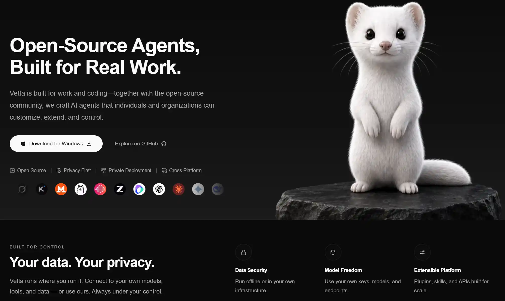
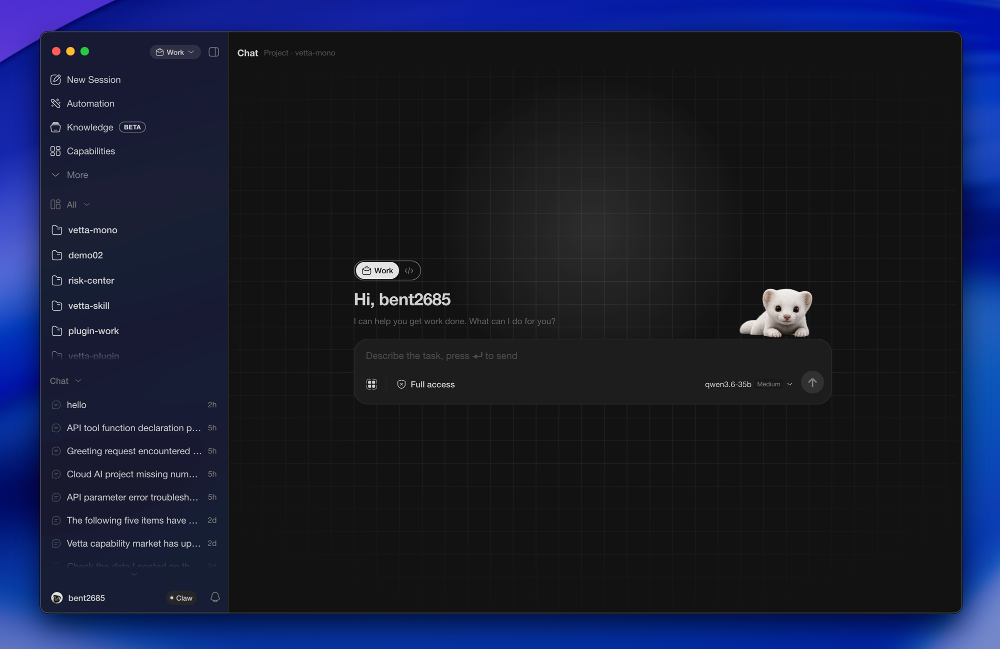
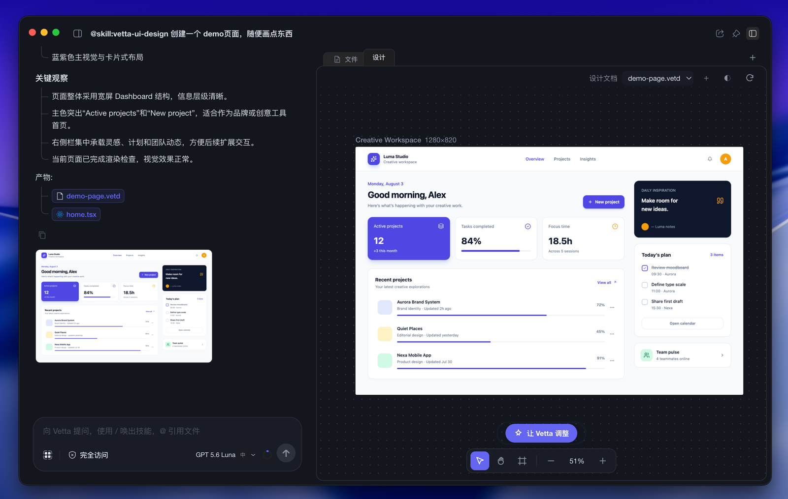
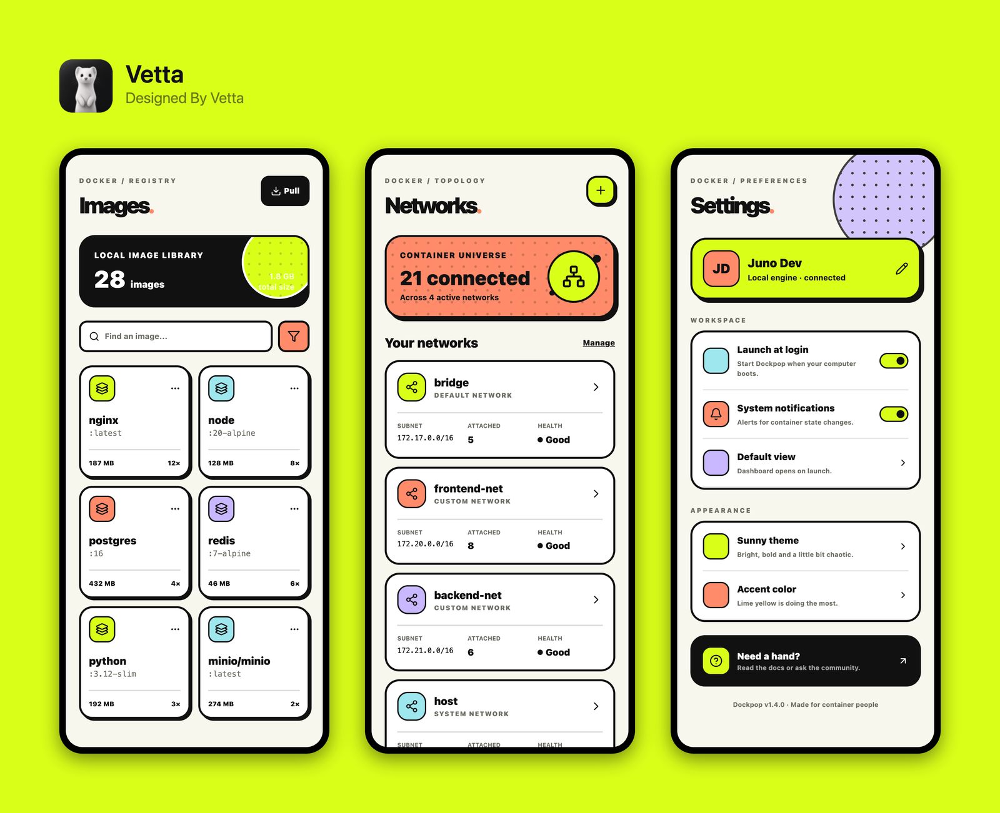

<p align="center">
  
</p>

<h1 align="center">Open Vetta</h1>

<p align="center">
  一个为真实工作而生的开源 AI Agent——本地运行、开放扩展，始终由你掌控。
</p>

<p align="center">
  <a href="https://www.openvetta.com"></a>
  
  
  
</p>

<p align="center">
  <a href="README.md">English</a> ·
  <b>简体中文</b> ·
  <a href="https://www.openvetta.com">官网</a> ·
  <a href="https://www.openvetta.com/download">下载</a>
</p>

---

## 这是什么

Open Vetta 是 Vetta 的开源版，也是一个为真实工作而生的 AI Agent。

它面向工作与编程场景，帮助个人与团队构建可定制、可扩展、可掌控的 AI Agent。无论是处理文档、
分析数据、编写代码、搭建工作流，还是连接自己的模型、工具与知识，Open Vetta 都希望成为一个
真正参与工作、持续交付结果的智能伙伴。

Open Vetta 运行在你指定的环境中。你可以连接自己的模型、工具与数据，也可以通过桌面应用、CLI
与 SDK 使用或扩展它的 Agent 内核。

我们选择开源，因为 AI 的工作方式不应由少数人单独定义。开发者、创作者和真实用户都可以贡献代码、
开发技能、接入新的模型与工具，并围绕自己的工作方式塑造 Agent。

### 你的数据，由你掌控

Open Vetta 不依赖 Vetta 运营的服务端：无需登录，没有账号、订阅计费或远程管理后台。你使用自己的
API Key，请求直接发送给所选的模型服务商，密钥只保存在本机 keychain 中。Open Vetta 不收集遥测、
崩溃报告或使用数据；所有网络请求都由你的配置明确触发（见[网络行为](#网络行为)）。

<p align="center">
  
</p>

---

## 桌面应用能力

下面是能力索引，只说有什么、怎么用；详细教程见[官网](https://www.openvetta.com)。

### 对话与工作区

| 能力 | 说明 |
|------|------|
| 对话 | 主界面。消息流、Artifact 渲染、工具调用可视化、自动跟随与回到底部。 |
| 项目与会话 | 侧边栏按项目组织会话，项目分普通、批量、定时三类，各自有独立的执行形态。 |
| 文件浏览与预览 | 内置本地文件树；PDF、Office 文档、表格、图片音视频直接在应用内预览，扫描版 PDF 可离线 OCR 取文字。 |
| 活动面板 | 右侧可拖拽面板，实时展示工具调用、请求历史、批量任务进度与调试信息。 |
| 执行隔离 | 会话可选择执行隔离级别，限制 Agent 能读写的目录、是否允许联网，退出时回收残留进程。三个平台都有对应的系统级隔离支持。 |

### 自动化

| 能力 | 说明 |
|------|------|
| 批量任务 | 一个 Prompt × 多个目标目录，按设定并发度并行执行，支持暂停、重试单项与全部重跑。 |
| 定时调度 | 用 Cron 表达式设定时间，到点自动跑任务，应用留在托盘即可，不必守着。 |
| Webhook 通知 | 任务完成或异常时推送到飞书、钉钉机器人，凭据本地加密存储。 |
| IM 旁路 | 在设置里填好凭据后，可以从手机上的 IM 直接给本机 Agent 派活、收结果，人不在电脑前也能推进任务。目前支持飞书，处于早期阶段。 |

### 扩展生态

| 能力 | 说明 |
|------|------|
| 能力市场 | 浏览并安装 Skill、MCP Server、插件与能力包。市场来源就是普通的 GitHub 仓库，你可以添加任意多个，也可以一个都不加——没有中心服务器。 |
| Skills | 把一套做事方法固化成可复用的技能，内置一批开箱可用的预设，也可从市场安装。 |
| MCP | 完整支持 MCP Server，接入后工具自动对 Agent 可见。 |
| 插件 | 应用的大部分工作区形态都由插件提供，可按需启用、卸载。详见[插件系统](#插件系统)。 |
| 主题 | 整套界面外观可替换，支持安装第三方主题。 |

### 本地数据

| 能力 | 说明 |
|------|------|
| 知识库 | 把本地文档收进知识库，应用在后台整理成可检索的资料，供 Agent 随时引用。全程不出本机。 |

### 桌面原生集成

| 能力 | 说明 |
|------|------|
| 快捷面板 | 一个全局快捷键随时唤起输入面板，不用切窗口就能发起任务。 |
| Appshot（macOS） | 一个手势抓取当前窗口，连同界面上的文字内容一起作为上下文交给 Agent，不用截图再描述一遍。 |
| 桌宠 | 桌面吉祥物随会话状态做出反应，可隐藏。 |
| 运行时管理 | 需要 Node 或 Python 时应用自动准备，不污染系统环境，也不要求你预装。 |
| 首启向导 | 引导完成模型配置、权限授予与运行时准备。 |
| 系统集成 | 托盘常驻、快捷键可自定义、原生通知、自动更新。 |
| 双语界面 | 中文与 English 完整覆盖，随时切换。 |

---

## 插件系统

插件不是边角料的点缀——设计画布、内容创作、Git、图表、各类文件预览，
这些工作区形态本身就是插件写出来的。同一套扩展点对第三方完全开放。

一个插件是一个 React 包，在 `activate(ctx)` 里注册贡献，或在 `plugin.json` 里声明式贡献。
它可以扩展界面，也可以扩展 Agent 的能力边界。

### 设计取向

**插件是 Vetta 的组成部分，不是挂在旁边的外挂。**
大多数 Agent 工具的插件止步于「加几个工具、几条命令、几个 MCP Server」——
能力是外接的，产品本身还是那个产品。Vetta 的插件可以往 Agent 里注入系统提示词、技能、
工具与 MCP Server，声明自己适用的工作模式，接管新会话的引导入口，还能决定一轮结束后是否自动续跑。
装上一组插件，你得到的不是「多了几个按钮的 Vetta」，而是按你的活法重组过的那个 Vetta。

**界面和会话是双向的。**
插件不只是给模型加能力，也能反过来驾驶对话：在画布上选中一个元素、在文件树上点一个菜单，
就能带着精确上下文发起一轮任务。这条从界面回到会话的通道，是纯 CLI 形态的扩展机制给不出的。

**预装能力和第三方插件走同一套 API。**
仓库里那些预装插件用的就是本文档列出的公开扩展点，没有私有后门。
系统插件与普通插件的差别只在分发方式——随应用发布、权限自动授予、不可卸载——
而不在能力上限。你能写出来的，和我们写出来的，是同一类东西。

**Vetta 自己会写插件。**
插件工作台把这份开发手册连同检查清单打包成技能交给 Agent，
配上专用的工作模式提示词，并把这套贡献硬隔离在工作台模式内，不污染日常会话。
于是从「我想要一个能干 X 的面板」到装进本机，全程可以在对话里完成——
Vetta 开发插件时读的，就是你现在要读的这份手册。

### 扩展点

**界面**

| 扩展点 | 能做什么 |
|--------|----------|
| 活动面板 Tab | 在右侧活动面板里开一个自己的工作区，插件最常用的落脚点 |
| 全局浮层 | 挂载覆盖整个应用的浮层 UI |
| 文件预览 | 接管某类文件的预览渲染，大文件走流式取址 |
| 文件列表扩展 | 给文件树加右键菜单、工具栏按钮、状态装饰，并可定位与刷新 |
| 消息卡片 | 为 Agent 产出的结构化数据注册自定义卡片渲染器，支持跨轮去重 |
| 工具调用渲染 | 替换某个工具调用在消息流里的行内呈现 |
| Turn 卡 | 在本轮对话上方挂一张常驻卡片 |
| 输入栏动作 | 往输入栏加一个开关式动作 |
| 全局通知 | 发 Toast 与错误提示，无需权限 |
| 快捷键作用域 | 接入宿主的快捷键作用域栈，不与全局快捷键打架 |

**对话与 Agent**

| 扩展点 | 能做什么 |
|--------|----------|
| 读对话 | 订阅会话状态与事件流 |
| 驾驶对话 | 代用户发起 prompt、插入文本、中断当前执行 |
| 注册 Agent 工具 | 把插件能力做成工具交给模型调用 |
| 注册 App Action | 贡献带 JSON Schema、走审批与取消流程的应用级动作 |
| 打包 Skill | 随插件分发技能，安装即生效 |
| 内聚 MCP Server | 插件自带 MCP Server，与用户配置的 MCP 一同聚合 |
| 动态系统提示词 | 按上下文向本轮注入 system prompt |
| 自动续跑策略 | 决定一轮结束后是否自动继续 |
| 新会话引导词 | 在空会话里给出引导入口 |
| 工作模式门控 | 声明插件适用的工作模式，并在运行时感知切换 |

**系统能力**

| 扩展点 | 能做什么 |
|--------|----------|
| 文件读写 | 读写工作区文件 |
| 命令执行 | 跑一次性命令，或拉起长驻进程（如自己的 dev server） |
| 网络请求 | 经宿主代理发请求，绕开渲染进程的跨域限制 |
| 私有存储 | 插件独占的持久化空间 |
| 设置 | 声明并读取自己的设置项，宿主统一渲染设置界面 |
| 插件 i18n | 随包分发语言包，跟随应用语言切换 |

### 权限模型

每项能力都要在 `plugin.json` 里显式声明权限，由宿主单独授权，运行时再校验一次；
未声明即拒绝。插件与宿主共享同一份 React 运行时，因此定位是**经审核的一方/策展扩展**，
而非任意不可信代码的沙箱容器——这个取舍与相应边界在 [permissions.md](docs/plugin/permissions.md) 里写明。

### 上手

```tsx
import { definePlugin } from "@vetta-org/plugin-sdk";

export default definePlugin({
  activate(ctx) {
    ctx.ui.registerActivityTab({ id: "my-tab", label: "我的面板", component: MyPanel });
  },
});
```

```json
{
  "id": "my-plugin",
  "name": "我的插件",
  "version": "0.1.0",
  "pluginApiVersion": "^1.0.0",
  "permissions": ["ui.slot.activity-tab"]
}
```

不想手写脚手架，就用[插件工作台](packages/plugins/presets/plugin-workbench)——
在对话里描述你要的面板，让 Vetta 建、让它构建、一键装进本机。

### 开发手册

| 文档 | 内容 |
|------|------|
| [getting-started.md](docs/plugin/getting-started.md) | 环境、脚手架、构建、安装与调试闭环 |
| [manifest.md](docs/plugin/manifest.md) | `plugin.json` 全字段、工作模式白名单、i18n、设置、Agent 侧贡献 |
| [permissions.md](docs/plugin/permissions.md) | 权限完整清单、门控点、声明与授权流程 |
| [ui-slots.md](docs/plugin/ui-slots.md) | 全局浮层、活动 Tab、文件预览、输入栏动作、Turn 卡、工具槽、快捷键 |
| [message-cards.md](docs/plugin/message-cards.md) | 消息卡片渲染器与跨轮去重 |
| [file-explorer.md](docs/plugin/file-explorer.md) | 文件列表右键菜单、工具栏、装饰、定位与事件 |
| [conversation-and-agent.md](docs/plugin/conversation-and-agent.md) | 对话读写、注册工具、命令、fs、network、storage、settings、i18n |
| [app-actions.md](docs/plugin/app-actions.md) | App Action 的 Schema、审批、生命周期与独立发布 |
| [mcp.md](docs/plugin/mcp.md) | MCP 三源聚合与插件内聚 MCP |
| [system-plugins.md](docs/plugin/system-plugins.md) | 系统插件（presets）与租户打包 |
| [styling-and-pitfalls.md](docs/plugin/styling-and-pitfalls.md) | 样式约定、常见陷阱、缓存与版本号 |

完整索引见 [docs/plugin/README.md](docs/plugin/README.md)，
SDK 与构建工具位于 [packages/plugins](packages/plugins)。

### 内置插件

| 插件 | 说明 |
|------|------|
| [vetta-ui-design](packages/plugins/presets/vetta-ui-design) | 无限画布 UI 设计工作区，详见下节 |
| [content-creation](packages/plugins/presets/content-creation) | 节点画布、素材生产与多轨编排工作区 |
| [plugin-workbench](packages/plugins/presets/plugin-workbench) | 用对话做插件：从新建到装进本机全程在应用里完成 |
| [git](packages/plugins/presets/git) | 活动面板内的 Git 变更状态树与文件 diff |
| [image-gen](packages/plugins/presets/image-gen) | 图像生成 |
| [chart-renderer](packages/plugins/presets/chart-renderer) | 让 Agent 生成的数据直接在对话里画成图表 |
| [office-viewer](packages/plugins/presets/office-viewer) · [media-viewer](packages/plugins/presets/media-viewer) · [svg-viewer](packages/plugins/presets/svg-viewer) | 离线预览 PDF/DOCX/PPTX/表格、图片音视频、SVG |
| [vetta-actions](packages/plugins/presets/vetta-actions) | 一组官方内置动作，供 Agent 直接调用 |

`packages/plugins/externals` 下另有几个插件（Cowart 无限画布、移动设备 UI 预览等）**不随应用打包**，
只作为源码示例存在，可作为写自己插件时的参考。

### Vetta UI Design

在无限画布上做 UI 设计稿。画框不是静态图层，而是真实可运行、可交互的界面，
改完即所见即所得。

- 在活动面板打开「设计」标签新建设计文档，或直接在对话里让 Vetta 帮你创建。
- 选中一个画框、多个画框，或画框内的某个具体元素，点「让 Vetta 调整」说出你想要的改动，
  画布实时更新——不需要解释"我说的是哪个按钮"。
- 整份设计共享一套色彩系统，改一次全部画框同步换肤。
- 画框可导出渲染图，圆角、外边框、投影、背景与输出倍率都可调，也能直接复制到剪贴板。
- 整份设计可打包成只读分享包，对方在应用内即可查看，无需任何环境准备。

首次使用时应用会自动准备设计运行环境，无需预装 Node 或手动配置。

<p align="center">
  
</p>

<p align="center">
  <sub>一句话让 Vetta 建出页面：左边是对话与产物，右边是画布，选中任何画框或元素都能继续追加要求</sub>
</p>

<p align="center">
  
</p>

<p align="center">
  <sub>选中画框导出渲染图，背景、圆角、投影与标识都可调，直接用于交付或分享</sub>
</p>

---

## 安装

### 下载安装包

从 [Releases](../../releases) 获取 macOS、Windows、Linux 安装包。三平台由
`.github/workflows/desktop-release.yml` 分别构建发布。

### 从源码构建

需要 **Bun 1.3+** 与 **Node 20+**。

```bash
bun install                # 安装全部工作区依赖
bun run build              # 构建核心库
bun run build:desktop      # 构建桌面应用
bun run build:cli          # 构建 CLI 应用
```

IM 旁路网关（Go）：

```bash
cd packages/im-gateway && make build
```

---

## 架构

Monorepo 分四层，依赖方向单向向下：**应用 → runtime-\* → coding-agent / agent / ai**。
核心库不感知宿主，因此同一套内核既能跑在 Electron 里，也能跑在终端里。

### 应用层

| 包 | 角色 | 技术栈 |
|----|------|--------|
| [desktop-app](packages/desktop-app) | Electron 桌面宿主，承载上文全部能力 | Electron · React · Vite · Jotai · TanStack Router · shadcn/ui · Tailwind v4 |
| [coding-agent](packages/coding-agent) | 编码智能体内核，支持交互 / print-JSON / RPC / SDK 四种运行模式 | TypeScript |
| [cli-app](packages/cli-app) | 基于 coding-agent 的纯 CLI 封装 | TypeScript |
| [im-gateway](packages/im-gateway) | IM 平台旁路 sidecar，NDJSON IPC 与桌面主进程通信 | Go |

### 核心库

| 包 | 职责 | 不包含 |
|----|------|--------|
| [ai](packages/ai) | 多 Provider LLM API、模型注册表、Provider Adapter、Token 与成本核算 | Agent Loop、UI、会话持久化 |
| [agent](packages/agent) | 有状态 Agent Loop、工具调用、事件流 | 终端/桌面 UI、业务规则 |
| [ui](packages/ui) · [theme-ui](packages/theme-ui) · [theme-sdk](packages/theme-sdk) | 可复用 UI 原语、主题视图层与主题 SDK | 宿主生命周期 |

### 运行时层

被宿主应用复用的一组适配包：[runtime-core](packages/runtime-core)（`RuntimeHost` 与 Session Facade）、
[runtime-tools](packages/runtime-tools)（内置工具重导出）、[runtime-storage](packages/runtime-storage)（会话与设置存储）、
[runtime-mcp](packages/runtime-mcp)（MCP Manager 绑定）、[runtime-telemetry](packages/runtime-telemetry)（本地日志抽象，仅落盘）。

### 目录速览

```
open-vetta-mono/
├── packages/
│   ├── ai · agent · ui · theme-ui · theme-sdk      # 核心库
│   ├── runtime-core · runtime-tools · runtime-mcp · runtime-storage · runtime-telemetry
│   ├── coding-agent · cli-app · desktop-app        # 应用
│   ├── im-gateway                                  # IM 旁路（Go）
│   ├── plugins · themes · skill-presets            # 扩展生态
│   └── capability-sdk · capability-runtime         # 能力与权限层
├── docs/                                           # 架构文档与 ADR
├── scripts/                                        # 构建、发布与质量守卫
├── AGENTS.md                                       # 开发与 AI 协作规范
└── CONTEXT.md                                      # 领域术语表
```

---

## 模型配置（BYOK）

客户端内置一份预设服务商目录（Claude、OpenAI、DeepSeek、Z.ai (GLM)、Kimi、Gemini、Grok、Qwen），
**只含 `baseUrl` 与 API 类型，不含任何 Key**。填入自己的 Key 之后：

- 立即向该服务商的 `/models` 拉取你账号实际可用的模型，之后每 12 小时后台同步一次；
- 价格与能力元数据由 [models.dev](https://models.dev) 公共目录补齐，随包带快照兜底；
- 请求直发服务商原站，本应用不代理、不转发、不计费。

也可以自定义任意 OpenAI 兼容端点，包括 Ollama / vLLM / LM Studio 等本地推理服务。
设计背景见 [ADR-0050](docs/adr/0050-preset-providers-move-client-side-with-dynamic-model-lists.md)。

---

## 能力市场

能力（Skill / MCP Server / Plugin / Bundle）来自 **GitHub 仓库归档**：客户端下载仓库压缩包，
读取其中的 `.vetta/marketplace.json`，搜索与筛选全部在本地快照上完成。
你可以添加任意多个市场来源，也可以完全不加。

清单格式见 [docs/open-marketplace.md](docs/open-marketplace.md)，
统一模型见 [ADR-0049](docs/adr/0049-abilities-unify-storage-and-presentation-not-installation.md)。

MCP 配置示例：

```jsonc
// ~/.vetta/agent/mcp.json
{
  "mcpServers": {
    "filesystem": {
      "command": "npx",
      "args": ["-y", "@modelcontextprotocol/server-filesystem", "/path/to/directory"]
    }
  }
}
```

交互模式下用 `/mcp` 查看状态。详见 [packages/coding-agent/docs/MCP.md](packages/coding-agent/docs/MCP.md)。

---

## 网络行为

本应用只在以下情况发起网络请求，且全部由你的配置决定：

| 用途 | 目标 | 可否关闭 |
|------|------|----------|
| LLM 推理 | 你配置的服务商原站 | 不配 Key 即不发生 |
| 模型元数据 | `models.dev` 公共目录 | 失败回退随包快照 |
| 能力市场 | 你添加的 GitHub 仓库 | 不加来源即不发生 |
| 便携运行时下载 | Node / Python 官方发行源（国内镜像优先） | 用系统已装运行时即可跳过 |
| 自动更新 | 你配置的 `VETTA_UPDATE_URL` 或 GitHub Releases | 不配即不检查 |
| MCP / 插件 / IM / Webhook | 由你安装的扩展与填写的凭据决定 | 不装即不发生 |

没有遥测，没有崩溃上报，没有使用统计。

---

## 参与开发

```bash
bun run check              # Biome + 类型检查 + 架构守卫（开 PR 前必跑）
bun run check:quick        # 改动文件的快速反馈（不含类型检查）
bun run test:unit          # 核心库单元测试
bun run test:pkg ai        # 单包测试；test:pkg --list 查看可测包
bun run test:changed       # 只跑受改动影响的包
```

约定要点：

- **包管理器**统一使用 Bun（`bun` / `bunx`）。
- TypeScript 侧禁止 `any`（除非确有必要）、禁止用于取类型的内联 `import()`；Go 侧改完必须跑 `make check`。
- 面向用户的文案必须走 i18n，不得硬编码。
- 提交信息使用中文；关联工单写 `fixes #N` / `closes #N`。
- 不要直接运行 `bun run dev` / `bun run build` / `bun test`。

完整规范见 [AGENTS.md](AGENTS.md)，质量门禁分层见 [docs/dev/quality-gates.md](docs/dev/quality-gates.md)。

### 版本与发布

所有包共用同一版本号（lockstep），版本源以 `@vetta/coding-agent` 为准，不做 major 发版：

```bash
bun run release:patch    # Bug 修复与新增功能
bun run release:minor    # API Breaking
```

每个包独立维护 `packages/*/CHANGELOG.md`，新条目写入 `## [Unreleased]`，已发布版本段不再改动。

### 文档

- [docs/plugin/README.md](docs/plugin/README.md) — 插件开发手册（11 篇）
- [docs/adr/](docs/adr) — 架构决策记录
- [docs/capabilities/README.md](docs/capabilities/README.md) — 基础/领域能力与权限层
- [docs/open-marketplace.md](docs/open-marketplace.md) — 开放能力市场清单格式
- [docs/desktop/README.md](docs/desktop/README.md) — 桌面打包与自动更新链路
- [CONTEXT.md](CONTEXT.md) — 领域术语表（写代码前先查既有命名）

---

## 致谢与引用

这个项目站在不少人的工作之上。以下是直接构成本仓库代码或分发物的部分：

| 项目 | 用在哪里 | 许可 |
|------|----------|------|
| [pi](https://github.com/badlogic/pi-mono) · Mario Zechner | `ai` / `agent` / `coding-agent` / `ecosystem-adapter` 四个包在其基础上重写与迭代，Agent Loop、Provider 抽象与扩展机制的骨架来自这里 | MIT |
| [Codex CLI](https://github.com/openai/codex) · OpenAI | 执行沙箱的整体方案借鉴其设计；Windows 平台直接使用其沙箱宿主二进制 | Apache-2.0 |
| [bubblewrap](https://github.com/containers/bubblewrap) | Linux 平台的沙箱后端，随安装包分发 | LGPL-2.0+ |
| [PP-OCRv5](https://github.com/PaddlePaddle/PaddleOCR) · PaddlePaddle | 离线 PDF OCR 的检测与识别模型 | Apache-2.0 |
| [python-build-standalone](https://github.com/astral-sh/python-build-standalone) · Astral | 便携 Python 运行时的发行源 | 见原仓库 |
| [Node.js](https://nodejs.org) | 便携 Node 运行时的发行源 | MIT |
| [Cowart](https://github.com/zhongerxin/Cowart) | `plugins/externals/cowart-vetta` 由其改编。该插件位于 `externals/`，**不随应用打包**，仅作为源码示例存在 | 见原仓库 |

同样受益于 [Model Context Protocol](https://modelcontextprotocol.io) 规范、
[models.dev](https://models.dev) 的公共模型目录，以及 Electron、React、Vite、Tailwind CSS、
shadcn/ui、Jotai、TanStack Router、Biome、Bun 等一众基础设施。

完整的第三方组件清单与原始版权声明见 [NOTICE](NOTICE)。

## 许可

[Apache-2.0](LICENSE)。
