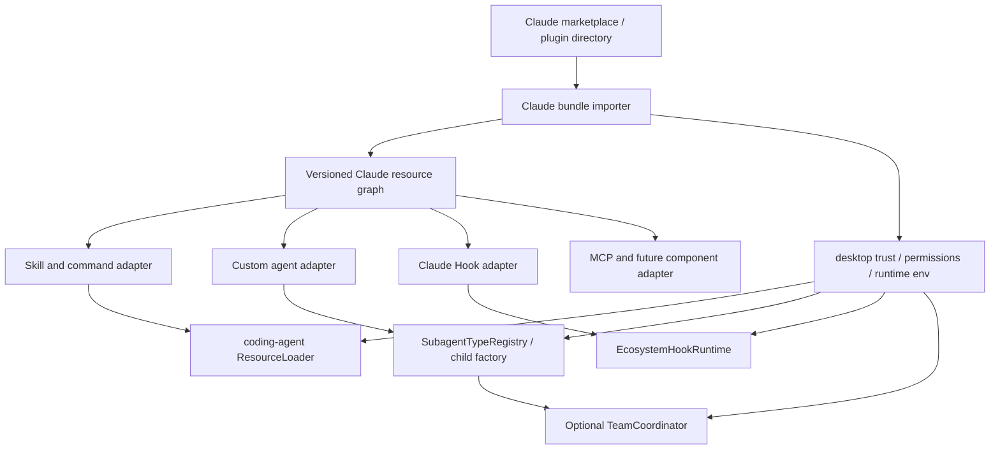

# Claude Code 兼容目标架构

## 1. 设计目标

目标不是“让模型大致看懂 Claude Skill”，而是为 Claude Code 资源提供可验证、可诊断、可逐版本升级的宿主兼容层，同时保持 Vetta 原生协议稳定。

设计约束：

1. `ecosystem-adapter` 保持生态协议适配职责，不拥有插件商店 UI、安装目录和用户授权。
2. `coding-agent` 只接收归一化资源和能力，不扫描 Claude marketplace 缓存。
3. `desktop-app` 拥有本地安装、信任、进程环境和插件生命周期。
4. Claude/Codex/Vetta 三种清单、工具名和 Hook wire contract 不互相冒充。
5. 首版以 `cc-skills@f5359d9` 契约测试为准，官方扩展功能通过新 profile 增量加入。

## 2. 分层



### 2.1 `ecosystem-adapter`

建议增加：

```text
packages/ecosystem-adapter/src/claude/
├── plugin/
│   ├── types.ts                 # marketplace/plugin/component 原始类型
│   ├── schemas.ts               # Zod 校验
│   ├── discover.ts              # 默认目录 + manifest path 规则
│   ├── resource-graph.ts        # 归一化 bundle
│   └── path-substitution.ts     # PLUGIN_ROOT/PROJECT_DIR/DATA
├── skills/
│   ├── frontmatter.ts
│   └── command-adapter.ts       # commands/*.md → skill contribution
├── agents/
│   ├── frontmatter.ts
│   └── tool-names.ts
└── hooks/
    ├── index.ts
    └── v2_1_x/                  # 实施时改成精确受测版本号
        ├── adapter.ts
        ├── config-schema.ts
        ├── input-codec.ts
        ├── output-schema.ts
        ├── event-semantics.ts
        ├── matcher.ts
        └── tool-mapper.ts
```

这里的 plugin parser 是纯解析库，不负责把文件安装到 `~/.vetta`，也不执行命令。

### 2.2 `coding-agent`

负责：

- 接收 Claude Skill contribution，保留 canonical id、alias、frontmatter 和 plugin root；
- 执行 Claude Skill 参数替换、fork、agent 选择和 scoped tool permission；
- 把 Claude agent contribution 编译为 session registry type；
- 为 `Agent` / `Task` facade 复用现有 `SubagentCoordinator`；
- 触发真实 `SubagentStart` / `SubagentStop` Hook；
- 提供 Teams 时管理共享 task graph 和 mailbox。

不负责：

- clone marketplace；
- 决定插件是否可信；
- 在用户目录中安装或升级文件；
- 静默下载外部 CLI。

### 2.3 `desktop-app`

负责：

- 选择本地 Claude marketplace/plugin 目录或仓库来源；
- 固定版本、复制资源、计算清单与文件哈希；
- 展示组件 inventory、权限和不兼容诊断；
- 将已授权 Hook source、Skill/agent paths 和 env 传给 session；
- 提供 `${CLAUDE_PLUGIN_ROOT}`、`${CLAUDE_PLUGIN_DATA}`、`${CLAUDE_PROJECT_DIR}`；
- 管理 Bash/`jq` 等可选运行环境；
- 插件启停、升级和重新授权。

## 3. 中立资源图

建议 installer 与 runtime 之间传递结构化对象，而不是原始 `plugin.json`：

```ts
interface ClaudePluginBundle {
  id: string;
  marketplaceId?: string;
  version: string;
  rootPath: string;
  source: { repository?: string; commit?: string };
  skills: ClaudeSkillContribution[];
  commands: ClaudeCommandContribution[];
  agents: ClaudeAgentContribution[];
  hookSources: ClaudeHookContribution[];
  mcpSources: ClaudeMcpContribution[];
  diagnostics: ClaudeCompatibilityDiagnostic[];
}
```

要求：

- 所有路径在解析时 canonicalize，并验证仍位于 plugin root；
- 保留原始 manifest 和 component file hash；
- 缺失默认目录不是错误；manifest 指向不存在路径是错误；
- unsupported component 进入 diagnostic，不能静默丢弃；
- logical dependency 可由 manifest 声明，也允许 compatibility metadata 补充，但不得从自然语言描述随意推断并自动安装。

## 4. Skill 与 command 适配

### 4.1 统一 contribution

`commands/foo.md` 在资源图中转换为 synthetic Skill：

- canonical id：`claude:<marketplace>:<plugin>:command:<path>`
- invocation alias：Claude 原始 command 名
- body：原 Markdown body
- frontmatter：保留 `allowed-tools`、description 等
- source kind：`claude-command`

`skills/foo/SKILL.md` 使用同样的 canonical namespace，但 source kind 为 `claude-skill`。

### 4.2 调用入口

兼容入口：

| 输入 | 行为 |
| --- | --- |
| `/skill:name args` | 保留 Vetta 原生行为 |
| `/name args` | 解析唯一 Claude/Vetta Skill alias |
| `/plugin:name args` | 解析 plugin scoped contribution |
| 模型 `Skill(name, args)` | facade 到 `invoke_skill` |
| 自然语言 | 继续由 description 触发 |

短 alias 冲突时不按加载顺序猜测，返回候选 scoped names。

### 4.3 执行顺序

1. 解析 canonical Skill。
2. 检查 `disable-model-invocation` / `user-invocable` 与调用来源。
3. 读取正文并执行一次参数 substitution。
4. 若允许且未被策略关闭，执行 Claude dynamic context expansion。
5. 建立 scoped pre-approval；不得扩大 session 的长期权限。
6. `context: fork` 时选择 agent 并创建 child；否则注入当前会话。
7. 记录来源、参数、agent、工具权限和结果。

## 5. Custom agent 适配

### 5.1 Registry 扩展

现有 `SubagentTypeDefinition` 应增量扩展，而不是增加第二套 coordinator：

```ts
interface ClaudeBackedSubagentTypeDefinition extends SubagentTypeDefinition {
  source: { ecosystem: "claude"; pluginId: string; path: string };
  modelPolicy?: ClaudeAgentModelPolicy;
  maxTurns?: number;
  preloadSkillIds?: string[];
  memoryPolicy?: ClaudeAgentMemoryPolicy;
  background?: boolean;
  isolation?: "worktree";
  exactToolAllow?: string[];
  exactToolDeny?: string[];
}
```

实际类型名称使用 plugin scoped id，短名只作为无冲突 alias。

### 5.2 工具映射

至少需要以下映射：

| Claude 名 | Vetta 能力 |
| --- | --- |
| `Read` | `read` |
| `Grep` | `grep` |
| `Glob` | `glob` |
| `Bash` | `bash` 或兼容 shell runtime |
| `Write` | `write` |
| `Edit` | `edit` |
| `AskUserQuestion` | `ask_user_question`；后台 child 不可用时明确拒绝 |
| `Skill` | `invoke_skill` facade |
| `Agent` / `Task` | `spawn_agent` facade；遵守递归策略 |
| `SendMessage` | root/agent mailbox facade |

映射只解决名称，权限仍按 Vetta 工具对象和 sandbox 强制。

### 5.3 模型与停止边界

- `inherit` 继承 parent；
- `haiku` / `sonnet` / `opus` 通过宿主配置映射为实际 provider/model，不写死某供应商；
- 调用级 model 不得扩大工具权限；
- `maxTurns` 由 child agent loop 强制；
- model 不可用时给出 diagnostic，并按显式策略继承或失败，不静默换高成本模型。

## 6. Agent Teams

建议在现有 child factory 之上增加 `TeamCoordinator`，复用 session 创建、usage、取消和 transcript，不复用 root-only 通信假设。

需要的数据模型：

- `TeamSnapshot`
- `TeamMemberSnapshot`
- `TeamTask`：id、subject、description、owner、status、blockedBy
- `TeamMessage`：from、to、payload、createdAt、deliveredAt

需要的工具 facade：

- `TeamCreate` / `TeamDelete`
- `Teammate` 或带 teammate flag 的 agent spawn
- `TaskCreate` / `TaskUpdate` / `TaskList` / `TaskGet`
- `SendMessage`

关键不变量：

1. task dependency 完成后自动解锁；
2. owner 与 status 更新原子化；
3. teammate 能联系 lead 和 sibling；
4. lead/teammate 的权限和工具面可不同；
5. team 关闭会取消或回收所有成员；
6. `TeammateIdle` 和 `Stop` 有独立生命周期，避免无限 continuation；
7. UI 与磁盘状态不要求复刻 `~/.claude` 路径，只需保持可观察语义。

## 7. Claude Hook profile

### 7.1 Profile 标识

实施前必须用 Claude Code 官方发行版和 fixture 确认准确版本，例如：

```text
claude-code-hooks/2.1.211
```

文档目录名 `v2_1_x` 只是设计占位，不能进入最终公开 API。

### 7.2 `cc-skills` 首版子集

支持：

- config：plugin `hooks/hooks.json`
- handler：`type: command`、sync
- event：`SessionStart`、`UserPromptSubmit`、`PreToolUse`、`Stop`
- matcher：全匹配、精确、`|`、regex
- exit code：0、2、其它错误
- output：plain context、block reason、Stop continuation
- env/path：plugin root、plugin data、project dir

未支持的事件或 handler 必须产生 `unsupported_*` diagnostic，并在安装 UI 中显示。

### 7.3 工具名

Hook matcher 与 stdin 使用 Claude canonical name，而不是 Vetta host name。除基础工具映射外，`cc-skills` 还要求：

| Vetta/兼容能力 | Claude Hook 名 |
| --- | --- |
| team 创建 | `TeamCreate` |
| team 删除 | `TeamDelete` |
| agent/team 消息 | `SendMessage` |

Teams 尚未实现时，这些工具不存在，`cdt` PreToolUse Hook 也不会触发；诊断必须将其标为 host capability missing。

### 7.4 路径变量与命令执行

不要依赖宿主 shell 自行解释所有变量。先做受控的 token substitution，再用明确的 shell/runtime 执行：

| Claude 变量 | Vetta 值 |
| --- | --- |
| `${CLAUDE_PLUGIN_ROOT}` | 当前安装版本只读根 |
| `${CLAUDE_PLUGIN_DATA}` | 插件持久化数据目录 |
| `${CLAUDE_PROJECT_DIR}` | session cwd / 项目根策略值 |

Windows 上对 `.sh` handler：

- 有托管 POSIX runtime：显式调用 `bash <absolute-script>`；
- 无 runtime：安装/启用时标记不兼容；
- 禁止尝试把 Bash 文本自动翻译成 PowerShell 或 CMD。

## 8. 安装与权限

### 8.1 Resource-only bundle

推荐给 Vetta 增加 resource-only plugin/bundle 形态，至少支持：

- 无 renderer entry；
- 声明 Skills、agents、Hooks、MCP；
- 与普通插件共用版本、启停、市场和权限 UI；
- 安装后获得稳定 rootPath；
- 不加载不必要的 Module Federation runtime。

如果短期不改 Vetta plugin schema，可以由 Claude importer 管理独立 compatibility bundle，但不能为方便而伪造 Claude/Vetta 混合 manifest。

### 8.2 建议权限

现有权限之外，Claude compatibility bundle 至少需要明确的声明面：

- `agent.skills.control`
- `agent.subagents.control`（新增）
- `agent.hooks.control`（新增）
- `agent.teams.control`（新增，CDT）
- `agent.mcp.control`（存在 MCP 时）
- 命令/网络/文件写权限按组件细分

首次启用展示完整 inventory。升级时若 component hash、命令、工具或权限扩大，重新确认。

## 9. 不应采用的实现

1. 把 Claude `.claude-plugin/plugin.json` 直接交给 Vetta plugin store。
2. 把 Claude `commands` 填入 Vetta `commands`。
3. 在 Codex `fca51f6` profile 中加入 Claude 特例。
4. 仅把 agent Markdown body 注入 root prompt，却宣称 custom agent 已支持。
5. 用多次 `spawn_agent` 模拟 Agent Teams，却不实现 task graph/mailbox。
6. 在 Windows 自动翻译 Bash。
7. 扫描用户 `~/.claude` 后静默执行 Hook；所有来源必须由宿主显式传入并获信任。
8. 在 Vetta 核心硬编码 `cc-skills` 插件名或工作流语义。

