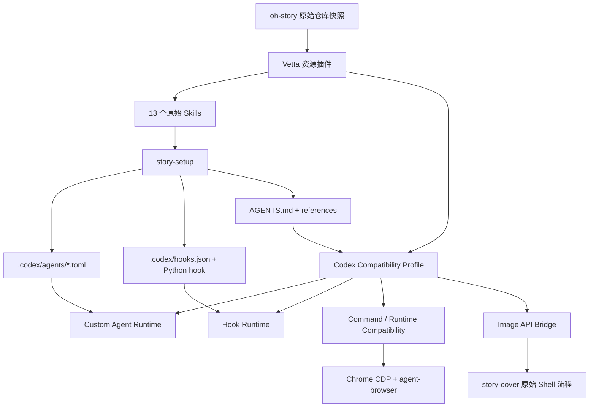

# oh-story-claudecode → Vetta 无缝兼容方案

## 文档状态

- 方案版本：v2，兼容优先
- 修订日期：2026-07-15
- 配套评估：[oh-story-claudecode.md](./oh-story-claudecode.md)
- 外部仓库基线：`worldwonderer/oh-story-claudecode@12a9655a21abacfbd1c01eb41b98f2af007ab5be`
- Vetta 基线：`56f96cb885e06a7fd2dfd56bda5af33bba93e786`
- 本文取代此前的“solo 优先、业务语义改写”方案。
- 本文只定义目标架构和实施边界，不表示相关代码已经实现。

## 目标调整

实现难度不作为裁剪功能的理由。目标从“让主体 Skill 能运行”调整为：

> 让 Vetta 原生兼容 oh-story 已提供的 Codex/Claude Code 能力面，使上游 Skill、Agent、Hooks、脚本和命令尽量原样运行。

最终交付必须满足：

1. 上游 13 个 `SKILL.md` 不因 Vetta 修改业务流程。
2. 上游 7 个 Agent 可注册、隔离运行、并发执行和按权限访问文件。
3. `story-review full/lean` 和 `story-long-analyze` 并行拆文真实可用，不以 solo 作为计划内交付状态。
4. `.codex/hooks.json` 及 `story_codex_hook.py` 原样执行，写前阻断、写后检查、上下文恢复和 Stop 扫描都生效。
5. `/story-*`、`$story-*`、`/skill:story-*`、`Skill(...)`、`Agent(...)` 和 `Task(...)` 兼容调用。
6. `browser-cdp` 和扫榜脚本按上游协议工作。
7. `story-cover` 不改流程即可使用 Vetta 图像配置，并将图片原样落盘到项目。
8. Windows 上不要求用户另行安装 Bash、Node、Python、jq、curl、agent-browser 或 ImageMagick。
9. 上游升级以替换固定 commit snapshot 为主，本地 patch 应接近零。

solo、manual scan 和封面仅预览仍保留为运行时故障降级，但不再是 Vetta 适配版的功能边界。

## 核心判断

上游已经维护了完整 Codex 适配，而不是只有 Claude Code 版本：

- `.codex/agents/*.toml`：7 个项目级 Agent。
- `.codex/hooks.json`：SessionStart、PreToolUse、PreCompact、PostCompact、Stop。
- `.codex/hooks/story_codex_hook.py`：Codex stdin/stdout JSON 协议适配。
- `commandWindows`：Windows Hook 命令。
- `AGENTS.md.tmpl`：Codex 项目规则。
- Skill 内同时识别 `agent_type` 与 `subagent_type`，并定义了明确 fallback。

因此最佳路线不是再维护一套 `oh-story-vetta` 业务 fork，而是让 Vetta 实现一个可复用的 **Codex Project Compatibility Profile**。oh-story 在 Vetta 中选择 Codex 部署目标，上游文件直接成为 Vetta 的项目资源。

## 推荐架构



架构分为四层：

| 层 | 责任 |
| --- | --- |
| 资源插件 | 固定版本打包上游 `skills/`，声明兼容 profile，不改 Skill 正文 |
| Codex 兼容层 | 加载 Codex Agent、Hooks、AGENTS.md、命令和目录约定 |
| 通用宿主能力 | 子 Agent、Hook 执行、POSIX 命令运行时、CDP、图像代理 |
| oh-story 项目 | 由原始 `story-setup` 生成 `.codex/`、追踪文件和项目规则 |

Vetta 核心中不得出现 `story-*`、`正文/`、`细纲`、`伏笔` 等业务判断。所有小说规则继续由上游文件拥有。

## 1. 上游包保持原样

建议的插件结构：

```text
packages/plugins/externals/oh-story-vetta/
├── plugin.json
├── package.json
├── vite.config.ts
├── src/
│   └── index.tsx                 # 最小激活入口/兼容状态 UI
├── skills/                       # 上游 skills/ 原样 snapshot
├── upstream.json                 # URL、commit、版本、文件校验
├── compat.json                   # 声明 codex profile 和运行时依赖
└── locales/
    ├── zh.json
    └── en.json
```

原则：

- `skills/` 直接来自固定上游 commit。
- 不维护 Vetta 专用的 13 份 `SKILL.md`。
- 不把 Hooks 重写成 `story_write_file` 等 Vetta 专用工具。
- 不把 `browser-cdp` 重写成另一套 MCP 调用协议。
- 不把 `story-cover` 改成 Vetta 专用提示词流程。
- `upstream.json` 记录快照校验；升级时整包替换并跑兼容测试。

插件继续通过 `agent.skillPaths: ["skills/"]` 注册整套 Skill。后续给插件清单增加通用兼容声明，例如：

```json
{
  "agent": {
    "skillPaths": ["skills/"],
    "compatibilityProfiles": ["codex-project"]
  }
}
```

`compatibilityProfiles` 是通用宿主声明，不是 oh-story 特例。

## 2. story-setup 在 Vetta 中直接走 Codex 部署

Vetta 会话需要公开结构化宿主信息：

```text
host = vetta
compatibility_profile = codex-project
project_dir = <absolute cwd>
supports_custom_agents = true
supports_project_hooks = true
supports_managed_python = true
supports_posix_bash = true
```

调用 `story-setup` 时，`target_cli` 自动确定为 `codex`，不让模型因为项目尚无 `.codex/` 而误选 generic。实现可分两层：

1. `invoke_skill` 向 Skill 上下文注入兼容 profile。
2. oh-story 插件调用 Skill 时默认附加 `target_cli=codex` 参数。

长期应向上游提交一个极小兼容补充：检测 `VETTA_RUNTIME=1` 或宿主 capability 后将 Vetta 视为 Codex-compatible。该补充若被上游接受，Vetta snapshot 不再需要任何 setup overlay。

部署后 Vetta 监听下列文件并热更新，不要求用户新开会话：

- `.codex/agents/*.toml`
- `.codex/hooks.json`
- `.codex/hooks/*`
- `AGENTS.md`
- `.codex/skills/`
- `.story-deployed`

上游仍可提示“新开会话”，但 Vetta 应做到部署完成后立即显示 7 个 Agent 和 Hook 状态。

## 3. Skill 与命令协议兼容

### 用户输入兼容

以下形式归一到同一个 Skill：

| 输入 | 归一结果 |
| --- | --- |
| `/story-long-write 参数` | `story-long-write` |
| `$story-long-write 参数` | `story-long-write` |
| `/skill:story-long-write 参数` | `story-long-write` |
| 自然语言触发 | 由 description 和 `story` 路由 |

每个 Skill 自动注册 `/name` 与 `$name`，不要求逐个在 Vetta 写别名。中文别名可由插件额外声明，但不从 description 自由文本中猜测。

### 模型工具兼容

保留 Vetta 原生工具，同时增加兼容别名：

```text
Skill({ name, args })                  -> invoke_skill
Agent({ agent_type, prompt, model? })  -> custom agent runtime
Agent({ subagent_type, prompt, model? }) -> 同上
Task({ subagent_type, prompt, model? })  -> 同上
```

`agent_type` 与 `subagent_type` 同时出现且值不一致时拒绝执行，避免静默选择。

Vetta 的 Read/Write/Edit/Glob/Grep/Bash 工具向兼容上下文提供 Claude/Codex 名称别名。Hook 匹配也使用这些规范名称，避免上游 matcher 因 Vetta 内部小写工具名失效。

### Skill 相对资源

`invoke_skill` 继续提供 `SKILL_DIR`，并在当前 Skill 作用域中记录资源根。需要保证：

- Markdown 相对链接相对 `SKILL_DIR` 解析。
- `scripts/foo.js`、`references/foo.md` 在模型工具调用时能稳定解析到当前 Skill。
- Agent 子会话也继承来源 Skill 的资源根。
- 项目路径仍相对项目 cwd，不因 Skill 资源根改变。

不通过复制 `scripts/` 到用户项目解决路径问题。

## 4. Custom Agent 完整兼容

### Agent 资源加载

Vetta 同时支持：

- Codex：`.codex/agents/*.toml`
- Claude Code：`.claude/agents/*.md`
- 插件：未来的 `agent.agentPaths`

oh-story 默认使用 `story-setup` 部署出的 Codex TOML。解析字段至少包括：

- `name`
- `description`
- `developer_instructions`
- `nickname_candidates`
- `sandbox_mode`

Claude Markdown 兼容解析还包括：

- `tools`
- `model`
- `maxTurns`
- `memory`

同名资源优先级：项目 Codex > 项目 Claude > 插件 > 用户全局。出现重复时 UI 显示来源，不能静默合并两份指令。

### Agent 执行模型

`Agent` / `Task` 工具基于 `createAgentSession` 创建真实隔离会话：

1. 继承项目 cwd、模型凭据、兼容 profile 和项目资源。
2. 不继承父会话全部消息；prompt 必须自包含，符合上游假设。
3. 应用 Agent developer instructions 和工具白名单。
4. `sandbox_mode = "read-only"` 在工具层禁止 Write/Edit/apply_patch/写文件 Shell，不只依赖提示词。
5. 绑定父级取消信号、超时和会话关闭。
6. 限制递归 spawn；子 Agent 内默认不暴露 Agent/Task。
7. 返回完整结果、状态、错误和 usage，父 Agent 再负责落盘或综合。

### 并行与批量

支持同一模型响应中的多个 Agent tool call 真并行执行，并提供宿主级并发队列：

- `story-review full`：4 个 reviewer 并发。
- `story-review lean`：2 个 reviewer 并发。
- `story-long-analyze` Stage 2：每批 5-8 个 chapter-extractor。
- 支持分批等待、失败重试、取消和结果顺序稳定。

不能复用当前后台 Shell task 伪装子 Agent；两者的上下文、模型和权限语义不同。

### 模型别名

兼容上游 `haiku` / `sonnet` / `opus`：

| 上游别名 | Vetta 档位 |
| --- | --- |
| `haiku` | low |
| `sonnet` | medium |
| `opus` | high |

用户在 Vetta 设置中为 low/medium/high 选择实际 provider/model。未配置时继承父模型并在 Agent 运行详情中提示，不因此降级 solo。

`Agent(..., model: "sonnet")` 等调用级覆盖只改变模型档位，不得扩大工具和文件权限。

## 5. Codex Hook Runtime 完整兼容

### 配置加载

新增项目 Hook loader：

- 主来源：`.codex/hooks.json`
- 可扩展来源：`.claude/settings.local.json` 的 `hooks`
- 配置变化时热重载。
- 按项目隔离，不写入全局配置。

内部先将不同来源归一成 Hook IR，再交给统一 runner。需要支持上游使用到的字段：

- event
- matcher
- type=`command`
- command
- `commandWindows`
- timeout
- statusMessage
- hook-level `if`（Claude 配置）

Windows 优先执行 `commandWindows`，并用 `cmd.exe /d /s /c` 保持其 CMD 语法；其他平台执行 `command`。托管 Python 和 POSIX 工具加入 Hook 子进程 PATH。

### 事件映射

| Codex/Claude 事件 | Vetta 触发点 | 要求 |
| --- | --- | --- |
| SessionStart | session_start / resume / clear / compact 后恢复 | 可注入 additionalContext |
| PreToolUse | 工具审批之后、真正执行之前 | 可 deny，必须阻断工具 |
| PostToolUse | 工具执行和结果形成之后 | 可产生检查信息和 additionalContext |
| PreCompact | session_before_compact | 在摘要开始前等待完成 |
| PostCompact | session_compact | 将恢复提示注入压缩后的上下文 |
| Stop | 当前 Agent 自然停止点 | 每轮只触发一次，防止递归 |
| SessionEnd | 会话释放/切换 | best-effort，执行日志持久化 |

### Hook stdin

向命令发送 UTF-8 JSON，至少包含：

```json
{
  "session_id": "...",
  "cwd": "C:/project",
  "hook_event_name": "PreToolUse",
  "source": "startup",
  "tool_name": "Write",
  "tool_input": {},
  "tool_response": {}
}
```

工具名在发送前做兼容映射：Vetta `bash/shell` → `Bash`，`write` → `Write`，`edit` → `Edit`，`apply_patch` 保持原名。

环境变量至少包含：

- `CODEX_PROJECT_DIR`
- `CLAUDE_PROJECT_DIR`
- `VETTA_PROJECT_DIR`
- `VETTA_RUNTIME=1`
- 托管 Node/Python/POSIX runtime PATH

### Hook stdout

按 UTF-8 JSON 解析并支持：

- `hookSpecificOutput.additionalContext`
- `hookSpecificOutput.permissionDecision`
- `hookSpecificOutput.permissionDecisionReason`
- `continue`
- 普通状态/警告文本

`permissionDecision = "deny"` 映射到 Vetta `tool_call` block/reason；`additionalContext` 进入当前上下文，不只显示为日志。

Hook 超时、退出码、stdout/stderr、匹配结果和阻断原因在活动面板可见。Hook 失败不得被当作“检查通过”。是否 fail-open 由事件和项目授权策略决定，并明确显示。

## 6. Windows POSIX 兼容运行时

仅靠 PowerShell 无法原样执行上游大量 Bash 示例。Vetta 应提供可选的托管 POSIX runtime，并在 Codex compatibility profile 中暴露 `Bash` 工具。

运行时至少包含：

- Bash
- grep、sed、awk、sort、cut、head、find、file
- curl、jq、base64
- coreutils
- Node.js
- Python
- 可选 ImageMagick

普通 Vetta PowerShell 工具保持不变；上游 Skill 调用 `Bash` 时进入托管 POSIX runtime。路径桥负责 Windows native path 与 `/c/...` 形式转换，并给子进程设置 UTF-8。

复杂命令不做 PowerShell 自动翻译。翻译 Shell 文本无法保证引号、管道、heredoc、`set -euo pipefail` 和退出码语义，是伪兼容。

## 7. browser-cdp 原协议支持

不再用 MCP 替换 `browser-cdp`。Vetta 托管运行时直接提供上游要求的 `agent-browser` 可执行命令，并保证其在 `Bash` 与 Windows 命令环境 PATH 中可见。

保持上游流程：

1. `setup-cdp-chrome.js --detect-only`
2. 根据 `CDP_STATUS` 分支。
3. 需要终止用户 Chrome 时通过 AskUserQuestion 获得明确同意。
4. 同意后执行 `--yes`。
5. `agent-browser --cdp 9222 open/wait/eval/snapshot/click/type`。

Vetta 需要补充的宿主保证：

- `agent-browser` 随运行时发布，不执行 `npm install -g`。
- 终止 Chrome、清空 debug profile 等操作进入高风险审批。
- 后台进程、超时、取消和 stderr 可观察。
- CDP 端口占用有明确诊断。
- 登录 Cookie/Token 只在用户明确要求时返回；敏感输出进入脱敏策略。

上游脚本已经覆盖 Windows Chrome 路径和 `commandWindows`，因此优先保持它，而不是另写 Vetta 浏览器协议。未来可以提供不关闭常规 Chrome 的增强模式，但不能让增强模式破坏原始 CLI 行为。

## 8. story-cover 原协议支持

目标是保留上游 `curl + OpenAI Images API + b64_json + 文件落盘 + ImageMagick` 流程，同时复用 Vetta 图像配置。

建议在 Desktop 主进程提供一个仅监听 loopback 的临时 OpenAI Images 兼容桥：

```text
POST /v1/images/generations
POST /v1/images/edits
```

桥接流程：

1. Vetta 为当前会话生成短期 bearer token。
2. 向兼容 Shell 环境注入：
   - `GPT_IMAGE_BASE_URL=http://127.0.0.1:<port>/v1`
   - `GPT_IMAGE_API_KEY=<ephemeral-local-token>`
   - `GPT_IMAGE_MODEL=<configured-model>`
3. 原始 Skill 使用 curl 调用本地兼容端点。
4. 主进程转发到 Vetta 图像服务。
5. 兼容端点按上游预期返回 `.data[0].b64_json`。
6. 原始 Shell 解码并写入 `{BOOK_DIR}/封面/封面_vN.png`。

真实服务 API Key 不进入 Agent、Hook 或 Shell。用户已显式设置外部 `GPT_IMAGE_*` 时允许选择直接模式，但默认使用本地桥。

平台上传尺寸继续执行上游 Step 3.5。托管 runtime 提供 ImageMagick，保证 `600×800` 居中裁剪、缩放和 `_上传.png` 落盘，无需新增 Vetta 专用 `images.export` 工具。

## 9. 安装、信任与权限

无缝兼容不等于静默执行项目代码。首次启用时用一次项目级信任流程展示：

- 13 个 Skill。
- 7 个 Agent 及其只读/可写权限。
- Hook 配置、命令、事件和超时。
- 托管运行时依赖。
- Chrome 进程控制能力。
- 图像服务和预计密钥使用方式。

用户批准后保存对“项目路径 + Hook 配置哈希 + 插件版本”的授权。Hook 命令或 Agent 权限发生变化时重新请求批准；普通参考资料内容更新不重复弹窗。

关键权限必须在宿主强制：

- read-only Agent 无法通过 Shell 绕过写限制。
- Hook 只在当前项目 cwd 运行。
- `commandWindows`/`command` 使用参数化进程启动，runner 不拼接额外用户文本。
- 超时后杀掉完整进程树。
- Vetta 本地 image token 只允许当前会话和图像路由。

## 10. Vetta 模块改造范围

| 模块 | 改造内容 |
| --- | --- |
| `packages/coding-agent/src/core/resource-loader.ts` | Codex profile、`.codex` 资源发现、热重载 |
| `packages/coding-agent/src/core/skills.ts` | `/name`、`$name` aliases 和去重来源 |
| `packages/coding-agent/src/core/tools/invoke-skill/` | Skill runtime metadata、资源根作用域、`Skill` alias |
| `packages/coding-agent/src/core/agents/`（新增） | TOML/Markdown loader、registry、child session、并发和权限 |
| `packages/coding-agent/src/core/tools/agent/`（新增） | `Agent` / `Task` 兼容 schema 和结果聚合 |
| `packages/coding-agent/src/core/hooks/` | Codex/Claude 配置归一、command runner、JSON 协议 |
| `packages/coding-agent/src/core/extensions/` | Hook 与现有生命周期事件桥接 |
| `packages/coding-agent/src/core/session/` | 子 Agent 取消、usage、递归保护、资源热更新 |
| `packages/desktop-app/src/main/` | 项目信任、进程树、托管 POSIX runtime、image bridge |
| `packages/desktop-app/src/renderer/` | Agent/Hook 状态、授权和诊断 UI，所有用户文案接 i18n |
| `packages/plugins/plugin-sdk/` | `compatibilityProfiles` / `agentPaths` 等通用清单类型 |
| `packages/plugins/plugin-vite/` | 打包 Agent、runtime manifest 和上游 snapshot |
| `packages/plugins/externals/oh-story-vetta/` | 资源插件和固定上游快照 |

具体文件在实施设计阶段按职责拆分，不能把 Agent registry、Hook runner 和进程控制继续塞进 `agent-session.ts`。

## 11. 实施里程碑

里程碑用于控制验证顺序，不代表对外发布残缺模式。

### M1：资源与命令兼容

- 原始 13 Skill 整包安装。
- `/name`、`$name`、`/skill:name`、`Skill(...)`。
- `story-setup` 自动走 Codex profile。
- AGENTS.md、Skill references 和项目目录解析。
- `.codex` 资源热重载。

### M2：Custom Agent

- 7 个 TOML Agent 注册。
- `Agent` / `Task`、`agent_type` / `subagent_type`。
- 只读 sandbox、模型别名、父子取消、递归保护。
- full/lean review 和 5-8 并发 chapter-extractor。

### M3：Hooks

- `.codex/hooks.json` 原样加载。
- Windows `commandWindows`。
- stdin/stdout JSON、matcher、deny、additionalContext。
- SessionStart、Pre/PostToolUse、Pre/PostCompact、Stop、SessionEnd。
- 项目信任和诊断 UI。

### M4：运行时、浏览器和封面

- 托管 Bash/coreutils/curl/jq/base64/Node/Python/ImageMagick。
- `agent-browser` 和原始 CDP 流程。
- 本地图像 API bridge。
- 封面生成、图生图、提示词副本和 `600×800` 上传版。

### M5：上游一致性

- 跑上游静态检查和可复用测试。
- 新增 Vetta 端到端兼容测试。
- 对比 Claude/Codex/Vetta 产物契约。
- 处理所有计划外 fallback，目标状态为 full。

## 12. 最终功能矩阵

| 能力 | 目标状态 | 实现方式 |
| --- | --- | --- |
| 13 Skill 发现与更新 | 原样完整 | 资源插件 + 固定 snapshot |
| `story-setup` | 原样完整 | Vetta 作为 Codex-compatible target |
| AGENTS.md / references | 原样完整 | Codex resource profile |
| 长短篇写作 | 原样完整 | 原始 Skill + Hooks + Agent |
| 长短篇拆文 | 原样完整 | batch child Agent |
| `story-review full/lean/solo` | 三模式完整 | Custom Agent runtime |
| `story-import` / `story-deslop` | 原样完整 | Skill + POSIX/Node/Python runtime |
| 长短篇扫榜 | 原样完整 | `browser-cdp` + agent-browser |
| `story-cover` | 原样完整 | image API bridge + ImageMagick |
| Session/Tool/Compact Hooks | 原样完整 | Codex Hook runtime |
| Windows | 完整 | commandWindows + 托管 POSIX runtime |

## 13. 兼容验收套件

### 安装与发现

- 插件 zip 安装后正好发现 13 个 Skill。
- Skill 名、版本、references 和 scripts 校验值与上游一致。
- 三种显式调用形式进入同一 Skill。
- 插件升级不修改用户写作项目产物。

### story-setup

- 全新项目自动选择 Codex profile。
- 部署 7 个 `.codex/agents/*.toml`。
- 合并而非覆盖 `.codex/hooks.json` 和 AGENTS.md。
- references 路径全部可解析。
- 部署后无需重启即可看到资源。

### Agent

- full review 同时运行 4 个 reviewer，报告 `Effective Mode: full`。
- lean 只运行指定 2 个 reviewer。
- chapter-extractor 每批 5-8 个并发，摘要数等于章节数。
- `model: sonnet` 升级重试使用 medium 映射。
- read-only Agent 的 Write/Edit/Bash 写入全部被宿主拒绝。
- 取消父任务会取消所有子 Agent。

### Hooks

- 缺细纲首次写正文时 PreToolUse 返回 deny，文件未创建。
- 正常修改已有正文不被误拦。
- PostToolUse 产生正文退化检查结果。
- PreCompact 保存状态，PostCompact 注入恢复上下文。
- Stop 扫描只执行一次，不形成无限续跑。
- Windows 使用 `commandWindows` 和托管 Python 成功处理中文路径。

### 浏览器

- detect-only 无副作用。
- Chrome 正在运行时必须先出现用户确认。
- 拒绝后不终止进程；同意后 `--yes` 可继续。
- `agent-browser --cdp` 完成 open、snapshot、click、eval 和提取。
- 长篇、短篇各跑通至少一个平台采集脚本。

### 封面

- 原始 curl 请求命中本地 image bridge。
- 文生图和图生图都返回有效 `b64_json`。
- 原图、prompt、参考图记录按上游命名落盘。
- 番茄上传版严格为 `600×800` 且不变形。
- 真实 API Key 不出现在 Shell 环境、日志或模型上下文。

### 跨平台

- Windows、macOS、Linux 跑同一套契约测试。
- UTF-8 中文路径、空格路径和非 Git 项目均可运行。
- 不依赖用户全局 npm/pip/系统工具安装。

## 14. 上游同步与补丁上限

采用固定 commit snapshot，不维护长期业务 fork：

1. 拉取新的上游 tag/commit。
2. 校验许可和文件清单。
3. 替换 `skills/` snapshot。
4. 运行上游可复用测试和 Vetta 兼容套件。
5. 生成兼容差异报告。
6. bump 插件版本并发布。

允许的本地差异仅限：

- `plugin.json` / `compat.json` 包装元数据。
- 构建与校验脚本。
- 上游尚未合并的极小 Vetta 宿主识别补丁。

13 个业务 Skill、7 个 Agent 指令、Hook 脚本和 references 不进入 Vetta 私有 patch 队列。若兼容测试失败，优先修复 Vetta compatibility profile，而不是改写上游 Skill。

## 15. 对旧方案的修正

以下做法不再作为推荐目标：

1. **先发布 solo 版**：会把多 Agent 缺失固化成产品行为。
2. **用 `story_write_file` 替代 Hooks**：需要修改写作 Skill，也无法兼容上游更新。
3. **用 Browser MCP 替代 `browser-cdp`**：改变上游命令协议和调试方式。
4. **用 `images.export` 重写 story-cover**：仍需修改 Skill，且丢失原始 API/落盘协议。
5. **Windows 上翻译 Bash 为 PowerShell**：无法可靠保持脚本语义。
6. **把 full/lean/scan 标成后续增强**：与“尽可能无缝移植”的目标不一致。

正确边界是：Vetta 补齐 Codex-compatible 宿主能力，上游业务包保持原样。只有在上游协议本身无法表达 Vetta 宿主身份时，才维护极小、可回馈上游的识别补丁。
