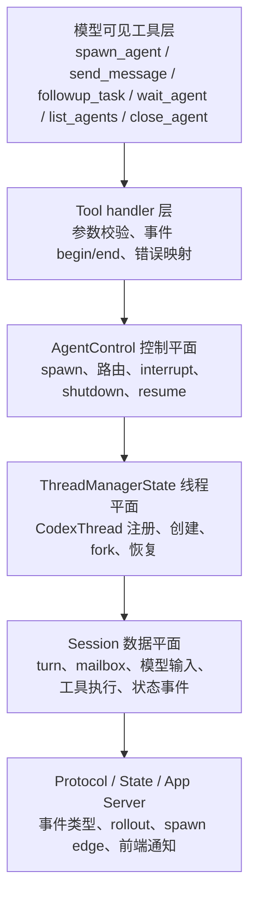

# 1. 总体架构

## 1.1 分层视图

Codex 的多 Agent 实现可以分为六层：



对应源码：

- 工具 schema：`codex-rs/tools/src/agent_tool.rs`
- 工具计划：`codex-rs/tools/src/tool_registry_plan.rs`
- V2 handlers：`codex-rs/core/src/tools/handlers/multi_agents_v2/`
- 控制平面：`codex-rs/core/src/agent/control.rs`
- 线程平面：`codex-rs/core/src/thread_manager.rs`
- Session：`codex-rs/core/src/session/`
- 协议：`codex-rs/protocol/src/protocol.rs`
- 状态存储：`codex-rs/state/`

## 1.2 子 Agent 的真实运行单元

协作型子 Agent 的真实运行单元是新的 `CodexThread`，其内部又持有一套完整 `Codex/Session`。`AgentControl::spawn_agent_internal()` 最终调用：

- 新上下文：`ThreadManagerState::spawn_new_thread_with_source()`；
- fork 上下文：`ThreadManagerState::fork_thread_with_source()`；
- 恢复历史：`ThreadManagerState::resume_thread_from_rollout_with_source()`。

三条路径最终都汇入 `ThreadManagerState::spawn_thread_with_source()`，再调用 `Codex::spawn()` 并通过 `finalize_thread_spawn()` 注册到：

```rust
Arc<RwLock<HashMap<ThreadId, Arc<CodexThread>>>>
```

因此每个子 Agent 都有：

- 独立 `ThreadId`；
- 独立模型会话与上下文窗口；
- 独立 active turn 与任务生命周期；
- 独立 `AgentStatus` watch channel；
- 独立 mailbox；
- 独立 rollout 文件/记录；
- 独立 token usage；
- 独立 App Server 事件订阅对象。

这也是为什么子 Agent 可以和主 Agent 真正并发运行，而不是等待一次嵌套函数调用返回。

## 1.3 “全局线程管理器”与“根任务树控制器”分离

`ThreadManagerState` 管理进程内全部线程；`AgentControl` 只管理一个根会话树。

`ThreadManager::agent_control()` 每次启动一个普通 root thread 时创建新的 `AgentControl`：

```rust
AgentControl::new(Arc::downgrade(&self.state))
```

`AgentControl` 内部有两个重要字段：

```text
manager: Weak<ThreadManagerState>
state: Arc<AgentRegistry>
```

- `manager` 是到全局线程集合的弱引用，负责找到并操作真实 `CodexThread`；使用 `Weak` 避免 `ThreadManagerState -> CodexThread -> Session -> AgentControl -> ThreadManagerState` 引用环。
- `state` 是当前根任务树独占的 `AgentRegistry`，负责配额、逻辑路径、昵称和任务元数据。

spawn 子 Agent 时传入的是 `self.clone()`，所以所有后代共享同一个 `Arc<AgentRegistry>`。它们看到的是同一棵任务树，但不会把其他 root thread 的 Agent 混进来。

## 1.4 两个身份：ThreadId 与 AgentPath

V2 同时保留物理身份和逻辑身份：

- `ThreadId`：运行时/持久化层的唯一线程 ID；
- `AgentPath`：模型协作层的 canonical task name。

例如根 Agent 创建 `backend`，`backend` 再创建 `tests`：

```text
/root
└── /root/backend
    └── /root/backend/tests
```

实现位于 `codex-rs/protocol/src/agent_path.rs`：

- root 固定为 `/root`；
- task name 只能使用小写字母、数字和下划线；
- 禁止 `root`、`.`、`..` 和 `/`；
- 当前 Agent `/root/backend` 解析相对目标 `tests` 得到 `/root/backend/tests`；
- 跨分支通信必须使用绝对路径，例如 `/root/frontend`。

`AgentRegistry.agent_tree` 用 path 字符串索引 `AgentMetadata`，后者包含：

- `agent_id`；
- `agent_path`；
- `agent_nickname`；
- `agent_role`；
- `last_task_message`。

## 1.5 父子关系的协议表达

`codex-rs/protocol/src/protocol.rs` 用 `SessionSource` 标记线程来源。协作型子 Agent 使用：

```rust
SessionSource::SubAgent(SubAgentSource::ThreadSpawn {
    parent_thread_id,
    depth,
    agent_path,
    agent_nickname,
    agent_role,
})
```

这组元数据同时承担：

- 识别是否为子 Agent；
- 计算下一层深度；
- 找直接父线程；
- 生成/恢复任务树；
- 完成时向直接父节点回传结果；
- 在 App Server 和 thread list 中展示昵称、角色；
- 为模型请求添加 `x-openai-subagent: collab_spawn` 标记。

## 1.6 共享与隔离边界

| 内容 | 主子 Agent 关系 | 实现依据 |
|---|---|---|
| 模型上下文 | 隔离；可选择性 fork | 每个子 Agent 是新 `Session`；`SpawnAgentForkMode` 控制历史 |
| active turn | 隔离 | 每个 Session 有自己的 `active_turn` |
| 状态 | 隔离、可订阅 | 每个 thread 有独立 `watch::Receiver<AgentStatus>` |
| rollout | 隔离、父子边关联 | 每个 thread 单独持久化；`thread_spawn_edges` 记录关系 |
| 文件系统 | 默认共享同一环境/cwd | spawn 复制 `turn.cwd` 与 environment selections，没有内建每 Agent 写集隔离 |
| shell snapshot | 从父节点继承 | `inherited_shell_snapshot_for_source()` |
| exec policy | 策略兼容时复用父节点 | `inherited_exec_policy_for_source()` |
| approval/sandbox | 从创建时的有效 turn 配置复制 | `apply_spawn_agent_runtime_overrides()` |
| Agent 注册表 | 同一根树共享 | clone 同一 `AgentControl.state` |
| 工具集合 | 通常相同，但受 feature、角色和深度限制 | `ToolsConfig` + role config + depth check |

“文件系统共享、模型上下文隔离”是理解协作行为的关键：不同 Agent 不会自动看到对方的思考和上下文，但会立即看到对方在同一工作目录中的文件修改。因此并发写同一文件存在冲突风险，运行时没有自动 merge 或文件所有权锁。

## 1.7 高层编排不是硬编码调度器

底层没有一个根据用户目标自动生成 DAG、分配节点并验收语义结果的中央 scheduler。真正的 orchestrator 是主 Agent 模型，它读取：

- `spawn_agent` 工具描述中的委派建议；
- collaboration mode developer instructions；
- 用户和 `AGENTS.md` 指令；
- `<environment_context><subagents>...</subagents>` 中的当前子 Agent 列表；
- mailbox 中的其他 Agent 消息与完成通知。

运行时只保证：

- 能安全创建/寻址线程；
- 消息按 mailbox 顺序交付；
- 状态来自可观察的终止事件；
- 并发和深度不超过配置；
- 关闭与恢复尽可能保持任务树一致；
- 前端可观察协作过程。

任务是否拆得合理、子 Agent 的答案是否满足目标、最终结果是否正确，仍需主 Agent 整合、验证和必要时追问。
