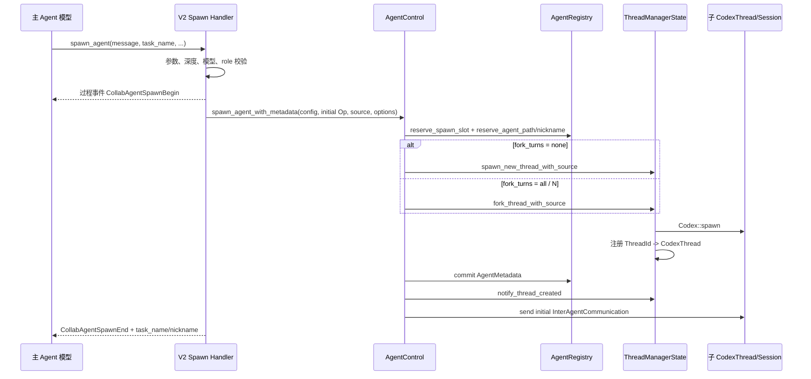

# 2. 任务派发与生命周期

## 2.1 从模型工具调用到子线程

V2 的派发入口是模型调用 `spawn_agent`。工具 schema 在 `codex-rs/tools/src/agent_tool.rs` 的 `create_spawn_agent_tool_v2()` 中定义，关键参数是：

| 参数 | 含义 |
|---|---|
| `message` | 给新 Agent 的初始纯文本任务 |
| `task_name` | 当前任务树下唯一的逻辑名称 |
| `agent_type` | 可选角色，例如 `default`、`explorer`、`worker` |
| `model` | 可选模型覆盖 |
| `reasoning_effort` | 可选推理强度覆盖 |
| `fork_turns` | `none`、`all` 或正整数字符串 |

调用链如下：



关键实现：

- handler：`codex-rs/core/src/tools/handlers/multi_agents_v2/spawn.rs`
- 公共配置：`codex-rs/core/src/tools/handlers/multi_agents_common.rs`
- 控制平面：`codex-rs/core/src/agent/control.rs`
- 线程创建：`codex-rs/core/src/thread_manager.rs`

## 2.2 派发前的校验

### 任务路径

`thread_spawn_source()` 将 `task_name` 拼接到当前 AgentPath：

```text
当前 /root + task_name=backend       -> /root/backend
当前 /root/backend + task_name=tests -> /root/backend/tests
```

`AgentRegistry::reserve_agent_path()` 以原子临界区保证路径唯一。重复路径直接失败，避免两个并发 spawn 获得相同逻辑地址。

### 深度

`next_thread_spawn_depth()` 读取当前 `SessionSource::ThreadSpawn.depth` 并加一；handler 使用：

```text
child_depth > agent_max_depth => 拒绝创建
```

默认 `DEFAULT_AGENT_MAX_DEPTH = 1`，见 `codex-rs/core/src/config/mod.rs`。因此默认配置允许 root 创建一层子 Agent，但子 Agent 再创建孙 Agent 会被拒绝。虽然 V2 工具描述声明子 Agent“有能力创建自己的 subagents”，这表示工具与代码路径具备递归能力，不代表默认深度配置一定允许。

### 并发槽位

`AgentRegistry::reserve_spawn_slot()` 使用 `AtomicUsize::compare_exchange_weak()` 抢占配额。V2 默认：

```text
max_concurrent_threads_per_session = 4
agent_max_threads = 4 - 1 = 3
```

root 不占 `AgentRegistry.total_count`，因此默认是 root + 最多 3 个活跃后代。

### RAII 回滚

配额、路径和昵称先放在 `SpawnReservation` 中。只有线程创建成功后才 `commit()`；中途出错时 `Drop` 自动释放计数和预留路径。这避免并发失败永久吃掉槽位。

## 2.3 子 Agent 配置从哪里来

`build_agent_spawn_config()` 不是简单复制磁盘配置，而是以父 Agent 当前 turn 的有效配置为准：

- 当前模型与 provider；
- reasoning effort/summary；
- developer instructions；
- compact prompt；
- approval policy；
- permission profile/sandbox；
- shell environment policy；
- cwd。

随后按次序叠加：

1. 显式 `model` / `reasoning_effort` 请求；
2. `agent_type` role 配置；
3. 运行时字段再同步；
4. 深度相关 feature 限制。

角色实现位于 `codex-rs/core/src/agent/role.rs`。用户角色可以来自 config layer 或 `agents/*.toml`，发现逻辑在 `codex-rs/core/src/config/agent_roles.rs`。

内置角色：

- `default`：无额外配置；
- `explorer`：工具描述层提供代码探索用途和复用建议；当前 `builtins/explorer.toml` 为空，因此它没有额外模型/权限锁定；
- `worker`：工具描述层强调执行工作、文件所有权和并发写冲突。

如果 role 文件固定了 `model` 或 `model_reasoning_effort`，角色层优先，工具描述也会提示这些设置不能被调用参数改变。

## 2.4 fork_turns 的真实语义

### `none`

创建全新 thread，不复制父 rollout。它仍会获得父 turn 的有效基础指令、developer instructions、运行时权限、cwd、environment、shell snapshot 等，但没有父对话历史。

适合：任务自包含、希望减少 token、避免将主 Agent 的冗余上下文带给子 Agent。

### `all`

先确保父 rollout materialized 并 flush，然后读取父 rollout，建立 `InitialHistory::Forked`。

“all”不是原始字节级复制。`keep_forked_rollout_item()` 会过滤：

- 保留 system/developer/user message；
- 只保留 phase 为 `FinalAnswer` 的 assistant message；
- 删除 reasoning；
- 删除 shell/function/tool/web/image generation call 及其 output；
- 删除旧 `TurnContext`，让子 Agent 建立自己的 context diff baseline；
- 保留 compaction、event、session metadata；
- 删除父线程已注入的 V2 root/subagent usage hint，子线程按自己的身份重新注入。

这是一种“语义历史 fork”，目标是给子 Agent 保留决策上下文，同时减少隐藏推理和过程工具噪声。

全量 fork 禁止同时传 `agent_type`、`model`、`reasoning_effort`。源码通过 `reject_full_fork_spawn_overrides()` 强制执行，意图是让 fork 子线程继承父线程的有效类型/模型/推理配置，避免历史与运行配置不一致。

### 正整数 N

`truncate_rollout_to_last_n_fork_turns()` 先截取最近 N 个 fork turn，再执行同样的过滤。

fork turn 边界包括：

- 真实用户消息；
- `trigger_turn=true` 的 inter-agent assistant envelope。

因此子 Agent 接到的后续任务本身也会成为可截断的 turn 边界。实现位于 `codex-rs/core/src/thread_rollout_truncation.rs`。

## 2.5 初始任务如何启动

线程注册完成后，`AgentControl` 调用 `send_input(new_thread_id, initial_operation)`。

V2 的纯文本初始任务通常被包装为：

```rust
Op::InterAgentCommunication {
    communication: InterAgentCommunication {
        author: parent_path,
        recipient: child_path,
        content: prompt,
        trigger_turn: true,
        ...
    }
}
```

`Session` 收到后先入 mailbox，再因 `trigger_turn=true` 在空闲时启动 regular turn。这样初始任务、后续 Agent 消息和完成通知统一走同一消息模型。

## 2.6 运行与状态转换

每个 Session 的 `send_event_raw()/deliver_event_raw()` 根据事件更新 status watch：

| 事件 | `AgentStatus` |
|---|---|
| 初始 | `PendingInit` |
| `TurnStarted` | `Running` |
| `TurnComplete` | `Completed(last_agent_message)` |
| `TurnAborted::Interrupted` | `Interrupted` |
| `TurnAborted::BudgetLimited` | `Interrupted` |
| 其他 abort | `Errored(reason)` |
| `Error` | `Errored(message)` |
| `ShutdownComplete` | `Shutdown` |
| 找不到 thread | `NotFound` |

状态转换实现：`codex-rs/core/src/agent/status.rs`；watch 更新：`codex-rs/core/src/session/mod.rs`。

`Completed` 表示当前 turn 完成，不表示 thread 对象已经被销毁。该 Agent 仍可接收 `followup_task` 并开始下一 turn。

## 2.7 结束、关闭与恢复

### 自然完成

子 Agent 自然完成 turn 后仍保留在线程管理器和 registry 中。V2 会把完成状态作为 queue-only mailbox 消息发送给直接父 Agent，但不会自动关闭 child。

### `close_agent`

V2 handler：`codex-rs/core/src/tools/handlers/multi_agents_v2/close_agent.rs`。

关闭过程：

1. 解析 task path/ThreadId；
2. 禁止关闭 root；
3. 读取关闭前状态；
4. 将持久化 spawn edge 标记为 `Closed`；
5. 找到内存中的所有后代；
6. flush rollout；
7. 对目标和后代发送 `Op::Shutdown`；
8. 从 `ThreadManagerState.threads` 和 `AgentRegistry` 移除；
9. 释放并发槽位。

关闭是子树级联操作，而不是只关闭一个叶节点。

### 恢复

legacy V1 暴露 `resume_agent`；V2 工具面不暴露 resume。底层 `AgentControl::resume_agent_from_rollout()` 仍支持从 rollout 恢复，并使用 SQLite `thread_spawn_edges` 广度优先恢复所有 `Open` 后代，跳过 `Closed` 边。

因此“底层具备恢复能力”和“当前 V2 模型可以直接调用恢复工具”是两件不同的事。
