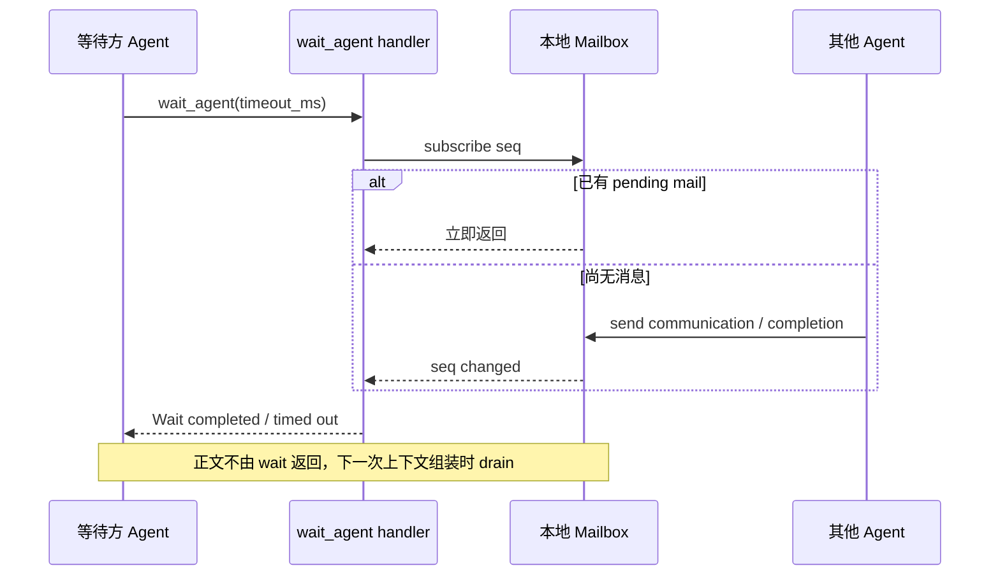

# 3. 主子 Agent 通信与协同

## 3.1 通信载体

V2 的统一消息结构是 `InterAgentCommunication`，定义于 `codex-rs/protocol/src/protocol.rs`：

```rust
pub struct InterAgentCommunication {
    pub author: AgentPath,
    pub recipient: AgentPath,
    pub other_recipients: Vec<AgentPath>,
    pub content: String,
    pub trigger_turn: bool,
}
```

当前模型工具只构造一个主接收者，`other_recipients` 预留了多接收者表达，但 V2 handlers 传入空数组。

消息进入模型上下文时被编码成 assistant commentary：

```json
{
  "author": "/root/backend",
  "recipient": "/root",
  "other_recipients": [],
  "content": "任务完成……",
  "trigger_turn": false
}
```

这不是普通 user message。它作为带来源和目标的结构化 assistant envelope 记录在接收线程历史中，便于模型区分用户输入与 Agent 间通信。

## 3.2 Mailbox 设计

每个 `Session` 持有一对：

```text
Mailbox + Mutex<MailboxReceiver>
```

`codex-rs/core/src/agent/mailbox.rs` 使用：

- `mpsc::UnboundedSender/Receiver`：承载消息内容；
- `VecDeque`：保持待处理顺序；
- `AtomicU64`：为每次发送生成单调递增 seq；
- `watch::Sender<u64>`：通知 wait 者“mailbox 发生变化”。

内容通道和变化通知分离有两个好处：

1. `wait_agent` 不必消费消息即可高效等待；
2. 消息最终仍由 Session 在模型采样边界统一 drain，避免 wait 工具偷走正文。

mailbox 是无界队列。它降低发送方阻塞风险，但没有内建背压；极端消息风暴可能增长内存。

## 3.3 三种发送语义

### `send_message`

`send_message` 使用 `MessageDeliveryMode::QueueOnly`，最终将 `trigger_turn` 改为 `false`。

语义：

- 消息可靠排入目标 mailbox；
- 不主动启动目标的新 turn；
- 目标正在运行时，可在合适的采样边界被注入；
- 目标空闲时，消息留在 mailbox，等待下一次 turn 或显式协作动作。

它允许向 root 发送消息，因此子 Agent 可以把中间发现异步汇报给主 Agent，而不强制打断主 Agent。

### `followup_task`

`followup_task` 使用 `MessageDeliveryMode::TriggerTurn`，`trigger_turn=true`。

语义：

- 目标空闲时，`maybe_start_turn_for_pending_work_with_sub_id()` 创建 regular turn；
- 目标正在运行时，消息排队，并优先在当前 turn 的可接收边界注入；
- `interrupt=true` 时，先 `Op::Interrupt`，再投递新任务；
- 禁止将 task 派给 root，避免子 Agent 反向调度主 Agent 执行任务。

工具描述还声明：如果消息到达时目标正在运行且 `interrupt=false`，当前 turn 完成后会启动下一 turn。但从当前源码调用链看，如果消息在 final-answer boundary 之后才到达，mailbox delivery 会被置为 `NextTurn`，而普通 `on_task_finished()` 路径没有显式再次调用 `maybe_start_turn_for_pending_work()`。消息和 trigger 标志仍保留，后续调度触发可以消费它；“立即自动开始下一 turn”是否在所有竞态下成立，当前实现不如工具描述明确。这是 V2 尚在开发阶段需要测试固定的边界。

### 完成通知

子 Agent 完成时，`Session::maybe_notify_parent_of_terminal_turn()` 生成 queue-only 通知发给直接父 Agent：

```text
<subagent_notification>
{ "agent_path": "...", "status": ... }
</subagent_notification>
```

它只针对：

- `Feature::MultiAgentV2` 已启用；
- `SubAgentSource::ThreadSpawn`；
- 有 canonical child path；
- `TurnComplete` 或 final `TurnAborted`；
- `AgentStatus` 被判定为 final。

通知是 `trigger_turn=false`，因此不会让空闲主 Agent 无条件追加一次模型调用。主 Agent 可在当前工作流、下一 turn 或 `wait_agent` 后消费它。

## 3.4 正文何时进入模型上下文

`Session::get_pending_input()` 将两类输入合并：

1. 当前 turn 的 pending input；
2. mailbox drain 后转换的 response input item。

如果模型刚刚产生 commentary 或 reasoning item，`session/turn.rs` 会检查 mailbox；有新消息时提前结束当前 sampling request，并设置 `needs_follow_up=true`，让下一次模型请求携带消息。这能在不中断整个 Agent turn 的情况下快速吸收其他 Agent 的新信息。

如果模型已经产生 final answer 或 image generation 结果，`stream_events_utils.rs` 会将 mailbox delivery phase 设为 `NextTurn`。这样晚到的 Agent 消息不会在 final answer 后悄悄扩展同一 turn，保持用户可见答案边界稳定。

## 3.5 `wait_agent` V2

V2 wait 不再接收指定 Agent ID 列表，而是等待当前 Session mailbox 的任意变化：



实现：`codex-rs/core/src/tools/handlers/multi_agents_v2/wait.rs`。

timeout 规则：

- 默认 30 秒；
- 非正值报错；
- 最小值来自 `features.multi_agent_v2.min_wait_timeout_ms`，默认 10 秒；
- 最大 3,600,000ms；
- handler 用 `tokio::time::timeout_at`，不轮询。

当前源码有一个值得注意的接口差异：工具描述称会返回“哪些 Agent 有更新”的摘要，但 V2 handler 实际只返回：

```json
{ "message": "Wait completed.", "timed_out": false }
```

或 timeout 版本；`CollabWaitingEndEvent` 中的 `statuses` 也为空。真正的 Agent 标识和正文要等 mailbox 注入模型上下文后才可见。这应视为当前 under-development V2 的实现现状，而不是依赖工具描述推断更多返回字段。

## 3.6 寻址与可通信范围

`resolve_agent_target()` 支持两类目标：

- 能解析成 `ThreadId`：直接使用；
- 否则按当前 `AgentPath` 解析相对/绝对 task path。

相对路径只向当前节点的后代解析：

```text
当前 /root/a，target=b       -> /root/a/b
当前 /root/a，target=/root/b -> /root/b
```

没有 `..` 语义，所以跨兄弟分支必须使用 canonical absolute path。这个约束让路径解析无歧义，也避免意外逃逸到其他 root tree。

## 3.7 协作事件协议

每个模型工具操作同时发出 begin/end 事件：

| 操作 | begin | end |
|---|---|---|
| spawn | `CollabAgentSpawnBegin` | `CollabAgentSpawnEnd` |
| send/followup | `CollabAgentInteractionBegin` | `CollabAgentInteractionEnd` |
| wait | `CollabWaitingBegin` | `CollabWaitingEnd` |
| close | `CollabCloseBegin` | `CollabCloseEnd` |
| legacy resume | `CollabResumeBegin` | `CollabResumeEnd` |

事件包含 `call_id`、sender/receiver thread ID、prompt、模型、推理强度、状态等。用途包括：

- rollout 重放；
- TUI 展示；
- App Server v2 `ItemStarted/ItemCompleted`；
- thread history 重建；
- analytics 与 rollout trace。

这些事件是可观察性协议，不是 Agent 间正文通道；正文通道仍是 `InterAgentCommunication + Mailbox`。

## 3.8 通信可靠性边界

运行时提供的保证和不保证项：

| 项目 | 当前实现 |
|---|---|
| 同一 mailbox 内顺序 | `mpsc + VecDeque` 保持发送顺序 |
| 发送方等待接收方处理 | 不等待；成功表示操作已路由/入队 |
| 消息持久化 | 消费进入历史后由 rollout 记录；纯内存 pending mailbox 本身不是数据库队列 |
| 跨进程投递 | 不是消息总线；通过同一 `ThreadManagerState` 的内存线程路由 |
| delivery ack | 没有显式业务 ack；可由接收方再发送消息确认 |
| 自动重试 | 没有通用消息重试协议 |
| 语义验收 | 没有；主 Agent 需检查内容和产物 |

因此高价值派发应在 task message 中明确输出格式、文件边界和验证标准，并由主 Agent 检查，而不能把“消息已送达”当成“目标已完成”。
