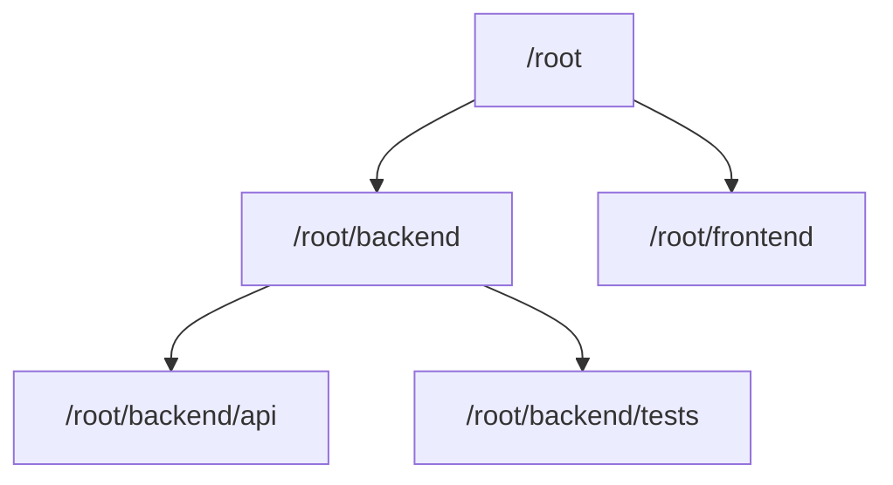

# 5. 多子 Agent 管理

## 5.1 管理对象不是平面列表，而是任务树

V2 用 `AgentPath` 将并发 Agent 组织成树：



树结构同时存在于三个层面：

1. 内存 registry：`AgentRegistry.agent_tree`，path -> metadata；
2. live thread：从每个 thread 的 `SessionSource::ThreadSpawn.parent_thread_id` 重建；
3. SQLite：`thread_spawn_edges(parent_thread_id, child_thread_id, status)`。

内存层适合快速寻址与展示，SessionSource 适合运行时关系推导，SQLite 适合跨进程恢复。三者各自负责不同生命周期阶段。

## 5.2 并发配额管理

`AgentRegistry.total_count` 是整棵 root tree 共享的原子计数器。

特性：

- 所有 `AgentControl` clone 共享；
- 并发 spawn 使用 CAS，避免竞态超额；
- spawn 失败通过 `SpawnReservation::drop()` 释放；
- close/shutdown 成功移出 registry 后释放；
- root 不计入该计数；
- V2 配置把“总并发 thread 数”减一转换成“可创建 subagent 数”。

默认 V2 总并发 4，包括 root；配置为 1 时 `agent_max_threads=0`，完全禁止子 Agent。

注意：变量注释曾写“total number”，但实现会在关闭时递减，所以它控制的是当前占用槽位，不是整个 session 历史累计创建数。

## 5.3 深度管理

深度由 `SessionSource::ThreadSpawn.depth` 携带，不依赖 path 字符串层数。这样恢复缺失 path 的旧线程时仍可执行深度限制。

handler 在创建前检查：

```text
next_depth > max_depth -> Agent depth limit reached
```

关闭子树和恢复后代则通过真实 `parent_thread_id` 边遍历，而不是假设 path 永远完整。

## 5.4 名称、昵称与角色

三个字段职责不同：

| 字段 | 示例 | 用途 |
|---|---|---|
| `agent_path` | `/root/backend/tests` | 稳定寻址、层级、唯一性 |
| `agent_nickname` | `Atlas` | UI/自然语言展示，不用于稳定路由 |
| `agent_role` | `worker` | 配置与职责提示 |

昵称从 `agent_names.txt` 或 role-specific `nickname_candidates` 随机选择。当前 pool 耗尽时清空 used set，并生成 `name the 2nd/3rd/...` 形式的后缀。关闭 Agent 不会立即释放昵称；要等 pool reset 后才可能复用，降低同一会话中混淆。

V2 可以通过 `hide_spawn_agent_metadata` 隐藏模型选择、角色参数和返回 nickname，但 canonical task name 仍必须返回，因为后续路由依赖它。

## 5.5 `list_agents`

`list_agents` 会：

1. 确保当前 root 注册为 `/root`；
2. 解析可选相对/绝对 `path_prefix`；
3. 获取 registry 中 live agents；
4. 按 path 和 thread ID 稳定排序；
5. 查每个 live thread 的最新 status；
6. 返回 `agent_name`、`agent_status`、`last_task_message`。

root 条目使用固定 `last_task_message = "Main thread"`。子 Agent 的 last task 在成功发送初始任务、message 或 followup 后更新。

`list_agents` 只列 live registry，不是历史审计 API。已 close 的 Agent 不会出现，但仍可能存在 rollout 与 SQLite spawn edge。

## 5.6 多 Agent 等待策略

V1 与 V2 的管理思路不同：

- V1：`wait_agent(targets=[id...])`，订阅指定 status watch，等待任意 final；
- V2：`wait_agent()`，订阅当前 Agent mailbox 的 seq，等待任意消息或完成通知。

V2 更适合动态任务树：主 Agent 不必预先维护一组 ThreadId，也不会因只等某个 Agent 而漏掉另一个 Agent 的关键消息。但代价是 wait 返回值本身信息较少，正文要在下一次模型上下文中读取。

高效模式是：

1. 一轮中创建多个互不依赖 Agent；
2. 主 Agent 继续做本地关键路径工作；
3. mailbox 有结果时自然吸收；
4. 只有确实阻塞时调用 wait；
5. `list_agents` 用于状态盘点，不用于频繁轮询。

## 5.7 关闭子树

`AgentControl::shutdown_agent_tree()` 先计算全部 live descendants，再依次 shutdown 目标和后代。

遍历通过 `live_thread_spawn_children()` 从 live threads 的 config snapshot 重建 `parent -> children` map，再用显式 stack 做深度遍历。它不依赖 registry path，因此匿名或恢复后 path 缺失的线程也能关闭。

关闭前会将目标 child edge 标记为 `Closed`。未来恢复根树时，只有 `Open` 后代会自动恢复。这使“用户/模型明确关闭”和“进程退出导致暂时不 live”能够区分。

## 5.8 持久化与恢复

### Rollout

每个 thread 的事件和上下文单独记录。spawn fork 读取父 rollout；resume 读取子 rollout。

### Spawn edge

迁移文件 `codex-rs/state/migrations/0021_thread_spawn_edges.sql` 创建：

```sql
CREATE TABLE thread_spawn_edges (
    parent_thread_id TEXT NOT NULL,
    child_thread_id TEXT NOT NULL PRIMARY KEY,
    status TEXT NOT NULL
);
```

### 恢复算法

`resume_agent_from_rollout()`：

1. 恢复目标 thread；
2. 从 state DB 查询 `Open` children；
3. 用 `VecDeque` 广度优先遍历；
4. 为 child 重建 `ThreadSpawn` source 和 depth；
5. 从 thread metadata 恢复 nickname/role；
6. 子节点恢复成功才继续遍历其后代；
7. `Closed` 后代不自动恢复。

这种设计允许整个协作树跨 Codex 进程恢复，而不仅是恢复单个对话文件。

## 5.9 前端和 App Server 如何管理多个 thread

子 thread 创建后，`AgentControl` 调用 `ThreadManagerState::notify_thread_created()`，通过容量 1024 的 broadcast channel 发送 `ThreadId`。

App Server 主循环位于 `codex-rs/app-server/src/lib.rs`：

- 订阅 `thread_created_rx`；
- 对所有已 initialized connection 调用 `try_attach_thread_listener()`；
- 子 Agent 后续事件可以像普通 thread 一样流向客户端；
- receiver lag 时当前实现只记录 warning，不做全量 resync。

与此同时，主 thread 中的协作工具 begin/end 事件由 `codex-rs/app-server/src/bespoke_event_handling.rs` 映射为：

```text
ThreadItem::CollabAgentToolCall
```

包含工具类型、sender/receiver IDs、prompt、model、reasoning effort 和各 Agent status。`codex-rs/app-server-protocol/src/protocol/thread_history.rs` 还能从 rollout 事件重建这些 item。

## 5.10 环境上下文中的 Agent 清单

每次构造模型输入时，`Session` 调用：

```text
AgentControl::format_environment_context_subagents(current_thread_id)
```

它只列当前节点的 open/live 直接 children，并把结果放入：

```xml
<environment_context>
  <subagents>
    ...
  </subagents>
</environment_context>
```

这给模型一个低成本的局部拓扑视图，帮助它复用已有 Agent，而不必每轮先调用 `list_agents`。全树盘点仍需要 `list_agents`。
