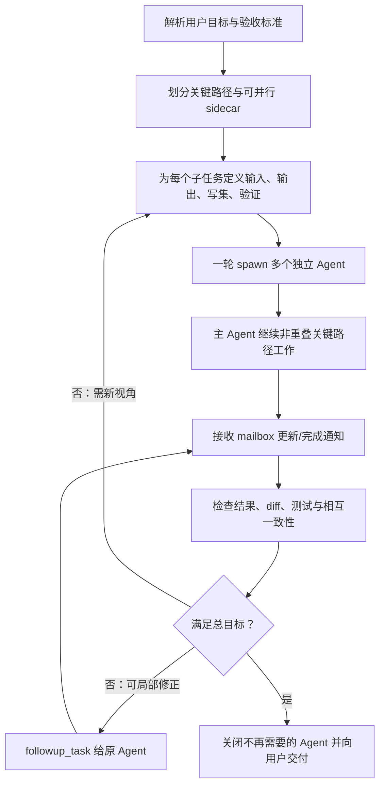

# 7. 高效协作机制、设计评价与实践建议

## 7.1 如何让主子 Agent 高效协作

源码中的效率不是靠单一算法实现，而是多层机制组合。

### 1. 独立上下文并发

每个子 Agent 是独立 thread/session，可以并行进行模型调用和工具执行。主 Agent 不必把所有探索过程塞进自己的上下文窗口。

### 2. 可控上下文 fork

`fork_turns=none/all/N` 允许在“上下文充分”和“token 成本低”之间选择。过滤 reasoning/tool traces 进一步压缩 fork 历史并减少过程噪声。

### 3. 逻辑任务路径

`/root/...` canonical path 比随机 UUID 更适合模型记忆、复用和跨 Agent 引用。相对寻址鼓励局部协作，绝对寻址支持跨分支协调。

### 4. queue-only 与 trigger-turn 分离

- 中间信息使用 `send_message`，避免无谓启动模型；
- 新任务使用 `followup_task`，必要时自动唤醒；
- 完成通知 queue-only，避免每个 child 完成都单独触发父模型调用。

### 5. 事件驱动等待

V2 `wait_agent` 等待 mailbox seq watch，不做高频轮询；V1 wait 使用 status watch 和 `FuturesUnordered`。两代都避免 sleep-polling 消耗。

### 6. 模型采样边界注入

mailbox 消息可以在 commentary/reasoning 后让 sampling request 提前结束并 follow-up，使正在工作的 Agent 及时吸收新信息，同时不粗暴 interrupt 整个 turn。

### 7. 可观察性

协作操作都有 begin/end 事件；子 thread 也会自动被 App Server listener 订阅。主 Agent、UI 和历史重建都能看到任务派发、接收者和状态。

### 8. 树级配额和级联清理

原子配额阻止无限并发；深度限制阻止无界递归；close 子树避免孤儿 Agent 持续占用资源。

## 7.2 “按目标完成”依赖哪些机制

可以分为硬机制和软机制。

### 运行时硬机制

- 任务消息必须非空；
- task path 必须合法且唯一；
- spawn 受深度和并发限制；
- 状态由真实事件推导，不由模型自报；
- completion 携带 final message；
- errored/not found/shutdown 可区分；
- rollout 与 spawn edge 可恢复；
- close 会清理后代；
- 配置、权限和环境从有效父 turn 继承。

这些机制保证执行过程可追踪、可约束、可恢复。

### 模型/提示软机制

- spawn 工具描述要求任务具体、有界、可独立执行；
- 建议把非阻塞 sidecar 任务并行派发；
- 要求避免主 Agent 与子 Agent 重复做同一件事；
- coding task 要划分互斥写集；
- worker role 强调 ownership；
- orchestrator developer instructions 要求先计划、持续更新、整合结果；
- `AGENTS.md` 规则对共享工作区内的修改继续生效；
- usage hint 可以分别指导 root 与 spawned child。

这些机制影响模型的编排质量，但不是运行时可证明的约束。

## 7.3 系统不保证什么

`AgentStatus::Completed` 只说明子 Agent 的 turn 正常完成，并不证明：

- 答案事实正确；
- 代码能编译；
- 测试已通过；
- 没有覆盖其他 Agent 修改；
- 用户验收条件已全部满足；
- 子 Agent 没有误解任务。

`AgentControl` 没有：

- 语义目标判定器；
- 自动 DAG 依赖分析；
- 文件级锁；
- 自动 patch merge；
- 共识/投票协议；
- 业务消息 ack/retry；
- 对子 Agent final answer 的自动事实校验。

因此主 Agent 仍承担最终编排责任：分解、选择上下文、检查结果、整合代码、运行验证、处理冲突、向用户交付。

## 7.4 推荐的派发模式

### 信息探索

适合并行：

```text
/root/api_trace      跟踪 API 调用链
/root/state_model    分析状态与持久化
/root/test_evidence  收集测试覆盖和边界行为
```

要求每个任务给出：问题范围、需要的具体结论、引用路径、禁止修改源码。

### 并行代码修改

只在写集明确互斥时使用：

```text
/root/backend   只修改 packages/backend/**
/root/frontend  只修改 packages/frontend/**
/root/docs      只修改 docs/**
```

派发消息应写明：

- 负责的文件/模块；
- 禁止触碰的范围；
- 已有并行 Agent，不能回滚他人修改；
- 验收命令；
- final message 中必须列出改动文件和验证结果。

### Review/验证

实现与 review 可以并行，但 review 必须有稳定输入。若 review 依赖尚未完成的 patch，过早派发只会造成等待或基于旧代码给出结论。

### 长时等待

不要用主 Agent 反复短轮询。优先：

- 让执行 Agent 自己等待其命令结束；
- 主 Agent 继续非重叠工作；
- 只有下一步被结果阻塞时调用 `wait_agent`。

## 7.5 一个可靠的主 Agent 编排循环



复用原 Agent 做 related follow-up 可以保留其 thread 上下文，减少重新解释任务；新领域或需要独立判断时再 spawn 新 Agent。

## 7.6 架构优点

### 线程模型统一

子 Agent 复用普通 `CodexThread/Session`，无需维护一套简化执行器。工具、模型、事件、rollout、权限等能力天然复用。

### 控制平面作用域清晰

全局 ThreadManager 与 root-tree AgentRegistry 分离，既能路由真实线程，又避免不同用户任务树污染配额和路径。

### 生命周期失败安全

`SpawnReservation` RAII、弱引用防环、watch 状态、持久化 edge、级联 close 都体现了对并发失败和恢复的考虑。

### 协议与 UI 解耦

core 发通用协作事件；App Server/TUI 自行映射展示。历史重建也复用同样事件，不依赖仅存在于内存的 UI 状态。

### 通信成本可调

queue-only、trigger-turn、interrupt、wait、fork depth 提供了多种成本/实时性选择。

## 7.7 风险与改进空间

### 1. 共享文件系统缺少冲突控制

当前依赖提示词约束写集。可考虑在更高层引入显式 ownership manifest、写入冲突检测或隔离 worktree，但这会增加集成成本，不一定适合所有环境。

### 2. V2 wait 返回过于贫乏

mailbox seq 只表示“有变化”，handler 没有返回 author/path/seq。工具描述和实现也不完全一致。可以考虑返回不消费正文的 metadata snapshot，例如 changed paths/authors/latest seq。

### 3. 消息队列无界且缺少 ack

正常 Agent 数量受配额限制，风险可控；但长时间高频互发仍可能积压。未来可增加容量、coalescing 或 backpressure telemetry。

### 4. 状态粒度有限

`Running/Completed/...` 适合生命周期，但无法表达 blocked、waiting-on-approval、waiting-on-agent 等业务状态。前端需结合 tool events 推断。

### 5. 描述、feature 和实现存在迁移差异

V2 尚未稳定，调用方应以实际 handler/schema 为准并通过测试固定预期，尤其是 wait 返回、默认 depth、resume 暴露和 role inheritance metadata。

### 6. semantic completion 依赖 orchestrator

可通过更结构化的 task contract、输出 schema、验收命令和独立 reviewer 提升可靠性，但不宜把所有任务都强制转成复杂工作流。

## 7.8 最终判断

Codex 的 subagent 架构可以概括为：

```text
独立线程执行 + 树级控制平面 + mailbox 数据平面 + 事件/rollout 可观察性
```

它的强项是复用完整 Agent 能力、低耦合并发、上下文隔离和可恢复生命周期；它没有试图在运行时硬编码“如何完成所有目标”，而是把高层任务分解与验收交给主 Agent 模型。

因此正确使用方式不是“尽可能多 spawn”，而是：只把边界清晰、能独立推进、写集互斥或只读的问题交给子 Agent，并让主 Agent 保留关键路径与最终验收责任。
