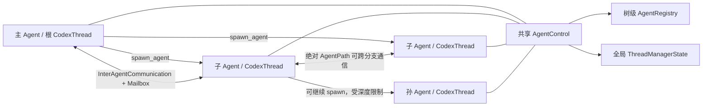

# Codex Subagent 实现分析

本文档集分析 codex 源码中的子 Agent（subagent）与多 Agent 协作实现。

## 分析基线

- Git commit：`a4fbd6d909262ebc539f559725944ba9b1ddca04`
- commit 时间：2026-04-29 11:40:47 +0800
- commit 标题：`feat(windows-sandbox): 增强 host 隔离控制`
- 分析日期：2026-07-15
- 源码工作树只有若干未跟踪的 sandbox 测试目录和 Windows 可执行文件；本文没有把它们作为实现依据。

## 核心结论

Codex 的协作型子 Agent 不是主 Agent 内部的一次普通函数调用，也不是共享同一模型上下文的轻量角色。它是一个独立的 `CodexThread` 和 `Session`：有独立的线程 ID、模型上下文、turn 生命周期、状态 watch channel、rollout 持久化和事件流。

同一根任务树中的 Agent 通过共享的 `AgentControl` 协作：

高层任务分解、选择哪个 Agent、何时等待、如何验收结果，主要仍由模型依据工具描述和 developer instructions 做决策。底层运行时提供的是并发线程、消息、状态、限制、持久化与事件等可靠原语，不是一个会自动保证语义正确性的 DAG 调度器。

## 文档导航

1. [01-architecture.md](01-architecture.md)：分层架构、核心对象、树与线程的关系。
2. [02-dispatch-and-lifecycle.md](02-dispatch-and-lifecycle.md)：主 Agent 如何派发任务，spawn、fork、运行、完成、关闭、恢复的完整调用链。
3. [03-communication.md](03-communication.md)：mailbox、消息注入、完成通知、等待与事件协议。
4. [04-capabilities-and-differences.md](04-capabilities-and-differences.md)：子 Agent 能做什么，与主 Agent 有什么相同和不同。
5. [05-multi-agent-management.md](05-multi-agent-management.md)：多子 Agent 命名、寻址、并发/深度限制、状态、持久化与前端订阅。
6. [06-v1-v2-and-other-subagents.md](06-v1-v2-and-other-subagents.md)：legacy multi-agent、MultiAgentV2，以及 review/guardian/agent-job 等其他“子 Agent”机制。
7. [07-design-assessment.md](07-design-assessment.md)：高效协作机制、设计优缺点、正确使用模式和源码层面的注意点。

## 关键源码索引

| 主题 | 相对源码路径 | 关键对象/职责 |
|---|---|---|
| 控制平面 | `codex-rs/core/src/agent/control.rs` | `AgentControl`，spawn/send/interrupt/wait 所依赖的底层能力 |
| 树级注册表 | `codex-rs/core/src/agent/registry.rs` | `AgentRegistry`、配额、路径、昵称、元数据 |
| Mailbox | `codex-rs/core/src/agent/mailbox.rs` | 无界消息队列、序号 watch、顺序 drain |
| 状态机 | `codex-rs/core/src/agent/status.rs` | 从 `EventMsg` 推导 `AgentStatus` |
| V2 工具处理器 | `codex-rs/core/src/tools/handlers/multi_agents_v2/` | spawn、send、followup、wait、list、close |
| legacy 工具处理器 | `codex-rs/core/src/tools/handlers/multi_agents/` | legacy spawn/send_input/wait/resume/close |
| 工具 schema | `codex-rs/tools/src/agent_tool.rs` | 暴露给模型的参数、描述和返回 schema |
| 工具选择与注册 | `codex-rs/tools/src/tool_registry_plan.rs` | 根据 feature 选择 V1 或 V2 工具集 |
| 线程管理 | `codex-rs/core/src/thread_manager.rs` | 创建、恢复、fork、注册 `CodexThread` |
| Session 消息调度 | `codex-rs/core/src/session/handlers.rs` | 处理 `Op::InterAgentCommunication` |
| Mailbox 消费 | `codex-rs/core/src/session/mod.rs` | drain mailbox、注入模型输入、完成通知 |
| 自动唤醒 | `codex-rs/core/src/tasks/mod.rs` | trigger-turn 消息在空闲时启动 regular turn |
| 协议类型 | `codex-rs/protocol/src/protocol.rs` | `SessionSource`、`AgentStatus`、协作事件 |
| Agent 路径 | `codex-rs/protocol/src/agent_path.rs` | `/root/...` 路径校验、join、resolve |
| 角色系统 | `codex-rs/core/src/agent/role.rs` | built-in/user role 配置叠加 |
| 角色发现 | `codex-rs/core/src/config/agent_roles.rs` | 从 config layer 和 `agents/*.toml` 加载角色 |
| spawn 边持久化 | `codex-rs/state/migrations/0021_thread_spawn_edges.sql` | 父子线程边及 open/closed 状态 |
| App Server 映射 | `codex-rs/app-server/src/bespoke_event_handling.rs` | 协作事件映射为 v2 `ThreadItem` |

## 主要测试证据

| 相对源码路径 | 覆盖内容 |
|---|---|
| `codex-rs/core/src/agent/control_tests.rs` | spawn/fork、配额共享、消息、完成通知、级联关闭、树恢复 |
| `codex-rs/core/src/agent/registry_tests.rs` | 配额 reservation、path 唯一性、昵称池、深度计算 |
| `codex-rs/core/tests/suite/subagent_notifications.rs` | 完成通知、fork 上下文、developer context、模型/role 覆盖 |
| `codex-rs/core/tests/suite/hierarchical_agents.rs` | 子 Agent 的层级 `AGENTS.md` 指令 |
| `codex-rs/core/src/session/tests.rs` | queue-only/trigger-turn mailbox 与 answer boundary |
| `codex-rs/core/src/tools/handlers/multi_agents_tests.rs` | legacy handlers、wait、resume 和错误路径 |
| `codex-rs/app-server/tests/suite/v2/turn_start.rs` | App Server 对 spawn item 与模型元数据的映射 |

## 术语约定

- **根 Agent / 主 Agent**：用户直接启动的 root thread，canonical path 为 `/root`。
- **协作型子 Agent**：由 `spawn_agent` 创建、`SubAgentSource::ThreadSpawn` 标记的独立 thread。
- **内部子 Agent**：review、guardian、memory consolidation、agent job 等一次性或专用执行单元；它们不一定使用 `AgentControl` 任务树。
- **AgentPath**：V2 的稳定逻辑地址，例如 `/root/backend/tests`。
- **ThreadId**：具体 `CodexThread` 的唯一 ID。
- **turn**：一个 Agent 的一次模型执行周期。一个 Agent thread 可以依次运行多个 turn。
- **rollout**：线程的持久化事件/上下文记录。
