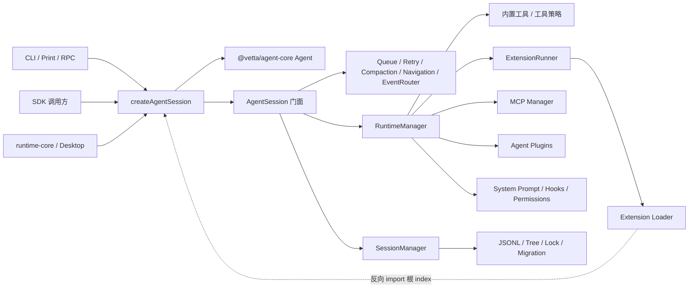

# Coding Agent 架构现状与问题评估

> 状态：初步评估  
> 日期：2026-07-25  
> 范围：`packages/coding-agent` 及其与 `runtime-*`、`desktop-app` 的直接边界

## 1. 结论摘要

`coding-agent` 当前不是一个边界清晰的“编码 Agent 内核”，而是一个在持续演进中不断吸收 CLI、SDK、会话、工具、扩展、MCP、插件、知识库、IM、后台任务与子 Agent 等能力的产品内核。

现有架构已经做过一次拆分：`AgentSession` 中的队列、重试、压缩、导航、事件路由等行为被提取为 Controller。但依赖方向没有随职责一起拆开，复杂度主要转移到了 `RuntimeManager`、`InputPipeline`、`SessionManager` 和 RPC 适配层。

核心问题可以概括为：

1. 系统没有唯一的组合根。
2. 多套扩展机制在中心模块中以命令式顺序拼接。
3. 产品垂直能力直接进入通用会话和输入管线。
4. 会话领域模型与文件存储、锁、迁移及宿主策略混合。
5. 公共 API 面积过大，runtime 和 desktop 对内部实现形成具体依赖。
6. 内部存在运行时和类型依赖环，限制后续拆分。

不建议整体重写。当前已有的 Controller、会话测试、Subagent 分层和底层 `@vetta/ai` / `@vetta/agent-core` 边界可以作为渐进式重构基础。

## 2. 分析范围与方法

本次评估以当前源码为准，文档仅作为设计意图参考。重点检查了：

- CLI、Print、RPC 和 SDK 入口；
- `AgentSession` 创建与生命周期；
- 输入处理、事件路由、工具运行时和系统提示词；
- Extension、Agent Plugin、Ecosystem Hook 与 MCP；
- Session JSONL、树结构、锁、迁移和分支；
- `runtime-core`、`runtime-tools`、`runtime-storage`、`runtime-mcp` 和 desktop 的直接依赖；
- 与当前实现相关的 ADR。

静态扫描得到：

- `packages/coding-agent/src` 下约 185 个 TypeScript 文件；
- TypeScript 源码约 46,638 行；
- 根 `src/index.ts` 包含约 36 组导出，至少覆盖 386 个符号或星号导出；
- 排除纯类型 import 后，最大运行时强连通分量包含 8 个文件；
- 包含类型依赖时，最大强连通分量扩展到 29 个文件。

最近 200 个涉及该包的本地提交中，变更最集中的源码文件包括：

| 文件 | 被涉及次数 |
|---|---:|
| `src/core/system-prompt.ts` | 48 |
| `src/core/agent-session.ts` | 47 |
| `src/core/sdk.ts` | 40 |
| `src/index.ts` | 30 |
| `src/core/session/runtime-manager.ts` | 29 |
| `src/core/session/input-pipeline.ts` | 16 |

这些文件同时也是当前主要的架构汇聚点，说明问题不仅是静态代码体积，也体现在实际变更传播上。

## 3. 当前架构

### 3.1 高层结构



### 3.2 入口与组合

`createAgentSession()` 是公开 SDK 工厂，负责：

- 创建 `AuthStorage`、`ModelRegistry` 和 `SettingsManager`；
- 设置服务端模型地址并加载远程模型；
- 创建或接收 `ResourceLoader` 与 `SessionManager`；
- 恢复模型、thinking level 和已有消息；
- 创建底层 `@vetta/agent-core` 的 `Agent`；
- 创建 `AgentSession` 并注入工具、插件、MCP、Hook、内存模式和 Subagent 配置。

随后，`AgentSession` 构造函数继续完成第二层装配：

- 创建 `EcosystemHookRuntime`；
- 创建共享 `SessionContext`；
- 创建 Queue、Retry、Bash、Model、Compaction、Navigation 和 Event Controller；
- 创建 TodoStore、BackgroundTaskManager 和 SubagentCoordinator；
- 创建 `RuntimeManager` 与 `InputPipeline`；
- 初始化 MCP、Agent 事件订阅和 continuation provider。

因此当前实际上存在两个组合位置：SDK 工厂和 `AgentSession` 构造函数。两者共同决定系统生命周期和依赖顺序。

### 3.3 回合执行

一次普通输入主要经过 `InputPipeline.prompt()`：

1. 刷新 Skill、MCP、图片设置、Persona 和提问能力；
2. 处理 Extension Command 和 input 拦截；
3. 规范化图片；
4. 展开 Skill、Scene 和 Prompt Template；
5. 处理 streaming queue；
6. 校验模型与 API Key；
7. 运行 Hook；
8. 进行预调用压缩；
9. 注入插件指令、知识模式、设置助手、附件和资源引用；
10. 准备插件与 Extension 修改后的系统提示词；
11. 根据本轮 metadata 临时过滤工具；
12. 调用 `agent.prompt()` 并等待 retry。

这个方法已经承担了输入解析、资源刷新、授权校验、上下文构建、产品模式、工具策略和 Agent 执行等多种职责。

### 3.4 工具与扩展运行时

`RuntimeManager` 当前同时拥有：

- 内置工具实例化；
- 场景、能力与工作模式过滤；
- Extension 加载结果与 `ExtensionRunner`；
- Agent Plugin 工具、策略、MCP 和系统提示词贡献；
- Ecosystem Hook 工具包装与权限请求；
- MCP 初始化、重载和渐进披露；
- Skill、Todo、后台任务、Subagent 和提问工具注册；
- 活跃工具集与系统提示词同步；
- 插件 continuation 与逐回合 prompt effect。

`buildRuntime()` 每次重新构建工具注册表、扩展 runner、MCP 工具、工具激活集、包装链和基础系统提示词。

### 3.5 会话持久化

`SessionManager` 同时管理：

- Session Header 和各类 Entry 协议；
- 版本迁移、JSONL 解析与序列化；
- 会话树、leaf、label 和分支；
- 同步文件读写；
- Session 文件锁；
- 延迟 flush 和 header 提前写入；
- compaction、fork、delete、branch export；
- Session 列表与元信息扫描；
- IM Gateway memory-mode rollover。

这使会话领域模型、存储实现、并发控制和具体宿主策略无法独立演进。

### 3.6 对外适配

- Print Mode 直接操作 `AgentSession` 并输出文本或 JSON 事件。
- RPC Mode 使用单个大型函数处理 NDJSON 传输、命令分发、Extension UI、Host Bridge、Memory Tool 和生命周期清理。
- `runtime-core` 直接依赖 `AgentSession`、`SessionManager`、`SessionEntry`、`loadEntriesFromFile` 和工具工厂。
- `runtime-tools`、`runtime-storage`、`runtime-mcp` 主要对 coding-agent 的具体实现进行重导出。
- desktop 除通过 runtime 层外，还直接导入 `ModelRegistry`、`DefaultResourceLoader`、knowledge、MCP 和 persona 等能力。

因此当前没有唯一、稳定的宿主集成边界。

## 4. 主要问题

### 4.1 P0：没有唯一组合根

`createAgentSession()` 和 `AgentSession` 构造函数共同创建系统对象。`RuntimeManager` 又需要反向访问完整 `AgentSession`，Extension Binding 也通过整个 Session 门面获得大量操作。

影响：

- 初始化顺序依赖隐式调用约定；
- 很难只实例化 Tool Runtime、Prompt Composer 或 Session Graph；
- Controller 单测仍需要较大的具体依赖集合；
- 新增横切能力时容易继续向构造参数和共享 Context 添加字段；
- Session 门面无法真正成为稳定边界。

### 4.2 P0：`RuntimeManager` 是新的 God Object

`RuntimeManager` 类约 1200 行，拥有约 44 个字段和 42 个方法；`buildRuntime()` 单方法约 231 行。

它的变化原因包括：

- 新增内置工具；
- 修改工具 scope 或 capability；
- 修改 Skill 可见性；
- 修改 Extension 生命周期；
- 修改 Agent Plugin 贡献；
- 修改 MCP；
- 修改系统提示词；
- 修改权限 Hook；
- 修改后台任务或 Subagent。

这些职责不属于同一个变化轴。当前拆分只是把原先的 `AgentSession` 巨型职责迁移到了新的管理器中。

### 4.3 P0：三套扩展机制缺少统一内部模型

当前至少存在三种横切机制：

1. Extension：进程内加载可信 TypeScript，可注册工具、命令、事件和 UI。
2. Agent Plugin：由宿主物化贡献，通过 invoker 桥接工具、MCP、系统提示词、策略和 continuation。
3. Ecosystem Hook：拦截 Session、Prompt、Tool、Permission、Stop 等生命周期。

三者的信任模型和加载方式可以不同，但在 coding-agent 内部处理的是高度重叠的概念。当前它们没有汇入统一的 contribution 和 phase 模型，执行先后顺序散落在：

- `InputPipeline`；
- `RuntimeManager.buildRuntime()`；
- Tool wrapper 嵌套顺序；
- `EventRouter`；
- continuation provider。

这会形成组合爆炸：单独测试每个机制不足以保证它们组合后的行为。

### 4.4 P0：产品垂直能力泄漏到通用管线

通用输入和会话层已经直接感知：

- Knowledge Mode；
- Settings Assist；
- IM Gateway memory-mode；
- IM 附件 Host Bridge；
- Desktop Prompt Attachments；
- Plugin Instructions；
- 工作模式；
- 后台任务；
- Workflow Subagent。

影响：

- 新增产品能力通常需要修改 `InputPipeline`、`RuntimeManager`、`AgentSessionConfig` 和 RPC；
- 无法在不影响其他宿主的前提下独立发布能力；
- SDK 用户会被迫携带本不需要的产品逻辑；
- 核心模块中的条件分支会随产品功能线性增加。

### 4.5 P1：会话领域与基础设施混合

`SessionManager` 既是：

- Session Graph；
- Entry Repository；
- JSONL Codec；
- Migration Runner；
- File Lock Manager；
- Session Query Service；
- IM rollover policy。

其同步 IO、全局文件系统调用和具体 JSONL 格式，使领域行为难以进行纯内存验证，也使替换存储后端或增加事务语义变得困难。

### 4.6 P1：依赖方向不稳定

主要依赖环来自：

- Extension Loader 为 Bun 二进制虚拟模块静态导入根 `src/index.ts`；
- 根 `index.ts` 又导出 SDK、Session、Extension、Resource Loader 和 CLI；
- SDK 创建 Session；
- Session 创建 RuntimeManager；
- RuntimeManager 使用 Extension；
- Extension Index 回到 Loader。

类型层面的环更大，原因包括：

- 子模块从 `agent-session.ts` 获取 `PromptOptions`、`SessionStats` 和 `AgentSessionEvent`；
- Controller 之间通过具体类型相互引用；
- Barrel 文件扩大了依赖可达范围。

依赖环未必立即造成运行错误，但会：

- 依赖 ESM 初始化顺序和 live binding；
- 阻碍模块独立测试与迁移；
- 让打包器行为成为架构前提；
- 增加后续拆包风险。

### 4.7 P1：公共 API 面积过大

根入口同时导出：

- Session 内部 Entry 与解析函数；
- Auth、Settings、ModelRegistry；
- Extension Runner 和大量事件类型；
- Tool 实例、工厂、Operations 和 Result 类型；
- Knowledge；
- Subagent Coordinator 和内部工具；
- Compaction 算法；
- Resource Loader；
- CLI main 和 RPC；
- Theme、Clipboard 和 Shell 工具。

下游已经直接消费这些符号，因此任何内部整理都有潜在兼容成本。`runtime-storage` 和 `runtime-tools` 的重导出也没有真正隔离实现变化。

### 4.8 P1：RPC 适配层职责过多

`runRpcMode()` 约 692 行，同时处理：

- stdout JSON 序列化；
- stdin readline；
- command/response correlation；
- Session 命令分发；
- Extension UI request/response；
- Widget、Status、Title 等宿主 UI 映射；
- IM Host request；
- IM Attachment Tool；
- Memory Tool；
- abort、shutdown 和 pending promise 清理。

协议类型、传输、命令处理和宿主能力应该可以分别测试和替换，目前都被闭包状态绑定在一个函数中。

### 4.9 P2：文档与实现漂移

ADR 0022 已明确移除 TUI 产品线，但 README、扩展文档和包级 AGENTS 仍保留大量交互模式描述。部分根 README 引用的架构文档在当前工作树中也不存在。

文档失真会导致：

- 新成员无法判断哪些能力仍是正式产品面；
- 设计讨论基于过期边界；
- 已删除能力的兼容负担被误判；
- 架构约束无法通过文档和守卫共同维持。

## 5. 当前设计中值得保留的部分

### 5.1 底层模型与产品行为已有初步分离

`@vetta/ai` 负责 Provider 与模型协议，`@vetta/agent-core` 负责 Agent Loop，coding-agent 负责产品级 Session。这一总体方向合理。

### 5.2 Controller 提取形成了可用缝隙

Queue、Retry、Compaction、Model、Navigation、Bash 和 EventRouter 已经拥有独立文件和状态，为后续缩窄接口提供了基础。

### 5.3 Subagent 模块布局相对清楚

Coordinator、Session Factory、Persistence、Notifications、Types 和 Tools 已按职责拆分，与现有目标架构文档基本一致。

### 5.4 工具激活策略已有统一概念

`scope_use`、`requires` 和 `agent_mode` 分别表达场景、能力与工作模式。问题主要在运行时组装过于集中，而不是策略概念本身。

### 5.5 关键会话行为已有测试

当前测试覆盖 Session Tree、Lock、Migration、Compaction、Branching、Concurrent Prompt 和 Extension 等关键行为，适合采用保持行为的渐进式重构。

## 6. 建议的目标边界

不要求立即拆成新 workspace 包。可以先在 `packages/coding-agent` 内形成以下边界：

```text
src/
├── core/
│   ├── session/
│   │   ├── contracts.ts
│   │   ├── session-facade.ts
│   │   └── session-coordinator.ts
│   ├── runtime/
│   │   ├── tool-catalog.ts
│   │   ├── tool-activation-policy.ts
│   │   ├── prompt-composer.ts
│   │   └── continuation-coordinator.ts
│   ├── extensions/
│   │   ├── public-api.ts
│   │   ├── extension-host.ts
│   │   └── extension-loader.ts
│   └── persistence/
│       ├── session-graph.ts
│       ├── session-codec.ts
│       ├── session-repository.ts
│       └── file-session-repository.ts
├── capabilities/
│   ├── skills/
│   ├── subagents/
│   ├── background-tasks/
│   └── knowledge/
└── adapters/
    ├── sdk/
    ├── rpc/
    └── print/
```

目录名称不是重点，关键是依赖方向：

```text
adapters / capabilities
          ↓
application session coordinator
          ↓
session contracts + pure domain
          ↑
infrastructure implementations
```

### 6.1 单一组合根

所有服务实例应由一个 composition root 创建。`AgentSession` 构造函数只接收已经完成组装的依赖，不再自行创建 Hook、Controller、Runtime、Subagent 和后台任务。

### 6.2 用窄 Port 替代完整 `AgentSession`

`RuntimeManager` 和 Extension Binding 不应接收整个 `AgentSession`。可以按需要定义：

- `SessionMessagePort`；
- `SessionModelPort`；
- `SessionLifecyclePort`；
- `SessionQueryPort`；
- `ToolActivationPort`。

每个组件只依赖实际使用的能力。

### 6.3 统一内部 Contribution 模型

Extension、Agent Plugin 和 Hook 不必统一加载方式，但应在进入核心运行时后转换成明确的内部贡献：

- `ToolContribution`；
- `PromptContribution`；
- `ToolPolicyContribution`；
- `ContinuationContribution`；
- `LifecycleInterceptor`；
- `PermissionInterceptor`。

同时定义固定执行阶段和优先级，避免通过 wrapper 嵌套与调用位置隐式决定顺序。

### 6.4 显式 Prompt 阶段

建议将当前 `InputPipeline.prompt()` 拆成固定阶段：

```text
refresh resources
→ intercept raw input
→ expand references
→ normalize media
→ validate model/auth
→ collect hidden context
→ compose system prompt
→ resolve per-turn tools
→ execute agent
→ settle retry/cleanup
```

每个产品能力注册到明确阶段。不要使用允许任意调用 `next()` 的通用中间件，否则只会把当前顺序依赖隐藏得更深。

### 6.5 拆分 Session Graph 与 Repository

建议职责如下：

- `SessionGraph`：Entry、parent/leaf、branch、label、delete、fork；
- `SessionCodec`：JSONL parse/serialize 与版本迁移；
- `SessionRepository`：load、append、rewrite、list；
- `FileSessionRepository`：文件系统、锁和原子写；
- rollover：由 IM capability 或注入的 policy 负责。

现有 `SessionManager` 可以暂时作为兼容门面，内部逐步委托给这些对象。

### 6.6 收缩适配层与公共 API

- RPC 拆为 transport、codec、dispatcher、UI bridge 和 host bridge；
- runtime-core 只依赖稳定 SDK Port，不直接依赖 Entry 文件格式；
- desktop 通过单一 Runtime Host 入口接入；
- 根入口只保留高层 SDK 和稳定合同；
- Tools、Session Storage、Extensions、MCP 使用明确 subpath export。

## 7. 推荐的渐进式重构顺序

### 阶段一：修复依赖方向

目标：

- 将 `AgentSessionEvent`、`PromptOptions`、`SessionStats` 等合同移出 `agent-session.ts`；
- 内部模块不从根 `src/index.ts` 或宽泛 barrel 导入；
- Extension Loader 使用专用 `extension-public-api` 虚拟模块；
- 为 Runtime 和 Extension Binding 定义窄 Session Port；
- 增加 coding-agent 内部依赖环守卫。

验证：

- 运行时强连通分量为零；
- 现有公开 API 暂时通过兼容 re-export 保持；
- 行为测试无需改动或仅调整 import。

### 阶段二：建立单一组合根

目标：

- 所有 Controller、Runtime、Hook、Subagent 和后台任务由统一 Builder/Factory 创建；
- `AgentSession` 只保留公开门面与协调逻辑；
- 删除构造过程中的 mutable ref 回填。

验证：

- 创建顺序集中在一个文件；
- `AgentSession` 构造函数不再实例化基础设施；
- 各子系统可以使用 fake port 独立测试。

### 阶段三：拆分 RuntimeManager

优先提取：

1. `ToolCatalog`；
2. `ToolActivationPolicy`；
3. `McpLifecycle`；
4. `ExtensionHost`；
5. `PromptComposer`；
6. `ContinuationCoordinator`。

验证：

- 新增普通工具只修改 capability/tool registration；
- 修改 MCP 不触碰 Extension Host；
- 修改 prompt contribution 不重建无关生命周期对象。

### 阶段四：重构 Input Pipeline

目标：

- 固定 Prompt 阶段；
- Knowledge、Settings Assist、Attachments、Skill、Plugin Instruction 通过 contributor 接入；
- 明确 Extension、Plugin、Hook 的调用顺序；
- 工具按本轮上下文解析，不通过临时覆盖全局 Agent tools 实现。

验证：

- 新增一种 prompt capability 不修改管线主体；
- 每个阶段可单测；
- streaming、普通 prompt 和 continuation 使用一致的上下文构建规则。

### 阶段五：拆分 SessionManager

目标：

- 提取纯 `SessionGraph`；
- 提取 Codec/Migration；
- 提取 File Repository/Lock；
- 将 IM rollover 移到 capability policy；
- 保持现有 JSONL 格式和 SessionManager 兼容门面。

验证：

- Graph 测试不访问文件系统；
- Repository 测试不依赖 Agent；
- 现有 Session 文件无需迁移即可读取；
- 锁与分支行为保持。

### 阶段六：整理适配层和公共 API

目标：

- 拆分 RPC；
- 收敛 desktop 接入路径；
- 明确 SDK、Tools、Storage、Extensions、MCP 的 subpath；
- 逐步弃用根入口中的内部实现导出；
- 更新 README、AGENTS 和 ADR 索引。

## 8. 架构验收标准

重构是否成功不应以文件行数作为主要标准，而应满足：

1. `packages/coding-agent/src` 内没有运行时依赖环。
2. 内部模块不反向导入根公共入口。
3. 系统只有一个组合根。
4. `RuntimeManager` 不再持有完整 `AgentSession`。
5. 新增 Prompt 或工具能力不需要修改 `InputPipeline` 和 Runtime 组装主体。
6. Extension、Agent Plugin、Hook 的执行顺序有显式合同和组合测试。
7. Session Graph 可完全在内存中测试。
8. runtime-core 不依赖 JSONL Entry 的具体实现。
9. desktop 只通过一个稳定入口管理 Agent Session。
10. 根公共 API 只暴露稳定高层能力，内部实现通过受控 subpath 提供。

## 9. 最终判断

当前架构并非完全不可维护，也不需要推倒重来。它更像一个处于产品能力快速聚合期的过渡架构：

- 底层 Agent Loop 边界尚可；
- Session Controller 拆分已经开始；
- 但组合、扩展、宿主和持久化边界没有同步收敛。

最优策略是先治理依赖方向和组合根，再拆 Runtime 与 Prompt Pipeline，最后处理持久化和公共 API。若先移动大量目录或拆 workspace 包，只会把现有耦合扩散到更多位置。
