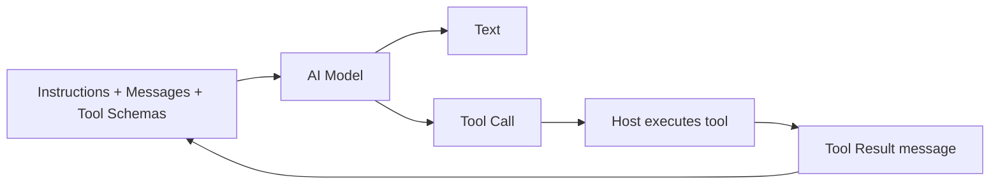
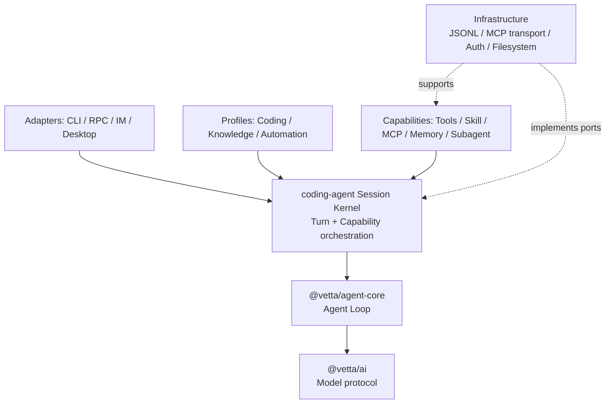

# Coding Agent 内核与能力边界分析

> 状态：设计基线  
> 日期：2026-07-25  
> 范围：AI 模型原语、`@vetta/ai`、`@vetta/agent-core` 与 `packages/coding-agent` 的职责边界

## 1. 核心结论

`coding-agent` 应被定义为“稳定内核 + 能力编排”，而不是所有 Agent 相关功能的集合。

但这里的“内核”不能等同于模型调用或 Tool Loop，因为仓库已经存在两层更基础的实现：

- `@vetta/ai` 负责模型协议与 Provider 适配；
- `@vetta/agent-core` 负责 Agent Loop、Tool 执行编排和基础状态事件。

因此，`coding-agent` 真正需要保留的内核价值是：

1. 管理一个长期 Session 的生命周期；
2. 在每个 Turn 开始前组合有效能力；
3. 将能力贡献转换成 Prompt、Context、Tool、Policy 和生命周期行为；
4. 调用 `@vetta/agent-core` 完成模型与 Tool Loop；
5. 对外发布稳定事件，并通过 Port 保存状态。

Skill、MCP、知识库、Memory、Subagent、IM 和 Coding Tools 都不是内核本身。它们应作为 Capability、Profile、Adapter 或 Infrastructure 接入。

## 2. AI 模型真正拥有的基础能力

模型本身是一次请求、一次响应的推理函数。它不天然拥有会话、文件系统、长期记忆、知识库、Skill、MCP 或 IM。

模型侧最小输入是：

- 指令，例如 System Prompt；
- 对话消息；
- 可选的 Tool Schema；
- 可选的图片等多模态内容；
- 模型参数，例如 reasoning level、temperature 和 token limit。

模型侧最小输出是：

- 文本；
- 结构化 Tool Call；
- 可选的 reasoning/thinking；
- stop reason、usage 和流式增量事件。



Tool 的真实执行发生在宿主程序中。System Prompt 只能告诉模型“应该怎样做”，不能赋予模型读取文件、访问网络或写入数据库的实际权限。

可以用下面的公式区分几个概念：

```text
模型能力 = 理解、推理、生成、选择 Tool
Agent 能力 = 模型能力 + Tool Loop
产品能力 = Agent 能力 + Context + Storage + Host Integration
```

## 3. 不可混淆的基础概念

### 3.1 Instruction

Instruction 是行为约束，例如 System Prompt、项目规则或 Skill 中的步骤。它是输入数据，不是可执行能力。

### 3.2 Message 与 Context

Message 是模型可见的信息载体。Context 是一次调用时实际送入模型的 Message 集合及相关媒体内容。

会话历史、知识检索结果、Memory 内容和 Skill 说明，最终都可能以 Context 的形式进入模型，但它们的来源和生命周期并不相同。

### 3.3 Tool

Tool 是模型可请求、由宿主执行的动作。Tool 至少包含：

- 名称和描述；
- 参数 Schema；
- 执行函数；
- 执行结果；
- 可选的权限和策略元数据。

文件读写、Shell、知识检索和主动发送附件都可以表现为 Tool。

### 3.4 Agent Loop

Agent Loop 负责：

1. 调用模型；
2. 识别 Tool Call；
3. 查找并执行 Tool；
4. 将 Tool Result 追加到消息；
5. 再次调用模型，直到得到终止结果。

这部分已经由 `@vetta/agent-core` 实现，`coding-agent` 不应重新实现一套。

### 3.5 Session

Session 是跨多个 Turn 的长期运行单元，负责：

- 消息和状态；
- prompt、continue、abort 和 queue；
- 事件发布；
- 上下文预算和压缩入口；
- 持久化边界；
- 能力的创建、使用和释放。

Session 是 `coding-agent` 内核最合理的中心抽象。

### 3.6 Capability

Capability 是可选择装配到 Session 的独立能力。它可以贡献一种或多种元素：

- Prompt；
- Context；
- Tool；
- Tool Policy；
- Turn Policy；
- Lifecycle Handler。

Capability 不应要求修改 Session 主流程才能接入。

### 3.7 Adapter、Infrastructure 与 Profile

- Adapter 将外部输入输出协议转换为 Session API 和 Event，例如 CLI、RPC、IM 和 Desktop。
- Infrastructure 提供具体技术实现，例如 JSONL Repository、文件锁、MCP Transport 和 Auth Storage。
- Profile 是一组能力和默认策略的产品化组合，例如 Coding Profile。

## 4. 现有功能应如何归类

| 功能 | 正确归类 | 依赖的基础原语 | 不应进入内核的内容 |
|---|---|---|---|
| Read/Edit/Bash | Tool Capability | Tool | 具体文件和进程实现 |
| Skill | Instruction Capability | Prompt、Context，可选 Tool | 文件发现、Markdown 解析、Skill 选择策略 |
| MCP | Integration Capability | Tool/Resource/Prompt 适配 | 协议连接、OAuth、重连、服务器配置 |
| 知识库 | Retrieval Capability | Context 或 Tool | 索引、标签、存储、检索实现 |
| Memory | State Capability | Storage、Context，可选 Tool | MEMORY.md、Journal、Flush 策略 |
| Subagent | Orchestration Capability | Session、Tool、Event | Coordinator、进程或线程策略 |
| Compaction | Session Policy | Context Transform | 具体摘要算法和 Prompt |
| Extension/Plugin | Capability Provider | Contribution、Lifecycle | 加载器、包格式、宿主 UI |
| IM | Adapter | Session API、Event | 渠道映射、附件桥、rollover |
| RPC | Adapter | Command、Session API、Event | NDJSON、request correlation、Host Bridge |
| JSONL Session | Infrastructure | Session Repository Port | Codec、文件锁、迁移和路径策略 |
| Coding Agent | Profile | 一组默认 Capability | 将所有能力固化为核心条件分支 |

### 4.1 IM 不是 Tool

IM 的基本链路是：

```text
IM message
→ resolve session
→ submit turn
→ receive session events
→ render IM response
```

这属于 Adapter。只有“让模型自主决定发送消息或附件”时，该动作才需要作为 Tool 暴露。

### 4.2 MCP 不等于 Tool

MCP 是能力接入协议，可以提供 Tools、Resources 和 Prompts。在当前 Agent 场景中，最常用的是把 MCP Tool 转换为 `AgentTool`，但连接管理、能力发现和认证仍属于 MCP Capability 的基础设施部分。

### 4.3 Skill 主要是 Instruction

Skill 描述何时使用、执行步骤和参考资料，主要贡献 Prompt 或 Context。`invoke_skill` 是按需发现和加载 Skill 的一种 Tool 化实现，不是 Skill 的本质。

### 4.4 知识库可以主动注入，也可以由模型检索

宿主侧 RAG：

```text
input → retrieve → inject context → model
```

Agentic RAG：

```text
input → model calls search tool → tool result → model
```

知识库本身是数据与检索系统，不应被等同为 Prompt 或 Tool。

## 5. 仓库现有分层与边界偏移

### 5.1 已经正确分离的部分

`@vetta/ai` 当前已经承担：

- Provider 请求和响应适配；
- 统一 Message、Tool、流式事件和模型元数据；
- Provider 认证辅助和 Token/Usage 表达。

`@vetta/agent-core` 当前已经承担：

- `Agent` 状态；
- `transformContext` 和 `convertToLlm`；
- Tool 查找、参数校验、执行和 Tool Result 回填；
- steering、follow-up、abort 和 Agent Event。

这两层应继续保持通用，不应反向依赖 `coding-agent`。

### 5.2 `coding-agent` 当前发生的边界偏移

当前 `coding-agent` 的核心路径直接知道过多具体能力：

- `InputPipeline` 直接识别 Knowledge Mode、Plugin Instructions、附件和设置辅助；
- `RuntimeManager` 同时创建 Tool、Extension、MCP、Plugin、Subagent、后台任务和 Prompt；
- `AgentSession` 直接持有 Memory Mode、MCP 和多种产品 Controller；
- `SessionManager` 直接处理 JSONL、文件锁、迁移和 IM rollover；
- RPC Mode 直接加入 Memory Tool 和 IM Host Bridge。

这意味着新增一种能力时，往往需要修改 Session、Runtime、Input Pipeline 和 Adapter，多处代码共同知道同一个业务概念。问题的根源不是功能数量，而是能力没有通过统一边界接入。

## 6. Coding Agent 最小内核

建议内核只保留以下职责：

### 6.1 Session 生命周期

- create、restore、close；
- prompt、continue、abort；
- steering 和 follow-up queue；
- 当前运行状态和事件流。

### 6.2 Turn 编排

- 接收结构化 Turn Request；
- 解析本轮启用的 Capability；
- 按固定阶段收集 Prompt、Context、Tool 和 Policy；
- 调用 `@vetta/agent-core`；
- 完成本轮清理。

### 6.3 Capability 编排

- 注册和注销 Capability；
- 处理依赖、冲突、优先级和作用域；
- 保证同一贡献类型具有确定执行顺序；
- 管理 Capability 生命周期。

### 6.4 稳定 Port

- `SessionRepositoryPort`；
- `ModelSelectionPort`；
- `AuthorizationPort`；
- `EventSinkPort`；
- `Clock` 或其他必要基础 Port。

内核依赖抽象 Port，不依赖 JSONL、文件系统、IM、MCP 或 Desktop。

## 7. 明确不属于内核的内容

以下功能即使默认启用，也不应成为内核分支：

- `knowledgeMode`、`memoryMode` 等产品模式；
- Skill 搜索路径和解析；
- MCP Server 配置、进程和 OAuth；
- Knowledge Store 和标签体系；
- Memory 文件和刷新策略；
- Subagent 类型和调度策略；
- PDF、OCR、文档转换等 Tool；
- IM Channel、附件和 rollover；
- RPC、CLI、Desktop 协议；
- JSONL 格式、文件锁和 Migration；
- Coding 场景的默认 Prompt 与 Tool 集。

默认启用不等于属于内核。默认行为应由 Profile 或 Composition Root 决定。

## 8. 目标依赖方向



依赖规则：

1. `@vetta/ai` 不知道 Agent、Session 和 Capability；
2. `@vetta/agent-core` 不知道 Coding、MCP、Skill、Knowledge 和 IM；
3. Session Kernel 不知道任何具体 Capability 名称；
4. Capability 只依赖公开合同和窄 Port；
5. Adapter 只通过 Session API 和 Event 集成；
6. Composition Root 是唯一知道具体实现并完成装配的位置。

## 9. 边界判断标准

可以用以下问题审查一项功能是否进入了错误层：

1. 删除该功能后，Session 是否仍能完成普通多轮 Tool Loop？
2. 新增同类功能是否必须修改 Session 主流程？
3. 内核类型中是否出现了 `knowledge`、`mcp`、`im` 等具体业务名称？
4. Adapter 是否直接操作 Session 内部状态或存储格式？
5. Capability 是否持有完整 `AgentSession`，而不是窄 Port？
6. 默认启用是否被错误地解释为“必须写进核心”？

若第 1 题为“否”，或第 2 至第 6 题为“是”，说明边界仍需调整。

## 10. 最终定义

本项目中的 `coding-agent` 应采用下面的定义：

> `coding-agent` 是建立在 `@vetta/agent-core` 之上的 Session 内核与能力编排器；“coding”由默认 Profile 表达，而不是由内核中的业务条件分支表达。

这一定义允许同一个内核服务 CLI、Desktop、IM 和自动化任务，也允许 Skill、MCP、知识库、Memory 与 Subagent 独立组合、替换和演进。
