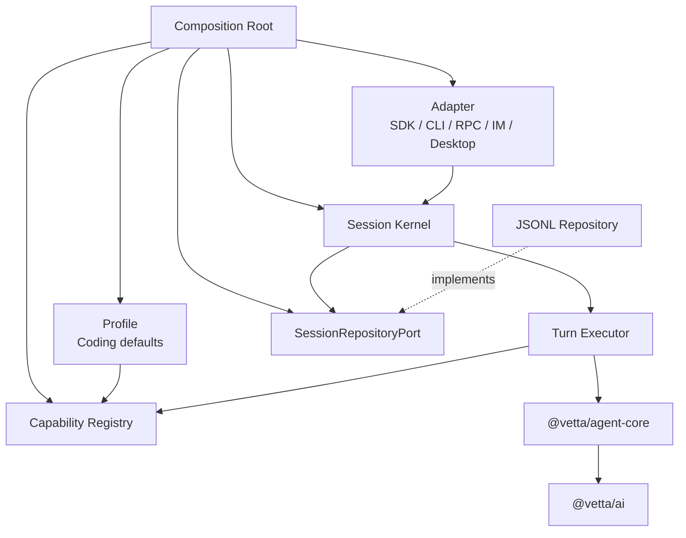

# Coding Agent“内核 + 能力编排”重构方案

> 状态：建议方案  
> 日期：2026-07-25  
> 前置阅读：[Coding Agent 内核与能力边界分析](./02-core-boundary-analysis.md)

## 1. 目标

将 `packages/coding-agent` 从“集中承载所有功能的产品内核”调整为：

```text
稳定 Session Kernel
+ 明确的 Capability Contribution
+ 可选择的 Product Profile
+ 独立的 Adapter
+ 可替换的 Infrastructure
```

重构完成后，新增 Skill、MCP、知识库、Memory、Subagent 或新的宿主入口，不应修改 Session 主流程和 `@vetta/agent-core`。

## 2. 非目标

本方案不建议：

- 重写 `@vetta/ai` 或 `@vetta/agent-core`；
- 一次性移动全部目录；
- 立即新增多个 workspace 包；
- 立即删除现有 SDK 导出；
- 同时改变 Session JSONL 格式；
- 设计一个允许任意 `next()` 调用的通用中间件框架；
- 为尚不存在的能力预留复杂抽象。

先在 `packages/coding-agent` 内建立边界，验证稳定后再决定是否拆包。

## 3. 目标架构



### 3.1 Session Kernel

Session Kernel 只负责：

- Session 状态机；
- Turn 接收、排队、取消和完成；
- Capability 生命周期；
- 调用 Turn Executor；
- Session Event；
- 通过 Port 恢复和保存状态。

它不创建 MCP Manager、Knowledge Store、Memory Journal 或 Subagent Coordinator。

### 3.2 Turn Executor

Turn Executor 使用固定阶段，而不是让能力自由控制调用链：

```text
accept request
→ resolve enabled capabilities
→ transform input
→ collect context
→ validate prerequisites
→ compose instructions
→ resolve tools and policies
→ call @vetta/agent-core
→ persist and emit
→ settle capability lifecycle
```

每个阶段有明确输入输出。Capability 只能向允许的阶段贡献行为，不能绕过状态机或自行调用下一阶段。

### 3.3 Capability Registry

Registry 管理：

- Capability ID；
- Session 级或 Turn 级作用域；
- 依赖和冲突；
- 显式优先级；
- Contribution 注册；
- setup、startTurn、endTurn 和 dispose 生命周期。

Registry 不负责实现具体能力。

### 3.4 Composition Root

系统只能有一个组合根。它负责：

- 选择具体 Adapter、Repository 和 Infrastructure；
- 根据 Profile 注册 Capability；
- 创建 `@vetta/agent-core`；
- 创建 Session Kernel；
- 建立生命周期和释放顺序。

`AgentSession` 可以继续作为兼容门面，但其构造函数不再创建具体子系统。

## 4. 核心合同

以下代码用于表达边界，不是要求一次性落地的最终 API：

```ts
interface TurnRequest {
  input: AgentMessage[];
  capabilityIds?: string[];
  capabilityOptions?: Readonly<Record<string, unknown>>;
  metadata?: Readonly<Record<string, unknown>>;
}

interface Capability {
  readonly id: string;
  readonly scope: "session" | "turn";
  setup?(context: CapabilitySetupContext): Promise<void>;
  contribute(context: ContributionContext): Promise<CapabilityContribution>;
  dispose?(): Promise<void>;
}

interface CapabilityContribution {
  inputTransforms?: readonly InputTransform[];
  contextContributors?: readonly ContextContributor[];
  promptContributors?: readonly PromptContributor[];
  tools?: readonly ToolContribution[];
  toolPolicies?: readonly ToolPolicy[];
  lifecycleHandlers?: readonly LifecycleHandler[];
}
```

设计约束：

1. `metadata` 只承载不可解释的宿主数据，内核不读取业务字段；
2. `capabilityOptions` 由对应 Capability 自己解释和校验；
3. Contribution 使用只读数据；
4. 同类 Contribution 的排序规则固定；
5. Capability 不获得完整 `AgentSession`；
6. Tool 最终统一转换为 `@vetta/agent-core` 的 `AgentTool`。

### 4.1 避免继续使用布尔模式

当前类似下面的接口会让业务概念进入通用管线：

```ts
metadata: {
  knowledgeMode: true,
  pluginInstructions: [...]
}
```

目标接口应表达为能力选择和能力自身配置：

```ts
{
  capabilityIds: ["knowledge"],
  capabilityOptions: {
    knowledge: {
      access: "read",
      query: "..."
    }
  }
}
```

Session Kernel 只解析 `capabilityIds`，不会识别 `knowledge` 的业务含义。长期实现中，`capabilityOptions` 应通过 Capability 自己的 Schema 校验，避免继续扩张中心类型。

## 5. 能力的迁移方式

### 5.1 Coding Profile

Coding Profile 负责默认组合：

- Coding System Prompt；
- read、edit、write、bash、grep、find、tree 等 Tool；
- 默认 Tool Policy；
- Coding 场景的 Context Files；
- Coding 场景的压缩策略。

`coding-agent` 仍可以开箱即用，但默认组合不再等于内核实现。

### 5.2 Skill Capability

Skill Capability 负责：

- Skill 发现和解析；
- 判断可见 Skill；
- 贡献 Skill 摘要或完整说明；
- 可选地注册 `invoke_skill` Tool；
- 处理 Skill 资源引用。

它向内核贡献 Prompt、Context 和可选 Tool，不修改 Input Pipeline。

### 5.3 MCP Capability

MCP Capability 负责：

- Server 配置和生命周期；
- OAuth、进程、HTTP 和重连；
- Tool/Resource/Prompt 发现；
- MCP Tool 到 `AgentTool` 的适配；
- 大量 Tool 的渐进披露策略。

MCP 事件应通过 Capability Event 映射为公共 Session Event，而不是让 Session Event Union 持续加入协议细节。

### 5.4 Knowledge Capability

Knowledge Capability 负责：

- 检索和写入权限；
- 标签、查询和结果裁剪；
- 作为 Context Contributor 主动注入结果；
- 或注册 Knowledge Tools 供模型自主检索。

是否启用知识能力由 Profile、Adapter 或 Turn Request 决定，不由 Input Pipeline 判断 `knowledgeMode`。

### 5.5 Memory Capability

Memory Capability 负责：

- Memory Store；
- Turn 前读取与 Context 注入；
- Turn 后提取和刷新；
- 可选的 Memory Tool；
- compaction 前后的 Memory 生命周期。

Session Kernel 只发布生命周期事件，不出现 `memoryMode` 和 `memoryFile`。

### 5.6 Subagent Capability

Subagent Capability 负责：

- 子 Session Factory；
- Coordinator；
- spawn、send、wait、interrupt 等 Tool；
- 父子事件和持久化映射；
- 并发与资源策略。

它复用 Session Kernel，而不是在父 Session 内嵌另一套 Agent Loop。

### 5.7 IM Adapter

IM 作为 Adapter 负责：

- IM 用户、频道与 Session 的映射；
- 入站消息到 `TurnRequest` 的转换；
- Session Event 到 IM 消息的转换；
- 附件上传和下载；
- rollover 等渠道策略。

若模型需要主动发送附件，可由 IM Adapter 在组合时额外注册一个 Host Tool Capability。

## 6. 推荐目录结构

先在当前包内重组，不改变 workspace：

```text
packages/coding-agent/src/
├── kernel/
│   ├── contracts/
│   ├── session-kernel.ts
│   ├── turn-executor.ts
│   ├── capability-registry.ts
│   └── events.ts
├── capabilities/
│   ├── coding-tools/
│   ├── skills/
│   ├── mcp/
│   ├── knowledge/
│   ├── memory/
│   ├── compaction/
│   ├── subagents/
│   └── extensions/
├── profiles/
│   └── coding-profile.ts
├── adapters/
│   ├── sdk/
│   ├── print/
│   ├── rpc/
│   └── im/
├── infrastructure/
│   ├── session-jsonl/
│   ├── auth/
│   ├── settings/
│   └── filesystem/
└── composition/
    └── create-coding-agent.ts
```

目录可以渐进迁移。真正需要守卫的是依赖方向，而不是目录名称。

## 7. 迁移策略

采用兼容门面和逐项迁移，不做整体替换。

### 阶段 0：建立行为基线

工作：

- 固化 prompt、continue、queue、abort、retry 和 compaction 行为测试；
- 固化 Tool 激活顺序和 Prompt 组合快照；
- 固化 Session JSONL 兼容测试；
- 为 MCP、Skill、Knowledge、Memory 和 Subagent 建立最小组合测试；
- 记录当前 SDK 和根导出使用方。

验收：

- 可以判断重构前后行为是否一致；
- 每个待迁移能力至少有一条独立启停测试；
- 不改变生产代码。

### 阶段 1：提取合同，切断反向依赖

工作：

- 将 `PromptOptions`、`AgentSessionEvent`、`SessionStats` 等移到 `kernel/contracts`；
- 定义 `SessionRepositoryPort` 和窄 Session Port；
- 禁止内部模块导入根 `src/index.ts`；
- Extension Loader 改用专用 Public API；
- 增加依赖环和分层 import 守卫。

验收：

- `packages/coding-agent/src` 没有运行时依赖环；
- Controller 不再从 `agent-session.ts` 获取共享合同；
- 原有导出通过兼容 re-export 保留。

### 阶段 2：建立单一组合根

工作：

- 新建 Composition Root；
- 在组合根创建 Agent、Controller、Repository 和 Capability；
- `AgentSession` 改为接收已组装依赖；
- 保持 `createAgentSession()` 对外签名；
- 明确反向顺序执行 dispose。

验收：

- 只有一个文件决定具体实现和创建顺序；
- `AgentSession` 构造函数没有 `new McpManager`、`new SubagentCoordinator` 等产品实例化；
- Kernel 可以使用内存 Repository 和空 Capability Registry 独立运行。

### 阶段 3：引入固定 Turn Pipeline 和 Contribution

工作：

- 建立 `CapabilityRegistry`；
- 建立 Prompt、Context、Tool、Policy 和 Lifecycle Contribution；
- 将 `InputPipeline` 的步骤迁入固定阶段；
- 将 `RuntimeManager` 暂时包装成一个 Legacy Capability Provider；
- 明确 Extension、Plugin 和 Hook 的执行优先级。

验收：

- 空 Capability 的 Session 可以完成纯文本 Turn，注册最小 Tool Capability 后可以完成 Tool Loop；
- 新增测试 Capability 不修改 Turn Executor；
- 相同输入和 Capability 集合得到确定的 Prompt 与 Tool 顺序。

### 阶段 4：逐项迁出垂直能力

建议顺序：

1. Skill；
2. Knowledge；
3. Memory；
4. MCP；
5. Background Task；
6. Subagent；
7. Extension、Plugin 和 Hook 的统一内部贡献。

先迁移依赖少、验证清晰的能力，再处理具有复杂生命周期的 MCP 和 Subagent。

每迁移一项必须满足：

- 删除 Input Pipeline 和 RuntimeManager 中对应业务分支；
- Capability 可单独启用和禁用；
- 不改变其他 Capability 的测试结果；
- 旧配置由兼容层映射到新 Capability 配置。

### 阶段 5：拆分 Session 持久化

工作：

- 提取纯 `SessionGraph`；
- 提取 `SessionCodec` 和 Migration；
- 提取 `SessionRepositoryPort`；
- 将 JSONL、文件锁和路径策略放入 Infrastructure；
- 将 IM rollover 移到 IM Adapter；
- 保留 `SessionManager` 兼容门面。

验收：

- Session Graph 测试不访问文件系统；
- Kernel 测试使用 InMemory Repository；
- 现有 JSONL 文件无需迁移即可读取；
- IM 策略不再出现在通用 Repository 中。

### 阶段 6：收敛 Adapter 与公共 API

工作：

- RPC 拆分为 Transport、Codec、Dispatcher 和 Host Bridge；
- IM、Desktop、CLI 只调用稳定 Session API；
- 根入口只保留高层 SDK 和稳定合同；
- Tool、MCP、Storage 等改用明确 subpath；
- 为旧导出添加弃用周期。

验收：

- Adapter 不访问 Session 内部字段；
- runtime 和 desktop 不依赖 JSONL Entry 实现；
- 公共 API 变更有清晰迁移说明；
- README、ADR 和实际导出一致。

## 8. 第一个可实施切片

不建议第一步就移动 MCP、Knowledge 或 Subagent。第一个切片应只建立架构缝隙：

1. 新建 `kernel/contracts`，移动共享类型并兼容重导出；
2. 定义最小 `CapabilityContribution` 与空 Registry；
3. 在 `createAgentSession()` 中创建 Registry 并注入；
4. 让现有 `RuntimeManager` 通过 Legacy Adapter 提供当前 Tool 和 Prompt；
5. 增加测试，证明 Turn Executor 不认识任何具体能力名称。

这个切片不改变用户行为，却建立后续逐项迁移所需的稳定接口。

## 9. 测试策略

### 9.1 Kernel Contract Tests

验证：

- 无 Tool 的纯文本 Turn；
- 一个 Tool 的完整 Tool Call/Result Loop；
- queue、abort 和 continue；
- Capability setup/dispose；
- Contribution 顺序和冲突；
- Capability 故障隔离；
- Repository 故障处理。

### 9.2 Capability Contract Tests

每个 Capability 使用相同测试模板：

- 启用时只贡献声明的元素；
- 禁用时没有副作用；
- 不访问未声明 Port；
- dispose 后无监听器、进程和 pending promise；
- 与至少一个其他 Capability 组合时顺序确定。

### 9.3 Adapter Contract Tests

验证：

- 入站协议转换为相同的 `TurnRequest`；
- Session Event 能完整映射；
- Adapter 断开不会破坏 Session 状态；
- Host Tool 只在对应 Adapter 中注册。

### 9.4 兼容测试

持续保留：

- SDK 创建参数；
- Session JSONL；
- CLI/RPC 协议；
- Tool 名称和参数；
- 配置文件；
- Extension Public API。

## 10. 架构守卫

建议将以下规则加入自动检查：

1. `packages/ai` 不得依赖 `agent` 或 `coding-agent`；
2. `packages/agent` 不得依赖 `coding-agent`；
3. `kernel` 不得导入 `capabilities`、`adapters`、`profiles` 或具体 Infrastructure；
4. Capability 不得导入具体 Adapter；
5. 内部代码不得导入 `src/index.ts`；
6. 禁止运行时依赖环；
7. Kernel 源码中禁止出现具体能力标识，例如 `knowledgeMode`、`memoryMode` 和 `mcpDebug`；
8. Composition Root 之外禁止实例化具体 Repository 和外部 Capability。

## 11. 风险与控制

| 风险 | 控制方式 |
|---|---|
| 抽象过度 | 只为现有能力提取 Contribution，不为假设功能设计接口 |
| 行为顺序改变 | 固化 Prompt、Tool 和生命周期顺序测试 |
| 公共 API 破坏 | 使用兼容门面和 re-export，设置弃用周期 |
| Capability 相互依赖失控 | 显式依赖、冲突与优先级，禁止隐式全局访问 |
| 生命周期泄漏 | 统一 setup/dispose，并测试进程、监听器和 promise 清理 |
| 重构长期双轨 | 每迁移一项就删除对应 Legacy 分支，设置阶段退出条件 |
| 拆包扩大复杂度 | 先包内分层，满足稳定性指标后再做 workspace 决策 |

## 12. 完成标准

当以下条件全部满足时，可以认为“内核 + 能力编排”已经落地：

1. 空 Capability Registry 下，Session 仍可完成基本对话；注册 Tool Capability 后无需修改 Kernel 即可完成 Tool Loop；
2. Session Kernel 不包含具体业务模式字段；
3. 新增 Capability 不修改 Kernel 和 Turn Executor；
4. Coding 默认行为完全由 Coding Profile 组合；
5. Skill、MCP、Knowledge、Memory 和 Subagent 可独立启停；
6. CLI、RPC、IM 和 Desktop 只通过稳定 Session API 接入；
7. Session Kernel 不依赖 JSONL 和文件系统；
8. 系统只有一个 Composition Root；
9. 运行时依赖环为零；
10. 原有 SDK、Session 数据和主要协议在迁移期保持兼容。

最终形态不是让 `coding-agent` 变得“功能少”，而是让它的核心只负责稳定机制，所有产品功能通过清晰合同被组合进来。
