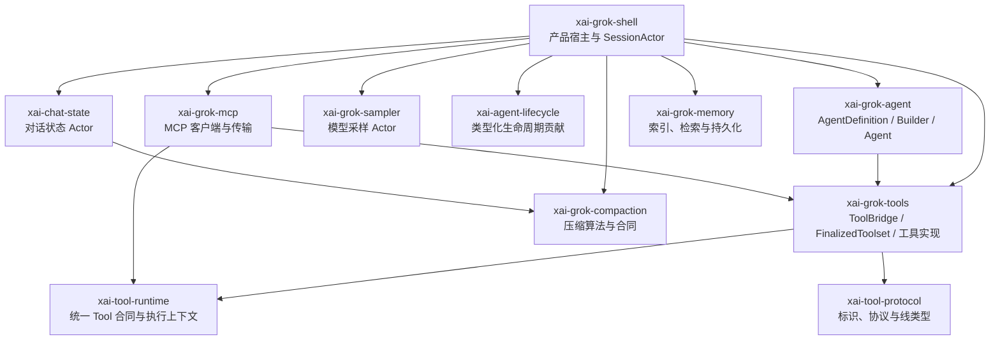
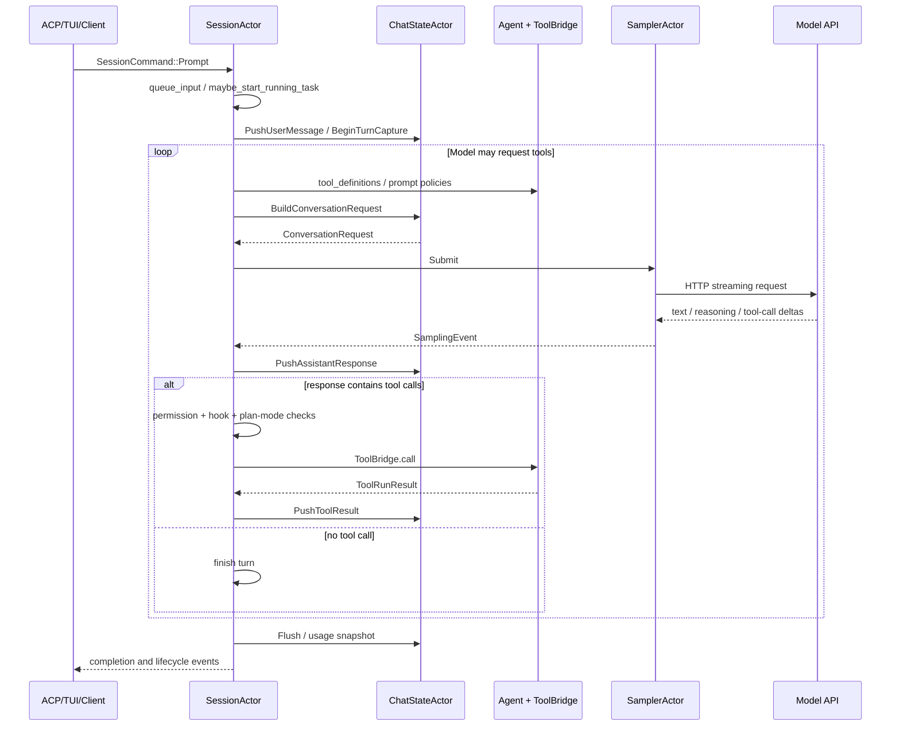
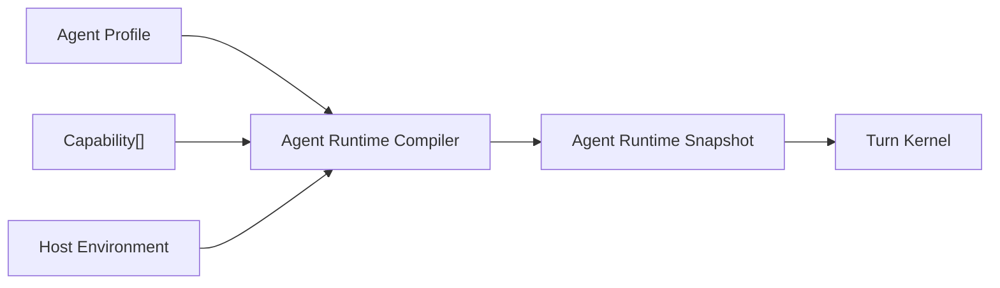

# grok-build Agent 内部实现分析

> 状态：参考实现分析
>
> 日期：2026-07-26
>
> 分析对象：`C:\develop\github\grok-build`
>
> 源码版本：`main` / `c68e39f60462f28d9be5e683d9cbe2c57b1a5027`

## 1. 结论摘要

`grok-build` 不是一个可以直接照搬的“理想 Agent 内核”，而是一套正在从大型会话宿主中持续抽取基础设施的成熟产品实现。

它最值得借鉴的不是 Rust、Actor 或 crate 数量，而是以下四个设计：

1. 模型采样被隔离为独立的 `SamplerActor`，会话不直接拥有 HTTP 流和重试细节。
2. 对话状态被隔离为独立的 `ChatStateActor`，通过命令串行修改，避免多个控制器共享可变会话数据。
3. 工具具有统一的协议、运行时、注册表和调用上下文，内置工具与 MCP 工具最终进入同一执行通道。
4. `AgentDefinition → AgentBuilder → Agent` 体现了“声明、编译、运行时快照”三个阶段。

但它也存在与当前 `coding-agent` 类似的结构问题：

1. `SessionActor` 仍是产品级 God Object，直接字段约 113 个。
2. `AgentBuilder` 长 2,396 行，在一次构建中命令式拼装 Skill、工具、子 Agent、提示词、文件规则、内存及多种产品开关。
3. `Agent` 声称构建后基本不可变，但内部 `ToolBridge` 仍允许动态注册和注销 MCP 工具。
4. MCP 同时存在协议客户端、会话状态、工具注册、资源桥接、扩展 API、重启和提醒等多条控制路径。
5. 类型化生命周期扩展机制已经出现，但当前会话组合根只安装了 `idle_prompt`，大部分能力仍直接写在 `SessionActor` 中。
6. Plugin 主要是“能力资源包”，不是统一的运行时 Capability 合同；其 Skill、Agent、Hook、MCP、LSP 最终仍由不同子系统分别解释。

因此，对 `coding-agent` 的正确启示不是“改成 grok-build 的结构”，而是：

> 采用它已经验证有效的底层隔离方式，但不要复制它尚未完成的会话宿主和能力编排。

`coding-agent` 的目标应比 `grok-build` 再向前一步：让内核只运行 Turn 状态机，让所有 Skill、MCP、Memory、Subagent、Hook、Compaction 和产品策略都通过统一的 Capability Contribution 进入组合根。

## 2. 分析范围与方法

本次分析以源码为准，没有仅依赖项目 README。重点追踪了：

- Agent 定义、构建和运行时对象；
- Session Actor 的启动、命令循环和 Turn 执行；
- 对话状态所有权；
- 模型采样、流式事件、重试和取消；
- 工具协议、注册、执行和结果回灌；
- MCP、Skill、Memory、Plugin 和生命周期扩展；
- crate 之间的直接依赖方向。

主要源码入口：

| 关注点 | 主要源码 |
|---|---|
| Agent 定义 | `crates/codegen/xai-grok-agent/src/config.rs` |
| Agent 构建 | `crates/codegen/xai-grok-agent/src/builder.rs` |
| Agent 运行时对象 | `crates/codegen/xai-grok-agent/src/agent.rs` |
| 会话宿主 | `crates/codegen/xai-grok-shell/src/session/acp_session.rs` |
| 会话主循环 | `crates/codegen/xai-grok-shell/src/session/acp_session_impl/run_loop.rs` |
| Turn 执行 | `crates/codegen/xai-grok-shell/src/session/acp_session_impl/turn.rs` |
| 工具调用管线 | `crates/codegen/xai-grok-shell/src/session/acp_session_impl/tool_calls.rs` |
| 对话状态 | `crates/codegen/xai-chat-state/src/` |
| 模型采样 | `crates/codegen/xai-grok-sampler/src/` |
| 工具运行时 | `crates/common/xai-tool-runtime/src/` |
| 工具协议 | `crates/common/xai-tool-protocol/src/` |
| 工具注册与桥接 | `crates/codegen/xai-grok-tools/src/registry/types.rs`、`bridge.rs` |
| MCP | `crates/codegen/xai-grok-mcp/src/`、`xai-grok-shell/src/session/acp_session_impl/mcp.rs` |
| Skill | `crates/codegen/xai-grok-agent/src/prompt/skills.rs`、`xai-grok-tools/src/implementations/skills/` |
| Plugin | `crates/codegen/xai-grok-agent/src/plugins/` |
| 生命周期扩展 | `crates/codegen/xai-agent-lifecycle/src/` |

## 3. 总体分层

从 crate 依赖和运行链路看，`grok-build` 的主要结构如下：



这个依赖图有两个明显特征：

- crate 层没有循环依赖，Rust 构建系统强制了依赖方向。
- `xai-grok-shell` 仍直接依赖几乎所有重要子系统，是事实上的产品组合根和复杂度汇聚点。

因此，crate 拆分解决了编译边界和部分状态所有权，但没有自动解决产品能力的编排边界。

## 4. Agent 的三个阶段

### 4.1 AgentDefinition：声明

`AgentDefinition` 是可序列化的 Agent 配置，来源可以是 Markdown + YAML frontmatter，也可以由代码创建。

它声明：

- 名称和描述；
- Prompt 模式和 Prompt 正文；
- Tool 配置、允许列表和禁止列表；
- Permission Mode；
- Skill 预加载；
- 是否发现 Skill 和 AGENTS.md；
- Completion Requirement；
- Compaction、Bash、重试和工具参数；
- 子 Agent 类型限制；
- Hosted Tool 允许范围。

这个方向是正确的：定义文件描述“想要什么”，不直接运行模型。

但 `AgentDefinition` 已包含较多宿主和产品策略。它不只是 Agent Profile，也承担工具预设、兼容规则和会话策略配置，因此边界已经开始膨胀。

### 4.2 AgentBuilder：编译与组合

`AgentBuilder::build()` 是真正的 Agent 编译器。它主要执行：

1. 解析最终定义；
2. 发现 Plugin Skill 和本地 Skill；
3. 预加载指定 Skill，并把 Skill 正文写入 Prompt；
4. 创建工具注册表；
5. 根据 Memory、Web、LSP、Image、Video、Subagent 等开关增删工具；
6. 应用 Tool allowlist、denylist、别名和参数覆盖；
7. 创建 `SessionContext` 并 finalize `ToolBridge`；
8. 发现并加载 AGENTS.md；
9. 初始化 Skill 与 AGENTS.md 的运行时发现 Tracker；
10. 创建 `PromptContext` 并渲染系统提示词；
11. 生成 Hosted Tool；
12. 返回 `Agent`。

这体现了一个很重要的模式：

> Agent 不是手写出来的对象，而是由定义、环境和能力集合编译得到的运行时产物。

问题在于，该编译器同时知道几乎所有能力细节。`AgentBuilder` 有大量 `with_*` 方法和产品开关；新增一种能力往往需要修改 Builder 字段、构建顺序、工具集合和 Prompt 上下文。

它本质上仍是“中心模块识别全部能力”，而不是“能力自行声明贡献，由通用编译器合并”。

### 4.3 Agent：运行时快照

最终的 `Agent` 持有：

- `AgentDefinition`；
- `PromptContext`；
- 已渲染的系统提示词；
- `Arc<ToolBridge>`；
- Reminder Policy；
- Compaction Policy；
- Hosted Tools；
- Backend Search 开关。

这个对象没有执行主循环。它更接近：

> 已完成编译、绑定到具体 Session 的 Agent Runtime Snapshot。

源码明确说明它并不 portable，因为 `ToolBridge` 和渲染结果已经绑定具体 Session。

这个边界比“Agent 对象拥有一切”更清晰，但仍存在两个问题：

1. Agent 同时持有定义、Prompt、工具和压缩策略，职责偏宽。
2. `ToolBridge` 内部允许运行时注册 MCP 工具，所以 Snapshot 并非真正不可变。

## 5. 一次完整 Turn 的运行链路

主链路可以概括为：



### 5.1 SessionActor 是控制平面

`run_session()` 使用一个大的 `tokio::select!` 同时处理：

- Session 命令；
- ChatState 事件；
- 模型采样和 UI 回放事件；
- Turn 完成；
- 模型切换；
- Memory idle flush；
- Memory dream；
- MCP 初始化、状态和重启；
- 关闭和持久化。

`handle_prompt()` 负责 Turn 前处理、Prompt 注入、状态更新、Hook、Goal、Memory 和后续执行。

`process_conversation_turn()` 负责重复采样，直到模型不再产生需要执行的工具调用。

### 5.2 ChatStateActor 是状态数据平面

`ChatStateActor` 独占：

- Conversation；
- Sampling Config；
- Prompt Index；
- Token Usage；
- Rewind 数据；
- Compaction 边界；
- 编辑文件集合；
- Turn Capture；
- Usage Ledger；
- Credential 快照。

外部通过 `ChatStateCommand` 修改或查询状态。Actor 内部串行处理命令，因此 Conversation 无需由多个 Controller 共同加锁。

这是非常值得借鉴的边界：

> 状态所有权与流程控制分离；控制器不能直接修改 Conversation。

但它的命令已经覆盖请求构建、历史修复、图片预算、Usage、Harness Trace 和持久化，说明 Actor 也在继续吸收周边职责。将状态放进 Actor 只能保证并发正确，不能自动保证领域边界正确。

### 5.3 SamplerActor 是模型 I/O 数据平面

`SamplerActor` 只通过 `SamplerHandle` 接收命令：

- Submit；
- Cancel；
- UpdateConfig；
- IsActive；
- ActiveCount。

每个请求由独立任务执行，Actor 保存活动请求和取消令牌。输出统一为：

- StreamStarted；
- FirstToken；
- ChannelToken；
- ToolCallDelta；
- Completed；
- Retrying；
- Failed；
- ModelMetadata；
- BackendToolCallStarted / Completed。

它不知道 Session、Skill、MCP、Memory 和 UI 的业务含义。

这是本次分析中边界最清晰的模块。对于 `coding-agent`，模型 Provider、重试、流转换和取消都应该位于类似的 Model Runtime Port 后面。

## 6. Tool：最成熟的统一基础能力

`grok-build` 将工具拆成三层：

1. `xai-tool-protocol`：标识、能力、注册和线协议类型；
2. `xai-tool-runtime`：`Tool`、`ToolDispatch`、`ToolCallContext`、`ToolError`、流式输出；
3. `xai-grok-tools`：Tool Registry、Bridge、资源容器、提醒和具体工具。

`ToolRegistryBuilder` 负责注册工具类型和元数据。finalize 后生成 `FinalizedToolset`，其职责包括：

- 对外提供模型可见 Tool Definition；
- 名称和参数别名映射；
- 输入反序列化；
- Requirement 检查；
- ToolCallContext 创建；
- 本地注册表分发；
- 流式 Tool 输出；
- Tool 结果格式化；
- 跨工具 Reminder；
- Resource 持久化。

Tool 调用最终统一为：

```text
模型工具名
  → 名称/参数反向映射
  → ToolCallContext
  → LocalRegistry.execute
  → Typed Output
  → Reminder
  → ToolRunResult
  → Conversation ToolResult
```

这个结构验证了此前对基础能力的判断：

> Tool 是模型能够调用外部确定性能力的基础协议；MCP、Memory 查询、Skill 加载和 Subagent 创建都可以适配为 Tool。

但 `FinalizedToolset` 当前有 4,511 行，并同时承担注册、资源、模板、提醒、持久化、动态 MCP 和执行后处理，已经是另一个中心模块。统一协议是正确的，统一实现类并不正确。

## 7. MCP 的真实实现方式

MCP 在 `grok-build` 中不是 Agent 内核的一部分，而是一组基础设施和适配器：

1. `xai-grok-mcp` 处理 MCP Client、OAuth、HTTP/stdio transport 和 server state；
2. Session 初始化 MCP Server 并获取远端 Tool Definition；
3. 每个 MCP Tool 被包装成实现统一 `Tool` 合同的对象；
4. `ToolBridge::register_mcp_tools()` 将它动态注册到 Toolset；
5. 模型通过普通 Tool Call 或 `search_tool` / `use_tool` 间接调用；
6. Session 另外维护 MCP 状态、资源访问、认证、配置更新、重连和 UI 通知。

因此：

> MCP 的模型执行面确实建立在 Tool 之上；MCP 的连接、认证、资源和生命周期不是 Tool 本身，而是 Tool Adapter 背后的 Infrastructure。

目前的问题是 MCP 控制面分散在：

- `xai-grok-mcp`；
- `SessionActor` 的 MCP 字段；
- `acp_session_impl/mcp.rs`；
- `mcp_dispatcher.rs`；
- `extensions/mcp.rs`；
- ToolBridge 动态注册；
- MCP Reminder 和 Snapshot。

这造成两条重叠通路：

- 模型调用通路：MCP → ToolBridge → Tool；
- 产品管理通路：ACP Extension → Session/MCP State。

两条通路本身合理，但缺少统一的 `McpCapability` 所有者，导致 Session 必须理解其内部状态。

## 8. Skill 的真实实现方式

Skill 本质上是 Markdown Prompt 资源，不是新的模型原语。

`grok-build` 中的 Skill 包含四个阶段：

1. Discovery：从项目、用户、兼容目录和 Plugin 中发现 `SKILL.md`；
2. Selection：按名称、作用域、优先级和忽略规则解析；
3. Injection：预加载 Skill 直接写入 Agent Prompt；
4. Runtime Loading：运行时通过 Skill Tool、Slash Command 或文件读取加载正文，并以消息或 Tool Result 送回模型。

此外，ToolBridge 内部还维护 SkillManager：

- 运行时发现访问路径附近的 Skill；
- 更新可用 Skill 列表；
- 产生系统提醒；
- 刷新 Slash Command；
- 在 Session 恢复时保留已通知状态。

因此：

> Skill = 受约束的知识/流程文档 + 发现策略 + 选择策略 + Prompt/Tool 注入适配器。

Skill 并不需要进入 Turn Engine。内核只需要接收最终生成的 Instruction Fragment 或 Tool Result。

`grok-build` 的不足是 Skill 状态被放进 ToolBridge Resources，Skill 变化的副作用再由 Session 执行。这使 Skill、Tool 和 Session 形成间接耦合。

## 9. Memory、Knowledge 与 Compaction

### 9.1 Memory

Memory 实现被拆到 `xai-grok-memory`，提供存储、Chunk、Embedding、Search、MMR 和 Dream。

对模型的暴露方式仍然是：

- Memory Search Tool；
- Memory Get Tool；
- Turn 前 Memory Reminder / Context Injection。

这说明 Knowledge Base 和 Memory 不是新的 Agent 内核原语。它们由两部分组成：

- 检索和存储基础设施；
- 向模型提供内容的 Tool 或 Prompt Adapter。

### 9.2 Compaction

压缩算法位于 `xai-grok-compaction`，ChatState 持有对话和 token 数据，Session 决定何时触发并协调模型调用及状态替换。

这个职责拆分基本合理：

- Compaction Engine：纯策略和算法；
- Chat State：原子替换 Conversation；
- Session Policy：决定触发时机和失败恢复。

但在目标架构中，Compaction Policy 不应由每种产品能力直接修改 Turn Loop。它应通过标准的 Context Budget Policy 接口参与。

## 10. Plugin 和生命周期扩展

### 10.1 Plugin 是资源包，不是运行时能力合同

Plugin 可以打包：

- Skills；
- Commands；
- Agents；
- Hooks；
- MCP Servers；
- LSP Servers。

Plugin Registry 负责发现、作用域、启用、信任、冲突和组件路径。

随后每种组件交由独立系统解释：

- Skill 进入 Skill Discovery；
- Agent 进入 Agent Discovery；
- Hook 进入 Hook Registry；
- MCP 进入 MCP State；
- LSP 进入工具基础设施。

这个设计证明：

> Plugin 是分发和安装边界，不应该等同于内核扩展接口。

### 10.2 生命周期贡献机制方向正确，但尚未成为主干

`xai-agent-lifecycle` 定义了类型化 Contributor：

- Turn Lifecycle；
- Session Lifecycle；
- Turn Input；
- Command。

Contributor 在安装时接收能力，通过数据化 Hook Input 参与运行，不拥有主循环控制权。Registry 构建完成后不可变。

这是最接近“Capability Contribution”的实现。

但当前 `session_extension_registry()` 只安装了 `idle_prompt`。Memory、MCP、Goal、Hook、Plugin、Laziness、Recap 等仍由 SessionActor 直接持有和调用。

所以这套机制目前更像正确方向的起点，而不是已经完成的架构。

## 11. 值得借鉴与不应照搬的部分

| 设计 | 评价 | 对 coding-agent 的处理 |
|---|---|---|
| Sampler Actor | 边界清晰 | 借鉴语义，抽象成 Model Runtime Port |
| ChatState Actor | 状态所有权清晰 | 借鉴单写者模型，但缩小命令面 |
| AgentDefinition / Builder / Agent | 阶段划分正确 | 保留“声明 → 编译 → 快照”，重写编译器 |
| Tool Protocol / Runtime | 基础合同成熟 | 借鉴统一 Tool 合同和调用上下文 |
| ToolBridge | 功能完整但过重 | 拆成 Registry、Dispatcher、PostProcessor |
| Lifecycle Contributor | 方向正确 | 升级为所有能力的统一贡献协议 |
| MCP → Tool Adapter | 边界正确 | 保留执行适配，独立 MCP Control Plane |
| Skill → Prompt/Tool | 概念正确 | 保持为外部 Capability，不进入内核 |
| Plugin 资源包 | 分发边界正确 | Plugin 只负责交付 Capability Manifest |
| SessionActor | 产品职责过度集中 | 不照搬 |
| AgentBuilder 命令式拼装 | 中心模块知道所有能力 | 不照搬 |
| 全局 Tool Preset 注册 | 隐含初始化顺序 | 不照搬，改显式组合 |
| 动态修改 Finalized Toolset | 快照语义不一致 | 不照搬，改版本化 Runtime Snapshot |

## 12. 对 coding-agent 完全重构的直接约束

### 12.1 内核只保留五项职责

建议将 `coding-agent` 内核严格限制为：

1. Turn 状态机；
2. Model Port；
3. Conversation State Port；
4. Tool Dispatch Port；
5. Kernel Event 输出。

内核不直接导入：

- MCP；
- Skill；
- Knowledge / Memory；
- Plugin；
- IM；
- CLI / RPC / Desktop；
- Subagent；
- 具体文件系统工具；
- 用户设置文件；
- Telemetry 实现。

### 12.2 使用显式的编译阶段

目标构建过程应为：



Compiler 只认识统一贡献类型，不认识 Skill、MCP 等具体能力：

```ts
interface CapabilityContribution {
  tools?: readonly ToolContribution[];
  instructions?: readonly InstructionContribution[];
  contextProviders?: readonly ContextProviderContribution[];
  lifecycle?: readonly LifecycleContribution[];
  commands?: readonly CommandContribution[];
  policies?: readonly PolicyContribution[];
}
```

每种能力自行适配：

```text
MCP       → tools + lifecycle
Skill     → instructions + commands + optional tools
Knowledge → contextProviders + tools
Subagent  → tools + lifecycle
Hook      → lifecycle
Compaction→ policies
IM        → Host Adapter，不进入 Capability
```

### 12.3 Runtime Snapshot 必须具有一致语义

运行时能力变化不能直接修改“已 finalize”的对象。

可采用：

1. Capability Registry 产生新版本；
2. Compiler 构建新的 Runtime Snapshot；
3. 只在 Turn 边界原子替换；
4. 当前 Turn 始终使用同一个 Snapshot；
5. Snapshot ID 写入事件和测试记录。

这比 `grok-build` 在 `Arc<ToolBridge>` 内动态注册 MCP 更容易推理，也能避免 Prompt 中工具列表与实际可调用工具在同一 Turn 内不一致。

### 12.4 Session Runtime 不得成为能力状态仓库

Session Runtime 只能持有：

- 当前 Kernel 状态；
- 当前 Runtime Snapshot；
- 输入队列和取消；
- 对外事件 Sink；
- 必要的 Actor/Task Handle。

MCP 连接、Skill Discovery、Memory Index、Plugin Registry 和 Subagent Roster 应由对应 Capability Runtime 持有。

判断标准：

> 删除某项能力时，Session Runtime 的字段和主循环不应变化。

### 12.5 Plugin 与 Capability 分离

Plugin Manifest 只描述交付内容和权限：

```text
Plugin Package
  → Capability Factory
  → Capability Instance
  → Capability Contribution
  → Runtime Compiler
```

不能让 Plugin Loader 直接修改 Session、Prompt 或 Tool Registry。

## 13. 推荐的目标模块布局

建议先在 `packages/coding-agent` 内完成逻辑边界，再决定是否拆成多个 workspace package：

```text
src/
  kernel/
    turn-engine.ts
    turn-state.ts
    model-port.ts
    conversation-port.ts
    tool-port.ts
    events.ts

  runtime/
    agent-profile.ts
    capability-contract.ts
    runtime-compiler.ts
    runtime-snapshot.ts
    session-runtime.ts

  capabilities/
    tools/
    mcp/
    skills/
    knowledge/
    memory/
    compaction/
    subagent/
    hooks/

  infrastructure/
    model/
    filesystem/
    persistence/
    telemetry/

  adapters/
    sdk/
    cli/
    rpc/
```

这里最重要的不是目录名，而是依赖规则：

```text
adapters ─┐
          ├→ runtime → kernel
capabilities ┘           ↑
infrastructure ──────────┘（只实现 Port）
```

`kernel` 不允许反向导入 `runtime`、`capabilities`、`infrastructure` 和 `adapters`。

## 14. 推荐的重构顺序

不要按目录整体重写。应按可验证的运行链路建立新内核：

### 阶段 1：冻结当前行为

- 建立 Prompt → Model → Tool → ToolResult → Model → Final 的黑盒测试；
- 固定事件顺序、取消、重试和压缩行为；
- 记录 CLI、RPC、SDK 的兼容契约。

### 阶段 2：抽取 Model Runtime

- 将 Provider、流式事件、重试和取消放到 Model Port；
- Session 不再直接处理 Provider 事件差异；
- 用旧实现作为 Adapter，确保行为不变。

### 阶段 3：抽取 Conversation State

- 设立单一写入者；
- 所有历史修改通过命令或领域方法；
- 持久化作为 Port，不混入状态模型。

### 阶段 4：建立 Tool Runtime

- 统一 ToolDefinition、ToolCall、ToolResult 和 ToolContext；
- 内置 Tool 先迁移；
- 权限、Hook 和 Telemetry 使用执行管线贡献，不写进每个 Tool。

### 阶段 5：引入 Runtime Compiler

- 从 Profile + Capability[] 编译 Runtime Snapshot；
- 冲突、顺序、权限和依赖在编译期失败；
- Turn 只读取 Snapshot。

### 阶段 6：逐项迁移能力

建议顺序：

1. Skill；
2. MCP；
3. Knowledge / Memory；
4. Hook；
5. Compaction；
6. Subagent；
7. 产品专属策略。

Skill 和 MCP 最适合作为首批验证，因为它们能同时验证 Instruction、Tool、Lifecycle 和动态刷新边界。

### 阶段 7：替换入口

- SDK、CLI、RPC 只做输入输出适配；
- 删除旧组合根；
- 最后再物理拆包，避免过早制造 package 迁移成本。

## 15. 重构验收标准

完全重构不能以“文件变小”作为完成标准，应满足：

1. Kernel 单元测试不需要文件系统、MCP、Skill、Plugin 或真实模型；
2. 新增 Capability 不修改 Turn Engine；
3. 删除 Capability 不修改 Session Runtime；
4. CLI、RPC、SDK 使用同一个 Runtime Compiler；
5. 同一输入和 Snapshot 得到确定的 Tool/Prompt 组合顺序；
6. Capability 冲突在 Session 启动或 Snapshot 编译时失败；
7. 动态能力更新只在 Turn 边界生效；
8. Conversation 只有一个写入所有者；
9. Tool 执行、权限、Hook、Telemetry 可以分别测试；
10. 依赖检查能阻止 Kernel 反向引用具体能力。

## 16. 最终判断

`grok-build` 已证明以下方向在大型 Agent 产品中可行：

- 模型 I/O、对话状态和工具运行时可以独立；
- Agent 可以被编译成 Session 级运行时快照；
- MCP 可以适配成普通 Tool；
- Skill 和知识能力最终都通过 Prompt 或 Tool 影响模型；
- 生命周期能力可以使用类型化 Contributor，而不是在主循环中硬编码。

它同时证明了另一件事：

> 仅仅拆文件、拆 crate、使用 Actor，并不能防止 Session 和 Builder 再次成为 God Object。

对 `coding-agent` 的完全重构必须围绕“谁拥有主循环、谁拥有状态、谁声明贡献、谁负责组合”建立硬边界。目标不是复刻 `grok-build`，而是沿用其成熟的基础设施思想，并用统一 Capability Compiler 完成它尚未完成的能力编排。
