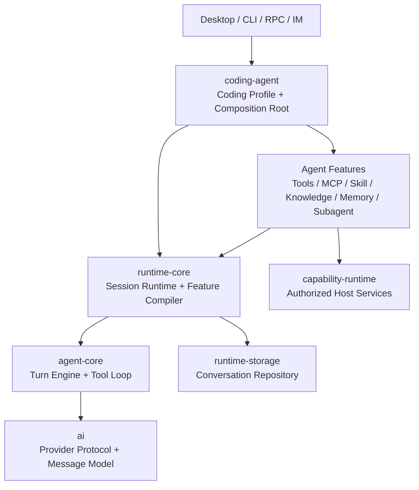
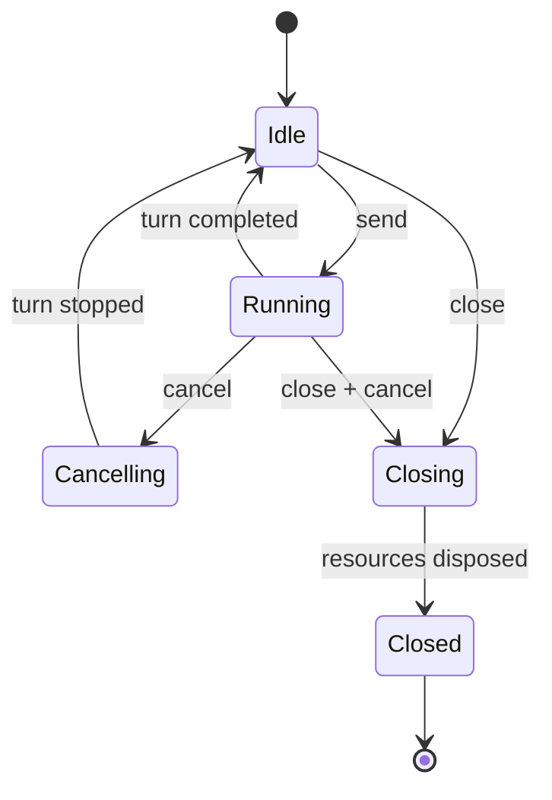

# 目标架构与核心合同

## 1. 目标分层



依赖规则：

- 上层可以依赖下层，下层不能导入上层。
- `runtime-core` 不得导入 `coding-agent`。
- `runtime-storage`、`runtime-tools`、`runtime-mcp` 不得导入 `coding-agent`。
- `coding-agent` 是唯一产品组合根，不再是公共基础设施仓库。
- Feature 只能通过贡献合同影响运行快照，不能持有并修改 Session 内部状态。

## 2. 包职责

### 2.1 `@vetta/ai`

继续拥有：

- Provider 协议。
- 统一消息类型。
- 模型元数据。
- 流式事件。
- Token 和 usage 语义。

不拥有：

- Session。
- 工具权限。
- Skill、MCP、知识库。

### 2.2 `@vetta/agent-core`

继续拥有：

- 单轮模型调用。
- Tool Call / Tool Result 循环。
- 基础 Agent 状态转换。
- steering 和 follow-up 队列的底层语义。
- 标准 Turn 事件。

不拥有：

- 产品 Profile。
- 会话持久化格式。
- MCP、Skill 和知识库发现。
- CLI、RPC、Desktop。

是否保留该包由合同测试决定。如果它不能接受不可变工具集、取消信号和事件接收端，再对它做小范围重写；不能因为全面重写 `coding-agent` 而默认复制一份 Turn Engine。

### 2.3 `@vetta/runtime-core`

重建为中立的 Agent Runtime，拥有：

- 稳定 Session API。
- Session 状态机。
- 强类型 Turn Pipeline。
- Runtime Snapshot。
- Agent Feature 合同。
- Feature Compiler。
- Context Builder。
- Tool Runtime 与 Tool Policy 端口。
- Conversation Repository 端口。
- Turn Engine Port。
- 生命周期和取消传播。

禁止导入：

- `@vetta/coding-agent`。
- Desktop 业务类型。
- IM、CLI、RPC 类型。
- 具体 MCP SDK。

### 2.4 `@vetta/runtime-storage`

由“重新导出 coding-agent 存储”改为真正拥有：

- Conversation Repository 实现。
- Session 元数据。
- 事件日志。
- 快照和分支存储。
- 旧格式导入器。
- Auth、Settings 存储中真正通用的部分。

它依赖 `runtime-core` 的存储端口，不依赖 `coding-agent`。

### 2.5 `@vetta/runtime-tools`

真正拥有：

- read、write、edit、search、tree、process 等编码工具。
- Tool 输入输出 Schema。
- 工作区路径约束。
- 工具结果规范化。

它依赖 `runtime-core` 的 Tool 合同和必要的 Host Capability Token，不依赖 `coding-agent`。

### 2.6 `@vetta/runtime-mcp`

真正拥有：

- MCP client 生命周期。
- Server 配置解析。
- MCP Tool 到统一 ToolDefinition 的适配。
- 重连、取消和错误映射。
- OAuth 端口。

它作为 `McpFeature` 向运行快照贡献工具，不直接修改 Session。

### 2.7 `@vetta/capability-sdk` / `@vetta/capability-runtime`

继续拥有宿主服务调用与授权，不承载 Agent Feature 编排。

典型调用链：

```text
模型
-> ToolRuntime
-> ToolPolicy
-> Agent Tool
-> AuthorizedCapabilityClient
-> Host Capability Provider
```

### 2.8 `@vetta/coding-agent`

最终只拥有：

- Coding Agent 默认 Profile。
- 默认 Feature 清单。
- System Instructions 的产品级组合。
- `createCodingAgent()` 组合入口。
- CLI / SDK / RPC 所需的薄适配。
- Coding Agent 特有的配置映射。

它不再拥有通用工具、存储、MCP 实现和 Host Runtime。

## 3. 新内核的最小合同

以下代码只描述合同方向，不是要求逐字实现。

### 3.1 稳定 Session API

```ts
export interface AgentSession {
	readonly id: string;
	readonly state: "idle" | "running" | "closing" | "closed";

	send(input: SessionInput, options?: SendOptions): Promise<TurnResult>;
	cancel(reason?: string): Promise<void>;
	events(options?: EventSubscriptionOptions): AsyncIterable<SessionEvent>;
	getSnapshot(): Promise<SessionSnapshot>;
	close(): Promise<void>;
}
```

宿主只持有该接口，不读取 `backgroundTasks`、`modelRegistry`、`sessionFile` 等内部属性。

### 3.2 不可变运行快照

```ts
export interface RuntimeSnapshot {
	readonly id: string;
	readonly instructions: readonly InstructionBlock[];
	readonly tools: ReadonlyMap<string, ToolDefinition>;
	readonly contextProviders: readonly ContextProvider[];
	readonly contextStrategy: ContextStrategy;
	readonly toolPolicy: ToolPolicy;
	readonly observers: readonly TurnObserver[];
}
```

快照规则：

- 创建后不可修改。
- 同一个 Turn 从开始到结束只使用一个快照。
- 配置、MCP、Skill 或 Plugin 变化时，在后台编译新快照。
- 新快照只在下一个 Turn 边界原子生效。
- 编译失败时保留上一个有效快照。

### 3.3 Agent Feature

```ts
export interface AgentFeatureDefinition<Config> {
	readonly id: string;
	readonly dependencies?: readonly string[];
	readonly conflicts?: readonly string[];
	prepare(config: Config, context: FeaturePrepareContext): Promise<AgentFeature>;
}

export interface AgentFeature {
	contribute(context: FeatureContributionContext): Promise<FeatureContribution>;
	dispose(): Promise<void>;
}

export interface FeatureContribution {
	readonly instructions?: readonly InstructionBlock[];
	readonly tools?: readonly ToolDefinition[];
	readonly contextProviders?: readonly ContextProvider[];
	readonly observers?: readonly TurnObserver[];
	readonly policies?: readonly ToolPolicyRule[];
}
```

约束：

- Feature 不接收可变 Session 对象。
- Feature 不使用通用 `next()` 中间件篡改任意阶段。
- Feature 不写共享 metadata。
- Tool 名、Feature ID 和资源键发生冲突时编译失败，不静默覆盖。
- `prepare()` 成功的 Feature 必须被 `dispose()`。

### 3.4 Feature Compiler

Compiler 执行固定阶段：

```text
读取 Profile
-> 解析 Feature 定义
-> 校验依赖和冲突
-> 按稳定规则排序
-> prepare
-> 收集贡献
-> 校验 Tool / Context / Policy 冲突
-> 生成 RuntimeSnapshot
-> 原子发布
```

相同输入必须生成语义相同的快照。排序不能依赖文件系统遍历顺序、异步完成顺序或对象插入偶然性。

### 3.5 Session 状态机



必须显式定义：

- `send()` 在 Running 状态下是排队、拒绝还是 steering。
- follow-up 与普通输入的优先级。
- close 是否等待存储落盘。
- cancel 后是否保存部分 assistant 输出。
- Tool 已产生副作用后如何记录停止原因。

这些属于内核合同，不能由 CLI、IM 和 Desktop 分别决定。
