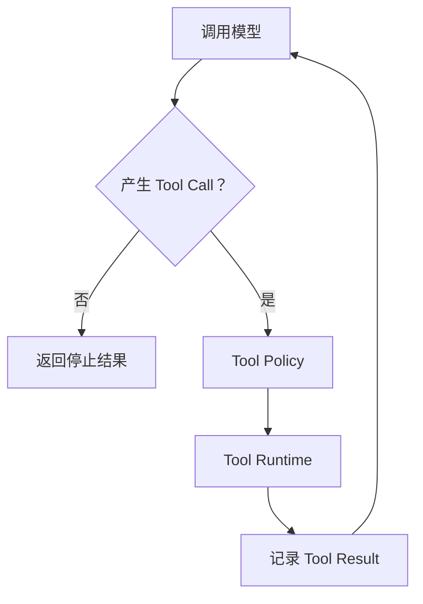

# 执行 Pipeline 与抽象边界

## 1. 执行模型

新内核采用 Pipeline 思想，但不是把整个 Agent 实现成可以任意插入 `next()` 的通用中间件链。

执行架构分为五个相互独立的部分：

```text
Session State Machine   控制 Session 生命周期、并发、排队和取消
Turn Pipeline           控制一次 Turn 的固定数据处理阶段
Tool Loop               控制模型与 Tool Call / Tool Result 的循环
Feature Compiler        把 Profile 和 Feature 编译成不可变 RuntimeSnapshot
Model Call Frame        在每次模型调用前物化当时有效的提示词和工具清单
```

其中：

- Session State Machine 是控制面。
- Turn Pipeline 是数据面。
- Tool Loop 是 Pipeline 中 Execution 阶段的循环执行器。
- Feature Compiler 是配置面，只建立 Feature 拓扑和长生命周期资源。
- Model Call Frame 是动态能力面，允许同一 Turn 的后续模型调用看到受控变化。

## 2. Typed Turn Pipeline

一次 Turn 的固定阶段为：

```text
Admission
-> Snapshot Binding
-> Conversation Loading
-> Context Assembly
-> Context Preparation
-> Execution
-> Finalization
```

各阶段职责：

1. **Admission**
   - 校验 Session 状态。
   - 规范化输入。
   - 分配 `turnId`。
   - 决定排队、拒绝或 steering。
2. **Snapshot Binding**
   - 绑定当前有效 `RuntimeSnapshot`。
   - 一个 Turn 结束前不切换 Feature 拓扑、Context Strategy、Observer 和资源生命周期。
   - Snapshot 中的 `ModelCallContributionProvider` 可以在每次模型调用前重新物化动态能力。
3. **Conversation Loading**
   - 从 `ConversationRepository` 加载所需事件和 Snapshot。
   - 不向后续阶段暴露文件路径或数据库连接。
4. **Context Assembly**
   - 合并会话历史、Feature 提供的上下文和产品 instructions。
   - 生成结构化候选上下文，不直接截断消息。
5. **Context Preparation**
   - 计算 Token 预算。
   - 选择保留、裁剪或压缩策略。
   - 产出本 Turn 的最终模型上下文和可持久化的压缩记录。
6. **Execution**
   - 调用 `TurnEnginePort`。
   - 在内部执行模型与 Tool 的循环。
   - 传播取消信号。
   - 按协议记录模型、Tool Call、Tool Result 和停止原因。
7. **Finalization**
   - 持久化终止事件和 Session 元数据。
   - 释放 Turn 级资源。
   - 将 Session 恢复为 Idle 或推进到 Closing。

Tool Loop 不是线性 Pipeline：



因此不能把 Tool Loop 拆成一串只能执行一次的普通 Stage，也不能让外部 Feature 接管循环控制权。

Tool Loop 与外部持久化之间使用窄化的请求—应答检查点，而不是假设事件队列具有背压：

```text
assistant / toolResult event
  -> Turn Pipeline append
  -> model-call context checkpoint
  -> optional context.compacted append
  -> checkpoint complete
  -> next model call
```

检查点本身是进程内 `TurnEngineEvent`，不进入 Conversation Repository。它只暂停和恢复
模型循环，不解释阈值、摘要、Provider overflow 或产品 Hook。Context Strategy 返回压缩结果，
Turn Pipeline 决定提交，Coding Profile 决定具体压缩策略。

Tool 的定义与执行属于 Runtime 合同，`agent-core` Adapter 只做协议转换：

```text
RuntimeSnapshot 静态贡献 + ModelCallContributionProvider 动态贡献
-> ModelCallFrame
-> AgentCoreTurnEngine 转为 AgentTool
-> ToolPolicy.authorize
-> 动态 Catalog 按 CapabilityBinding 原子校验并登记执行
-> RuntimeToolDefinition.execute
-> ToolResultMessage
-> 下一次模型调用
```

边界约束：

- Runtime Tool 必须接收 `sessionId`、`turnId`、`toolCallId` 和 `AbortSignal`。
- Tool Policy 必须先于工具实现执行，拒绝结果转换成标准错误 Tool Result。
- 静态 Tool Schema 在 Runtime Snapshot 发布时深拷贝并递归冻结；动态 Tool Schema 在
  Model Call Frame 物化时执行相同处理。
- `AgentCoreTurnEngine` 由组合根注入模型与 Stream 实现，不读取 Model Registry 或全局 Session。
- Execution 阶段只持久化完成的 Assistant / Tool Result 消息；流式 delta 属于观察事件，不作为会话事实重复写入。
- `agent-core` 不得反向导入 `runtime-core` 或 `coding-agent`。

一次模型请求发出后，已发送的提示词、Skill 内容和 Tool Schema 无法撤回。运行时变化采用
以下明确边界：

```text
模型调用 N 发出
  -> 该调用继续使用 Frame N
  -> 工具真正执行前检查实时可用性
  -> 模型调用 N+1 重新物化 Frame N+1
```

因此，普通工具注销会阻止尚未开始的旧调用，但不靠修改已经发送的模型请求实现。已经开始
执行的工具由 `AbortSignal` 和显式 revoke 策略控制；普通 deactivate 不应隐式终止已有
副作用。Skill 文件被删除后，下一次贡献应停止注入内容和资源能力，但已经发送给模型的内容
不能“反向遗忘”。

模型看到的能力使用稳定绑定，而不是 JavaScript 对象引用：

```ts
export interface CapabilityBinding {
	readonly sourceId: string;
	readonly capabilityId: string;
	readonly revision: string;
}
```

- `sourceId` 标识能力目录，例如 Coding Tools、MCP Server 或 Skill Registry。
- `capabilityId` 标识该目录中的逻辑能力。
- `revision` 标识会影响调用兼容性的定义版本。
- Catalog Snapshot 只复制轻量 Entry 视图；只有发生注册、替换、撤销等有效变化时才创建新
  revision，不因每次模型调用重新物化 Frame 而轮换。

执行不能实现成 `resolve() -> await -> tool.execute()` 两个分离的公共步骤，否则在校验后、
登记执行前发生 revoke 会形成竞态。只读 Catalog 必须提供单一执行仲裁入口：

```text
Catalog.execute(binding, request)
  -> 同步读取当前 Entry
  -> 校验 state 与 revision
  -> 登记 in-flight execution
  -> 合并 Turn AbortSignal 与 revoke AbortSignal
  -> 调用当前实现
  -> 清理 in-flight execution
```

能力生命周期语义：

| 操作 | 后续 Frame | 尚未开始的旧绑定 | 已开始执行 | revision |
| --- | --- | --- | --- | --- |
| `activate` | 暴露 | 可执行 | 不影响 | 保持 |
| `deactivate` | 隐藏 | 拒绝，可重试 | 继续 | 保持 |
| `revoke` | 隐藏 | 拒绝，不可重试 | 协作取消并丢弃结果 | 轮换 |
| `unregister` | 移除 | 拒绝，可重试 | 继续 | 删除 |

这里的 revoke 是明确的安全/权限动作，不是普通热更新。它通过 `AbortSignal` 请求底层操作
停止；对于不响应取消的实现，Catalog 仍会丢弃其最终结果，但无法回滚已经产生的外部副作用。
因此具有不可逆副作用的工具仍需自身实现幂等、事务或补偿边界。

Pipeline 的每个阶段接收明确输入并返回明确输出。输出在语义上只读，不携带可由任意模块写入的共享 `metadata`：

```ts
export interface PreparedTurn {
	readonly turnId: string;
	readonly snapshot: RuntimeSnapshot;
	readonly messages: readonly ConversationMessage[];
	readonly compaction?: CompactionRecord;
}
```

这里的只读是合同约束，不要求为了形式上的不可变在每个阶段深拷贝全部消息。

## 3. 禁止万能 Middleware

不提供以下公开扩展方式：

```ts
pipeline.use(async (context, next) => {
	await next();
});
```

原因是通用 Middleware 会重新引入：

- 执行顺序依赖注册顺序。
- `next()` 前后均可产生不可追踪的副作用。
- 任意模块修改 messages、tools、instructions 和停止结果。
- 取消和错误传播无法局部推理。
- Feature 之间通过共享 context 形成隐藏依赖。
- 运行期配置通过无类型共享对象任意污染当前执行。

确实需要扩展的行为必须进入明确合同：

- 新上下文来源使用 `ContextProvider`。
- 每次模型调用需要刷新的提示词、Skill 和工具清单使用 `ModelCallContributionProvider`。
- 上下文预算和压缩使用 `ContextStrategy`。
- 模型可调用行为使用 `ToolDefinition`。
- 工具权限使用 `ToolPolicy`。
- Turn 完成后的非关键处理使用 `TurnObserver`。
- 输入输出协议使用 Adapter。

`TurnObserver` 只能观察已经发生的标准事件，不能修改 Turn 结果。Observer 失败必须被隔离和记录，不能破坏 Session 状态机。

## 4. 抽象原则：抽象边界，不抽象所有实现

内核只依赖稳定 Port，不与文件存储、具体压缩算法、某个模型供应商或 MCP SDK 绑定。但这不意味着每个类、函数和单一实现都需要创建接口。

满足以下任一条件时才建立抽象：

- 存在多个合理实现。
- 属于进程、存储、模型、工具或宿主服务边界。
- 测试需要确定性替换。
- 会随运行环境或产品策略变化。
- 具体实现不应被上层感知。

以下内容应形成稳定 Port：

| Port | 默认实现示例 | 测试实现示例 |
| --- | --- | --- |
| `TurnEnginePort` | `AgentCoreTurnEngine` | `FakeTurnEngine` |
| `ConversationRepository` | `FileConversationRepository` | `InMemoryConversationRepository` |
| `ContextStrategy` | `SummaryContextStrategy` | `NoCompactionContextStrategy` |
| `ContextSummarizer` | `ModelContextSummarizer` | `FakeContextSummarizer` |
| `ToolPolicy` | `DefaultToolPolicy` | `AllowAllToolPolicy` |
| `EventSink` | `MultiplexEventSink` | `CollectingEventSink` |
| Host Capability Client | `AuthorizedCapabilityClient` | `FakeCapabilityClient` |

以下内容通常保持具体实现，不为了形式创建接口：

- Session 状态转换函数。
- Pipeline 内部的固定阶段编排器。
- 只在一个包中使用的输入规范化函数。
- Token 预算中的简单计算器。
- 事件序列化辅助函数。
- 没有替换需求的不可变值对象。

Composition Root 是唯一选择具体实现的位置：

```ts
const repository = new FileConversationRepository(...);
const contextStrategy = new SummaryContextStrategy(...);
const turnEngine = new AgentCoreTurnEngine(...);

const agent = createCodingAgent({
	repository,
	contextStrategy,
	turnEngine,
});
```

Kernel 只能看到 Port，不知道实际绑定的是文件、SQLite、远程服务、摘要压缩或 Fake 实现。

Port 只改变依赖方向，不能静默改变产品语义。例如把旧 read 的“相对 cwd、允许绝对路径和
`~`”改成“只能读取 Workspace Root”，属于权限和功能变化，不是文件系统抽象。此类变化
必须单独提出并获得批准，不能夹带在架构迁移中。

## 5. 上下文压缩边界

上下文压缩属于 `Context Preparation` 策略，不是 Session Manager 的附属方法，也不是能够直接改写会话历史的 Extension Hook。

它有两个调用时机，但共享同一个 `ContextStrategy` 和提交边界：

- 外部 Turn 开始时，使用输入写入前的历史决定是否压缩。
- Execution 内的模型调用检查点，使用已经持久化的最新 assistant/toolResult 决定同 Turn
  阈值压缩或 overflow 恢复。

手动压缩是第三个触发入口，但不是伪造出来的 Turn。它使用 Session 控制面和专用算法 Port：

```text
RuntimeSessionContextController
  -> cancel active Turn
  -> acquire RuntimeSnapshot lease
  -> ManualContextCompactionRuntime
  -> ContextCompactionCommitter
  -> release lease
```

三种触发方式共享 `ContextCompactionCommitter`，由它统一负责 Repository 乐观版本提交、
Kernel Event 发布、Observer 通知和提交后 Document 读取。区别仅在于：

- Turn-start 和模型调用检查点压缩属于活动 Turn，`context.compacted` 必须携带 `turnId`。
- 手动压缩发生在两个 Turn 之间，不创建 `turn.started`，也不携带伪 `turnId`。
- 手动压缩的忙碌态、显式取消和自动压缩开关属于 Session Controller。
- 摘要算法、自定义指令、Extension 覆盖/取消和 Pre/PostCompact 属于 Coding Profile。

第二种情况不能只依赖普通 EventStream 通知。通知消费不是背压点，模型循环可能在 Repository
append 完成前继续。Turn Engine 必须发出请求—应答检查点并暂停；Pipeline 完成消息和
`context.compacted` 的有序提交后再应答。

建议合同：

```ts
export interface ContextStrategy {
	prepare(
		input: ContextPreparationInput,
		signal: AbortSignal,
	): Promise<PreparedContext>;
}

export interface ContextPreparationInput {
	readonly messages: readonly ConversationMessage[];
	readonly tokenBudget: number;
	readonly reservedOutputTokens: number;
	readonly model: ModelDescriptor;
}

export interface PreparedContext {
	readonly messages: readonly ConversationMessage[];
	readonly estimatedTokens: number;
	readonly compaction?: CompactionRecord;
}
```

实现可以包括：

- `NoCompactionContextStrategy`。
- `SlidingWindowContextStrategy`。
- `SummaryContextStrategy`。
- `HybridContextStrategy`。

如果摘要需要调用模型，再通过最小 Port 隔离：

```ts
export interface ContextSummarizer {
	summarize(
		input: SummarizationInput,
		signal: AbortSignal,
	): Promise<Summary>;
}
```

边界约束：

- `ContextStrategy` 不持有可变 Session。
- 不直接读写 `ConversationRepository`。
- 不读取全局 `ModelRegistry`。
- 不决定压缩记录是否落盘。
- 压缩结果由 Turn Pipeline 作为标准事件持久化。
- 手动压缩结果由 Session Controller 调用同一个 `ContextCompactionCommitter` 持久化，不允许
  宿主或产品 Adapter 直接写 Repository。
- 模型调用检查点只携带已类型化消息和完成/失败应答，不暴露 Repository。
- Overflow 错误可以先作为普通 assistant 历史持久化，再从一次性重试上下文移除。
- Profile 同一时间只能选择一个主 `ContextStrategy`，不能由多个 Feature 依次任意改写上下文。

纯 Token 预算和消息选择可以作为 `ContextStrategy` 内部具体函数，不需要再为每个计算步骤创建公开接口。

## 6. 会话存储边界

Session 不依赖 `FileSessionManager`、JSONL 路径或数据库连接，而依赖具有会话领域语义的 Repository：

```ts
export interface ConversationRepository {
	create(input: CreateConversationInput): Promise<ConversationMetadata>;
	load(sessionId: string): Promise<StoredConversation>;
	append(
		sessionId: string,
		events: readonly StoredSessionEvent[],
	): Promise<AppendResult>;
	saveSnapshot(
		sessionId: string,
		snapshot: ConversationSnapshot,
	): Promise<void>;
	close(): Promise<void>;
}
```

实现可以包括：

- `InMemoryConversationRepository`。
- `FileConversationRepository`。
- `SqliteConversationRepository`。
- `RemoteConversationRepository`。

不应将它抽象成通用 `get(key)` / `set(key, value)`，因为会话存储必须保留：

- 原子追加。
- 事件顺序。
- 乐观并发版本。
- Session 分支。
- Snapshot。
- 未完成 Turn 恢复。
- Schema 迁移。

Pipeline 不假设整个 Turn 是一个长数据库事务。它使用明确的持久化检查点：

1. Turn 接受后，原子写入输入、绑定的 Snapshot ID 和 Turn Started。
2. 模型与工具循环中的标准事件按顺序追加。
3. Finalization 写入完成、失败或取消终止事件。

这样进程中断后可以根据事件日志判断 Turn 停止在哪个阶段，而不是依赖内存状态猜测。

### 6.1 跨 Conversation 续接

rollover 不是普通 `append`，也不是新的 Turn。它创建新的持久化实体、改变 Session 身份并让
同一 Tool Loop 继续执行，因此使用独立 `ConversationContinuationStore`：

```text
source Conversation
  context.compacted
  turn.transferred ───────────────┐
                                  │ same turnId / snapshotId
target Conversation               │
  continuation seed               │
  turn.continued <────────────────┘
  message / tool result
  turn.completed | cancelled | failed
```

约束：

- Context Strategy 只能在压缩提交后返回通用 continuation directive；它不能创建文件或修改
  Session ID。
- Storage Adapter 原子校验源版本、活动 Turn 和最近压缩边界，目标只携带摘要与 kept tail。
- `turn.transferred` 是源会话终态，`turn.continued` 是目标会话起点；目标不得伪造
  `turn.started`。
- Pipeline 在存储事务成功后重绑定活动 Session 身份，后续 Tool、Policy、Prompt Provider、
  Observer 和终态都使用目标 `sessionId`。
- 瞬时 `conversation.continued` 只负责运行时投影、路径和宿主事件切换，不再次写入日志。
- 进程在跨文件写入窗口中崩溃时，恢复策略只把仍未闭合的 Turn 标记为 interrupted，不自动
  重放模型或工具；外部副作用不会被重复执行。

该边界是通用会话能力，不包含 MEMORY flush、JOURNAL 或 IM 策略。产品 Orchestrator 决定何时
请求续接，Runtime Core 只执行协议，Runtime Storage 只实现持久化事务。

## 7. 运行时类型校验策略

TypeScript 类型只约束编译期，不能信任来自模型、磁盘、网络、插件或 RPC 的运行时数据。Schema 校验放在不可信数据第一次进入领域模型的边界，校验成功后内部代码使用稳定类型，不在每一层重复 parse。

本架构采用以下选择：

| 边界 | Schema 方案 | 原因 |
| --- | --- | --- |
| Tool 参数 | TypeBox / JSON Schema | Schema 需要直接发送给模型 Provider，并由 agent-core/AJV 校验 |
| Conversation JSONL / Snapshot | TypeBox | 需要静态类型、运行时检查和可版本化的 JSON Schema 语义 |
| MCP Tool Schema | JSON Schema 转 TypeBox 或安全包装 | MCP 原生提供 JSON Schema，不能要求 Server 使用 Zod |
| Host 表单或复杂配置转换 | 按宿主需要选择 Zod | 只有需要 preprocess、transform 或既有 Zod 生态时才引入 |
| Kernel 内部对象 | TypeScript 合同 | 已经过入口校验，不重复增加运行时 Schema 层 |

约束：

- Kernel 和底层 Runtime 不同时维护 TypeBox、Zod 两套等价 Schema。
- Tool、存储和协议 Schema 必须与对应 schema version 一起演进。
- JSON 解析成功不等于领域对象合法；仍需校验 Message role、StopReason、Event discriminant 和嵌套字段。
- Repository 的公开写入方法也执行运行时校验，因为调用方可能来自 JavaScript、插件或版本不一致的包。
- 校验失败在写入侧返回稳定 `INVALID_EVENT`，在读取侧视为 `CORRUPT`，不能携带半合法对象进入 Kernel。
- Schema 只负责结构和基础约束；事件顺序、Session ID 一致性、乐观版本等领域不变量仍由 Repository 显式代码校验。
