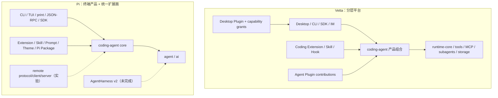

# 架构与扩展模型

## 总体结构

Vetta 的重写目标是把通用运行时下沉到 `runtime-*`，让 `coding-agent` 只拥有稳定会话合同和产品装配。Pi 当前生产实现仍把 `AgentSession`、`SessionManager`、`ResourceLoader`、`PackageManager`、Extension runner、models 和 tools 集中在 `packages/coding-agent/src/core`。因此：

- Vetta 新增通用运行时能力时，更容易通过 feature、port、contribution provider 或独立 package 实现，内部依赖边界更强。
- Pi 修改单一终端产品时路径更短，Extension 作者面对的概念更少；但 SDK 暴露 manager/loader 等具体类后，内部重构更容易影响外部合同。

## Vetta 的扩展层

### 1. Runtime Feature、Port 与 Contribution Provider

这是 Vetta 最重要、也最容易被外部 Extension 表象遮住的扩展层。`CodingAgentRuntimeCompositionOptions` 把 environment、conversation、model、tool、subagent、prompt、plugin、extension、context 和 observability 分开注入；`runtime-core` 的 turn pipeline、feature compiler 和 model-call contribution provider 使新增能力不必反向依赖宿主。

`runtime-tools` 使用版本化动态目录：注册或注销在下一次 model call 可见，执行时再次解析当前 catalog，并避免把旧 tool call 路由到同名的新实现。`runtime-mcp` 和 `runtime-subagents` 也分别拥有 supervisor、同步器、调度与恢复合同。这是 Vetta 内部扩展性领先 Pi 生产实现的核心原因。

### 2. Coding Extension

Coding Extension 是与 Pi 血缘最直接的机制，可注册事件处理器、工具、命令、Provider 和渲染器。当前实现已把 contracts、loading、registry、dispatcher、context host 分开，比 Pi 的 Extension runner 文件布局更清楚。

但它仍保留 Pi 的终端时代痕迹：公开合同包含 `Theme`、`Component`、editor/footer/header/custom terminal UI 等 TUI 类型，而 Vetta 的生产宿主同时包含 Desktop、RPC、SDK 和 IM。文档又说明非 TUI 宿主通常通过 RPC/Desktop 转发 UI，导致“公开可用”与“各宿主真正支持”之间存在落差。

生命周期也有待收紧：注册表本身可变，但 post-bind 的工具刷新、Provider 注册/注销、旧 context 失效和 event subscription 清理没有形成统一代际合同。底层 `runtime-tools` 已经有更强的动态语义，Coding Extension 尚未完整投影这些能力。

### 3. Desktop Plugin 与 Agent Plugin

Desktop Plugin 通过 `plugin.json`、Module Federation、UI slots 和 Plugin SDK 扩展 Renderer；权限声明与 capability access session 控制 agent、command、filesystem、network、storage、app action 等宿主能力。Agent contribution 可以注入 system prompt、skills、MCP、tool policy、动态工具和 continuation policy。

这套机制比 Pi TUI Extension 更适合大型 GUI 产品，也有更细的逻辑权限和审计边界。但插件代码与 Renderer 同 realm，不是进程沙箱；权限系统限制的是 SDK/bridge 能力，不能把受信插件变成不可信代码执行环境。

Desktop Plugin 与 Coding Extension 是两套作者模型。它们都能添加 agent tool、prompt 或资源，却有不同 manifest、生命周期、权限与宿主覆盖，这是 Vetta 当前认知成本最大的来源。

### 4. MCP、Skill、Prompt、Theme 与 Ecosystem Hook

这些机制分别解决远程工具协议、模型可读说明、模板/主题和外部生态兼容问题。它们适合作为声明式或协议式边界，不应被强行合并为可执行 Extension；但需要统一的 source、precedence、reload 和 diagnostics 视图。

## Vetta 扩展机制选择表

| 需求 | 首选机制 | 原因 | 不应默认选择 |
| --- | --- | --- | --- |
| 所有宿主可复用的 Agent 运行时能力 | Runtime Feature/Port 或 Agent Plugin contribution | 宿主无关，可测试，可进入组合层 | Desktop UI Plugin |
| 外部进程/服务提供工具与资源 | MCP | 协议边界清楚，可监督和同步 | 直接在 Extension 中长期管理子进程 |
| 仅包含工作流说明和可发现资源 | Skill/Prompt | 声明式、低权限、易分发 | 可执行 Extension |
| Coding Agent 事件、工具或 Provider 扩展 | Coding Extension | 与会话生命周期和模型调用直接集成 | Renderer-only Plugin |
| Desktop UI、菜单、面板、卡片 | Desktop Plugin | UI slots、i18n、权限与宿主 SDK 完整 | Coding Extension 的 TUI 类型 |
| Codex/Claude 等生态配置兼容 | Ecosystem Hook/adapter | 隔离兼容语义 | 污染核心 Runtime 合同 |

## Pi 的扩展模型

Pi 以一个主要的 TypeScript Extension API 为中心，Skill、Prompt Template、Theme 和 Pi Package 围绕它分发。Extension 同时能处理 session/agent/tool/input/provider 事件，注册工具、命令、快捷键、消息渲染器和 TUI 组件。优点是“一个入口即可改产品”，示例覆盖 subagent、plan mode、sandbox、custom provider、UI 甚至小游戏。

代价是 Extension API 较大，并直接暴露 TUI、session/settings/resource manager 等具体对象。它非常适合 Pi 自己这个终端 harness，但把同一合同移到 Desktop、Web、IM 或服务端时，宿主能力和安全边界会变得含糊。

Pi current 在这套统一表面上补齐了很多动态语义：generation invalidation、stale context 检测、fresh `withSession`、工具刷新、Provider 动态注册/注销、结构化 `sourceInfo`、项目目录信任与 package 更新事务。它的优势是生产细节成熟，而不是内部包分层优于 Vetta。

## 核心判断

Vetta 应保持“多层扩展”，但把它治理成一套**统一贡献模型**，而不是复制 Pi 的单一全能 Extension：

- 统一 contribution 的身份、来源、版本、优先级、冲突、生命周期和 diagnostics；
- 保留不同执行边界：声明式资源、进程内代码、Desktop UI、MCP 远程服务不能共享同一安全假设；
- 让宿主无关核心合同不再暴露 TUI 类型，宿主适配器负责 UI 投影；
- 从 Pi 吸收已经验证过的生命周期和分发语义，而不是回到集中式 `core`。
