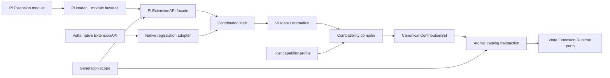

# 目标架构与模块划分

## 所有权决策

Pi Extension 兼容属于 `@vetta/coding-agent` 的产品扩展边界：

- 它理解 Pi 的 Extension、Package、事件和宿主语义；
- 它把第三方协议转换成 Vetta 稳定产品合同；
- `runtime-core`、`runtime-tools` 和 `@vetta/ai` 不应认识 Pi 包名或 Pi 类型。
- `@vetta/coding-agent` 不新增 `pi-tui` 依赖；兼容 loader 也不为它提供 virtual module。

第一阶段不新增 workspace package。兼容代码放入 `packages/coding-agent/src/extensions/pi-compat/`，canonical contribution 放在 `src/extensions/contributions/`。当兼容层需要被多个产品包独立消费、或依赖集合明显独立后，再按新增包规范提取 `@vetta/pi-extension-compat`；现在提前拆包只会增加 exports/build/path-map 成本。

这不是恢复被禁止的通用 `src/compat/`：`pi-compat` 是一个有明确外部协议、单向转换和删除条件的 Anti-Corruption Layer，输出只能是当前 Extension contribution contract。

## Native-first 架构门槛

`contributions/` 和 `lifecycle/` 先服务 Vetta native Extension，不依赖 `pi-compat`。实施顺序必须满足：

1. native registration 从旧 Map 迁移到 draft/catalog；
2. native Tool、Event、Provider 和 Context 合同通过回归测试；
3. `runtime-core` 只增加产品无关的窄 Port，例如 Tool `validateInput`；
4. Pi facade 最后编译到同一 contribution，不得直接调用 Runner、ModelRuntime 或 ToolRuntime 实现。

完整原生能力分解见 [Vetta 原生能力先行方案](07-vetta-native-first.md)。如果某项 Pi capability 找不到已经批准的 native contribution/port，compatibility compiler 必须将其标成 unsupported，而不是在 adapter 内添加第二套实现。

## 核心架构



关键改进是让 Vetta native 与 Pi compat 共享 `ContributionDraft -> ContributionSet -> DynamicContributionCatalog`，而不是让 Pi adapter 直接修改现有多个 `Map`。这里复用 ADR-0062 的 Catalog；Extension adapter 只负责 identity/owner 到既有 source replacement 的转换，不实现第二个通用 Catalog。

Native path 是事实源和行为基线：Pi path 只比 native path 多 module/schema/event shape 转换，不拥有 catalog transaction、Tool scheduler、prompt compiler、session transition 或 Provider lifecycle。

## Canonical Contribution IR

建议定义内部判别联合，作为唯一注册事实源：

```ts
type ExtensionContribution =
  | ToolContribution
  | EventHandlerContribution
  | CommandContribution
  | FlagContribution
  | ShortcutContribution
  | HostPresentationContribution
  | ProviderContribution
  | ResourcePathContribution
  | SystemPromptContribution;

interface ContributionIdentity {
  readonly contributionId: string;
  readonly extensionId: string;
  readonly generation: number;
  readonly source: ContributionSourceInfo;
  readonly priority: number;
}
```

IR 不出现 Pi `ExtensionAPI`、`pi-tui`、Pi `ModelRegistry`、TypeBox 1 `TSchema` 或具体 loader 对象。结构化交互是 context action port，不是可注册 UI contribution。

为了保持 Vetta native Extension 的既有行为，`ShortcutContribution` 和 `HostPresentationContribution` 可以承载当前 Vetta host 的 shortcut/message renderer/tool renderer binding，但它们明确标记 `origin: "vetta-native"`，只由 native registration adapter 生成，不进入 Runtime Core。Pi compatibility compiler 没有生成这两种 contribution 的权限；Pi renderer 仍被剥离或拒绝。

`ContributionSet` 必须是不可变快照；动态注册通过新 transaction 生成新 revision，而不是原地修改已发布对象。执行中的 Turn 继续持有本次需要的稳定 binding，下一 model call 观察新 revision。

## 建议目录

```text
packages/coding-agent/src/extensions/
  contributions/
    contracts.ts                 # Canonical discriminated unions
    source-info.ts               # 统一来源与 identity
    draft.ts                     # 注册阶段可变 draft，仅本 generation 可写
    native-registration.ts       # 现有 Vetta ExtensionAPI -> draft
    normalize.ts                 # 名称、Schema、默认值与 JSON-safe 归一化
    compiler.ts                  # draft + host profile -> immutable set/report
    catalog-adapter.ts           # typed contribution -> ADR-0062 Catalog source replacement
    conflict-policy.ts           # 同名优先级与诊断

  lifecycle/
    generation.ts                # active/stale 状态
    owned-resources.ts            # subscriptions/registrations/disposables
    teardown.ts                  # 关闭顺序、聚合错误、幂等

  native/
    tool-input-adapter.ts        # normalize + validator port
    tool-prompt-contribution.ts  # active Tool -> SystemPromptDraft
    state-events.ts              # settled/metadata/thinking 事实事件
    provider-contribution.ts     # owner-aware config Provider
    host-presentation.ts         # 保留 native shortcut/renderer，Pi 不可生成

  pi-compat/
    contracts.ts                 # 只描述 Pi 边界输入/输出
    profiles.ts                  # 支持的 namespace/feature baseline
    capability-map.ts            # Pi API -> canonical capability
    diagnostics.ts               # 稳定错误码与报告

    loader/
      specifier-map.ts           # current/legacy package aliases
      module-facades.ts          # virtual module 实例装配
      module-loader.ts           # Jiti 与 cache generation
      factory-inspector.ts       # inspect-only 注册

    api/
      extension-api.ts           # Pi ExtensionAPI facade
      action-facade.ts           # send/set/get/exec 等动作
      event-bus-facade.ts        # generation-owned subscriptions

    adapters/
      tool.ts
      command.ts
      provider-config.ts
      resources.ts
      session-context.ts
      model-catalog.ts
      interaction.ts            # 仅 notify/select/confirm/input

    events/
      definitions.ts             # 显式事件兼容表
      projectors.ts              # Vetta event -> Pi event
      result-folders.ts          # handler result chaining/short-circuit

    schema/
      tool-schema.ts             # TypeBox 1/plain JSON Schema 边界
      registration-guards.ts     # 函数/对象最小运行时检查
```

文件名按职责命名，避免新的 `PiExtensionManager` 或万能 `utils.ts`。

## 模块职责

### Loader 与 module facades

Loader 只负责：

- 解析已批准的路径；
- 注入允许的 virtual modules；
- 加载 default/inline factory；
- 管理以 cwd + generation + resolved path 为 key 的 cache；
- 返回 factory 或稳定加载错误。

它不负责事件分派、Tool 执行、Provider 注册或宿主能力判断。

`specifier-map.ts` 明确列出支持项：

```text
@earendil-works/pi-coding-agent
@mariozechner/pi-coding-agent
@earendil-works/pi-ai[/compat]
@mariozechner/pi-ai[/compat]
@earendil-works/pi-agent-core
@mariozechner/pi-agent-core
typebox[/compile|/value]
@sinclair/typebox[/compile|/value]
```

`@earendil-works/pi-tui`、`@mariozechner/pi-tui` 及其 subpath 明确不在映射表中，遇到 runtime import 时返回 `PI_COMPAT_EXCLUDED_TUI_IMPORT`。Pi AI 的 `/oauth`、`/providers/all` 也不在首个 profile。每个其他 specifier 的 facade 独立声明支持 exports；未支持 export 应在调用时抛稳定 `PI_COMPAT_UNSUPPORTED_EXPORT`，不能把 Vetta 包根整体伪装成 Pi。

### Registration Draft

Factory 执行期间只写本地 draft。注册函数完成以下工作：

1. generation active 检查；
2. 最小 shape 校验；
3. 记录 source/specifier/capability；
4. 暂存，不触碰全局 catalog；
5. factory 成功后统一 normalize/compile。

这样可以解决 Pi 当前 mutable Maps 的半注册问题。Factory 抛错时丢弃 draft 即可，不需要逐项补偿。

Factory 成功并激活后，长期保存的 native/Pi API 若再次注册动态能力，必须创建新的 owner-scoped draft/transaction；不能重新打开初始 draft，也不能直接修改已发布 `ContributionSet`。新 revision 只影响下一 model-call boundary。

### Compatibility Compiler

输入：

- `ContributionDraft`
- `CodingAgentExtensionHostCapabilities`
- Pi compatibility profile
- trust/source metadata

输出：

- 不可变 `ContributionSet`
- `PiExtensionCompatibilityReport`
- `publishable: boolean`

报告至少包含：extension source、import namespace、使用能力、状态、原因码、宿主覆盖、Schema warning、冲突和建议替代方案。

现有 `host/extensions/compatibility` 可以演进为 compiler 的 host capability 输入和最终 assessment，不应另建第二套真假相反的兼容判定器。

### Catalog Transaction

事务拥有 generation 的所有贡献：

```text
prepare -> validate -> resolve conflicts -> publish -> activate
                                  | failure
                                  v
                               rollback
```

- publish 以一个 revision 原子替换上一 generation；
- tool/provider/event subscription 都记录 owner；
- reload 先准备新 generation，发布成功后才 retire 旧 generation；
- 新 generation 失败时旧 generation 继续服务；
- shutdown 聚合错误但尝试释放全部资源。

### Event Adapter

不要写一个带大量 `if (isPi)` 的 Runner。建立声明式事件定义表：

```ts
interface PiEventDefinition {
  readonly piType: string;
  readonly sourceEvent: string;
  readonly status: CompatibilityStatus;
  readonly mutation: "observe" | "transform" | "short-circuit";
  project(event: unknown, context: ProjectionContext): unknown;
  fold?(state: unknown, result: unknown): FoldResult;
}
```

表只描述映射，具体 project/fold 使用命名纯函数。测试从同一表生成覆盖检查，但生产逻辑不要依赖字符串反射或动态 `any`。

### Context Facades

Pi Extension 看到的是兼容 facade，不是 Vetta 内部对象：

- `ReadonlySessionManagerFacade` 从 canonical conversation/session view 投影；
- `ModelRegistryFacade` 提供查询和 credential resolution，写入走 Provider contribution；
- `InteractionFacade` 只投影 `notify/select/confirm/input`，不提供 Component、Theme、terminal input 或展示 slot；
- session replacement 返回 fresh facade；旧 facade generation 检查失败；
- 不支持的方法存在时抛稳定错误，不返回容易被误解的空值。

## 公开入口

先从 `@vetta/coding-agent/extensions` 兼容演进 Vetta native contract：Tool input normalization/prompt metadata、原生状态事件、Provider unregister、generation/source diagnostics。现有字段保持兼容，新字段均为 optional 或新增方法，并检查所有宿主消费者。

Pi 接入使用显式 `@vetta/coding-agent/extensions/pi-compat` subpath，避免 native Extension loader/API 意外获得 Pi facade。该入口只导出窄类型与显式 loader：

- `@vetta/coding-agent/extensions/pi-compat`：显式 Pi loader、兼容状态、报告、inspect options；
- `@vetta/coding-agent/bootstrap`：在现有 `extensionRequirements` 中携带 origin/profile；
- SDK create options：只增加 `piCompatibility?: "off" | "strict" | "host-aware"`，默认是否开启由产品决策明确指定。

不要公开底层 module loader、draft、compiler class 或 Pi facade 具体实现；只公开按 profile 加载并返回报告的高层入口。

## 依赖方向

```text
pi-compat -> extension contributions -> runtime-contracts
          -> resources contracts
          -> @vetta/ai public values（仅 adapter）

composition -> pi-compat factory + catalog adapter
runtime-*  -X-> pi-compat
apps       -> public extension/bootstrap contracts
```

该方案涉及第三方协议、公共兼容行为、信任和新的 canonical contribution 模式，应先新增 ADR，再开始生产实现。
