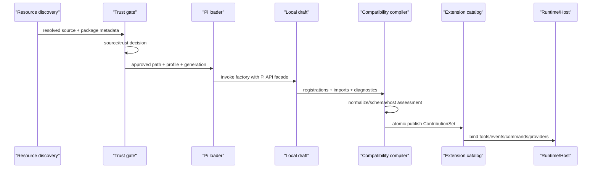
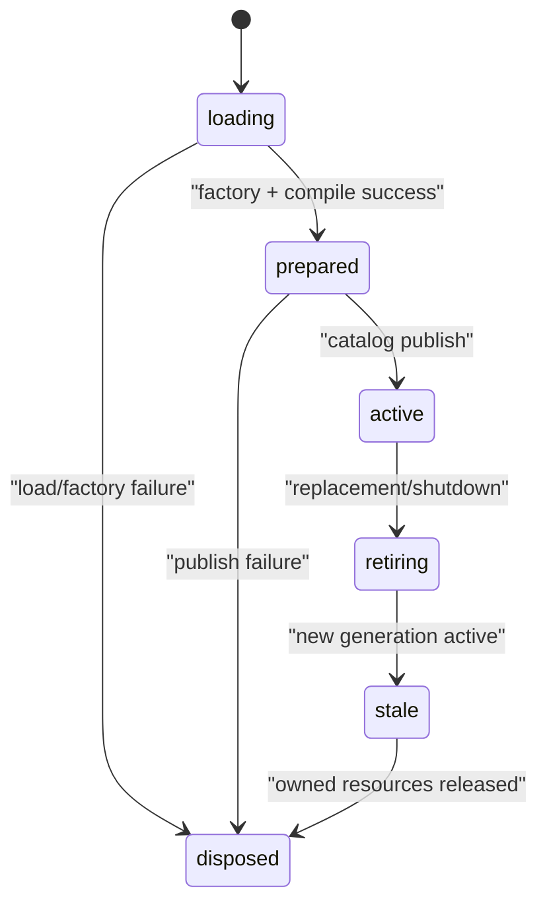

# 加载、生命周期与功能适配

## 端到端加载流程

兼容加载必须发生在 resource discovery 之后、catalog publish 之前：



详细顺序：

1. 前置条件：Vetta native registration 已使用 contribution catalog/generation，Tool/Event/Provider 通过 native fixtures。
2. 复用现有 resource/package discovery 解析 package `pi.extensions`、显式路径和动态 resource source。
3. 固化 `resolvedPath`、package source、版本、配置来源和 hash；禁止 Extension 在发布过程中改变自己的 identity。
4. project-local source 先走 project trust。`inspect-only` 仍会执行 factory，因此也必须先获得 trust，不能把 inspect 当沙箱。
5. loader 只注入 compatibility profile 允许的 module facade。
6. factory 通过 Pi registration adapter 写入原生 `ContributionDraft`；此时全局 catalog 不可见这些注册。
7. normalizer、Schema validator、compatibility compiler 一次性处理 draft。
8. `strict` 模式存在 unsupported 行为能力时拒绝整组发布；已知 presentation-only registration 可以剥离并记录 excluded 诊断。`host-aware` 只改变结构化交互在无 UI 宿主中的错误投影。
9. 原生 catalog 原子发布，随后激活 generation-owned event subscription 和 runtime binding。
10. reload 成功后 retire 旧 generation；失败则保留旧 revision。

## Generation 状态机



所有 ExtensionAPI、context、event bus subscription 和动态 registration 都持有 generation token。只有 `loading`、`prepared` 或 `active` 能按各自权限操作；旧 context 在 `stale` 后调用任何有副作用的方法都抛 `PI_COMPAT_STALE_GENERATION`。

`dispose` 幂等，并按以下顺序释放：

1. 阻止新调用和新事件投递；
2. 从 catalog 移除该 generation 的可发现 contribution；
3. 取消 event bus subscriptions；
4. 注销 provider/command，以及 Vetta native-only shortcut/renderer 等 host binding；
5. 等待或标记 in-flight Tool；
6. 执行其余 disposer，并聚合错误。

## 动态变更与 in-flight 语义

Pi 的 `registerTool` 可以触发 tool refresh。Vetta 不应把这解释成“原地修改当前模型请求”。统一规则如下：

- 动态注册也创建 catalog transaction 和新 revision；
- 已经发送给 Provider 的一次 model call 使用其开始时的 tool snapshot；
- 下一次 model call 使用最新 revision；
- 已开始的 Tool execution 绑定到启动时的 runner，即使该 Tool 随后被替换；
- Tool name 相同的新 generation 不接管旧 execution 的 callback；
- provider/model 列表刷新只影响下一次选择，不暗中切换当前 model；
- reload 期间旧 generation 可以完成已开始的 Tool，超时后由 host policy abort，不无限保活。

这些语义应由 runtime catalog 提供，Pi adapter 只发起 transaction，不能再维护第二份 tools map。

## Module facade 策略

支持一个 import namespace 不等于暴露其所有 export。Compatibility profile 记录：

```ts
interface PiCompatibilityProfile {
  readonly id: string;
  readonly upstreamSha: string;
  readonly packageVersion: string;
  readonly imports: Readonly<Record<string, readonly string[]>>;
  readonly capabilities: Readonly<Record<string, CompatibilityStatus>>;
}
```

第一阶段 facade 的优先级：

| Module | 第一阶段策略 |
| --- | --- |
| `@earendil-works/pi-coding-agent` 与 legacy namespace | 暴露 Extension 作者常用类型对应的运行时 helper；不暴露 Pi 内部 manager |
| `typebox` 与 legacy TypeBox specifier | 使用隔离的 TypeBox 1 facade，支持 root、`compile`、`value` |
| `pi-agent-core` | 只提供 Tool result/message 等 corpus 实际需要的稳定值；避免把 Vetta agent-core 整包伪装成 Pi |
| `pi-ai` | 第一阶段提供枚举、model/provider 值转换所需的窄 facade；OAuth/native provider 不在首个 profile |
| `pi-tui` | 不提供 facade；current/legacy namespace 和所有 subpath 都返回 `PI_COMPAT_EXCLUDED_TUI_IMPORT` |

deep import 默认拒绝。新增 export 要先增加 adapter 和 contract fixture，不能因为对象碰巧同形就透传。

## 功能适配

### Tool

Vetta native Tool contract 完成后，Pi adapter 支持：

- `name`、`label`、`description`、`parameters`、`execute`；
- `AbortSignal`、streaming `onUpdate`、结构化 result/details；
- `prepareArguments` 映射到 native `normalizeInput`；
- `promptSnippet`、`promptGuidelines` 编译到 Vetta 的 system prompt contribution；
- source、generation、tool call identity 和错误投影。

兼容边界：

- `constrainedSampling` 不进入首个 profile；Extension 显式启用时报告 unsupported，不能假装 Provider 已遵守；
- `executionMode` 未声明或为 `sequential` 时使用 Vetta 当前顺序执行；`parallel` 报 unsupported，不在 adapter 内自行并发；
- `renderShell`、`renderCall`、`renderResult` 和 renderer state 在 registration normalizer 中剥离，记录 `PI_COMPAT_EXCLUDED_PRESENTATION`；
- 如果 renderer 的创建依赖 runtime `pi-tui` import，模块会更早在 loader 阶段被拒绝；
- Vetta host 使用自己的 Tool call/result 展示，不执行 Extension 提供的 Pi 展示回调。

Pi Tool result 应转换为 Vetta canonical result；未知 detail 保留在受控 metadata 中，不能让未知对象穿过 IPC/RPC。

### Event

事件按 `observe`、`transform`、`short-circuit` 三类实现。相同优先级按稳定的 extension source/order 排序；transform handler 的输出依次成为下一个 handler 的输入。Observer 失败记录诊断后是否继续由事件 policy 明确规定，不能由某个 runner 的 `try/catch` 偶然决定。

建议首批事件矩阵：

| Pi event | Vetta 现状 | 首批状态 | 说明 |
| --- | --- | --- | --- |
| `session_start`、`session_shutdown` | 同名事件 | lossless | fresh session context |
| `before_agent_start`、`agent_start`、`agent_end` | 同名事件 | lossless/adapted | 核对消息与 prompt 变换顺序 |
| `turn_start`、`turn_end` | 同名事件 | lossless | 固定 turn identity |
| `message_start/update/end` | 同名事件 | lossless/adapted | `message_end` 首阶段只支持观察；Pi 新增的结果变换不伪造 |
| `tool_call`、`tool_result` | 同名事件 | lossless/adapted | short-circuit/result guard |
| `tool_execution_start/update/end` | 同名事件 | lossless/adapted | Vetta 额外 phase 不向 Pi 泄漏 |
| `input`、`user_bash` | 同名事件 | lossless | 命令和普通输入顺序要固定 |
| compact/tree 与 switch/fork before | 同名事件 | adapted | Vetta 额外的 after 事件不向 Pi facade 泄漏 |
| `resources_discover`、`model_select`、`context` | 同名事件 | adapted | 对 source/model/message 做投影 |
| `agent_settled` | 待新增 native fact event | adapted（N3 后） | 只从提交完成且无 continuation 的原生 settled 事实投影 |
| `session_info_changed` | 待新增 `session_metadata_changed` | 部分 adapted（N3 后） | 只投影 Vetta canonical metadata 可表达字段 |
| `thinking_level_select` | 待新增 `thinking_level_changed` | adapted（N3 后） | previous/current/source 来自实际状态变化 |
| `project_trust` | host trust gate | unsupported | Extension 不参与决定自身代码能否被信任 |
| Provider request/headers/response | 无等价公开事件 | unsupported | 不扩大凭据和请求可见性 |

每个 transform/short-circuit 事件必须单独定义结果 Schema 和 folding 规则。无效返回值立即失败并指向 Extension source，不能把任意对象 merge 进领域状态。

### Command、Shortcut 与 Flag

- Command 编译为 canonical command contribution，由当前 host 的 command router 暴露；无命令 UI 的 SDK 仍可通过程序化入口调用。
- `registerShortcut` 明确 excluded。调用时返回 `PI_COMPAT_EXCLUDED_TUI_API` 并拒绝该 factory，不尝试映射为 Desktop 快捷键。
- Flag 在启动配置冻结前可被读取；运行中注册的 flag 只对下一次解析/新 session 生效。若不能满足该语义，应在首阶段标记 unsupported。
- 同名冲突由统一 conflict policy 处理，诊断包含胜出者、被抑制者和原因。

### 结构化交互（不是 Pi TUI）

先从 Vetta native `ExtensionUIContext` 提取 `ExtensionInteractionPort`，再把 Pi 的四个方法映射到该 Port：

- `notify(message, type)`：投影为 Vetta notification；
- `select(title, options, opts)`：投影为结构化单选请求；
- `confirm(title, message, opts)`：投影为结构化确认请求；
- `input(title, placeholder, opts)`：投影为结构化文本请求。

四者只传递字符串、枚举、timeout、abort 和返回值，不传递 Pi `Component`、Theme 或 terminal 对象。`status/widget/header/footer/title/custom/editor/editor component/autocomplete/raw input/working indicator` 均返回 `PI_COMPAT_EXCLUDED_TUI_API`，不建设 host component bridge。

非交互 host 不应自动回答 `confirm`。它应返回结构化 `HOST_INTERACTION_REQUIRED`，由调用方决定重试、提供答案或跳过 Extension。

### Session Context 与 Actions

每次 handler/Tool 调用构造 fresh context，包含当前 `cwd`、mode、model、thinking level（若有）、trust、abort signal 和 session view。禁止缓存一个可变 context 并在 session replacement 后改写内部字段。

Pi 的 `ctx.sessionManager` 只提供兼容所需的只读 facade；写入、fork、switch、compact 等操作走显式 action facade。这样可以：

- 在动作前统一做 session identity 和 permission 检查；
- 把失败语义转成稳定错误；
- 避免 Extension 依赖 Vetta 的具体存储结构；
- 在 RPC/SDK host 中保持相同的 action contract。

### Provider

先完成 native owner-aware Provider catalog 和 `unregisterProvider`，再兼容 Pi `registerProvider(name, config)` 中 Vetta 当前 `ProviderConfig` 能表达的字段交集：provider-level `baseUrl/apiKey/api/headers/authHeader`，以及通过校验的 model metadata。Pi unregister 只调用同一 native catalog，reload 时自动撤销。

以下 Pi current 能力不进入首个 profile：

- `registerProvider(provider)` 完整原生 Provider overload；
- `refreshModels`；
- 依赖 Pi current request hook 语义的 `streamSimple`；
- OAuth 签名和 credential lifecycle；
- Vetta 当前 model config 无法表达的 per-model 字段；
- request/headers/response events。

Adapter 对每个字段做 allowlist；出现上述字段时该 Provider contribution 为 unsupported，不能丢字段后注册。Extension 的 Tool/Event 等独立 contribution 是否仍可发布，由它们是否声明/实际依赖该 Provider 决定。

### Resource 与 Package

现有 resource discovery 已识别 package `pi` 字段，应复用而不是重写 package manager。兼容层补充：

- resource source 进入统一 `ContributionSourceInfo`；
- package/extension 配置 hash 参与 generation identity；
- 安装与加载分离，安装成功不等于已信任/已激活；
- 同一文件被多个来源发现时先 canonicalize，再按 source precedence 去重；
- package 更新失败不破坏上一可用 generation。
- package `pi.themes` 只出现在兼容报告中并标记 excluded，不进入 Vetta Theme 目录。

## 默认开关和诊断

建议初始默认 `piCompatibility: "off"`，由 CLI/Desktop 产品设置或用户配置显式启用。完成固定 corpus、trust UI 和至少一个真实 host 验收后，再讨论默认 `host-aware`。`strict` 适合 CI 和可移植扩展，`host-aware` 适合交互产品。

每个加载结果输出机器可读报告：profile id、upstream baseline、import/export、capability 状态、host 缺口、adaptation/exclusion、冲突、Schema warning、Extension 级结果和最终是否发布。存在被剥离展示能力时必须显示 `runnable-with-exclusions`，日志不能只写“extension loaded”，否则生态兼容问题无法定位。
