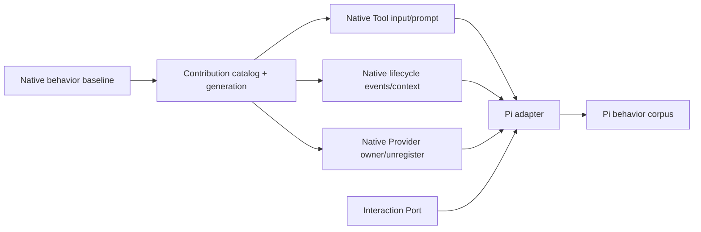

# Vetta 原生能力先行方案

## 决策

Pi 兼容层不得成为新能力的事实源。一个 Pi 能力如果对 Vetta 本身有产品价值，应先形成 Vetta 原生 Extension/Runtime 合同、通过 native tests，再由 `pi-compat` 做字段和事件投影。只有包名、TypeBox 1 authoring 和 Pi event shape 等第三方差异留在 Anti-Corruption Layer。

```text
先证明 Vetta 需要该能力
  -> 在正确 owner 中建立原生合同
  -> Vetta native Extension 使用并通过合同测试
  -> Pi adapter 映射到该合同
  -> Pi differential fixture 验证映射
```

如果某项能力没有合适的 Vetta native owner，就不应先在 Pi facade 中模拟它。这条规则可以避免形成“native Extension 一套语义、Pi Extension 另一套语义”。

## 当前基础与缺口

| 领域 | Vetta 已有基础 | 当前缺口 | 结论 |
| --- | --- | --- | --- |
| Extension registration | Tool、Event、Command、Flag、Shortcut、Provider registration | Factory 直接写多个 mutable `Map`；失败、动态变更和 owner 回收不统一 | 先建立 canonical contribution transaction |
| Dynamic Tool | `CodingAgentExtensionToolRuntime.refresh()`、Session overlay、model-call snapshot | `registerTool` 不主动发布 revision；定义与 owner 仍来自旧 Extension Map | 把现有 runtime 能力接到原生 catalog，不重写 Tool Runtime |
| Tool 输入 | Agent engine 已支持 `validateInput`；Vetta native Tool 使用 TypeBox 0.34 | `runtime-core` 的 `RuntimeToolDefinition` 没有透传自定义 validator；无标准 normalize-before-validate hook | 补通用 validator port，再增加 native input normalization |
| Tool Prompt | 已有 `SystemPromptDraft`、guidelines block、模型调用级 prompt composition | Extension Tool 只能贡献 description，不能贡献可审计的摘要/guideline | 增加 product-level Tool prompt contribution |
| Tool 调度 | 当前工具调用按顺序执行，steering/skip 语义稳定 | 没有 per-tool parallel scheduler | 保持 sequential；不为 Pi 提前扩张并发语义 |
| Event | 已有大部分 session/agent/turn/message/tool 事件与 transform dispatcher | 缺少稳定的 settled、session metadata change、thinking level change 事件 | 只新增对 Vetta 宿主也有价值的原生事件 |
| Context/Session | fresh `createContext()`、Session transition transaction、read-only session view | Extension API/runtime 对象可长期保存，缺少 generation stale check | generation token 下沉到原生 context/action facade |
| Provider | 配置型 Provider、model catalog、pending registration | 只能注册，不能按 Extension owner 撤销；OAuth/API registry ownership 不完整 | 先做配置字段交集的 owner/unregister，不做完整 Provider |
| 结构化交互 | Vetta 已有 `select/confirm/input/notify` contract | 原合同混有大量 terminal component 方法 | compat 只投影四个交互方法；不把 TUI 扩展当原生增强目标 |
| Compatibility | 已有 host capability/event assessment | 只有 supported/unsupported/inapplicable，且基于旧 registration summary | 扩展为 contribution/profile 报告，增加 adapted/excluded |

事实入口：当前 [Tool contract](../../../../packages/coding-agent/src/extensions/tool-contracts.ts)、[registration](../../../../packages/coding-agent/src/extensions/runtime/registration/extension-registration.ts)、[Extension Tool Runtime](../../../../packages/coding-agent/src/extensions/runtime/extension-tool-runtime.ts)、[Runtime Tool contract](../../../../packages/runtime-core/src/kernel/contracts.ts)、[Agent Tool validator](../../../../packages/agent/src/engine/tool-executor.ts)、[model runtime](../../../../packages/coding-agent/src/models/model-runtime.ts) 和 [prompt composer](../../../../packages/coding-agent/src/model-context/model-call-frame-composer.ts)。

## 原生能力分组

### N1：Contribution Catalog 与 Generation

所有 Vetta native registration 先进入 `ContributionDraft`，成功后原子发布不可变 `ContributionSet`。这一步不增加 Pi API，先替换当前多个 Map 的所有权模型。

原生合同需要提供：

- `extensionId + generation + contributionId + sourceInfo` identity；
- catalog revision、prepare/publish/replace/remove transaction；
- Tool、Event、Command、Flag、Provider 和 prompt contribution 的统一 owner；
- 现有 native shortcut/message renderer/tool renderer 作为 native-only host contribution 保持行为，不开放给 Pi adapter；
- factory 失败零发布；reload 失败保留上一 generation；
- activation 后的动态注册创建新的 owner-scoped transaction，不重新写初始 draft；
- stale context/action 拒绝；幂等 teardown；
- 冲突策略和结构化诊断。

现有 `CodingAgentExtensionToolRuntime` 继续作为 Tool runtime port。Catalog publish 后调用其 `refresh()`/session overlay；已经捕获的 model-call frame 保持稳定，下一次 model call 读取新 revision。

Native-first 是兼容演进，不是删除 Vetta 现有能力。现有 Extension 的 Tool Schema、renderer、shortcut、command、flag、事件顺序和冲突策略先建立基线；必要时由 native-only contribution 保留。Pi profile 的 excluded 规则只限制 Pi adapter，不能反向降低 Vetta native Extension。

### N2：Native Tool Contract

#### 输入 normalize 与 validator port

建议给产品 Extension Tool 增加命名为 Vetta 语义的可选 hook，而不是复制 Pi 字段名：

```ts
interface ToolDefinition<TParams extends TSchema, TDetails> {
  readonly normalizeInput?: (input: unknown) => unknown;
  // existing parameters + execute
}
```

同时在 product-neutral `RuntimeToolDefinition<TInput>` 增加：

```ts
readonly validateInput?: (input: unknown) => TInput;
```

Agent engine 已有同语义 validator；`runtime-core` 只负责透传，不能认识 Pi 或 TypeBox 1。Coding Agent adapter 负责固定顺序：

```text
raw arguments
  -> normalizeInput（若有）
  -> native TypeBox/JSON Schema validation
  -> execute
```

Pi `prepareArguments` 以后只映射到 native `normalizeInput`。Pi TypeBox 1 Schema 的 Ajv validator 也通过同一个 Runtime port 进入 Agent engine，不需要 Pi 专属执行器。

#### Prompt contribution

建议给 native Tool 增加产品级 prompt metadata：

```ts
interface ExtensionToolPromptContribution {
  readonly summary?: string;
  readonly guidelines?: readonly string[];
}
```

- 只在 Tool 对当前 model call active 时进入 `SystemPromptDraft`；
- 每项带 extension source、稳定 block id、priority 和 token diagnostics；
- summary 不替换 Provider Tool description；
- guidelines 进入既有 prompt document，不直接拼接字符串；
- 同名、空值、超预算和 reload 都有测试。

Pi `promptSnippet/promptGuidelines` 映射到这份 native metadata。

#### 暂不扩展的 Tool 能力

- `executionMode: "parallel"`：Vetta 当前 Tool batch 是 sequential，新增并发会改变结果顺序、steering、权限和取消语义。Pi 的 `undefined/sequential` 可兼容，`parallel` 报 unsupported。
- `constrainedSampling`：属于 Provider/model-call 能力协商，应先有通用 Provider contract；不放入 Extension Tool。
- renderer state：属于明确排除的 TUI 展示能力。

### N3：Native Lifecycle 与状态事件

新增事件使用 Vetta 领域名称，不复制 Pi 名称：

| Vetta native event | 建议语义 | Pi 投影 |
| --- | --- | --- |
| `agent_settled` | 一次 Agent run 已终止，Tool/commit 完成，且本轮没有待处理 continuation；每 run 最多一次 | `agent_settled` |
| `session_metadata_changed` | session name/label 等 canonical metadata 成功提交后发出，包含 revision/source | `session_info_changed` 的可表达子集 |
| `thinking_level_changed` | thinking level 实际改变后发出，包含 previous/current/source | `thinking_level_select` 的状态变化子集 |

这些事件先供 native Extension、SDK observation 或 telemetry 使用，再开放 Pi mapping。它们应是已发生事实的 observer；不得允许 Extension 反向修改已提交状态。

事件默认属于 `coding-agent` 产品投影：从 Runtime observation、Conversation commit 和 model controller 的真实结果构造。只有多个产品都需要且现有 Runtime observation 无法表达时，才向 `runtime-core` 增加产品无关 fact event；不能为了名字对齐 Pi 修改 Kernel pipeline。

不新增 `project_trust` Extension event。Trust 是模块执行前的 host policy，待加载的代码不能参与决定自身是否可信。Provider request/headers/response 也不因 Pi 兼容进入 native Event API。

Context 和 action facade 持有 generation token。Session replacement 创建 fresh context，旧 context 的副作用方法返回稳定 stale error；read-only snapshot 是否可继续读取由合同明确，不能原位改写成新 session。

### N4：Native Provider Contribution

先把现有配置型 Provider 改为 owner-aware catalog：

- `registerProvider(name, config)` 生成 generation-owned contribution；
- 增加 native `unregisterProvider(name)`，删除当前 owner 的配置并原子 rebuild model catalog；
- 覆盖 built-in provider 时保存来源和恢复策略；
- Tool/model call 只在下一次 selection/model-call boundary 看到新 revision；
- extension unload/reload 自动撤销；
- resolved credential 不进入诊断或可序列化 contribution snapshot；catalog 只保存 credential reference/resolver binding id，私有 binding 同样受 generation owner 管理。

第一阶段只允许 `baseUrl/apiKey/api/headers/authHeader` 和双方都能表达的 model metadata。虽然 `@vetta/ai` 已支持按 `sourceId` 注销 API provider，OAuth registry 尚无等价 owner lifecycle；因此 native Provider 第一阶段也不接受 OAuth、custom `streamSimple`、动态 refresh 或完整 Provider 对象。

### N5：Native 结构化交互边界

不扩展 TUI。相反，应从现有 `ExtensionUIContext` 中提取窄的宿主 Port：

```ts
interface ExtensionInteractionPort {
  notify(message: string, type?: "info" | "warning" | "error"): void;
  select(title: string, options: readonly string[], options?: InteractionOptions): Promise<string | undefined>;
  confirm(title: string, message: string, options?: InteractionOptions): Promise<boolean>;
  input(title: string, placeholder?: string, options?: InteractionOptions): Promise<string | undefined>;
}
```

Native Extension 可以继续保留旧 UI contract 以兼容现有作者，但新的 host-neutral contribution/context 只依赖该 Port。Desktop、CLI 和 RPC 各自适配；headless host 返回 `HOST_INTERACTION_REQUIRED`。Pi compat 只看到这个窄 facade。

## 不应为了 Pi 扩展的 Vetta 能力

| Pi 能力 | 不扩展原因 |
| --- | --- |
| Pi TUI/Theme/Component/renderers/shortcut | 具体终端产品合同，Vetta 已有独立宿主 UI 路线 |
| full native Provider | 会绕过 `@vetta/ai` 稳定协议和 owner 模型 |
| request/header/response hooks | 扩大 prompt、credential 和请求可见范围 |
| `project_trust` handler | 待执行代码不能参与自身 trust 决策 |
| parallel Tool execution | 需要 Agent engine 级调度设计，不能作为兼容细节添加 |
| concrete Pi SessionManager/ModelRegistry | 泄漏存储、认证和宿主实现 |
| Pi-only deep exports | 没有 Vetta native owner，也没有稳定行为合同 |

## 方案比较

| 方案 | 优点 | 缺点 | 结论 |
| --- | --- | --- | --- |
| 兼容层先补能力 | Pi fixture 较快跑通 | 双目录、双事件语义、native Extension 得不到增强 | 不采用 |
| 一次重写 Extension API v2 | 合同最整齐 | 迁移范围大，容易同时改变过多行为 | 不作为前置 |
| Native catalog/port 渐进增强，再接 Pi | 复用现有 Runtime，能力属于正确 owner，兼容层较薄 | 前期需要 native regression tests | 推荐 |
| 只手工移植 Extension | 无协议适配成本 | 不能消费生态，也不能解决原生生命周期问题 | 不满足目标 |

## 实现依赖顺序



Pi loader、TypeBox 1 facade 和 event projector 可以在 native contract 稳定后并行开发，但不能先发布一个绕过 catalog/port 的执行路径。

## Native-first 完成标准

- 每个新能力至少有一个 Vetta native Extension fixture，不依赖 Pi package；
- native Tool/事件/Provider 测试覆盖成功、失败、取消、reload、stale generation 和下一 model call 可见性；
- Pi adapter 测试只验证 schema/event/field projection，不重复测试目录和生命周期实现；
- 删除 `pi-compat` 后，新增的 Vetta 原生能力和测试仍全部成立；
- 没有 `runtime-* -> coding-agent` 反向依赖，也没有 Pi 类型进入 Runtime contract；
- parallel Tool、TUI、请求 hooks 等排除项不能因 fixture 压力被静默塞入 native API。
