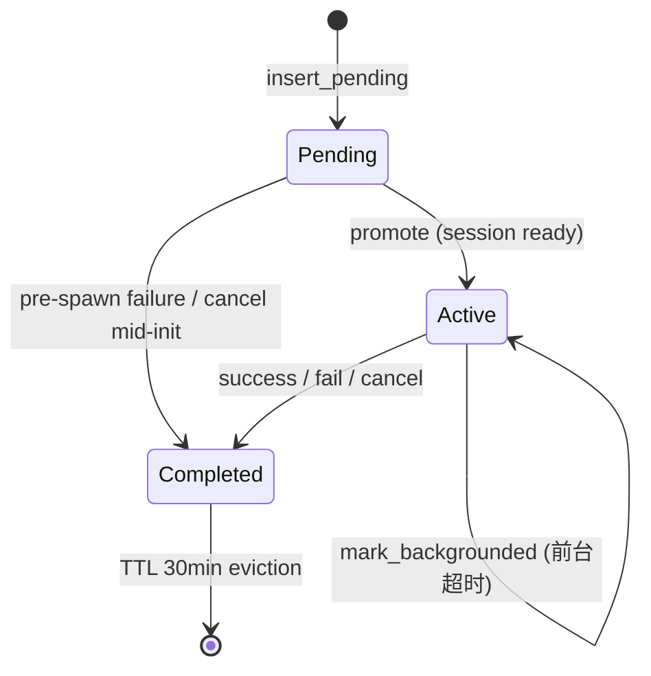

# 02 — 任务派发与生命周期

## 1. 主 Agent 如何「决定」派发

运行时**不**做任务调度 DAG；是否 spawn、选哪种 `subagent_type`、写什么 `prompt`，由**主会话模型**根据：

1. 主 Agent 的 system prompt / orchestrator 指令  
2. `spawn_subagent` 工具描述（`build_task_description` 动态列出可用 agent 类型）  
3. 当前对话与用户目标  

自行决策。运行时只提供：校验、隔离、并发执行、结果回传、取消与计费钩子。

Orchestrator 风格主 Agent 在 `xai-grok-agent/src/config.rs` 中明确要求：实现/深探/测试应委派 subagent，主 Agent 专注协调与审查。

## 2. 工具参数（模型面）

模型调用名：`spawn_subagent`（内部 `TaskTool` / id `task`）。

| 参数（模型名 / 内部） | 默认 | 说明 |
|---|---|---|
| `prompt` | 必填 | 子 Agent 完整任务说明 |
| `description` | 必填 | 3–5 词短标签（TUI / 日志） |
| `subagent_type` | `general-purpose` | 内置或用户定义 agent |
| `background` / `run_in_background` | **true** | 立即返回 id；用 output 工具取结果 |
| `capability_mode` | 角色决定 | `read-only` / `read-write` / `execute` / `all` |
| `isolation` | `none` | `worktree` 时建隔离 git worktree |
| `resume_from` | 无 | 续跑已完成 subagent 的 transcript |
| `cwd` | 无 | 显式工作目录；与 `isolation=worktree` 互斥 |
| `model` | 继承父 | 可选钉模型；resume 时忽略 |

内部还可由 harness 设置（**不在**模型 schema 中）：

- `surface_completion`：goal 内部 planner 等可 false，避免模型看到 harness 完成提醒  
- `fork_context`：把父对话规范化后作为子前缀  
- `runtime_overrides.persona` / `harness_agent_type`：goal/role 路径使用  

源：`crates/common/xai-tool-types/src/task.rs` · `TaskToolInput`。

## 3. TaskTool 入口校验链

实现：`crates/codegen/xai-grok-tools/src/implementations/grok_build/task/mod.rs`

```
run(input)
  │
  ├─ 读取 depth / backend / model_validator / session_id / prompt_id
  │
  ├─ depth >= MAX_SUBAGENT_DEPTH(1)  → invalid_arguments（禁止嵌套）
  │
  ├─ sanitize resume_from / model / cwd
  │     · resume 时强制忽略 model
  │     · cwd + worktree 且 cwd 真实存在 → 互斥错误
  │     · cwd + worktree 且 cwd 不存在 → 清掉 cwd，让 worktree 胜出
  │
  ├─ backend.validate_type(subagent_type, parent_session_id)
  │     Ok | Unknown | Disabled | NotAllowed | ValidationUnavailable
  │
  ├─ 可选 model slug 经 TaskModelValidator 校验
  │
  ├─ 构造 SubagentRequest { id: UUID v7, surface_completion: true, ... }
  │
  ├─ background=true  → tokio::spawn(backend.spawn); 返回 started 文案
  │
  └─ background=false → await spawn
        ├─ result.backgrounded（前台预算超时自动转后台）→ 返回仍在运行提示
        ├─ success → ToolOutput::SubagentCompleted(...)
        └─ fail → ToolError
```

`TaskTool` 还声明依赖：必须存在 `BackgroundTaskAction` 与 `KillTaskAction` 工具，否则无法注册——保证主 Agent 能轮询与杀掉自己 spawn 的后台子 Agent。

## 4. 通道派发

`ChannelBackend::spawn`（`task/backend.rs`）：

1. 新建 oneshot `result_tx/rx`
2. 发送 `SubagentEvent::Spawn(Box<SubagentRequest { result_tx, .. }>)`
3. **await** `result_rx` —— 即便「后台模式」，backend 层的 spawn 仍会等到子会话**结束**才完成 future；差别在于 TaskTool 是否 `tokio::spawn` 掉这个 future 并立即给模型返回。

`MvpAgent::start_subagent_coordinator`（`mvp_agent/subagent_coordinator.rs`）：

```
loop recv SubagentEvent:
  Spawn  → spawn_local {
             build_subagent_spawn_context(parent_sid)
             snapshot parent MCP / hooks / tools
             handle_subagent_request(...)
           }
  Query / Cancel / ListActive / Completions / Outstanding / ...
```

每个 Spawn 在 **独立 `spawn_local` 任务**上跑，因此多个 subagent **真并行**（同一 LocalSet / 单线程异步运行时，但可并发 await I/O 与模型流）。

## 5. `handle_subagent_request` 阶段划分

实现：`xai-grok-shell/src/agent/subagent/handle_request.rs`

### 阶段 A — 解析与门禁

1. `resolve_agent_definition(subagent_type)`：builtin / 用户 agents / 插件  
2. `gate_subagent_type`：`[subagents.toggle]`、`allowed_subagent_types`  
3. `insert_pending`：进入 coordinator.pending（可取消初始化）  
4. `resolve_subagent_toolset`：按类型与 harness 重选工具  
5. `resolve_effective_overrides`（`xai-grok-subagent-resolution`）：  
   **explicit spawn override > role > persona > parent**  
6. 解析 isolation：role/persona 默认或 definition 的 worktree  
7. persona 失败 → fail-closed 中止；role prompt_file 失败 → 降级继续  

### 阶段 B — resume / worktree / cwd

| 情况 | 行为 |
|---|---|
| `resume_from` 且源仍 active | 失败：「still running」 |
| `resume_from` 找不到 | 失败 |
| resume 成功 | 校验 type/persona；继承源 transcript/tool state/model；可 rehydrate worktree |
| `isolation=worktree` 且非 resume | `xai_fast_worktree` 创建 `subagent-{id}` 目录 |
| worktree 失败 | **降级共享 workspace**（warn，不硬失败） |
| 显式 `cwd` | 校验存在且为目录；与 worktree 互斥规则见上 |

### 阶段 C — 能力过滤与深度截断

1. `capability_mode.filter_tool_config`：按 ToolKind 白名单过滤  
2. 若 `parent_depth + 1 >= MAX_SUBAGENT_DEPTH`：从 tool_config **删除 Task 工具**，并 prune 孤儿的 get_task_output/kill_task（若无任何可起后台任务的工具）  

注意：即使 capability 的 `allowed_tool_kinds` 列表里包含 `Task`（见 types 中 ReadOnly 等模式的白名单），**深度截断会在其后再次剥掉**，产品语义仍是「子 Agent 不能再 spawn」。

### 阶段 D — 模型与凭证

`resolve_effective_model_config` 优先级（见 `subagent/mod.rs` 注释）：

1. runtime override model（goal/persona 路径）  
2. `[subagents.models].{type}`  
3. `AgentDefinition.model`  
4. 继承父会话 live `ChatStateHandle` 采样配置  

`fork_context=true` 会强制钉父会话 model。未知 model slug 回退父模型。

### 阶段 E — 创建子会话并运行

1. 准备 `forked_conversation`（New / Forked / Resumed）  
2. persona 指令以 `<system-reminder>` 插入对话  
3. 写 `SubagentMeta` 落盘；发 `SessionUpdate::SubagentSpawned`  
4. 建 sampling client + persistence  
5. 组装 `ToolContext`：共享 fs/terminal/hunk tracker，设置 `subagent_depth`  
6. 注册 child 到 coordinator（promote pending → active）  
7. 向 child 发送初始 `Prompt`（任务内容）  
8. await 子会话运行至终态（成功 / 失败 / 取消）  

前台 spawn 会持有 `BlockingWaitGuard`（`parent_blocking_wait_depth`），使父会话在等待期间把用户新输入路由到「立即发送」语义。

### 阶段 F — 收尾

1. **Usage fold**：把子 token 用量折算进父 prompt/session 账单；失败则 `MarkSubagentUsageNotApplied`  
2. **Reparent**：子会话退出后，存活的 bash/monitor 任务通知改挂到父 session  
3. **Shutdown** 子 SessionActor  
4. **Worktree**：可选 snapshot 到 `refs/grok/subagents/{id}` 并删除目录  
5. 计算 `will_wake` → `SubagentFinished` 通知  
6. `move_to_completed`  
7. 条件满足则 `inject_subagent_completed_prompt`（auto-wake）  
8. `result_tx.send(SubagentResult)`  

## 6. 状态机（coordinator 视角）



### 前台超时自动转后台

阻塞 await 超过预算时，coordinator 可将子任务 `mark_backgrounded`，`SubagentResult.backgrounded = true`，TaskTool 返回「仍在运行 + id」文案，后续走 auto-wake / 轮询，避免主对话卡死。

## 7. 取消路径

| 触发 | 行为 |
|---|---|
| 模型 `kill_command_or_subagent` | `SubagentEvent::Cancel(SubagentId)` → `mark_explicitly_killed` + cancel_token |
| 用户取消当前 turn | `Cancel(ParentPromptId)`：只杀**该 prompt 产生的前台**子 Agent；**后台子 Agent 存活** |
| pending 阶段 cancel | 用 pending 上的 `cancel_token` 中止初始化 |
| 父会话关闭 | 级联清理 / ParentGone 相关逻辑（与 auto-wake 抑制配合） |

`run_in_background=true` 的子 Agent **故意**不随父 turn cancel 一起死掉，以便后续轮询。

## 8. 完成结果形态

### 8.1 结构化 `SubagentResult`

字段包括：`success`、`output: Arc<str>`、`error`、`cancelled`、`tool_calls`、`turns`、`duration_ms`、`tokens_used`、`worktree_path`、`backgrounded`。

### 8.2 模型可见完成文本

`format_subagent_completed` 拼出：

```
{output}

<subagent_meta>id=..., type=..., tool_calls=..., turns=..., duration_ms=...</subagent_meta>

<subagent_result>
subagent_id: ...
subagent_type: ...
To continue this subagent's conversation, use resume_from="...".
</subagent_result>
```

后台启动时则用 `format_subagent_started_background`，提示用 `get_command_or_subagent_output` + `task_ids` + `timeout_ms`。

## 9. 持久化与遥测

| 产物 | 用途 |
|---|---|
| 子 session 目录 + transcript | 调试、resume 数据源 |
| `SubagentMeta` JSON | 状态、cwd、worktree、model、source |
| ACP `SubagentSpawned` / `SubagentFinished` | TUI 与外部客户端 |
| GCS upload（可选） | 生产 trace |
| telemetry `SubagentCompleted` | 成功/失败/取消 + 时长 + token |

## 10. 生命周期验证清单（读代码时）

1. TaskTool 深度门禁 vs handle_request 剥离 Task 工具——双重保险  
2. background 语义：模型立即得到 id，coordinator 仍跑完整生命周期  
3. 前台 blocking guard 与用户输入队列交互  
4. resume 不接受 running 源；model 在 resume 时 soft-ignore  
5. worktree 失败降级而非硬失败  
6. completed TTL 30 分钟后无法 resume  

下一篇：[03-communication.md](03-communication.md) 专注回传与协作通道细节。
