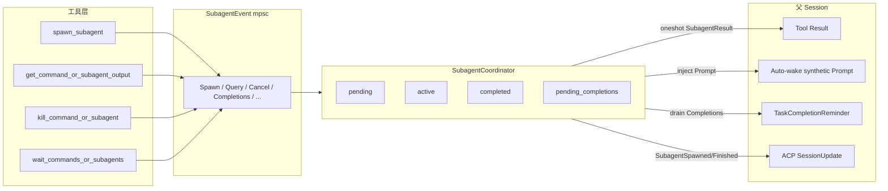

# 03 — 主/子 Agent 通信与协作通道

Grok Build 的父子通信**不是**通用 mailbox 或任意 Agent 间点对点消息总线，而是围绕 **spawn → 执行 → 结果交付** 设计的几条专用通道。主 Agent 是协调者，子 Agent 是一次性（或可 resume 的）工人。

## 1. 通道总览

## 2. 控制面：`SubagentEvent`

定义：`crates/codegen/xai-grok-tools/src/implementations/grok_build/task/types.rs`

单一无界 mpsc 承载所有协调器消息（部分枚举变体）：

| 事件 | 方向 | 用途 |
|---|---|---|
| `Spawn` | Tool → Coord | 启动子 Agent，oneshot 回 `SubagentResult` |
| `Query` | Tool → Coord | 查状态；`block=true` 可等到终态或超时 |
| `Cancel` | Tool / Session → Coord | 按 subagent_id 或 parent_prompt_id 取消 |
| `ListActive` | 查询 | 某父会话下运行中的摘要 |
| `Completions` | Reminder → Coord | drain `pending_completions` |
| `Outstanding` | 计费/freeze | 某 prompt 仍活着的前台子 Agent 列表 |
| `ValidateType` / `DescribeType` | Tool → Coord | spawn 前同步校验/描述工具集 |
| `MarkUsageNotApplied` / `ClearUsageNotApplied` | Session ↔ Coord | token 折算 incomplete 标记 |

**没有**「子 Agent 向任意其他子 Agent 发消息」的一等通道。子→父只通过结果、完成缓冲与合成 prompt。

## 3. 结果交付的三条路径

### 3.1 路径 A：前台 tool result（同步语义）

`background=false`（参数名模型侧常为 `background`，默认实际是 **true**，故前台需显式关后台）：

1. `TaskTool` await `backend.spawn`  
2. 子跑完后 `result_tx` 送达  
3. 包装为 `ToolOutput::SubagentCompleted`  
4. 主模型在同一 tool_call 结果里看到完整输出  

特点：主 turn 被阻塞直到子完成或 **前台预算耗尽转后台**。

### 3.2 路径 B：后台 + Auto-wake（异步主动推送）

`run_in_background=true` 时，`TaskTool` 先返回 started 文案。子完成后：

`should_auto_wake_subagent`（`subagent/mod.rs`）全部为真才注入：

| 条件 | 含义 |
|---|---|
| `run_in_background` | 仅后台 |
| `!cancelled` | 取消不唤醒（避免 Ctrl+C 后立刻再开一轮） |
| `auto_wake_enabled` | 配置/env 开关 |
| `!block_waited` | 未被 block query 消费过 |
| `!explicitly_killed` | 非模型主动 kill |
| `!goal_loop_active` | goal 循环中不打断 |
| `parent_channel_open` | 父 cmd 通道仍在 |

满足时 `inject_subagent_completed_prompt`：

- 格式化完成摘要（同 reminder 文案）  
- `SessionCommand::Prompt { verbatim: true, send_now: false, ... }` 注入父会话  
- 记入 `AutoWakeDeliveredIds`，避免 reminder 再重复推同一 id  
- 可选 synthetic turn trace  

效果：父 Agent **空闲时可被自动叫醒**，无需用户再敲回车。

### 3.3 路径 C：Between-turn / 工具结果内 Reminder（被动拉）

`TaskCompletionReminder`（`reminders/task_completion.rs`）：

1. 在后续某次工具结果路径上 `collect_reminders`  
2. 发 `SubagentEvent::Completions` 取缓冲完成项  
3. 过滤已 `reported` / auto-wake 已交付 / goal_loop 激活  
4. 拼成 `<system-reminder>` 附在 tool result 上  

与 auto-wake **互补**：auto-wake 失败或关闭时，主 Agent 下次 tool 调用仍可能看到完成提示。

## 4. 主动查询：`get_command_or_subagent_output`

内部 `TaskOutputTool` / `get_task_output`。

- 入参：`task_ids: Vec<String>`（最多 `MAX_MULTI_WAIT_IDS = 20`）、`timeout_ms`  
- `timeout_ms` 省略或 0：**非阻塞** snapshot  
- 正数：block 等到终态或超时  

Coordinator 侧 Query 处理（`mvp_agent/subagent_coordinator.rs`）：

1. `lookup` → `Initializing` / `Running` / 终态  
2. `Running` 时通过 `SessionSignalsHandle.snapshot()` 填 turn/tool/token 进度  
3. `block=true` 注册 `block_wait_slots`，200ms 轮询，超时或终态后回传  

若 block wait **成功消费**结果，会抑制 auto-wake（避免重复交付）。

## 5. 等待与终止

| 工具 | 模型名 | 作用 |
|---|---|---|
| `WaitTasksTool` | `wait_commands_or_subagents` | 多 id 等待（与 output 工具协作） |
| `KillTaskTool` | `kill_command_or_subagent` | bash Job/SIG；subagent 走 Cancel+Shutdown |

Kill 对 subagent：`mark_explicitly_killed` + cancel token；完成后 **不 auto-wake**。

## 6. 父会话命令与 UI 通知

`handle_subagent_request` 通过：

- `gateway` + `SessionUpdate::SubagentSpawned` / `SubagentFinished`  
- 可选 `parent_cmd_tx` 让父 SessionActor **持久化** spawn/finish 边  

TUI 消费这些事件渲染：

- scrollback 生命周期块（running / completed / failed）  
- Tasks pane（`Ctrl+B`）  
- 全屏子 transcript 观察视图  

用户一般**不能**像主会话一样向子 Agent 自由打字交互；子 Agent 面向自治执行。

## 7. 共享副作用：隐式「通信」

除消息外，父子通过**共享工作区状态**协作：

| 共享资源 | 协作意义 |
|---|---|
| `AsyncFileSystem` | 子写的文件主立刻可见（非 worktree） |
| `HunkTrackerHandle` | 编辑归因到同一 tracker，父可看 diff 汇总 |
| `TerminalBackend` | 后台 bash/monitor 在子退出后 reparent 到父 |
| `session_env` | 同一 .envrc / 颜色等环境 |
| `parent_mcp_pool` | 复用 MCP 连接，不重复握手 |
| `ClientHooks` | 同一 PreToolUse / 观察钩子 |
| Memory（若开） | 可共享跨会话记忆配置 |

`isolation=worktree` 时文件系统**逻辑隔离**，完成结果里带 `worktree_path`，需 merge/apply 才回到主树。

## 8. Goal 模式下的通信约束

Goal 循环激活时（`goal_loop_active` Arc）：

1. **抑制 auto-wake**，避免异步完成把主 goal turn 带偏  
2. **Reminder 不 surface** subagent 完成（仍标记 reported，防止之后洪水）  
3. Goal harness 内部 spawn 的子 Agent 可 `surface_completion=false`，不进模型可见完成队列  

Goal 自己的 planner/classifier/summarizer 是** harness 级** subagent 用法，与模型主动 `spawn_subagent` 共用 coordinator，但产品语义上对主模型隐藏。

## 9. Prompt 级指令如何「沟通」

子 Agent 启动时拿到的有效上下文：

1. **System prompt**：`subagent_prompt.md` 骨架 + agent 类型 body（explore/plan/…）  
2. **Role / persona**：`<role-instructions>` / `<persona>` 或 system-reminder  
3. **任务 prompt**：主 Agent 写的 `prompt` 字符串——这是最重要的「工单」  
4. **可选 fork 父对话**：`fork_context` 时带规范化父历史  
5. **resume**：整段历史 transcript + 新 user message  
6. **AGENTS.md 等**：子会话按 cwd 重新发现；主工具描述提醒「需关键约定写进 prompt」  

没有运行时强制的 schema 校验保证 prompt 质量；persona 的 `inputs`/`outputs` 合同主要给**配置/产品层**与主模型读 description 用，不是硬网关。

## 10. 与 Codex 通信模型对比（简）

| | Grok Build | Codex（文档集 `docs/agent`） |
|---|---|---|
| 消息模型 | 父子专用 + 完成推送 | Mailbox + InterAgentCommunication |
| 跨兄弟通信 | 无一等支持 | 绝对路径可跨分支 |
| 完成通知 | auto-wake + reminder + tool result | 完成通知进 mailbox / trigger-turn |
| 深度 | 1 | 多层 |

Grok 选择更简单的**星型**拓扑：所有协作最终汇回主 Agent。

## 11. 高效协作实践（运行时已支持的）

1. **并行 spawn 多个 background explore**，主 Agent 继续工作，完成后 auto-wake 汇总  
2. **`timeout_ms` 批量 wait** 在汇合点同步  
3. **resume_from** 做多阶段流水线（研究 → 实现）而不重复载入上下文  
4. **worktree 隔离实现** + 主会话审查后 merge  
5. **capability_mode** 限制破坏性工具，减少子 Agent 越权  

运行时保证的是交付与隔离；「是否正确分解任务」仍靠模型 + 工具描述 + 项目 AGENTS.md。
