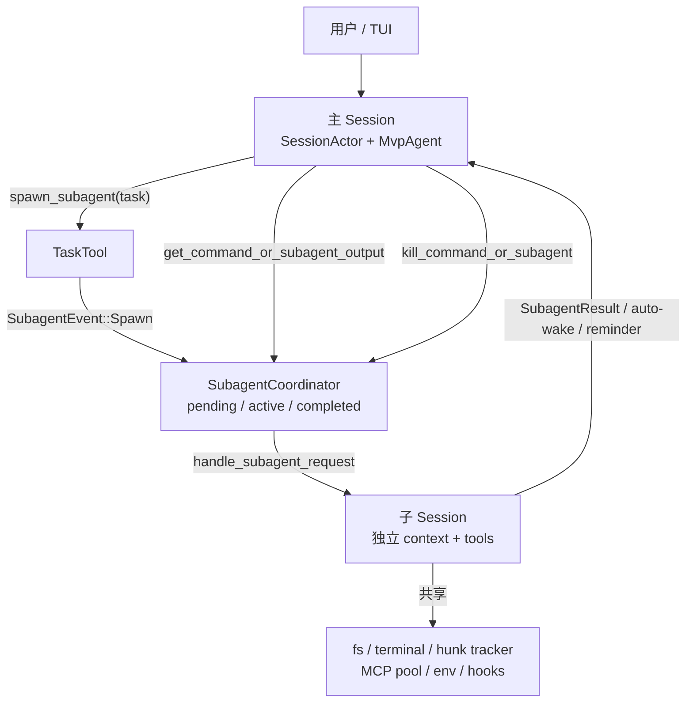

# Grok Build Subagent 实现分析

本文档集分析 **Grok Build CLI**（源码仓库 `grok-build`）中的子 Agent（subagent）体系：主 Agent 如何派发任务、子 Agent 如何独立运行、多子 Agent 如何管理，以及围绕目标完成任务的协作机制。

## 分析基线

| 项 | 值 |
|---|---|
| Git commit | `c68e39f60462f28d9be5e683d9cbe2c57b1a5027` |
| commit 时间 | 2026-07-16 06:46:02 +0100 |
| commit 标题 | `Publish harness and TUI open-source` |
| 分析日期 | 2026-07-16 |
| 官方用户文档 | `crates/codegen/xai-grok-pager/docs/user-guide/16-subagents.md` |

下文路径均相对于 **grok-build 仓库根目录**。

## 核心结论（一句话）

Grok Build 的 subagent **不是**主会话里换一个 system prompt 的“角色扮演”，而是由主会话通过 `spawn_subagent`（内部工具 id：`task`）向 **SubagentCoordinator** 发出请求后，**新开一个完整的子 Session**（独立上下文窗口、独立采样客户端、独立持久化目录），在共享文件系统/终端/hunk tracker 等父资源的前提下自治执行；完成后通过 **oneshot 结果**、**自动唤醒合成 prompt**、**between-turn system-reminder** 三条通道把摘要交回主 Agent。

## 与 Codex 文档集的对照

| | Codex（`docs/agent/`） | Grok Build（本文 `docs/agent/grok/`） |
|---|---|---|
| 控制面 | 共享 `AgentControl` + 树级 `AgentRegistry` | `SubagentCoordinator` 挂在 `MvpAgent` 上 |
| 通信 | Mailbox + 绝对 AgentPath 可跨分支互发 | 以 **父子单向** 为主：spawn/query/cancel 通道 + 完成通知 |
| 深度 | 可多层嵌套（有配额） | **硬上限 depth=1**，子 Agent **不能再 spawn 子 Agent** |
| 命名 | 昵称 + 路径 | UUID v7 `subagent_id`（= child session id） |
| 角色 | Role / agent definition | `subagent_type`（Agent）+ Persona 叠加 + Capability mode |

## 文档导航

1. [01-architecture.md](01-architecture.md) — 分层架构、核心 crate、对象职责与数据流
2. [02-dispatch-and-lifecycle.md](02-dispatch-and-lifecycle.md) — 派发参数、校验、spawn 全流程、完成与清理
3. [03-communication.md](03-communication.md) — 通道协议、结果回传、auto-wake、reminder、query/wait
4. [04-capabilities-and-differences.md](04-capabilities-and-differences.md) — 子 Agent 能做什么，与主 Agent 的差异
5. [05-multi-agent-management.md](05-multi-agent-management.md) — 多子 Agent 并发、生命周期表、取消、TTL、TUI
6. [06-goal-personas-isolation.md](06-goal-personas-isolation.md) — Goal 模式、Persona/Role、worktree 隔离、resume
7. [07-design-assessment.md](07-design-assessment.md) — 高效协作机制评估、设计取舍与使用建议

## 关键源码索引

| 主题 | 相对路径 | 职责 |
|---|---|---|
| 工具输入/输出类型 | `crates/common/xai-tool-types/src/task.rs` | `TaskToolInput`、capability/isolation 枚举、builtin 描述、completion 文案 |
| Task 工具实现 | `crates/codegen/xai-grok-tools/src/implementations/grok_build/task/mod.rs` | 深度检查、校验、前/后台 spawn |
| Backend 抽象 | `.../task/backend.rs` | `SubagentBackend` / `ChannelBackend` |
| 通道协议 | `.../task/types.rs` | `SubagentEvent`、`SubagentRequest`、`SubagentResult`、snapshot |
| 完成 reminder | `.../reminders/task_completion.rs` | bash + subagent 完成 `<system-reminder>` |
| Coordinator 核心 | `crates/codegen/xai-grok-shell/src/agent/subagent/mod.rs` | `SubagentCoordinator`、`SubagentSpawnContext`、auto-wake |
| 生命周期 | `.../subagent/coordinator_lifecycle.rs` | pending→active→completed、usage fold |
| 查询/TTL | `.../subagent/coordinator_query.rs` | lookup、block wait、30min 驱逐 |
| Spawn 编排 | `.../subagent/handle_request.rs` | 完整 spawn/run/finish 流水线 |
| Drain 任务 | `.../mvp_agent/subagent_coordinator.rs` | 消费 `SubagentEvent` 并 `spawn_local` 子任务 |
| 纯解析逻辑 | `crates/codegen/xai-grok-subagent-resolution/` | role/persona 覆盖优先级、resume 身份校验 |
| Agent 定义与工具改名 | `crates/codegen/xai-grok-agent/src/config.rs` | `task`→`spawn_subagent` 等 |
| Task 描述构建 | `.../builder.rs` | `build_task_description` |
| 子 Agent system prompt 模板 | `.../templates/subagent_prompt.md` | 子会话系统提示骨架 |
| Builtin prompt 正文 | `crates/common/xai-tool-types/src/task.rs`（`GENERAL_PURPOSE_PROMPT` 等） | explore/plan/general-purpose 指令 |
| TUI 展示 | `crates/codegen/xai-grok-pager/src/app/subagent.rs` 等 | scrollback 块、tasks pane |
| 用户指南 | `crates/codegen/xai-grok-pager/docs/user-guide/16-subagents.md` | 产品层说明 |

## 模型可见工具名 vs 内部 id

Grok Build 对模型暴露的名字与内部 `ToolId` 不同（见 `xai-grok-agent/src/config.rs`）：

| 内部 id / 类型 | 模型可见名 |
|---|---|
| `task` (`TaskTool`) | `spawn_subagent` |
| `run_in_background` 参数 | `background` |
| `get_task_output` | `get_command_or_subagent_output` |
| `wait_tasks` | `wait_commands_or_subagents` |
| `kill_task` | `kill_command_or_subagent` |

分析文档在讲**实现**时多用内部名；讲**模型交互**时用模型可见名。

## 推荐阅读顺序

若目标是快速建立心智模型：`README` → `01` → `04` → `02` → `03`。  
若目标是对接实现或移植：`01` → `02` → `05` → `06` → `07`。
