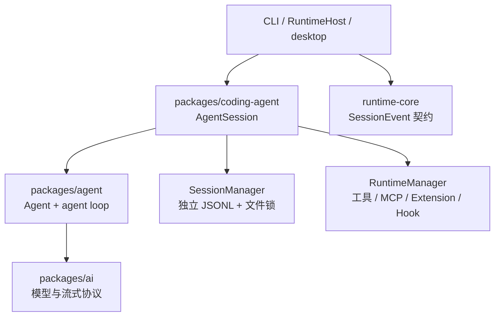

# 1. Vetta 现状与设计决策

## 1.1 当前分层

Vetta 已有的相关边界是：

职责已经很清楚：

- `packages/agent` 负责单个 Agent 的状态、模型循环、工具调用、steering/follow-up 队列和事件；
- `packages/coding-agent` 负责一个产品会话的持久化、工具运行时、MCP、扩展、压缩、后台任务和多宿主复用；
- `packages/runtime-core` 是 desktop/CLI 宿主的薄适配与事件协议层；
- desktop 通过 `RuntimeHost` 创建会话，并在这里注入 sandbox 工具、用户提问能力和插件桥。

subagent 是“多个产品会话如何协作”的问题，因此控制平面应位于 `coding-agent`，而不是让 `agent-core` 知道任务树、角色、持久化目录或 desktop sandbox。

## 1.2 已有能力

### 独立会话工厂

`packages/coding-agent/src/core/sdk.ts` 的 `createAgentSession()` 已能创建完整 `AgentSession`，包括：

- 独立 `Agent` 与模型上下文；
- 独立 `SessionManager`；
- 独立 runtime、扩展、MCP、压缩和后台任务；
- 继承/指定模型、thinking level、cwd、env、scenario；
- 订阅完整 `AgentSessionEvent`。

这意味着 Vetta 不需要再造一套简化的 child loop。subagent 应复用同构会话。

### 运行中消息与自动续跑

`Agent` 已有：

- `steer()`：当前工具完成后注入，并跳过剩余工具；
- `followUp()`：自然停止点继续下一轮；
- `waitForIdle()` 与 `abort()`；
- `continuationProvider`。

`AgentSession.sendCustomMessage()` 又提供：

- streaming 时作为 steer/follow-up/next-turn 投递；
- idle 时仅追加上下文，或 `triggerTurn` 启动新 turn。

后台 bash 已使用这一能力：任务完成后注入 `<task-notification>`，运行中排 follow-up，空闲时自动唤醒。subagent 完成通知可以复用同一语义，但需要批量合并和去重。

### 独立持久化与锁

`SessionManager` 已有：

- 每个 JSONL 一个 session ID；
- `parentSession` header 字段；
- `custom` entry（不进入模型上下文）；
- `custom_message` entry（进入上下文）；
- 每文件单写者锁；
- `create/open/inMemory/forkFrom`。

子 Agent 只要使用不同 JSONL，就不会和父会话争用同一文件锁。

### 宿主事件链

`AgentSessionEvent` 会被 `runtime-core/src/runtime-host/session-events.ts` 映射成 `SessionEvent`，desktop 已消费这一协议。新增一个全量 `subagents_update` 事件即可沿现有链路传播，无需让 renderer 直接持有 child `AgentSession`。

### Hook 协议已经预留

`ecosystem-adapter` 已定义 `SubagentStart`、`SubagentStop`、`SubagentHookContext`，工具 mapper 也已把 `spawn_agent` 识别为 agent 类工具。当前缺的是 coding-agent 的真实生命周期触发点，而不是协议类型。

## 1.3 当前缺口

Vetta 目前没有：

1. child registry/coordinator；
2. subagent 状态机、并发 reservation 和等待原语；
3. 内建 spawn/list/wait/message/interrupt 工具；
4. 子会话专用目录与恢复索引；
5. child 完成结果的合并、去重与自动唤醒；
6. child 的宿主权限继承边界；
7. subagent 事件到 runtime-core/desktop 的协议；
8. 对现有 SubagentStart/SubagentStop Hook 的真实调用；
9. child token/cost 的独立统计。

另外，`packages/coding-agent/README.md` 仍明确写着 “No sub-agents”，而 `examples/extensions/README.md` 又列出仓库中不存在的 `subagent/` 示例。功能落地时必须同步清理这组文档矛盾。

## 1.4 三种落点比较

| 方案 | 优点 | 主要问题 | 判断 |
|---|---|---|---|
| 只做 extension | 改动少，可快速验证 | 无统一生命周期、宿主事件、恢复和权限继承；desktop 难以可靠展示 | 只适合原型，不作为产品实现 |
| 下沉 `packages/agent` | 所有消费者都能用 | 把会话持久化、角色、MCP、sandbox 和产品策略污染通用 loop | 不采用 |
| 内建于 `packages/coding-agent` | 复用完整会话，与 CLI/RPC/desktop 共用 | 需要增加 coordinator 与 child factory 边界 | 推荐 |

## 1.5 参考实现的取舍

| 维度 | Codex | Grok Build | Vetta 首版 |
|---|---|---|---|
| 拓扑 | 可递归任务树 | 单层星型 | 单层星型 |
| 执行单元 | 独立 thread/session | 独立 child session | 独立 `AgentSession` |
| 标识 | canonical path + ThreadId | UUID | `/root/<task_name>` + session ID |
| 通信 | mailbox，支持跨分支 | 父子结果通道 | 父对 child 控制 + child 结果回父 |
| 并发 | 原子 reservation | 无明确硬上限 | 硬上限，默认 3 个 active child |
| 上下文 | none/all/N fork | fresh/fork/resume | 首版 fresh；follow-up 保留 child 上下文 |
| 能力 | role/config | type + capability | `explorer` / `worker` 固定策略 |
| worktree | 默认共享 | 可选 worktree | 首版共享，后续可选 |
| 完成交付 | mailbox + wait | tool result + wake + reminder | wait 或合并 wake，单次消费 |

## 1.6 关键决策

### 决策 A：单层星型

首版 child 不注册 subagent 工具，并在 coordinator 再做 `depth === 0` 校验，形成双保险。

原因：主 Agent 本来就负责用户目标、拆分和验收；Vetta 当前没有必须跨兄弟通信或递归分解的产品需求。单层能覆盖并行探索、互斥写集实现和独立 review，同时显著降低恢复与关闭复杂度。

### 决策 B：宿主注入 `SubagentSessionFactory`

这是安全边界，不只是可扩展点。

desktop 的 sandbox/full-access 工具由 `RuntimeHost.resolveExecutionModeTools()` 创建，并包含宿主授权、session ID 和插件桥上下文。若 coordinator 直接调用普通 `createAgentSession()`，worker 可能得到未经 sandbox 包装的 bash/edit 工具；若直接复用父 `agent.state.tools`，Hook、后台任务、插件和 session ID 又会错误绑定到父会话。

因此 coordinator 只描述“要创建什么 child”，具体“如何创建且不提升权限”由工厂负责。

### 决策 C：首版 fresh context

`SessionManager.forkFrom()` 会复制完整 session entry，不等同于 Codex 经过过滤的语义 fork。直接使用会携带父工具轨迹、custom message、compaction 和可能不适合 child 的上下文。

首版仅给 child：

- 自己的 system prompt；
- cwd 下重新发现的项目指令/skills；
- 父 Agent 写明的任务合同；
- 父当前模型和 thinking level。

后续如果增加 context fork，应先实现明确的过滤器和 token 预算，而不是直接复制 JSONL。

### 决策 D：共享 cwd，不自动 worktree

Vetta 要同时支持 Windows、普通目录和非 Git 工作区。worktree 应作为独立后续能力，不阻塞核心生命周期。

首版运行时不声称能解决写冲突。`worker` 的工具描述必须要求：只有互斥写集才并行派发；主 Agent 必须检查最终 diff；不得回滚其他并行工作。

### 决策 E：完成状态不等于语义成功

`completed` 只表示 child 正常结束一次 Agent run。它不证明代码正确、测试通过或用户目标完成。最终验收仍由 root 承担，运行时只提供真实状态、结果摘要、transcript 和验证信息。

