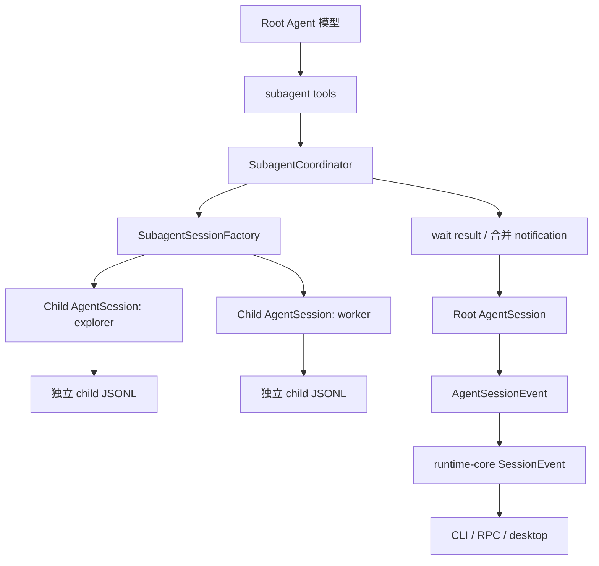
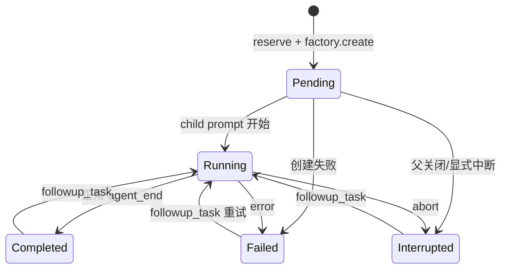

# 2. 目标架构

## 2.1 总体结构



边界原则：

- coordinator 管身份、状态、并发、等待、通知和 child handle；
- factory 管有效工具、权限、模型、cwd、资源与 child session 创建；
- child 只对自己的任务和 transcript 负责；
- root 负责拆分、冲突规避、结果整合和最终验收；
- runtime-core 只映射协议，不承载调度策略。

## 2.2 推荐模块布局

```text
packages/coding-agent/src/core/subagents/
├── types.ts                 # 公共状态、请求、快照、factory 契约
├── coordinator.ts           # reservation、状态机、wait、恢复、dispose
├── session-factory.ts       # CLI/SDK 默认 child factory
├── persistence.ts           # child 目录、metadata/lifecycle 恢复
├── notifications.ts         # 结果裁剪、批量通知、单次消费
├── tools/
│   ├── spawn-agent.ts
│   ├── send-message.ts
│   ├── followup-task.ts
│   ├── wait-agent.ts
│   ├── list-agents.ts
│   ├── interrupt-agent.ts
│   └── index.ts
└── index.ts                 # 明确导出，不放业务逻辑
```

这是一个同时包含状态、持久化、工具协议和通知的复杂功能，拆分有助于让 `agent-session.ts` 继续只做装配，而不是重新变成 god component。

## 2.3 核心类型

建议的概念类型如下，最终命名可按现有风格调整：

```typescript
export type SubagentType = "explorer" | "worker";

export type SubagentStatus =
  | "pending"
  | "running"
  | "completed"
  | "failed"
  | "interrupted";

export interface SubagentSnapshot {
  id: string;                // child session ID，持久身份
  taskName: string;          // root 下唯一名称
  path: string;              // /root/<taskName>
  agentType: SubagentType;
  status: SubagentStatus;
  task: string;
  parentSessionId: string;
  sessionFile?: string;
  startedAt: number;
  endedAt?: number;
  finalText?: string;
  errorMessage?: string;
  usage: {
    input: number;
    output: number;
    cacheRead: number;
    cacheWrite: number;
    costTotal: number;
  };
}

export interface SubagentSpawnRequest {
  taskName: string;
  message: string;
  agentType: SubagentType;
}

export interface SubagentParentContext {
  parentSessionId: string;
  parentSessionFile?: string;
  cwd: string;
  scenario: ConversationScenario;
  model: Model<Api>;
  thinkingLevel: ThinkingLevel;
}

export interface SubagentSessionFactory {
  create(
    request: SubagentSpawnRequest,
    parent: SubagentParentContext,
    signal?: AbortSignal,
  ): Promise<AgentSession>;
  reopen?(snapshot: SubagentSnapshot, signal?: AbortSignal): Promise<AgentSession>;
}
```

不要把父 `AgentSession`、`RuntimeManager` 或 `RuntimeHost` 整个传给 factory。显式参数袋能避免环状依赖，也便于用 fake factory 单测 coordinator。

## 2.4 身份与寻址

首版保留两个身份：

- `id`：child `SessionManager.getSessionId()`，用于持久化、锁和宿主 API；
- `path`：模型友好的 `/root/<task_name>`，用于工具寻址。

`task_name` 规则：

- 只允许小写字母、数字和下划线；
- 不能为空，不能是 `root`；
- 同一 root session 内唯一；
- 首版只有一层，因此不存在 `..`、相对兄弟或孙节点解析。

工具 target 同时接受 child ID、`task_name` 和完整 path。解析结果必须唯一；重复 task name 在 reservation 阶段失败。

## 2.5 状态机与并发 reservation



实现要求：

1. 在任何异步初始化前原子预留 `task_name` 和 active slot；
2. 默认 `maxConcurrent = 3`，只计算 `pending/running`，root 不计入；
3. factory 或 prompt 失败必须在 `finally` 中释放 active slot；
4. terminal snapshot 保留在 registry 中，便于 list/follow-up；内存只保留最近 50 个 terminal handle，旧 handle 可仅保留轻量 metadata；
5. 同一 child 同时只能有一个 run；并发 `followup_task` 必须串行或明确排队；
6. parent dispose 时先禁止新 spawn，再 abort child，等待 idle，最后 dispose child，禁止完成通知重新唤醒已关闭的 parent。

这里需要专用 reservation，而不是直接复用当前 `createLimiter()`：现有限流器会排队且没有取消、状态和唯一名称预留，不符合模型工具“立即成功或明确拒绝”的语义。

## 2.6 工具面

### `spawn_agent`

输入：

```json
{
  "task_name": "api_trace",
  "message": "分析 API 调用链，只读；返回关键文件和结论。",
  "agent_type": "explorer"
}
```

语义：始终后台启动，尽快返回 `{ id, path, status: "pending" }`。不提供 `background` 参数，避免两套完成语义；需要同步汇合时调用 `wait_agent`。

首版不提供 `model`、`reasoning_effort`、`fork_turns`、`isolation`。这些字段一旦公开就形成长期兼容契约，应等相应能力完整后再加。

### `send_message`

把信息加入 child 的 next-turn 上下文，不主动启动 turn，也不中断当前工具。它用于补充约束，不承诺当前采样请求立即看见消息。

Vetta 当前 agent loop 只会在工具完成点检查 steering，并没有 Codex 的 sampling-boundary mailbox。工具描述必须忠实表达这一点，不能声称“即时送达”。

### `followup_task`

- child idle/terminal：懒加载其 session 后调用 `prompt()`；
- child running：调用 `followUp()`，在当前 run 的自然停止点继续；
- 更新 last task 和状态；
- 保留 child 原 transcript，因此这是首版的上下文复用方式。

### `wait_agent`

建议输入：

```typescript
{
  targets?: string[]; // 省略表示当前 root 的所有 active child
  timeout_ms?: number; // 默认 30000，范围 1000..300000
}
```

语义：事件驱动等待指定集合中任意一个进入 terminal；若调用时已有未消费 terminal 结果，立即返回。返回值包含状态与裁剪后的 finalText。不得 sleep-poll。

### `list_agents`

返回稳定排序的全部 snapshot，不消费完成结果。首版是平面列表，但仍返回 `/root/<task>` path，给未来树形升级留兼容空间。

### `interrupt_agent`

只中断当前 run，不删除 transcript 和 metadata。完成后状态为 `interrupted`，可再次 `followup_task`。父 session dispose 是内部级联清理，不需要模型逐个 close。

## 2.7 内置 Agent 类型与工具能力

类型定义通过 `SubagentTypeRegistry` 注册。Coordinator / 控制工具对 type id 无硬编码分支。

### `explorer`（首版唯一内置）

- `createBuiltinTools` → `createReadOnlyTools(cwd)`（read/grep/glob/find/ls/dir_tree）；
- `inheritParentMcp: true`：代理父会话**全部已连接 MCP 工具**（不另起 MCP 进程；可写 MCP 残留风险靠人设约束，二期可收紧）；
- 不暴露 edit/write/bash/shell/todo/ask/subagent 控制工具；
- system prompt：探索/补信息、可联网搜、不改仓库；最终改内容归 root。

### 横向扩展（例：`worker`，未实现）

- 新增 `types/worker.ts` + `registry.register(...)`；
- `createBuiltinTools` 用 coding tools；`inheritParentMcp` 按需；
- factory 仍按 typeDef 装配，coordinator 无需改。

### 权限不增原则

有效 child 工具必须满足：

```text
child role 允许的工具名
∩ parent/host 实际提供的工具实现
∩ 当前 scenario 与 capability policy
```

child 不能因为自己是 `worker` 就获得父会话没有的 file.write、network 或 shell 权限。

禁止直接复用父 `AgentTool` 对象，因为这些对象可能闭包绑定父 session 的：

- sandbox grant/session ID；
- Hook runtime；
- extension context；
- background task manager；
- MCP manager；
- plugin invoker。

正确做法是 factory 按 child 身份重新装配同一权限策略下的新工具实例。MCP 共享连接可以后续单独设计；首版不要通过复制闭包伪装共享。

## 2.8 Child session 创建

### CLI/SDK 默认 factory

默认 factory 调用内部 child 会话创建路径：

- cwd、agentDir、env、scenario 与父一致；
- model、thinking level 取 spawn 时父的 live 值；
- 共享只读的 `ModelRegistry`，不重复远程 model fetch；
- 新建独立 `SessionManager`；
- 依据 agent type 显式选择工具名；
- `subagents.enabled = false`；
- `askUserQuestion = undefined`；
- 首版 child `enableBackgroundTasks = false`，避免 child agent_end 后仍遗留进程；
- 首版 child MCP/插件能力只有在能按 child 身份安全重新装配时才开启，否则明确关闭并在工具描述中说明。

### RuntimeHost factory

`RuntimeHost` 必须用 parent handle 的 `executionMode` 重新调用同一套 sandbox/custom-tool 构造逻辑，并给 child 使用新的 `sessionIdRef`。不能从普通 SDK fallback 创建未经包装的工具。

child 不作为普通顶层会话加入 sidebar 的 `sessions` map；它由 coordinator 持有，并通过 root 的 `subagents_update` 事件对外可见。需要查看 transcript 时，宿主按 child session path 只读加载。

## 2.9 上下文合同

child 初始输入应包含结构化但简短的任务 envelope：

```text
<subagent_task>
id: ...
path: /root/api_trace
type: explorer
parent_session_id: ...
</subagent_task>

<task>
主 Agent 提供的完整任务合同
</task>
```

任务合同至少应说明：

- 目标和输出格式；
- 允许修改的文件范围；
- 禁止触碰的范围；
- 验收命令或证据要求；
- 存在共享工作区和并行 Agent；
- 关键项目约束。

这类文本属于 Agent 协议，不是 desktop 用户界面文案，不走 i18n。

## 2.10 完成回传与去重

完成结果有两个消费者：

1. 已注册的 `wait_agent`；
2. 父会话自动通知。

coordinator 应对每个 terminal generation 保存 delivery 状态：

```text
pending -> delivered_by_wait | delivered_by_notification
```

规则：

- 有匹配 waiter 时先交给 waiter，并抑制该 generation 的自动通知；
- 没有 waiter 时把短时间内多个完成项合并为一个 `<subagent_notification>`；
- 父在 streaming 时用 follow-up，父 idle 时 `triggerTurn`；
- notification 内容包含 id/path/status/finalText/error/transcript path；
- finalText 设字符上限，例如 16 KiB，完整内容保留在 child transcript；
- 一个 child 每次 follow-up 产生新的 generation，去重键应为 `(childId, generation)`，不能永久屏蔽后续完成。

这样保留 Grok 的 auto-wake 优点，同时避免“wait 已拿结果，后台通知又开一轮”的重复交付。

## 2.11 持久化与恢复

持久化目录建议：

```text
<parent session dir>/.subagents/<parent session id>/
└── <timestamp>_<child session id>.jsonl
```

好处：

- 不污染普通 session 顶层列表；
- child 继续使用现有 JSONL 与锁；
- 根据 parent session ID 可直接扫描恢复；
- 删除/导出父 session 时能明确找到附属数据。

创建 child 时：

- 扩展 `SessionHeader` 和创建参数，增加可选的 `subagent` 元数据，记录 taskName/path/type/parentSessionId；
- `SessionManager.create(cwd, childDir, { parentSession: parentSessionFile, subagent })` 在创建 JSONL 时一次性写入 header；
- 每次状态终结追加 `subagent.lifecycle` custom entry。

身份元数据必须放在创建时立即写入的 header，不能依赖 `subagent.metadata` custom entry。当前 `SessionManager` 会将尚未接在 assistant 后面的普通 entry 延迟持久化；如果进程在 child 首轮 assistant 消息前退出，custom entry 可能尚未落盘，恢复时会丢失 taskName/type。`subagent` 是可选 header 字段，不影响旧 session 的读取。

不要把异步 child lifecycle entry 追加到父 session 的消息树。`SessionManager` 的 custom entry 也会推进 leaf；并发完成事件若插入父树，会改变后续消息的 parentId，给树导航和 compaction 增加隐蔽耦合。

恢复规则：

- root 恢复时扫描专属目录，重建轻量 snapshot；
- 上次为 `pending/running` 且没有 terminal 记录的 child 标记 `interrupted`；
- 不自动启动模型或命令；
- `followup_task` 需要时通过 factory `reopen()` 获取锁并继续；
- child 文件已被其他进程锁定时返回明确错误，不抢锁、不复制写入。

内存 parent session 的 child 也使用内存 session，进程结束即丢弃，不伪装可恢复。

## 2.12 Hook 集成

现有 Hook 协议应成为真实生命周期的一部分：

1. spawn reservation 后、child 首次 prompt 前调用 `SubagentStart`；
2. Hook 返回的 additional context 注入 child 初始上下文；
3. Hook 要求 stop 时取消 spawn 并释放 reservation；
4. child 的 UserPrompt/PreToolUse/PostToolUse/Compact 事件都携带 `{ agentId, agentType }`；
5. child terminal 前调用 `SubagentStop`；
6. `SubagentStop decision:block` 按现有 Hook 语义让 child 受限续跑，并复用 stop continuation 上限，防止无限递归；
7. `agentTranscriptPath` 指 child JSONL，`transcriptPath` 仍指父 transcript。

为实现第 4 点，`EcosystemHookRuntimeOptions` 需要可选 `subagentContext`，`baseEvent()` 自动带入，而不是每个工具包装器手工补字段。

## 2.13 事件与宿主协议

`AgentSessionEvent` 增加：

```typescript
{ type: "subagents_update"; agents: ReadonlyArray<SubagentSnapshot> }
```

使用全量 snapshot 与现有 `background_tasks_update` 一致，renderer 不必自己重放易丢失的 delta。

`runtime-core` 增加对应：

```typescript
export interface SubagentsUpdateEvent extends SessionEventBase {
  type: "subagents.update";
  agents: SubagentInfo[];
}
```

首版不把 child 的每个 token delta 转发到 root 事件流，避免一个 root session 混入多个 assistant stream。UI 展示状态、耗时、类型、最终摘要和 transcript 入口即可。

## 2.14 用量统计

每个 snapshot 独立累计 child assistant message 的 usage/cost。不要修改父 assistant message 中的原始 usage，也不要把 child usage 混入现有 `usage.update` 后造成 provider 单轮数据失真。

总任务用量应在 SessionStats/desktop 汇总层明确展示：

```text
root usage + sum(child usage)
```

并标明 child 是否仍在运行；仍在运行时总量是 incomplete。
