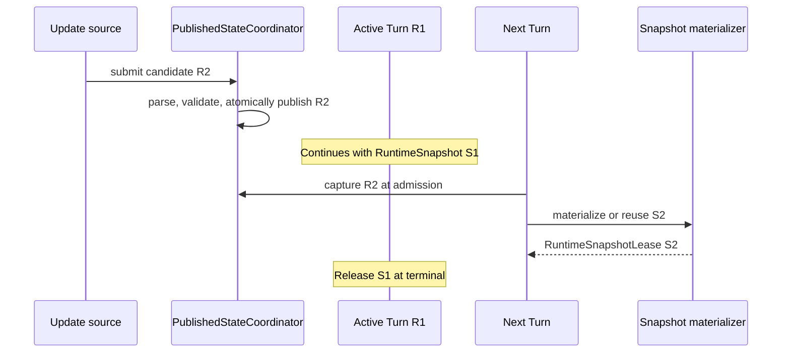

# 目标架构

## 1. 总体结论

目标架构采用“两阶段快照、一个执行事实源”模型：

1. 控制面把外部配置整理为不可变的 `PublishedAgentStateRevision`；
2. Session 在 Turn admission 时捕获当前 revision，并将其物化为现有的 `RuntimeSnapshot`；
3. Kernel 在整个 Turn 内只持有该 `RuntimeSnapshotLease`；
4. 后续外部更新只发布新的 revision，不修改已被 Turn 持有的 snapshot；
5. snapshot 中引用的 Tool、Plugin、MCP、Sandbox 等资源由 lease 延迟普通 retirement 回收。

`PublishedAgentStateRevision` 是待编译的控制面输入，`RuntimeSnapshot` 是可执行的数据面对象。Kernel 只认识后者，因此不会出现两个并列的执行事实源。

```mermaid
flowchart LR
    A["Settings / Plugin / MCP / Skill / Host updates"] --> B["Source adapters"]
    B --> C["Published state coordinator"]
    C -->|"atomic publish Rn"| D["Current immutable revision pointer"]

    E["New Turn admission"] --> F["Session turn snapshot provider"]
    D -->|"capture once"| F
    F --> G["Materialize or reuse RuntimeSnapshot Sn"]
    G --> H["Acquire RuntimeSnapshotLease"]
    H --> I["All model calls, tools, hooks and continuations in the Turn"]
    I --> J["Turn terminal event"]
    J --> K["Release lease; retire unused generation resources"]

    C -. "publish Rn+1 only" .-> D
    D -. "never pushes into active Turn" .-> I
```



## 2. 线性化点

### 2.1 外部状态发布

每个外部来源先独立完成读取、解析、结构校验和必要的准备工作，再以一个不可变对象原子替换当前指针。发布函数不得等待 Session，也不得遍历活动 Turn 修改其对象。

发布的线性化点是 `currentRevision = candidate` 的原子替换。更新发生在该点之前的新 Turn 可以看到旧代；发生在该点之后开始捕获的新 Turn 必须看到候选代或明确记录该候选代的物化失败。

### 2.2 Turn admission

Turn 的运行时状态线性化点是 `SessionTurnSnapshotProvider.acquireForTurn()` 同步捕获当前 process revision、workspace revision 与 session overlay revision 的时刻。捕获完成后，即使物化包含异步工作，期间发布的新 revision 也只能影响下一个 Turn。

因此实现必须满足：

- 所有 revision 指针在第一次 `await` 之前读取完毕；
- 捕获结果本身不可变；
- 物化过程只读取捕获结果，不再读取 `getCurrent*()`；
- 物化成功后获取的必须是该捕获 key 对应的 snapshot，而不是当时最新 snapshot；
- acquire 失败时不能悄悄改绑到更新、更旧或部分混合的代。

### 2.3 Turn 结束

结束点沿用 Kernel 的 Turn terminal 语义。`completed`、`failed`、`cancelled` 和 admission 后的异常路径都必须在 `finally` 中释放 lease。Session 被关闭时先阻止新 Turn，再取消或等待活动 Turn，最后释放 session 持有的 generation cache。

## 3. 核心对象

以下名称是实施建议；编码时可按现有命名风格调整，但职责不可重新混合。

### 3.1 `PublishedAgentStateRevision`

由 Coding Agent 产品层拥有，表达一次完整、不可变、可追踪的外部状态：

```ts
interface PublishedAgentStateRevision {
  readonly id: string;
  readonly publishedAt: number;
  readonly scope: Readonly<{
    kind: "process" | "workspace";
    key: string;
  }>;
  readonly sources: Readonly<{
    settings: string;
    resources: string;
    tools: string;
    mcp: string;
    plugins: string;
    hooks: string;
    extensions: string;
    hostPolicy: string;
  }>;
  readonly state: Readonly<PublishedAgentState>;
}
```

`id` 应来自单调 generation 或稳定 hash；`sources` 用于诊断和缓存，不应包含密钥、完整 Prompt 或用户文件内容。

这里的“副本”不要求深拷贝所有数据。可以引用不可变 catalog、持久化数据结构或 generation handle，但这些引用必须在 revision 生命周期内稳定，并且可通过 lease 防止宿主因普通更新主动回收。Lease 不冻结物理健康，也不提供调用成功保证。

状态按 scope 发布，不构造包含所有 workspace 的巨大对象：process scope 保存全局设置和 Plugin 来源，workspace scope 保存资源、Skill、MCP 等工作区状态，并记录所基于的 process revision。Session admission 同步捕获 process、当前 workspace 与 session overlay 三个不可变指针，再生成一个 resolved composite key。

### 3.2 `PublishedStateCoordinator`

控制面唯一发布者，负责：

- 接受文件 watcher、Desktop 设置、Plugin 管理器、MCP 配置等来源的候选更新；
- 合并来源 revision，生成完整候选；
- 校验候选，不发布半成品；
- 原子发布当前 revision；
- 对快速连续更新执行去重与 newest-wins 调度；
- 暴露 desired、published、failure 诊断状态。

它不负责编译 Session 的 `AgentProfile`，也不持有活动 Turn。

### 3.3 `SessionStateOverlay`

Session 自身仍有独立变化，例如 cwd、Agent Mode、Execution Mode、session plugin selection、模型选择和会话级权限。它们必须用与 process/workspace revision 相同的不可变发布方式维护：

```ts
interface SessionStateOverlayRevision {
  readonly id: string;
  readonly state: Readonly<SessionStateOverlay>;
}
```

Turn 捕获的 cache key 至少包含：

```text
process revision id + workspace revision id + session overlay revision id + product/compiler version
```

不要再为 Agent Mode、Plugin、Execution Mode 分别维护互不知情的 pending 字段。

### 3.4 `SessionTurnSnapshotProvider`

这是连接控制面与现有 Kernel contract 的产品层适配器。每个 Session 一个实例，职责为：

1. 同步捕获 process、workspace 与 session overlay revision；
2. 按 composite key 复用已物化 snapshot；
3. 未命中时调用 `TurnSnapshotMaterializer`；
4. 原子安装成功候选；
5. 返回目标 key 对应的 `RuntimeSnapshotLease`；
6. 在 lease 归零后释放已 retirement 的 generation 资源。

建议让 `RuntimeSnapshotProvider.acquire` 接受最小的 Turn 上下文：

```ts
interface RuntimeSnapshotAcquireContext {
  readonly sessionId: string;
  readonly turnId: string;
  readonly signal: AbortSignal;
}

interface RuntimeSnapshotLease {
  readonly snapshot: RuntimeSnapshot;
  readonly modelBinding?: RuntimeTurnModelBinding;
  release(): Promise<void>;
}

interface RuntimeSnapshotProvider {
  acquire(
    context: RuntimeSnapshotAcquireContext,
  ): Promise<RuntimeSnapshotLease>;
}
```

该参数只用于取消、诊断和 admission；不能让 provider 根据后续 Model Call 再次选择 revision。`modelBinding` 也必须从该次捕获的 model policy/provider revision 解析，Kernel 不应在 acquire 之后再调用独立的 live `RuntimeTurnModelBindingProvider.bind()`，否则 snapshot 与模型仍可能跨代。

### 3.5 `TurnSnapshotMaterializer`

物化器从已捕获的三层 revision 构造完全稳定的 `AgentProfile`，再复用现有 `FeatureCompiler`、`RuntimeCapabilityComposition` 与 `AtomicRuntimeSnapshotProvider` 生成 `RuntimeSnapshot`。

物化器必须完成：

- 解析最终设置、模式、Prompt 片段与资源目录；
- 捕获 Tool/MCP/Skill/Plugin/Hook/Extension catalog；
- 获取所需 generation resource leases；
- 构建不再读取 mutable current state 的 provider 和 hook binding；
- 把资源 release 注册到 compiled snapshot 的 `dispose()`；
- 写入不含敏感内容的 generation descriptor。

物化器不应把产品字段加入 `runtime-core`。Kernel 保持通用，只消费 `RuntimeSnapshot` 及其既有 provider contracts。

### 3.6 `RuntimeGenerationDescriptor`

建议为 `RuntimeSnapshot` 增加只读诊断元数据：

```ts
interface RuntimeGenerationDescriptor {
  readonly generationId: string;
  readonly sourceRevisions: Readonly<Record<string, string>>;
  readonly compiledAt: number;
}
```

事件和日志默认只记录 `snapshotId`、`generationId` 与 revision id。完整 Prompt、Tool 参数、密钥和用户资源内容不得进入 descriptor。

## 4. 稳定数据与 Turn-local 状态

Turn 隔离不等于冻结 Agent 自己在本 Turn 中产生的所有状态。实现应明确分成两个读取面。

### 4.1 Generation-stable 读取面

以下数据只能来自已捕获 revision 或 snapshot 闭包：

- System Prompt 模板及外部注入片段；
- Skill、Plugin、MCP、Tool 和 Extension 的可用集合及实现绑定；
- Agent Mode、Execution Mode、Sandbox policy 与模型策略；
- Hook 和 interceptor 注册集合；
- 外部资源目录及其内容 revision；
- Plugin 配置与宿主 capability 授权。

这一层禁止调用语义为“current/latest/refresh”的函数。

### 4.2 Turn-local 读取面

以下状态可以在同一 Turn 的 Model Call 之间变化，因为变化由该 Turn 的执行产生：

- 对话消息与工具结果；
- todo、plan、usage、compaction 游标；
- 本 Turn 已激活的 deferred tools；
- 工作流节点输出；
- 当前 Turn 的内存写入视图；
- 取消信号与物理资源健康状态。

Model Call provider 可以组合 generation-stable 数据与 Turn-local 数据，但不得借后者重新读取外部 current state。

必须绑定、必须实时与必须实时收紧的完整判定规则见
[Turn Binding 的能力边界](./08-binding-boundaries.md)。

## 5. 资源 lease 模型

不可变对象本身容易冻结，真正困难的是对象背后的进程、函数实现和连接。所有可能因更新而被替换的资源必须遵循同一生命周期：

```text
prepare candidate -> publish for new acquisitions -> retire old generation
                  -> active leases drain -> dispose old resources
```

需要 generation lease 的资源至少包括：

- Plugin activation 与其主进程/Renderer handler；
- MCP server supervisor、tool binding 与连接；
- Extension runner 和 custom tool handler；
- Execution Mode 对应的 sandbox/terminal/tool host；
- 动态 Tool implementation；
- Hook/interceptor handler catalog。

普通更新只能 retirement；hard revoke 才能绕过 lease 拒绝新调用或取消在途调用。二者必须使用不同 API、不同事件和不同审计原因。Lease 只管理所有权和回收时机；进程崩溃、transport 断线、网络失败等物理故障仍可使旧代调用失败。

## 6. 更新事务

### 6.1 普通更新



### 6.2 候选失败

若来源解析或控制面校验失败，候选不得发布。若 Session-specific 物化失败：

1. 该 Session 保留最后一个成功的 snapshot；
2. 本次 Turn 可以按明确策略使用最后成功代，不能混合候选的一部分；
3. 发出包含目标 revision 与失败阶段的诊断事件；
4. UI 显示 `apply_failed` 和实际 effective generation；
5. 安全收紧不得以此路径 fail-open，必须先走 hard revoke。

产品默认采用“最后有效代继续运行”，保持与现有 `RuntimeCapabilityComposition` 编译失败语义一致。若未来某类更新要求 fail-closed，应由该来源显式声明，不能由异常类型隐式决定。

### 6.3 快速连续更新

控制面可以把尚未发布的候选合并为最新值；已经发布的 revision 不得改写。Session 物化可以 coalesce 相同 composite key，也可以跳过尚未被任何 Turn 捕获的中间代，但不能把已经捕获 `R2` 的 Turn 改绑到 `R3`。

## 7. Admission 顺序调整

为了让 Prompt hook、UserPromptSubmit hook 和 Turn preparer 也受同一代约束，动态扩展代码必须在 snapshot binding 之后执行。建议 Kernel/Host 顺序统一为：

```text
accept request
  -> allocate turnId
  -> acquire RuntimeSnapshotLease
  -> run snapshot-bound prompt/input hooks and preparers
  -> use model binding carried by the same lease
  -> model/tool loop
  -> terminal event
  -> release lease
```

admission 前允许的逻辑仅限协议解析、大小限制、身份认证和不依赖动态扩展的基础校验。若现有 Host 在调用 Kernel 前执行 Plugin/Prompt/MCP 逻辑，应将该逻辑迁入 snapshot-bound preparer，或让 Host 先显式获取同一 lease 并把它移交 Kernel；禁止前后各取一次。

## 8. 包边界

| 包 | 目标职责 |
| --- | --- |
| `runtime-core` | Turn admission、`RuntimeSnapshotLease`、generic acquire context、finally release、generation 诊断事件 |
| `coding-agent` | `PublishedAgentStateRevision`、session overlay、revision capture、物化器和产品级失败策略 |
| `runtime-tools` | versioned tool catalog、implementation lease、retirement 与 hard revoke 分离 |
| `runtime-mcp` | immutable MCP config/tool generation、连接 lease 与同配置重连 |
| `plugins` | Plugin generation contract、不可变 manifest/config snapshot、SDK 兼容约束 |
| `desktop-app` | 设置来源、Plugin handler generation router、desired/published/effective UI |
| `cli-app` | 配置更新发布与当前/下个 Turn 状态展示 |

下层包不得依赖 Desktop 或 Coding Agent 的 revision 类型。跨包能力通过各包公开 exports 和小型 lease contract 暴露。

## 9. 为什么不采用其他方案

### 9.1 不在每个 Model Call 单独复制外部状态

这仍会让同一 Turn 的多次 Model Call 跨代，也无法保护两次 Model Call 之间的工具执行和 hook。复制边界必须是 Turn admission。

### 9.2 不给每个领域各加一个 `pending*`

各领域独立切换会产生 Prompt 已更新但 Tool 未更新之类的混合代，也难以确定失败回滚到哪一组状态。统一 revision set 才能建立原子合同。

### 9.3 不冻结整个 Session

Session 可能持续数小时，冻结到 Session 结束会让更新长期不生效。Turn 是同时满足一致性和及时性的最小自然边界。

### 9.4 不在活动 Turn 上热替换 provider 对象

对象引用不变不代表行为不变；只要闭包读取 mutable source，仍会漂移。必须冻结读取源和实现资源，而不是只冻结 provider 拓扑。
