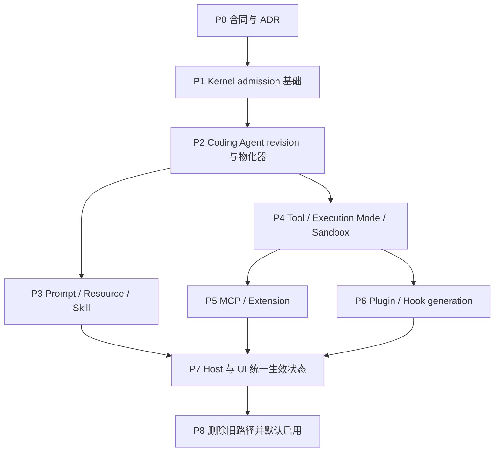

# 实施路线图

## 1. 直接修改与先重构的判断

本任务满足仓库规则中的必需重构条件：

- 同一运行时状态由 Kernel snapshot、Model Call refresh、Host pending 字段和 live registry 多处决定；
- Tool、Plugin、MCP、Prompt 都重复实现“何时读取最新值”；
- 普通配置更新、资源 retirement 和安全撤权混在一个 availability check 中；
- 现有闭包读取 mutable state，使 Kernel 已有 lease 无法证明行为稳定；
- Execution Mode、Plugin reload 与 Hook dispatch 涉及异步竞态和资源所有权。

因此不能通过给若干 getter 加缓存完成。实施应先建立统一发布/lease 边界，再逐领域迁移；每个阶段保持可独立验证，最后删除旧路径。

## 2. 交付策略

建议拆成下列阶段或独立 PR。阶段顺序是依赖顺序，不代表必须按固定日历执行。



在 P8 前允许内部双写诊断，但不允许同一 Turn 同时从新旧路径执行。若使用临时开关，开关只能在 Session 创建时选择完整旧/新实现，不能在活动 Turn 中热切换。

## 3. P0：合同、ADR 与可失败基线

### 目标

先固定“同一 Turn 不跨 generation”合同，并用测试证明当前实现会违反它。

### 工作项

- 新增跨模块 ADR，记录 Turn boundary、revision、lease、ordinary retirement、hard revoke 和失败策略；
- 修订 [分领域迁移方案](./04-domain-migration.md) 中列出的冲突文档；
- 建立统一术语，避免继续混用 refresh、reload、revoke、retire；
- 在现有测试中加入可控 barrier，写出旧实现会失败的竞态测试；
- 盘点所有 `refresh*()`、`getCurrent*()`、registry snapshot 和 pending 字段，形成迁移清单；
- 明确 hard revoke 的授权主体、reason code 和审计事件。

### 基线测试至少覆盖

- 两次 Model Call 之间更新 Skill/Prompt/Tool，旧实现第二次可见；目标断言是不可见；
- Tool schema 生成后普通 unregister，旧实现 execution 被拒；目标断言是继续执行旧 binding；
- Plugin hook 在 Turn 内 reload，旧实现 next dispatch 使用新 handler；目标断言是旧 handler；
- MCP tools-changed 在 Turn 内到达，旧实现下一 Model Call 列表变化；目标断言是不变；
- Execution Mode 在 busy 时更新被拒；目标断言是更新被接受且只影响下一 Turn。

### 完成门槛

- ADR 和文档合同无互相冲突；
- 测试能够稳定暴露旧行为，不使用任意 sleep；
- 明确哪些安全事件允许 hard revoke，未决项不得进入实现。

## 4. P1：Kernel admission 与 generation metadata

### 目标

强化已有 `RuntimeSnapshotLease`，让所有 Turn 动态准备逻辑都位于同一 lease 之后，并提供可观测 generation id。

### 工作项

- 扩展 `RuntimeSnapshotProvider.acquire(context)`；
- 让 acquire 结果携带基于同一 captured revision 的 `RuntimeTurnModelBinding`，移除后续 live bind；
- 调整 `turn-pipeline.ts` admission 顺序；
- 为 snapshot/turn event 增加非敏感 generation descriptor；
- 验证成功、失败、取消、preparer 异常都只释放一次；
- 保持模型选择结果的 Turn 稳定性以及 usage、stop、tool call 和 queue 语义不变；
- 如果 Host 当前在 Kernel 前运行动态 prompt/hook，先迁移为 snapshot-bound preparer。

### 不在本阶段做

- 不改变各领域仍按 Model Call refresh 的行为；
- 不把 Coding Agent revision 类型放进 runtime-core；
- 不重写 `AtomicRuntimeSnapshotProvider`。

### 完成门槛

- runtime-core 合同和生命周期测试通过；
- Turn 事件能关联 `snapshotId/generationId`；
- 所有动态 preparer 的调用点位于 acquire 之后；
- 公共 API 消费者完成类型迁移。

## 5. P2：统一 Published State 与 Session 物化

### 目标

建立唯一的产品控制面和 admission 物化器，但先让它生成与当前配置等价的 snapshot。

### 工作项

- 新增 `PublishedStateCoordinator` 与 immutable revision；
- 分别维护 process/workspace scope，并在 capture 时组成 resolved key；
- 新增 `SessionStateOverlayRevision`；
- 新增 `SessionTurnSnapshotProvider` 与 `TurnSnapshotMaterializer`；
- composite key 捕获在第一次 await 前完成；
- 同 key single-flight，不同 key 可 newest-wins 预热但不可改绑已捕获 Turn；
- 将 materialized resource release 挂入 snapshot dispose；
- 提供最后成功代回退和 apply failure 诊断；
- 接入当前 settings、mode、plugin selection、execution mode 的读模型，但暂不移除领域旧 refresh。

### 并发状态机

Session provider 至少需要表达：

```text
unprepared
  -> preparing(key)
  -> active(key, snapshot)
  -> retired(key, refCount > 0)
  -> disposed

preparing(key) --failure--> active(previousKey) + apply_failed(key)
```

Session close 与 candidate materialization 必须有明确互斥：close 后候选不得重新 publish，已开始物化的资源必须释放。

### 完成门槛

- 相同 revision 的多个 Turn 可复用 snapshot；
- 更新后新 Turn 取新 key，活动 Turn 仍持有旧 key；
- 物化失败只使用完整旧代，不产生混合代；
- rapid updates、close race 和 ref-count dispose 测试通过。

## 6. P3：Prompt、Resource、Skill 与 Personalization

### 目标

先迁移纯数据领域，验证“两阶段快照”可以替代 Model Call refresh。

### 工作项

- loader/watcher 输出 immutable resource revisions；
- materializer 生成 Turn-bound prompt/resource/skill snapshots；
- `PromptRuntime` 移除 Model Call reload；
- `invoke_skill` 改用 Turn-bound catalog 和内容 revision；
- 将 memory/todo 明确拆成 external baseline 与 Turn-local overlay；
- 缓存按内容 hash/revision 寻址；
- 更新动态资源测试和产品文档。

### 兼容要求

- 外部文件在 Turn 中被删除或改写，当前 Turn 仍读取捕获内容或内容寻址缓存；
- 新 Turn 使用最新成功发布内容；
- 无法保留内容的超大资源应在 admission 复制到受控临时对象或返回明确物化失败，不能回退到按路径读取最新文件；
- Prompt role、system instruction 顺序和 token accounting 不改变。

### 完成门槛

- Prompt/Skill/Resource 路径没有 Model Call 级外部 refresh；
- 同 Turn 第二次 Model Call 的内容稳定性测试通过；
- 资源更新到下一 Turn 可见；
- 现有 prompt 与 skill 行为测试除预期时机变化外保持通过。

## 7. P4：Tool、Execution Mode、Sandbox 与 hard revoke

### 目标

建立可复用的 generation-aware capability lease，这是后续 MCP 和 Plugin 迁移的基础。

### 工作项

- runtime-tools 增加 immutable `ToolCatalogRevision`；
- Tool binding 绑定具体 implementation generation；
- catalog retirement 与 hard revocation API 分离；
- availability guard 改为 Turn binding + hard revoke check；
- model-call tool contribution 不再 refresh external catalog；
- Execution Mode/Sandbox host 进入 session overlay 与 resource lease；
- 普通 mode 更新从 busy 拒绝改为 next-Turn publish；
- hard revoke 支持 reason、scope、epoch、audit id 和可控取消点。

### 安全检查点

hard revoke 至少在以下位置检查：

- admission 获取 capability lease；
- 工具实际副作用开始前；
- 长时间工具的可取消阶段边界；
- Provider/MCP 发起新的外部请求前。

不要在纯结果解析完成后把已成功副作用伪装成“未执行”。事件必须能区分 `revoked_before_start`、`cancelled_in_flight` 和 `completed_before_revoke`。

### 完成门槛

- 普通 unregister/reload 不破坏活动 Turn；
- hard revoke 能稳定阻止尚未开始的敏感操作；
- 旧 sandbox/tool implementation 在 lease drain 后准确释放；
- mode update 在 active Session 中被接受，且新旧 Turn effective mode 可观测。

## 8. P5：MCP 与 Extension

### 目标

把外部进程/连接型工具迁移到 generation lease，并验证物理故障与配置更新分离。

### 工作项

- MCP config/tools-changed 只发布新 revision；
- MCP catalog schema 与 execution binding 同代；
- supervisor/connection 引入 ref-counted generation binding；
- 同 fingerprint 资源可共享，变更 fingerprint 则并存到旧 lease 归零；
- Extension discovery、runner、handler 使用相同模型；
- 对连接断开、进程退出、重连与配置 reload 建立不同事件。

### 完成门槛

- Turn 内 tools-changed 不改变后续 Model Call schema；
- 旧 Turn 的 MCP/Extension 调用不会落到新 handler；
- 物理重连不改变 generation；
- Session close 和快速 reload 不泄漏子进程、连接或监听器。

## 9. P6：Plugin activation、Tool 与 Hook

### 目标

完成最复杂的跨进程 generation routing，确保 Plugin reload 不侵入活动 Turn。

### 工作项

- Plugin manager 支持 activate-new / retire-old；
- Tool、MCP、Hook、interceptor 和 handler 统一携带 plugin generation id；
- Desktop 主进程 handler router 保留 retired generation；
- Hook dispatch 从 global registry lookup 改为 Turn binding；
- Plugin tool execute 删除普通 current config 二次检查；
- SessionStart/End 与 Turn hooks 按不同边界路由；
- deactivate/dispose 在所有 lease 归零后触发；
- reload 失败保留上一有效 activation，并显示失败状态。

### 迁移兼容层

若现有 Plugin SDK 只返回逻辑 handler id，宿主可在注册时包成 `{ pluginId, generationId, handlerId }`。Plugin 代码无需立即感知 generation，但内部路由必须感知。兼容层不得通过查 current generation 补齐缺失字段。

### 完成门槛

- reload 中的活动 Turn 完整使用旧 Plugin generation；
- reload 后的新 Turn 完整使用新 generation；
- 普通 disable、hard revoke、activation crash 三类结果可区分；
- Renderer 退出、Desktop 关闭和 Session 取消无 handler/resource 泄漏。

## 10. P7：Host API、Desktop/CLI 状态与可观测性

### 目标

统一用户可见的更新语义，消除“设置看起来已改但当前 Turn 为何没变”的歧义。

### 工作项

- Host 更新 API 返回 published revision id 和生效说明；
- Session 状态暴露 active turn generation、last successful generation、target revision、apply failure；
- Desktop 所有新增文案接入 i18n；
- UI 显示 desired/published/effective/pending/failed；
- CLI status 输出同一状态模型；
- 日志、trace、metrics 接入 generation id；
- 更新用户文档、Changelog 和 API/IPC schema 测试。

### 完成门槛

- 用户修改设置时不被 busy Session 拒绝；
- UI 能明确说明当前 Turn 仍使用旧代；
- 新 Turn 开始后 effective generation 更新；
- apply failure 不被展示成“已生效”。

## 11. P8：删除旧路径并默认启用

### 目标

清除所有可绕过 Turn isolation 的旧读取路径和临时兼容逻辑。

### 工作项

- 删除 [分领域迁移方案](./04-domain-migration.md#12-迁移后的删除项) 中列出的路径；
- 用静态架构检查禁止 Model Call runtime 导入 source watcher/live registry；
- 用代码搜索确认不存在语义等价的 current lookup；
- 删除迁移 feature flag、双写诊断和旧 pending state；
- 运行多包定向测试、`test:changed`、完整 `check` 与适用 UI 验证；
- 完成旧 generation drain、长期 Session 和快速 reload soak 测试；
- 更新 Changelog 的 `[Unreleased]`。

### 建议机械守卫

- coding-agent model-call/runtime 目录禁止导入 watcher、filesystem loader 和 global registry；
- Plugin Hook adapter 的 Turn event dispatch 必须要求 generation binding；
- Tool execution 不得调用普通 `getCurrentCatalog()`；
- runtime-core 不得依赖 Coding Agent 或 Desktop revision 类型；
- hard revoke API 必须要求 reason 与 audit metadata。

### 完成门槛

- 新路径成为唯一执行路径；
- 仓库规范、README、ADR、源码和测试对生效边界描述一致；
- 全量质量门禁通过；
- rollout 指标满足 [测试、可观测性与上线](./06-testing-observability-rollout.md) 的退出条件。

## 12. 推荐 PR 切分

为了让 review 能区分行为保持型重构与行为变化，建议按以下最小可审查单元拆分：

1. ADR、术语和失败基线测试；
2. runtime-core acquire context、admission 顺序与 metadata；
3. Coding Agent publisher/materializer，保持现有领域行为；
4. Prompt/Resource/Skill 迁移；
5. runtime-tools lease 与 hard revoke；
6. Execution Mode/Sandbox 迁移；
7. MCP/Extension generation；
8. Plugin/Hook generation router；
9. Host API、Desktop/CLI UI 与 i18n；
10. 删除旧路径、机械守卫和默认启用。

公共合同变更与消费者迁移必须位于同一 PR，不能让主分支出现只有一半消费者适配的状态。

## 13. 回退策略

### 代码上线回退

在迁移阶段，允许**仅在 Session 创建时**选择旧或新 runtime composition。已创建 Session 不热切换实现；需要回退时停止接受新 Turn，等待或取消活动 Turn，关闭 Session 后重建。

### 配置更新回退

控制面保留最近若干成功 revision 的 immutable metadata。回退通过发布一个内容等价于旧代、但 revision id 新增的候选完成；不得把 current pointer 向后改成已 retirement 的对象。

### 安全回退

hard revoke 不因普通配置回退自动解除。解除撤销必须是独立、可审计操作，并只影响新操作/新 Turn。

## 14. 实施期间的关键评审问题

每个领域进入编码前都应回答：

1. 外部 source 的原子 revision 是什么？
2. admission 捕获发生在哪一行、第一次 await 是否在其后？
3. schema/Prompt 与 execution/content 是否绑定同一 generation？
4. 老资源由哪个 lease 延寿，谁负责 dispose？
5. 普通 retirement 与 hard revoke 分别走哪个 API？
6. 物化失败时使用哪个完整旧代，UI 如何显示？
7. 同一 Turn 的第二次 Model Call 是否还存在 live current lookup？
8. Session close、取消和快速 reload 的竞态如何由测试证明？

只要其中一项没有明确所有者，该领域就尚未完成迁移设计。
