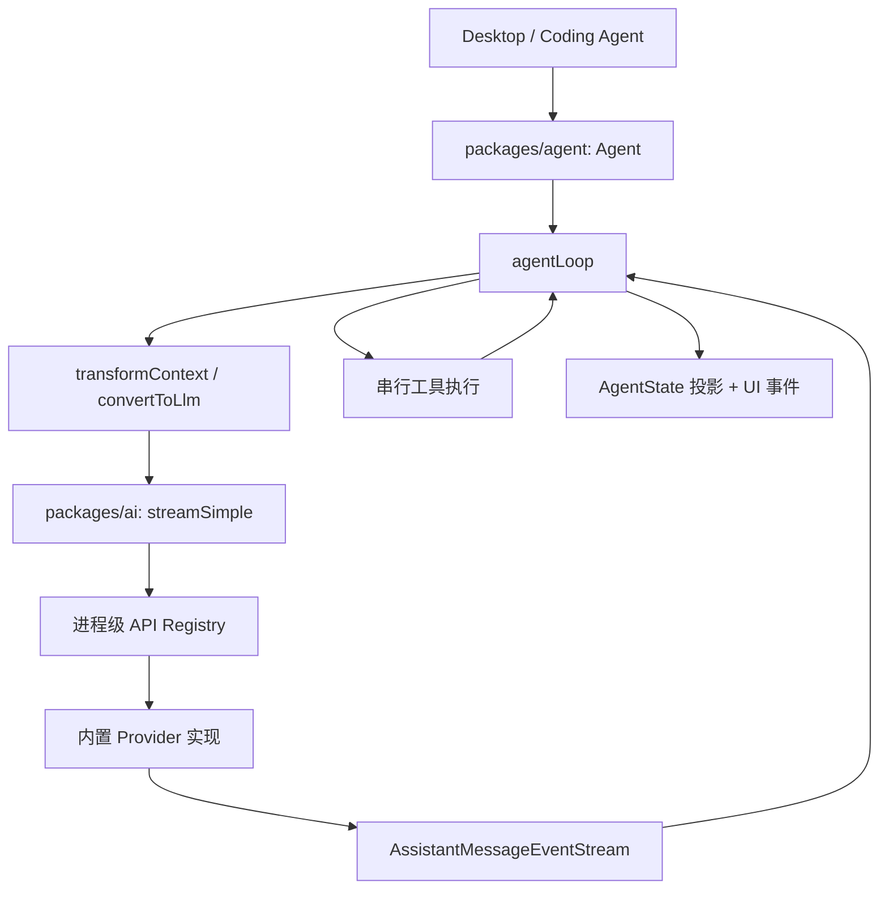
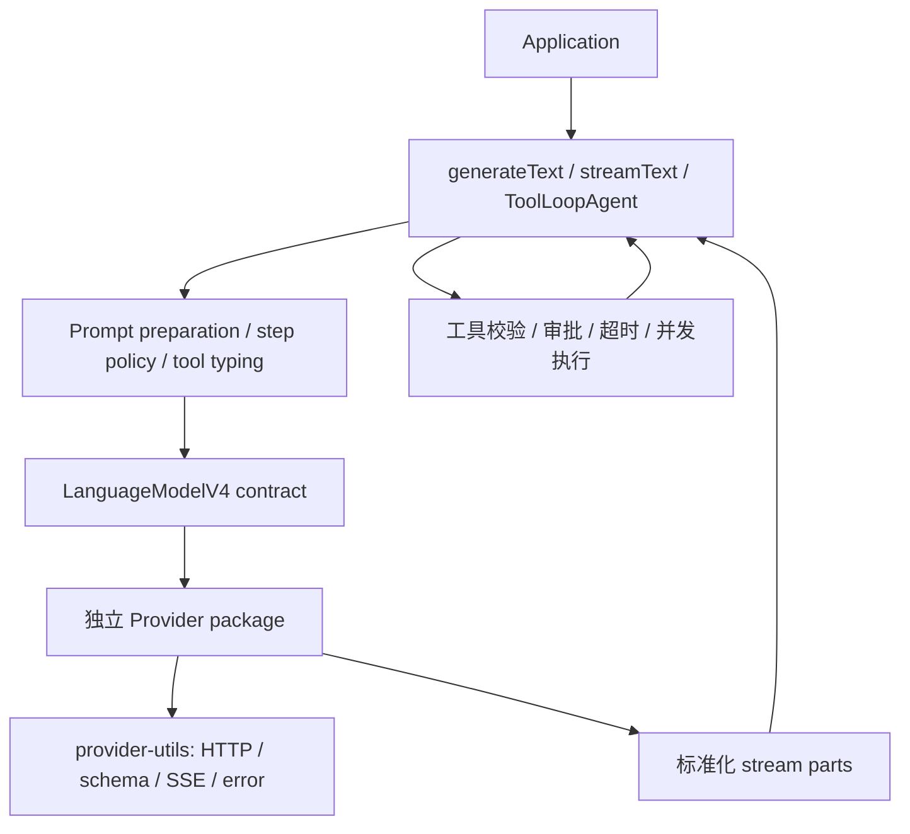

# 审计范围与架构基线

## 快照与口径

本次结论基于以下本地代码快照：

| 仓库 | 路径 | Commit | 日期 |
| --- | --- | --- | --- |
| Vetta Mono | `C:\develop\yiyun\vetta-mono` | `2fae6596e18fc58c3b23e6d910ed327fa1a3eb66` | 2026-08-09 |
| Vercel AI SDK | `C:\develop\github\ai` | `63db19387ba71ec50820d146658ae720ab50c80b` | 2026-08-07 |

对比采用“职责对齐”，而不是只比较同名包：

| Vetta | 对照仓库中的对应职责 |
| --- | --- |
| `packages/ai` 的公共类型与流协议 | `packages/provider` |
| `packages/ai` 的校验、SSE、重试和错误处理 | `packages/provider-utils` |
| `packages/ai/src/providers/*` | `packages/openai`、`packages/anthropic` 等独立 Provider 包 |
| `packages/agent` 的模型循环与工具执行 | `packages/ai/src/generate-text/*` 与 `packages/ai/src/agent/*` |
| `Agent` 的长会话状态与 steering/follow-up | 对照仓库没有完全等价的单一组件 |

因此，Vercel 的 `packages/ai` 代码量远大于 Vetta 的 `packages/ai` 并不能直接说明质量差异；两者包名相同，但职责不同。

## 代码规模

以下数字用于理解维护面，不作为质量评分：

| 模块 | 生产文件 | 生产代码行 | 测试文件 | 测试代码行 |
| --- | ---: | ---: | ---: | ---: |
| Vetta `packages/ai` | 77 | 9,088 | 38 | 8,217 |
| Vetta `packages/agent` | 13 | 2,101 | 10 | 2,201 |
| Vercel `packages/provider` | 240 | 9,074 | 1 | 99 |
| Vercel `packages/provider-utils` | 152 | 8,241 | 91 | 13,114 |
| Vercel `packages/ai` | 335 | 34,992 | 148 | 117,096 |
| Vercel `packages/openai` | 70 | 14,055 | 30 | 27,862 |
| Vercel `packages/anthropic` | 41 | 10,594 | 18 | 19,069 |

Vercel 的协议包测试少，是因为大量协议行为由 Provider 工具、具体 Provider 和核心编排层验证；不能孤立地用 `packages/provider` 的测试数量评价其覆盖。

## 当前 Vetta 调用链

关键特点：

- 模型是可序列化的 `Model` DTO，行为由全局 Registry 根据 `model.api` 查找。
- Provider 输出统一为带完整 `partial` 快照的事件流。
- Agent 自己持有会话状态，并把底层事件投影到 `AgentState`。
- 工具执行、steering、follow-up、上下文检查点都在同一个循环里串行协调。

## 对照仓库调用链

关键特点：

- `LanguageModelV4` 是版本化行为协议，模型实例直接实现 `doGenerate` 与 `doStream`。
- Provider-specific options 和 metadata 按 Provider 命名空间透传。
- HTTP、响应 schema、安全 JSON 解析、重试和错误分类集中在 `provider-utils`。
- `ToolLoopAgent` 本身较薄，复用 `generateText` / `streamText` 的成熟循环。
- Agent 调用默认是一次性操作；它不负责 Vetta 那种长期可变的桌面会话对象。

## 审计维度

本次从以下维度检查：

1. 模块职责与依赖方向。
2. 公共类型、运行时 schema 与向后兼容能力。
3. 流式协议的完成、失败、取消和背压语义。
4. Provider 扩展成本与 Provider-specific 能力保真度。
5. 工具调用的校验、审批、超时、并发和错误传播。
6. Agent 的状态所有权、终止条件、长会话与宿主交互。
7. 浏览器、Node、代理和进程级副作用。
8. 可观测性、usage、上下文/token 诊断能力。
9. 单元测试、集成测试、类型测试和运行时矩阵。
10. 迁移成本与是否符合当前桌面产品需求。

## 已执行验证

- 运行 `packages/agent` 的 4 个核心单元测试文件，共 27 个测试通过。
- 运行 `packages/ai` 的 4 个纯逻辑测试文件，12 个测试通过、4 个凭据相关测试跳过。
- 用一次性 Bun 脚本验证：`transformContext` 抛错后，`agentLoop` 消费者在 150ms 内没有完成，结果为 `timeout`。
- 用一次性 Bun 脚本验证：直接调用 `EventStream.end()` 且不传结果后，`result()` 在 100ms 内没有完成，结果为 `timeout`。

这些 smoke 验证没有写入仓库。它们用于确认静态审查发现的终止语义问题，不替代后续正式回归测试。

## 限制

- 没有运行需要真实 Provider 凭据的跨 Provider E2E，因此不评价当前每个模型的线上可用率。
- 没有进行 bundle analyzer 或多浏览器实测；浏览器相关结论是基于入口依赖和副作用的架构风险判断。
- 对照仓库是指定本地快照，不代表其他版本，也不意味着其设计全部适合 Vetta。
