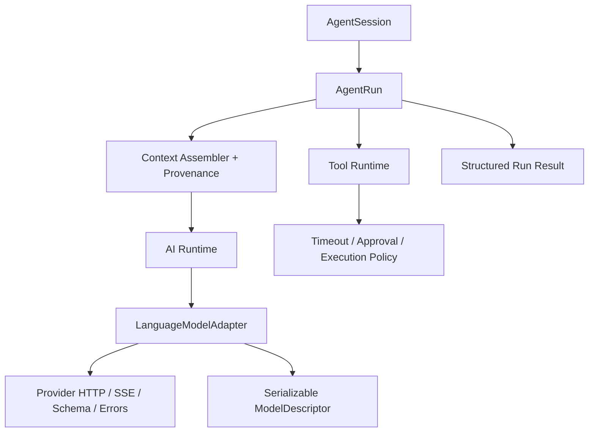

# 目标架构与演进路线

## 原则

1. 先修行为合同，再移动文件或拆包。
2. 保留 `Model` 可序列化和 Agent 长会话能力。
3. 新旧 API 并行迁移，避免一次性改完所有 Provider 和下游。
4. 每一阶段都必须有可独立验证的退出条件。
5. 只引入已经出现三次以上的共享抽象，不预建完整 Vercel 生态。

## 目标边界



建议保留两个概念，而不是在“DTO 或行为对象”之间二选一：

```ts
interface ModelDescriptor {
  id: string;
  provider: string;
  adapter: string;
  capabilities: ModelCapabilities;
  pricing?: ModelPricing;
  contextWindow?: number;
  maxOutputTokens?: number;
}

interface LanguageModelAdapter {
  readonly protocolVersion: "v1";
  stream(
    model: ModelDescriptor,
    request: LanguageModelRequest,
    options: LanguageModelCallOptions,
  ): LanguageModelStream;
}
```

`ModelDescriptor` 用于持久化和 IPC；`LanguageModelAdapter` 由应用 runtime 显式持有，不放进全局 Map。

## Phase 0：修复终止语义

目标：所有请求都能在成功、失败、取消三种情况下确定结束。

工作项：

1. 重写或收紧 `EventStream`：`close(result)`、`fail(error)`、`cancel(reason)`。
2. `result()` 在失败时 reject，AsyncIterator 同步结束或抛出同一错误。
3. `agentLoop` 托管后台 task，不允许 unhandled rejection。
4. 代理流缺少 terminal event 时返回 `IncompleteStreamError`。
5. checkpoint 支持 signal 与 timeout。

退出条件：

- 对 streamFn、transform、converter、listener、proxy EOF 和 checkpoint 各类失败都有回归测试。
- 所有测试用 `Promise.race` 断言不会悬挂。
- `prompt()` 和 `waitForIdle()` 在每个终态都完成。

## Phase 1：为 Agent 增加运行预算

目标：循环资源消耗可预测、终止原因可观察。

工作项：

1. 增加 `StopPolicy`：`maxSteps`、`maxToolCalls`、`maxDurationMs`、`maxRecoveryAttempts`。
2. 默认 `maxSteps = 20`，由上层产品覆盖。
3. 工具支持单独 timeout。
4. `agent_end` 替换或扩展为带 `reason` 的结构化 run result。
5. 基础设施错误不再自动写入模型消息历史。

退出条件：

- 无限 tool-call fixture 能在预算耗尽时稳定结束。
- abort、timeout、budget exhausted、provider error 可以被调用方无字符串解析地区分。

## Phase 2：建立 Provider 内核边界

目标：减少全局状态和每个 Provider 的重复基础设施。

先在 `packages/ai` 内部拆目录，不急于增加 workspace 包：

```text
src/protocol/
  model.ts
  request.ts
  stream-part.ts
  usage.ts
  errors.ts

src/provider-utils/
  http.ts
  response-handler.ts
  sse.ts
  schema.ts
  secure-json.ts
  retry.ts

src/providers/
  anthropic/
  openai/
  google/
  ...
```

工作项：

1. 定义最小版本化 adapter contract。
2. 用实例化 `AiRuntime` 替代进程级 Registry；保留兼容 facade。
3. 统一结构化错误、warning、provider metadata 和 raw usage。
4. Provider factory 显式注入 fetch、base URL、headers 和 auth resolver。
5. HTTP proxy 安装移到应用入口。

退出条件：

- 至少 Anthropic、OpenAI Responses、Google 三种不同协议迁移到新 contract。
- 旧 `streamSimple` 通过 adapter 兼容层工作。
- 导入协议/类型不会加载所有 Provider 或改变全局 HTTP dispatcher。

何时再拆包：只有出现以下任一需求时才把目录变成 workspace 包：独立发布、依赖冲突、浏览器 bundle 隔离、第三方 Provider 开发，或不同团队所有权。

## Phase 3：恢复关键类型关联

目标：消除公共边界的 `any`，而不是追求全库零断言。

优先保护两条关系：

1. `adapter/api -> call options`
2. `tool name -> input -> output -> event`

工作项：

- Provider options 使用按 Provider 命名空间的 map，并由 schema 解析。
- 不完整的流式工具 JSON 是 `unknown`/partial state；完成校验后才产生 typed tool call。
- Agent 以 `ToolSet` 泛型参数化事件。
- 为 `getModel`、stream options、tool event、custom message declaration merging 增加 `.test-d.ts`。

退出条件：调用不存在的 Provider option 或读取错误工具结果类型能在类型测试中失败。

## Phase 4：拆分 AgentSession 与 AgentRun

目标：保留桌面会话能力，同时让单次运行可独立推理和测试。

`AgentSession` 负责：

- 持久 messages。
- steering/follow-up queue。
- subscription。
- 启动、取消和等待当前 run。

`AgentRun` 负责：

- 一次 loop 的不可变初始输入。
- step 状态、停止策略、工具执行和终态。
- 动态 context prepare hook。
- 结构化事件流。

checkpoint 改成配置函数；事件只用于观察。动态工具通过 `prepareStep` 返回下一步快照，减少直接读取共享可变 state。

退出条件：run 可以脱离 `Agent` 类进行纯单元测试；Session 的排队语义保持现有测试兼容。

## Phase 5：上下文与 token 可观测性

目标：支持桌面输入框展示系统提示词、skill、历史、工具和附件的上下文占比。

这个能力必须放在“上下文组装层”，不能只依赖 Provider usage：

```text
原始来源
  -> ContextAssembler 记录 segment provenance
  -> Provider-specific message conversion
  -> tokenizer 估算每个 segment
  -> 发起请求
  -> Provider 返回总 input/cache usage
  -> 汇总并标记 estimated / reported
```

建议数据合同：

```ts
interface ContextUsageReport {
  model: string;
  contextWindow?: number;
  segments: ContextUsageSegment[];
  estimatedInputTokens: number;
  providerReportedInputTokens?: number;
  cachedInputTokens?: number;
  estimationDelta?: number;
}

interface ContextUsageSegment {
  id: string;
  kind: "system" | "skill" | "history" | "tool" | "attachment" | "other";
  source?: string;
  estimatedTokens: number;
}
```

重要约束：Provider 通常不返回每个区块的精确 token。UI 必须把分区显示为“估算”，把 Provider 总量显示为“报告值”；不能把估算包装成精确数据。缓存 token 也不等于某个区块独占的 token，需要单独展示。

退出条件：同一次模型调用可以关联 prepared context report、Provider reported usage 和最终 assistant message；压缩/裁剪前后可以比较 segment 变化。

## 建议的实施顺序

| 顺序 | 工作 | 原因 |
| ---: | --- | --- |
| 1 | EventStream 与 Agent 异常闭环 | 当前存在悬挂风险，且后续所有层都依赖它 |
| 2 | Loop 预算与 checkpoint timeout | 控制资源与宿主故障 |
| 3 | 结构化错误 | 为迁移和 telemetry 提供共同语言 |
| 4 | Provider utils 与显式 runtime | 降低重复和全局副作用 |
| 5 | Provider contract + 三个代表 Provider 迁移 | 用真实差异验证抽象 |
| 6 | 关键类型测试 | 锁定新合同 |
| 7 | Session/Run 分层 | 在底层稳定后简化状态所有权 |
| 8 | 上下文 provenance 与 token 报告 | 基于稳定 prepare-call 边界实现 |

## 不建议的方案

- 一次性重写两个包。
- 先拆十几个 workspace package，再定义行为合同。
- 直接将 Vercel AI SDK 作为底层并删除现有 Provider；特殊 OAuth/CLI/Codex 行为和可序列化模型目录会产生较大迁移风险。
- 只在 desktop UI 侧重新 tokenize 最终字符串；这样会丢失 skill、工具 schema 和 Provider 转换前后的来源关系。
- 为了“兼容浏览器”继续静默跳过工具校验。

## 建议创建的首批 issue

1. `fix(ai): EventStream 统一成功、失败与取消终态`
2. `fix(agent): 托管 agentLoop 后台任务并修复异常悬挂`
3. `feat(agent): 增加默认 step budget 与结构化停止原因`
4. `fix(agent): context checkpoint 支持 abort 与 timeout`
5. `fix(ai): 工具参数校验改为 fail-closed`
6. `refactor(ai): 显式 AiRuntime 替代全局 Provider Registry`
7. `refactor(ai): 提取 Provider HTTP/SSE/schema/error 工具层`
8. `feat(ai): prepared context provenance 与 token usage report`

前五项应是独立、小范围、带回归测试的改动；第六项以后再进入架构演进。
