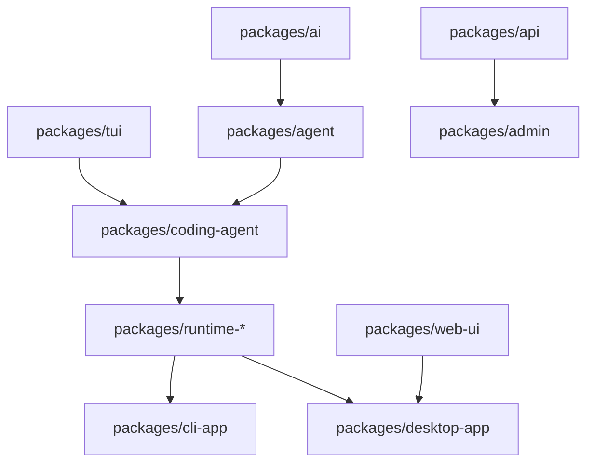
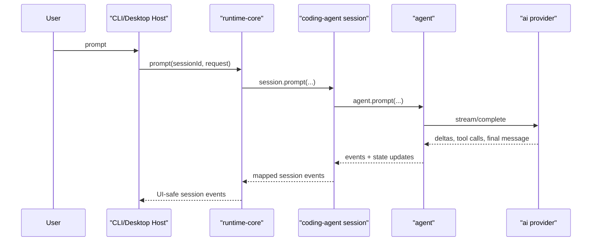
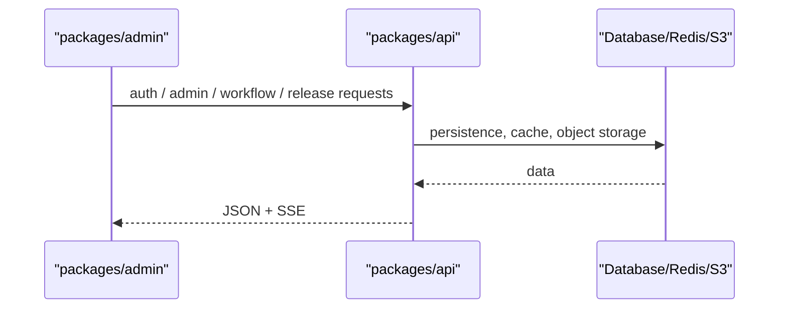

# Architecture Overview

This repository mixes reusable libraries, runtime host packages, product apps, and business services in a single monorepo. The structure is intentional, but the dependency direction matters:

- reusable libraries should not depend on product apps
- runtime host packages should adapt `coding-agent` for other hosts, not reimplement product logic
- business services (`api`, `admin`) should stay isolated from the generic agent/tooling stack

## Package Layers

## Ownership By Layer

### Core libraries

- `packages/ai`: provider APIs, model definitions, auth helpers, message normalization
- `packages/agent`: agent state machine, tool loop, event model
- `packages/tui`: terminal rendering primitives and input widgets
- `packages/web-ui`: browser UI components, artifacts, storage adapters

### Runtime and host integration

- `packages/coding-agent`: the main product surface and reusable agent session implementation
- `packages/runtime-core`: a stable session facade and runtime event contract for external hosts
- `packages/runtime-tools`: host-facing access to built-in coding tools
- `packages/runtime-storage`: storage abstractions reused by hosts
- `packages/runtime-mcp`: MCP manager exports for hosts
- `packages/runtime-telemetry`: runtime logger interface

### Product applications

- `packages/cli-app`: CLI entrypoint around `coding-agent`
- `packages/desktop-app`: Electron shell, preload bridge, renderer domains, host orchestration

### Business services

- `packages/api`: business backend in Go
- `packages/admin`: business administration frontend

## Request Flow

### Coding agent flow

### Business flow

## Dependency Rules

- `packages/ai` must not import from app packages
- `packages/agent` may depend on `packages/ai`, but not on `desktop-app`, `admin`, or `api`
- `packages/runtime-*` should adapt `coding-agent`, not duplicate its state model
- `packages/desktop-app` may depend on runtime packages and shared UI libraries, but business rules should stay in `packages/api`
- `packages/admin` should stay business-focused and not reach into `coding-agent` internals

## Current Risks To Watch

- duplicated UI implementations across `admin` and `desktop-app`
- duplicated file preview logic inside `web-ui`
- overuse of generic directories like `core` and `utils` without explicit ownership notes
- runtime package names are consistent, but their individual roles are not obvious without documentation

## Safe Refactoring Strategy

When making structural improvements without changing package names:

1. document package ownership before moving code
2. extract pure helpers first
3. move shared view components second
4. only then tighten dependency rules or exports

That order preserves behavior while reducing ambiguity.
