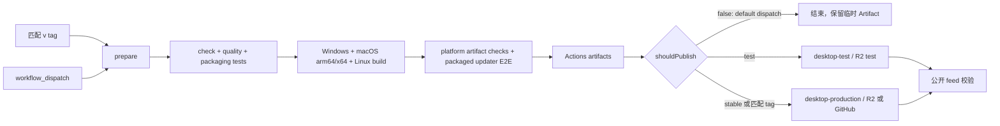

# Desktop 发布与自动更新流程

本文是 Vetta Desktop 发布流程的维护手册。它记录当前 GitHub Actions、构建配置解析器、R2/GitHub 发布和自动更新验收之间的关系，供下一次排查或修改发布链路时快速恢复上下文。

## 事实源

涉及行为时先看实现，再更新本文：

- [Desktop 发布 workflow](../../.github/workflows/desktop-release.yml)
- [发布配置解析器](../../scripts/release/resolve-desktop-release-config.mjs)
- [配置解析测试](../../scripts/release/resolve-desktop-release-config.test.mjs)
- [workflow 合同测试](../../scripts/quality/desktop-release-workflow.test.mjs)
- [真实安装升级 workflow](../../.github/workflows/desktop-upgrade-e2e.yml)
- [真实安装升级脚本](../../apps/desktop/scripts/desktop-upgrade-e2e.mjs)
- [Desktop 打包与更新脚本说明](../../apps/desktop/scripts/README.md)
- [Windows 更新与 R2 细节](../desktop/windows-auto-update.md)
- [macOS 更新、签名与公证](../desktop/macos-auto-update.md)

如果本文与 workflow 或脚本冲突，以代码和测试为准，并在同一变更中修正文档。

## 核心模型

发布由四个维度决定：

| 维度 | 可选值 | 作用 |
| --- | --- | --- |
| 触发器 | tag / `workflow_dispatch` | 决定版本来源和是否允许表单输入 |
| `channel` | `default` / `stable` / `test` | 决定是否发布、更新 URL 和 R2 prefix |
| `release_target` | `github` / `r2` | 决定开源 GitHub Release 或商业 R2 |
| `cloud_enabled` | `false` / `true` | 决定开源版或商业版；GitHub 与 `false`、R2 与 `true` 必须配对 |

tag 和手动 stable/test 使用同一套构建、校验和发布 jobs。差异只在输入和发布环境：tag 隐式表达正式发布，手动运行显式选择 channel。



`shouldPublish` 由解析器统一计算，当前规则是：

- 匹配的 tag push：发布。
- `workflow_dispatch + channel=test`：发布到 R2 test。
- `workflow_dispatch + channel=stable`：发布到 stable。
- 其它手动运行（通常是 `channel=default`）：只构建，不发布。
- `test` 不能由 tag 触发；`build_version` 只能用于 test channel。

## Channel 说明

### `default`

用于构建演练、调试配置和临时 Actions Artifact。它不会进入 R2/GitHub 发布 job，也不会执行发布后的公网 feed 校验。

### `test`

`test` 是生产候选更新通道，不是降低质量标准的 debug 包。它应使用：

- 商业版配置和真实构建流程；
- 完整 `check`、质量测试、平台制品校验和 packaged E2E；
- macOS 签名与公证；
- 独立的 `desktop-test` Environment、R2 prefix 和更新 URL；
- 递增的 `build_version`，例如基线 `0.5.46`，候选 `0.5.47`。

建议先发布 test 基线，再发布更高版本候选，从基线安装包执行真实升级。测试完成后不要把 test metadata 复制到 stable；stable 需要使用正式 channel 配置重新构建或按明确的制品晋级方案发布。

### `stable`

正式生产更新通道。可以通过匹配版本的 tag 发布，也可以在 `desktop-production` Environment 审批后手动选择 `channel=stable`。两者进入相同发布 job。

## GitHub 配置

### Environments

至少配置两个 GitHub Environment：

| Environment | 用途 | 关键约束 |
| --- | --- | --- |
| `desktop-production` | stable R2 或 GitHub 正式发布 | 建议启用 required reviewers；放正式 R2、签名和发布权限 |
| `desktop-test` | test R2 发布和候选升级 | 使用独立 test prefix/URL；不能复用 stable metadata 目录 |

构建 job、R2 发布 job 和 GitHub 发布 job 必须能拿到与目标 channel 对应的 Environment。当前 workflow 会根据 `channel` 为 test 选择 `desktop-test`，其它情况选择 `desktop-production`。

### Variables

常用非敏感变量如下。变量名必须与脚本一致，不要在 workflow 表单里粘贴密钥。

| 变量 | 说明 |
| --- | --- |
| `VETTA_RELEASE_TARGET` | 默认发布目标，商业版通常为 `r2`，开源 fork 为 `github` |
| `VETTA_RELEASE_CHANNEL` | 默认 channel；正式环境建议为 `stable` 或留空由 tag 语义决定 |
| `VETTA_CLOUD_ENABLED` | 商业版 `true`，开源版 `false` |
| `VETTA_SERVER_URL` | 商业版必填，必须是 HTTPS |
| `VETTA_SITE_URL` | 商业版站点地址，可选但应与部署环境一致 |
| `VETTA_TENANT` | 租户标识，可选 |
| `VETTA_SPEECH_INPUT_ENABLED` | `true` 或 `false` |
| `VETTA_UPDATE_PROVIDER` | R2 使用 `generic`，GitHub 使用 `github`；通常由 target 推导 |
| `VETTA_UPDATE_URL` | 默认更新源根路径 |
| `VETTA_UPDATE_URL_STABLE` / `_TEST` | stable/test 专用公开更新 URL，优先于通用 URL |
| `VETTA_R2_BUCKET` | R2 bucket |
| `VETTA_R2_PREFIX` | 默认 R2 prefix |
| `VETTA_R2_PREFIX_STABLE` / `_TEST` | stable/test 专用 prefix，必须与公开 URL path 对应 |
| `VETTA_TEST_BUILD_VERSION` | 仅 test 可使用；手动表单的 `build_version` 优先级更高 |
| `VETTA_OPEN_MARKETPLACE_REPOSITORY` | 仅开源版使用的 Marketplace 地址 |

Sentry 和 PostHog 是可选能力，不是商业版本的强制发布条件。配置其中任一能力时，必须满足对应字段的完整性和 URL/采样率校验；源映射上传凭据只放 Actions Secrets，不放 Variables 或 dispatch 表单。

### Secrets

R2 发布需要：

```text
VETTA_R2_ACCOUNT_ID
VETTA_R2_ACCESS_KEY_ID
VETTA_R2_SECRET_ACCESS_KEY
```

macOS 正式签名/公证使用以下 CI Secrets，或由自持 `vetta-mac` runner 提供等价环境变量：

```text
MACOS_CERTIFICATE_P12_BASE64
MACOS_CERTIFICATE_PASSWORD
APPLE_API_KEY_P8_BASE64
APPLE_API_KEY_ID
APPLE_API_ISSUER
APPLE_TEAM_ID
```

所有会发布的构建都要求 macOS 签名和公证。缺少凭据时应让 job 失败；只有不发布的手动构建允许未签名。

## 正式发布操作

### 推荐：推送版本 tag

1. 更新 `apps/desktop/package.json` 版本。
2. 完成对应版本的 `apps/desktop/CHANGELOG.md`，必须存在 `## [version]` 段落。
3. 确认 `desktop-production` 的 server、更新源、R2、签名和可选遥测配置完整。
4. 合并目标 commit。
5. 创建并推送完全匹配的 tag：

   ```text
   v<apps/desktop/package.json version>
   ```

   例如 package 版本是 `0.5.47`，tag 必须是 `v0.5.47`。

6. 等待 `desktop-release`：先看 `prepare` 的 resolved config，再看 quality、四个平台 build、制品校验、E2E 和最终公网 feed 校验。

不匹配的 `v*` tag 会被 scope job 忽略，不会打包或发布。正式 tag 不能携带 test channel 语义。

### 手动正式发布

需要从指定 branch/ref 发布时，可以手动运行：

1. 选择目标 ref。
2. 选择 `channel=stable`。
3. 选择 `release_target=r2`（商业版）或 `github`（开源版）。
4. 不填写 `build_version`；正式版本来自该 ref 的 `package.json`。
5. 检查 job summary 中的 `cloud_enabled`、server、更新 URL、R2 prefix 和 `should_publish=true`。
6. 通过 `desktop-production` Environment 审批。

GitHub target 的手动发布会以当前 workflow SHA 创建对应版本 Release；R2 target 不要求先有 tag，但仍应保留 commit、workflow run 和版本号之间的发布记录。

## Test 升级验收操作

真实安装升级使用独立的 `desktop-upgrade-e2e` workflow，不覆盖 stable，也不把“下载了一个伪造更新文件”当成升级成功。

### 前置发布

1. 使用 `desktop-release` 手动运行发布 test 基线：选择 `release_target=r2`、`channel=test`，填写当前基线版本的 `build_version`，例如 `0.5.46`。
2. 再运行一次相同 workflow，发布更高版本的 test 候选，例如 `0.5.47`。
3. 确认两次运行都通过构建、平台制品校验、packaged updater E2E、R2 上传和公开 feed 校验，并且版本化安装包仍保留在 `VETTA_R2_PREFIX_TEST`。
4. 确认 `desktop-test` Environment 的 `VETTA_UPDATE_URL_TEST` 与 `VETTA_R2_PREFIX_TEST` 对应同一个公开 feed。通常不需要在升级 workflow 中手动填写 `update_url`。

### 触发真实升级验证

在 GitHub Actions 中手动运行 `desktop-upgrade-e2e`，填写：

| 输入 | 填写内容 |
| --- | --- |
| `baseline_version` | 已发布的 test 基线，例如 `0.5.46` |
| `candidate_version` | 已发布的更高 test 候选，例如 `0.5.47` |
| `update_url` | 可留空，默认读取 `desktop-test` Environment 的 `VETTA_UPDATE_URL_TEST` |
| `notes` | 可选，仅写入本次运行摘要 |

workflow 会在 Windows、macOS、Linux runner 上并行执行，分别：

1. 下载并安装基线版本；
2. 启动已安装的真实应用；
3. 通过现有 updater 执行 `check -> download -> install`；
4. 等待安装器接管并退出应用；
5. 等待新版本重新启动；
6. 从重启后的应用进程读取版本并写入验证状态；
7. 失败时上传应用日志和 `desktop-upgrade-e2e.json` 状态文件。

各平台实际覆盖：

- Windows：Inno Setup 静默安装、版本目录切换、稳定启动器重启；
- macOS：ZIP 解压、Squirrel.Mac/ShipIt 替换、重启后版本确认；
- Linux：AppImage 执行、electron-updater 安装和重启后版本确认。

当前 GitHub `macos-latest` 只验证该 runner 的实际架构；如果要强制验证 macOS arm64，需要增加自托管 arm64 runner 矩阵。真实升级 workflow 依赖远程 test feed，因此必须在两个 test 版本上传完成后运行；它不是发布前的本地产物门禁。

验证成功后记录：

- 基线和候选版本；
- workflow run URL、平台和 runner 架构；
- 更新源 URL 与 R2 test prefix；
- 失败时的应用日志、升级状态文件和安装器日志。

当前发布 workflow 中的 packaged E2E 仍然保留，用于发布前验证 `app-update.yml`、feed、版本解析、下载链路和 IPC；`desktop-upgrade-e2e` 则补充真实安装器、退出、重启和版本切换，不应相互替代。

## 门禁顺序

发布前后顺序必须保持：

1. `bun run check`
2. `bun run test:quality`
3. `bun run verify:desktop:contracts`
4. `bun run test:desktop:packaging`
5. 每个平台构建
6. 每个平台 `verify:updates:*`
7. packaged app/updater E2E
8. 上传 Actions Artifact
9. 发布 job 再次合并 macOS metadata
10. `verify-update-artifacts` 在 R2 发布前检查制品
11. 先上传版本化安装包，再上传 `latest*.yml` metadata
12. 通过公开 URL 验证 metadata 和其引用的包

R2 的 `latest*.yml` 不能先于安装包公开。版本化安装包和旧版 blockmap 不要随意删除，否则会破坏差分更新和回退诊断。

## 常见故障

### `ENOENT app-update.yml`

通常表示旧包没有更新 provider 或更新源配置。当前构建入口会默认使用官方 stable 更新源，但应检查：

- `VETTA_UPDATE_PROVIDER` 是否为 `generic` 或 `github`；
- `VETTA_UPDATE_URL` 是否为 HTTPS 且无凭据/query/hash；
- 是否误设置了不支持的 `none`；
- 安装包是否来自旧版本或错误的 build 环境。

### test 发布后 stable 客户端看不到更新

这是预期隔离行为。test 包必须使用 test URL，stable 包只读取 stable URL。检查 job summary、`VETTA_UPDATE_URL_TEST`、`VETTA_R2_PREFIX_TEST` 和 CDN path 是否一致。

### feed 有 metadata 但客户端下载失败

先检查 metadata 引用的每一个安装包和 blockmap 是否可公开读取，再检查 SHA-512、文件大小、缓存头和 URL path。不要只检查 `latest.yml` 的 HTTP 200。

### macOS 发布 job 没有上传

发布型 job 缺少签名/公证凭据会主动失败，这是保护 stable/test feed 的门禁，不应通过关闭 `VETTA_REQUIRE_MAC_SIGNATURE` 绕过。

### 手动运行没有发布

确认是否仍是 `channel=default`。默认手动运行只是构建演练；必须显式选择 `test` 或 `stable`，并确认解析结果中的 `should_publish=true`。

### GitHub Release 已经公开后重复运行

workflow 不允许用 `--clobber` 修改已公开 Release。只有未公开的 draft 可以恢复；已公开版本应修复配置后发布新的版本号。

## 修改发布流程时的维护清单

- 同时检查 workflow、解析器、解析器单测和 workflow 合同测试。
- 保持 tag、手动 stable、手动 test 的质量门禁一致；差异只能在 channel、Environment 和发布目标。
- 新增 channel 时集中扩展解析器的 `CHANNELS`、URL/prefix 解析、`shouldPublish` 规则、Environment 映射、测试和本文，不要在多个 job 手写条件。
- 变更 updater 配置后运行：

  ```text
  bun run test:quality
  bun run --cwd apps/desktop test:packaging
  bun run check:quick
  bun run check
  ```

- 真实发布前确认版本、Changelog、公开 URL、R2 prefix、签名身份和测试基线版本。
- 日志、Issue、Actions 表单和文档中不要记录 R2 Secret、Access Key、证书内容、Sentry Auth Token、Cookie 或用户数据。
- 不要用手工上传绕过 `verify-update-artifacts` 和发布后的公开 feed 校验。
