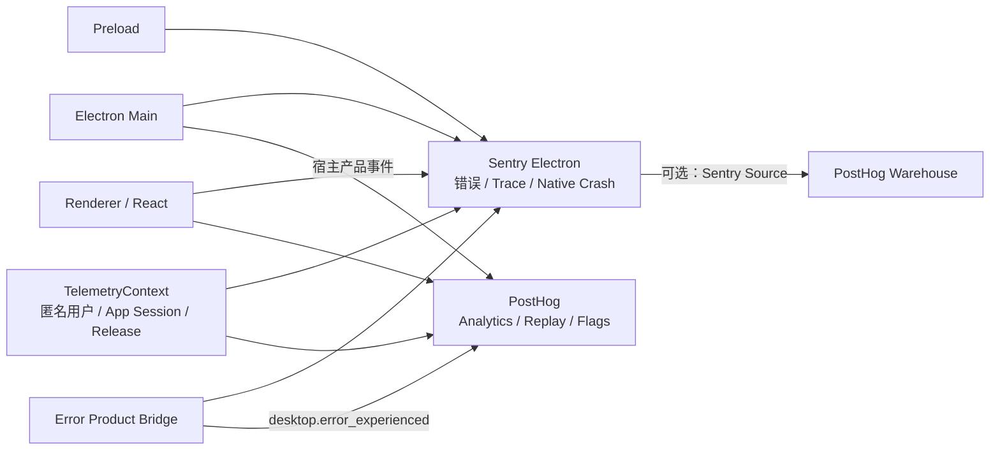

# 2. 目标架构

## 2.1 总体数据流



系统不存在通用 provider router。Sentry 和 PostHog 分别使用自己的 SDK 和数据模型，但业务代码看不到 SDK 类型。

## 2.2 进程职责

### Main

- 最早初始化 Sentry Electron Main；
- 建立 anonymousUserId、appSessionId、release、environment；
- 捕获 Main/process/IPC/updater/sidecar 等异常；
- 负责 Electron 原生 crash reporting；
- 为启动、窗口创建、IPC 和关键宿主流程建立性能 Span；
- 发送只在 Main 可观察到的产品事件；
- 把 TelemetryContext 安全提供给 Preload/Renderer；
- 管理用户的错误报告、产品分析和 Replay 设置。

### Preload

- 初始化或连接 Sentry 的 preload/renderer 桥；
- 只暴露必要的 TelemetryContext 和产品事件 API；
- 校验 Renderer 传入的产品事件；
- 不暴露平台 secret、Sentry scope 或 PostHog client；
- 不允许 Renderer 构造任意 tags、extra 或产品事件名称。

### Renderer

- 初始化 Sentry Renderer 集成；
- 捕获 React 根错误、Error Boundary 和未处理异常；
- 初始化 PostHog 产品分析、Replay 和 Feature Flag；
- 使用统一身份和 appSessionId；
- 对 UI 行为发送强类型产品事件；
- 维护当前 PostHog session/replay 标识，供错误关联桥使用。

## 2.3 仓库职责

### packages/runtime-telemetry

建议拥有：

- ErrorReporter；
- ErrorContext、Breadcrumb 等平台无关类型；
- NoopErrorReporter；
- 已有 RuntimeLogger/RuntimeTracer 能力。

不应拥有：

- Sentry/PostHog SDK 类型；
- Electron 生命周期；
- 产品事件目录；
- Replay 和 Feature Flag；
- source map 上传。

### packages/desktop-app

建议拥有：

- Sentry Electron adapter；
- PostHog analytics/replay/flags adapter；
- TelemetryContext；
- Error Product Bridge；
- 产品事件目录；
- SDK 初始化和用户设置；
- Replay DOM 隐私标记；
- release/source map 构建集成。

### CI / Release Pipeline

建议拥有：

- 稳定 release/buildId；
- Main、Preload、Renderer source map；
- Sentry source map 上传和验证；
- 安装包中删除 source map；
- production/staging Sentry/PostHog 配置；
- 构建产物中的 secret 检查。

## 2.4 依赖方向

```text
业务代码
  -> ErrorReporter
    -> SentryErrorReporter
      -> Sentry SDK

业务代码
  -> AnalyticsClient / FeatureFlagClient
    -> PostHogAdapter
      -> PostHog SDK

ErrorProductBridge
  -> ErrorReporter
  -> AnalyticsClient
```

禁止：

```text
domain component -> Sentry.captureException
domain component -> posthog.capture
runtime-telemetry -> @sentry/*
runtime-telemetry -> posthog-*
Sentry adapter -> PostHog SDK
PostHog adapter -> Sentry SDK
```

跨平台协调只发生在 ErrorProductBridge，不让两个 adapter 互相依赖。

## 2.5 建议模块布局

这是目标布局，实施时仍应先核对现有入口和 Sentry Electron SDK 约定：

```text
packages/runtime-telemetry/src/
├── errors.ts
└── index.ts

packages/desktop-app/src/
├── main/telemetry/
│   ├── sentry-main.ts
│   ├── telemetry-context.ts
│   ├── product-analytics.ts
│   └── telemetry-settings.ts
├── preload/
│   └── telemetry.ts
└── renderer/shared/telemetry/
    ├── sentry-renderer.ts
    ├── posthog.ts
    ├── analytics-client.ts
    ├── analytics-events.ts
    ├── error-product-bridge.ts
    └── telemetry-context.ts
```

不要为了形式一次创建全部文件。入口只负责装配；身份、事件目录、错误关联和隐私配置分别承担单一职责。

## 2.6 配置边界

配置按能力和环境管理，不提供 provider selector：

```typescript
export interface TelemetrySettings {
  errorReportingEnabled: boolean;
  productAnalyticsEnabled: boolean;
  sessionReplayEnabled: boolean;
}
```

部署配置：

```text
SENTRY_DSN
SENTRY_ENVIRONMENT
SENTRY_RELEASE
POSTHOG_HOST
POSTHOG_PROJECT_TOKEN
```

Sentry source map 上传 token 只能存在于 CI，不能进入应用包。PostHog project token 和 Sentry DSN 是客户端接入标识，不应被当作授权 secret；仍需限制数据模型和供应商侧配额，防止滥用。

## 2.7 可靠性原则

- SDK 初始化失败时使用 Noop 实现，应用继续启动。
- capture/track 调用不向业务层抛错。
- 错误报告、产品分析和 Replay 分别可关闭。
- 应用退出只做有界 flush，不无限等待。
- Main 真正崩溃时依赖 Electron/Sentry 原生崩溃路径。
- PostHog 不可用不影响 Sentry，Sentry 不可用不影响 PostHog。
- 不用业务重试机制重试遥测发送。
- 不把 SDK 内部错误再次递归发送到同一个 SDK。
