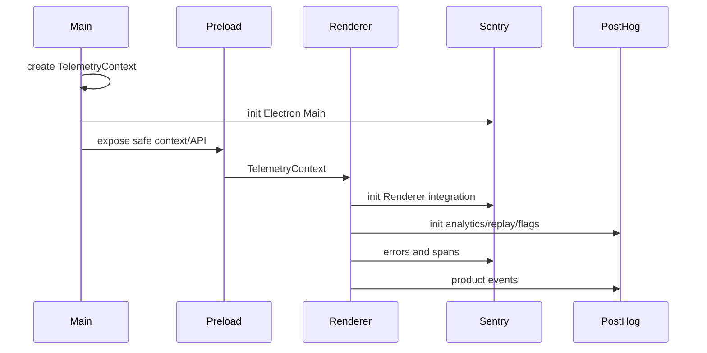
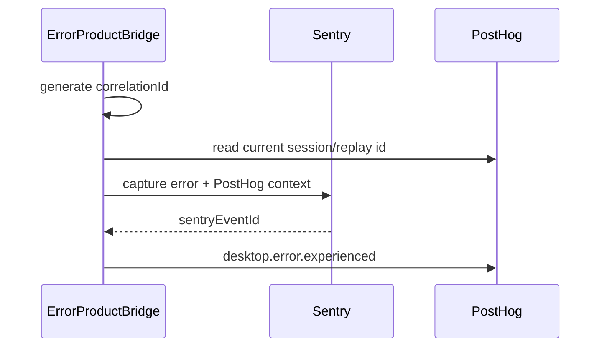

# 4. Electron 客户端采集

## 4.1 采集拓扑

Sentry Electron 覆盖 Main、Preload、Renderer 和原生崩溃。PostHog 在 Renderer 承担产品分析、Replay 和 Feature Flag；Main 中无法由 Renderer 可靠观察的宿主产品事件，可由 Main 的 PostHog adapter 发送。



不要把 Renderer 错误全部转发到 Main 再手工模拟 Sentry event。应优先遵循 Sentry Electron 的官方 Main/Renderer 集成模型，避免丢失进程上下文、自动 breadcrumbs 和原生关联。

## 4.2 初始化顺序

### Main

1. 读取遥测设置和部署配置。
2. 创建 TelemetryContext。
3. 尽早初始化 Sentry Electron Main 和原生崩溃能力。
4. 注册应用生命周期和窗口。
5. 把只读上下文及受限 API 暴露给 Preload。
6. 初始化 Main 产品分析 adapter。

### Renderer

1. 从 Preload 获取 TelemetryContext 和设置。
2. 初始化 Sentry Renderer。
3. 初始化 PostHog identity 和产品分析。
4. 在 sessionReplayEnabled 时初始化 Replay。
5. 安装 React 根错误与 Error Boundary 集成。
6. 启动 Error Product Bridge。

SDK 初始化失败时记录本地诊断并降级 Noop，不阻止窗口创建。

## 4.3 Sentry 捕获范围

### Main

- process 未处理异常和 rejection；
- app 生命周期和窗口创建失败；
- IPC handler 未处理异常；
- updater、sidecar、scheduler 等关键宿主异常；
- 应用启动、窗口创建、关键 IPC 和更新流程性能 Span；
- Electron/Chromium 原生崩溃。

### Preload

- preload 初始化异常；
- contextBridge 装配失败；
- Renderer 到 Main 的桥接异常。

### Renderer

- window error；
- unhandledrejection；
- React 19 根级 onUncaughtError；
- Error Boundary 中阻断用户操作的错误；
- 关键异步流程的手动异常；
- 页面初始化、主要交互和关键请求的必要 Span。

实施时先核对 Sentry Electron SDK 已自动安装的 handler，再决定是否补充监听器。不能让同一异常同时被 SDK、window handler 和 React Error Boundary 上报三次。

## 4.4 PostHog 捕获范围

### 产品事件

建议首版覆盖：

- desktop.session.started；
- desktop.project.opened；
- desktop.agent.run.started/completed/failed；
- desktop.feature.opened；
- desktop.update.started/completed/failed；
- desktop.error.experienced。

事件应描述产品事实，不记录控件实现。UI 事件归 Renderer；只有 Main 才能可靠知道的生命周期、后台任务和更新结果归 Main。一个产品事实只能有一个 owner。

### Replay

Replay 只在 Renderer 启用。默认配置：

```typescript
const sessionRecordingPrivacy = {
  maskAllInputs: true,
  maskTextSelector: "*",
};
```

以下区域整体阻止录制：

- 代码编辑器；
- 聊天消息和输入区；
- 终端；
- 文件内容和预览；
- 登录、认证和敏感设置；
- API key、IM 配置和模型凭据；
- 调试请求快照。

只对明确安全的导航名称、按钮类别、布局和状态图标选择性解除遮罩。关闭 console 录制和网络 body 录制；URL 删除 query 和 fragment。

PostHog 的遮罩在客户端执行，支持 maskAllInputs、maskTextSelector、ph-no-capture 和 URL/网络脱敏。参考 [PostHog Replay 隐私控制](https://posthog.com/docs/session-replay/privacy)。

### Feature Flag

Feature Flag 可以由 PostHog 管理，但业务代码仍通过 FeatureFlagClient 读取。事件需要记录实际 exposure，而不是只记录 flag 拉取；实验属性不能包含用户内容。

## 4.5 Preload 与 IPC

Preload 只暴露强类型能力：

```typescript
export interface RendererTelemetryBridge {
  getContext(): Promise<TelemetryContext>;
  getSettings(): Promise<TelemetrySettings>;
  trackHostEvent(event: HostAnalyticsEvent): Promise<void>;
}
```

限制：

- Renderer 不能提交任意事件名称；
- Renderer 不能修改 anonymousUserId、appSessionId、release；
- Main 再次校验 event union 和属性长度；
- 不暴露 Sentry scope、PostHog client、DSN 或队列状态；
- 不接受任意 tags/extra；
- handler 自身错误只记录本地日志，避免遥测递归。

## 4.6 Error Product Bridge

只对用户有影响的 Renderer 错误建立跨系统关联：



规则：

- userImpact=none 时只发送 Sentry；
- PostHog 未初始化时仍正常发送 Sentry；
- PostHog marker 失败不重试 Sentry；
- Main-only 后台错误通常没有 Replay，只发送 Sentry；
- marker 不包含异常正文和堆栈；
- bridge 自身错误只记录本地日志。

## 4.7 与现有日志的关系

packages/desktop-app/src/main/logger.ts 继续负责 main、render、im 文本日志：

- 不新增第二套文本日志文件；
- 不把整份日志作为 Sentry attachment；
- 不把 console 全量发送到 PostHog Replay；
- Sentry breadcrumbs 只来自受控的结构化事件；
- 用户主动导出诊断包与自动遥测相互独立。

## 4.8 用户设置

建议三个独立设置：

```text
错误与崩溃报告
产品使用数据
Session Replay
```

Replay 的敏感度高于普通产品事件，不能只用一个总开关。所有设置文案必须走 desktop-app i18n。关闭后：

- Sentry 停止新错误/Trace 上传，并按 SDK 能力有界 flush；
- PostHog 停止产品事件；
- Replay 立即停止录制；
- 不通过另一个通道绕过关闭状态。
