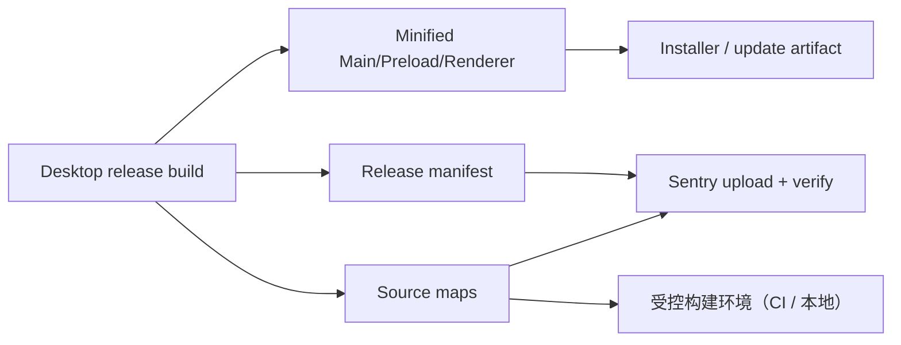

# 6. Sentry Source map 与原生崩溃

## 6.1 主责

Source map、release、JavaScript 堆栈和 Electron 原生崩溃全部由 Sentry 负责。PostHog 不启用 Error Tracking，因此：

- 不向 PostHog 上传 source map；
- 不向 PostHog 发送 minidump；
- 不在 PostHog 建立错误分组；
- PostHog 只通过 marker 和 Sentry Source 获取产品影响上下文。

## 6.2 Source map 流程



约束：

- Main、Preload、Renderer 使用同一 release/buildId 体系；
- source map 与 JavaScript 来自同一次 production 构建；
- source map 上传和验证在正式发布前完成；
- source map 不进入安装包和公开目录；
- Sentry auth token 只存在于 CI Secret 或本地构建进程的临时环境变量；
- 构建日志不能打印 token；
- build 失败或上传验证失败时阻断 release，或产生明确的发布阻断状态。

## 6.3 Release manifest

```json
{
  "schemaVersion": 1,
  "release": "1.2.3",
  "buildId": "immutable-build-id",
  "platform": "win32",
  "arch": "x64",
  "artifacts": [
    {
      "bundle": "main.js",
      "sourceMap": "main.js.map",
      "sha256": "..."
    }
  ]
}
```

同一 release/buildId 还要写入：

- Sentry event；
- PostHog 产品事件；
- PostHog desktop.error.experienced；
- 本地诊断信息；
- 更新和安装制品 metadata。

## 6.4 Vetta 当前构建注意事项

当前 `sentry-vite.ts` 在 Sentry 上传配置完整时，自动为 Main、Preload、Renderer 生成 hidden source map、上传三类产物，并在上传成功后删除本地 `.map`。`VETTA_MAIN_SOURCEMAP=true` 仍可用于不上传 Sentry 的 Main 调试构建，但不是正式 release 的上传开关。

只验证 Renderer source map 不足以覆盖 Electron Main 和 preload 错误。

## 6.5 上传与验证

CI 或本地 release 构建至少执行：

1. 生成 production bundle 和 source map；
2. 注入/生成 Sentry 能识别的 debug ID；
3. 上传 source map；
4. 验证 release/debug ID；
5. 从安装包中删除 map；
6. 构建安装包；
7. 在 staging 触发一个受控错误，确认堆栈还原。

Sentry 建议在错误发生前上传 source map，并提供 debug/verify 工具。参考 [Sentry source map troubleshooting](https://docs.sentry.io/platforms/javascript/guides/hono/sourcemaps/troubleshooting_js)。

## 6.6 Electron 原生崩溃

使用 Sentry Electron SDK 的官方集成处理 Main、Renderer 和 Electron 原生崩溃。实现前以当前安装版本的类型定义和官方文档为准，不手工猜测初始化参数：

- [Sentry Electron](https://docs.sentry.io/platforms/javascript/guides/electron/)
- [Electron crashReporter](https://www.electronjs.org/docs/latest/api/crash-reporter)

要求：

- 在 Renderer 创建前尽早初始化；
- release、environment、productName 和 app version 一致；
- 原生 extra 只包含短小、低敏感度字符串；
- crash reporting 与用户“错误与崩溃报告”设置一致；
- 测试原生崩溃只在隔离 staging 环境执行；
- 不同时启动另一套独立 Crashpad 上传路径。

## 6.7 Minidump 隐私

minidump 可能包含线程上下文和部分内存，敏感度高于普通 JavaScript error。必须：

- 明确用户设置和告知；
- 使用最小 extra；
- 禁止 token、路径、prompt 和用户内容；
- 限制 Sentry project 访问权限；
- 审查供应商留存和删除策略；
- 不自动下载或转存到普通日志/诊断目录；
- 对查看和导出权限进行审计。

如果产品不接受 minidump 的隐私和留存风险，可以关闭原生崩溃上传，同时保留普通 JavaScript 错误监控。

## 6.8 Sentry 事件脱敏

beforeSend/breadcrumb 处理至少移除：

- Authorization、Cookie 和认证 header；
- request/response body；
- prompt、模型响应和聊天内容；
- 文件内容与终端输出；
- 用户名和 workspace 绝对路径；
- local variables；
- 未经批准的 attachments；
- PostHog event payload。

堆栈需要保留用于定位，但要规范化本机用户名和路径。不要通过删除整个 stack 来实现脱敏。

## 6.9 不启用 Sentry Replay

Sentry 支持 Replay，并能将 Replay 与 Issue 关联，但本方案将 Replay 主责交给 PostHog。Sentry event 仅保存 PostHog session/replay 引用，避免：

- 重复录制 DOM；
- 两套遮罩策略；
- 双倍网络和存储；
- 两套 Replay 权限；
- 用户不知道哪份录制是事实来源。
